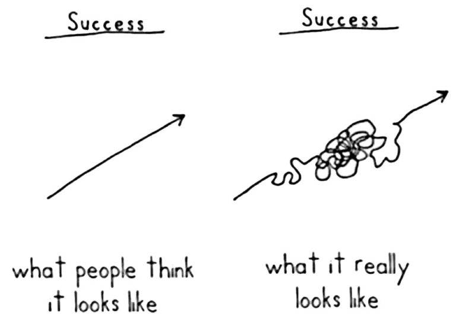

<!--
# Democratizing AI Compute

> by Chris Lattner

## Contents

- [Democratizing AI Compute, Part 1: DeepSeek’s Impact on AI](https://www.modular.com/blog/democratizing-compute-part-1-deepseeks-impact-on-ai)
- [Democratizing AI Compute, Part 2: What exactly is “CUDA”?](https://www.modular.com/blog/democratizing-compute-part-2-what-exactly-is-cuda)
- [Democratizing AI Compute, Part 3: How did CUDA succeed?](https://www.modular.com/blog/democratizing-ai-compute-part-3-how-did-cuda-succeed)
- [Democratizing AI Compute, Part 4: CUDA is the incumbent, but is it any good?](https://www.modular.com/blog/democratizing-ai-compute-part-4-cuda-is-the-incumbent-but-is-it-any-good)
- [Democratizing AI Compute, Part 5: What about CUDA C++ alternatives like OpenCL?](https://www.modular.com/blog/democratizing-ai-compute-part-5-what-about-cuda-c-alternatives)
- [Democratizing AI Compute, Part 6: What about AI compilers (TVM and XLA)?](https://www.modular.com/blog/democratizing-ai-compute-part-6-what-about-ai-compilers)
- [Democratizing AI Compute, Part 7: What about Triton and Python eDSLs?](https://www.modular.com/blog/democratizing-ai-compute-part-7-what-about-triton-and-python-edsls)
- [Democratizing AI Compute, Part 8: What about the MLIR compiler infrastructure?](https://www.modular.com/blog/democratizing-ai-compute-part-8-what-about-the-mlir-compiler-infrastructure)
- [Democratizing AI Compute, Part 9: Why Do HW Companies Struggle to Build AI Software?](https://www.modular.com/blog/democratizing-ai-compute-part-9-why-do-hw-companies-struggle-to-build-ai-software)
- [Democratizing AI Compute, Part 10: Modular’s bet to break out of the Matrix](https://www.modular.com/blog/modulars-bet-to-break-out-of-the-matrix-democratizing-ai-compute-part-10)
- [Democratizing AI Compute, Part 11: How is Modular Democratizing AI Compute?](https://www.modular.com/blog/how-is-modular-democratizing-ai-compute)
-->

# 【翻译中】AI算力民主化（译文）

> 原作者：Chris Lattner

- [第一部分：DeepSeek 给 AI 带来的影响](https://www.modular.com/blog/democratizing-compute-part-1-deepseeks-impact-on-ai)
- [第二部分：CUDA 到底是什么？](https://www.modular.com/blog/democratizing-compute-part-2-what-exactly-is-cuda)
- [第三部份：CUDA 是如何成功的?](https://www.modular.com/blog/democratizing-ai-compute-part-3-how-did-cuda-succeed)
- [第四部分：CUDA 现在是主流，但它真的够好吗？](https://www.modular.com/blog/democratizing-ai-compute-part-4-cuda-is-the-incumbent-but-is-it-any-good)
- [第五部份：CUDA C++ 的替代品（比如 OpenCL）如何？](https://www.modular.com/blog/democratizing-ai-compute-part-5-what-about-cuda-c-alternatives)
- [第六部分：AI 编译器（TVM、XLA）如何？](https://www.modular.com/blog/democratizing-ai-compute-part-6-what-about-ai-compilers)
- [第七部分：Triton 等 Python DSL 语言如何？](https://www.modular.com/blog/democratizing-ai-compute-part-7-what-about-triton-and-python-edsls)
- [第八部份：MLIR 编译器基础设施如何？](https://www.modular.com/blog/democratizing-ai-compute-part-8-what-about-the-mlir-compiler-infrastructure)
- [第九部分：为什么硬件公司难以构建 AI 软件?](https://www.modular.com/blog/democratizing-ai-compute-part-9-why-do-hw-companies-struggle-to-build-ai-software)
- [第十部分：Modular 突破“矩阵”的决心](https://www.modular.com/blog/modulars-bet-to-break-out-of-the-matrix-democratizing-ai-compute-part-10)
- [第十一部分: Modular 是如何让 AI 算力民主化的?](https://www.modular.com/blog/how-is-modular-democratizing-ai-compute)

## Democratizing AI Compute, Part 1: DeepSeek’s Impact on AI

DeepSeek’s recent breakthrough has upended assumptions about AI’s compute demands, showing that **better hardware utilization** can dramatically reduce the need for expensive GPUs.

For years, leading AI companies have insisted that **only those with [vast compute resources](https://www.bbc.com/news/articles/cy4m84d2xz2o)** can drive cutting-edge research, reinforcing the idea that it is “**[hopeless to catch up](https://www.youtube.com/watch?v=EtMsG2UtMUU)**” unless you have billions of dollars to spend on infrastructure. But DeepSeek’s success tells a different story: **novel ideas can unlock efficiency breakthroughs to accelerate AI**, and smaller, highly focused teams to **challenge industry giants**–and even level the playing field.

We believe DeepSeek’s efficiency breakthrough signals a **coming surge in demand** for AI applications. If AI is to continue advancing, we must **drive down the Total Cost of Ownership (TCO)**–by expanding access to alternative hardware, maximizing efficiency on existing systems, and accelerating software innovation. Otherwise, we risk a future where AI’s benefits are **bottlenecked**–either by **hardware shortages** or by developers struggling to effectively utilize the diverse hardware that is available.

This isn’t just an abstract problem–it's a challenge I’ve spent my career working to solve.

### My passion for compute + developer efficiency

I've spent the past 25 years working to unlock computing power for the world. I founded and led the development of [LLVM](https://en.wikipedia.org/wiki/LLVM), a compiler technology that opened CPUs to new applications of compiler technology. Today, LLVM is the foundation for performance-oriented programming languages like C++, Rust, Swift and more. It powers nearly all iOS and Android apps, as well as the infrastructure behind major internet services from Google and Meta.

This work paved the way for several key innovations I led at Apple, including the creation of [OpenCL](https://en.wikipedia.org/wiki/OpenCL), an early accelerator framework now widely adopted across the industry, the rebuild of Apple’s CPU and GPU software stack using LLVM, and the development of the [Swift programming language](https://en.wikipedia.org/wiki/Swift_(programming_language)). These experiences reinforced my belief in the power of shared infrastructure, the importance of co-designing hardware and software, and how intuitive, developer-friendly tools unlock the full potential of advanced hardware.

### Falling in love with AI

In 2017, I became fascinated by AI’s potential and joined Google to lead software development for the TPU platform. At the time, the hardware was ready, but the software wasn’t functional. Over the next two and a half years, through intense team effort, we launched [TPUs in Google Cloud](https://cloud.google.com/tpu), scaled them to ExaFLOPS of compute, and built a research platform that enabled breakthroughs like [Attention Is All You Need](https://en.wikipedia.org/wiki/Attention_Is_All_You_Need) and [BERT](https://en.wikipedia.org/wiki/BERT_(language_model)).

Yet, this journey revealed deeper troubles in AI software. Despite TPUs' success, they remain only semi-compatible with AI frameworks like PyTorch–an issue Google overcomes with vast economic and research resources. A common customer question was, **“Can TPUs run arbitrary AI models out of the box?”** The hard truth? **No–because we didn’t have CUDA, the de facto standard for AI development**.

I’m not one to shy away from tackling major industry problems: my recent work has been the creation of next-generation technologies to scale into this new era of hardware and accelerators. This includes the MLIR compiler framework (widely adopted now for AI compilers across the industry) and the Modular team has spent the last 3 years building something special–but we’ll share more about that later, when the time is right.

### How do GPUs and next-generation compute move forward?

Because of my background and relationships across the industry, I’m often asked about the future of compute. Today, countless groups are innovating in hardware (fueled in part by NVIDIA’s soaring market cap), while many software teams are adopting MLIR to enable new architectures. At the same time, senior leaders are questioning why–despite massive investments–the AI software problem remains unsolved. The challenge isn’t a lack of motivation or resources. So why does the industry feel stuck?

I don’t believe we are stuck. But we do face difficult, foundational problems.

To move forward, we need to better understand the underlying industry dynamics. Compute is a deeply technical field, evolving rapidly, and filled with jargon, codenames, and press releases designed to make every new product sound revolutionary. Many people try to cut through the noise to see the [forest for the trees](https://en.wiktionary.org/wiki/see_the_forest_for_the_trees), but to truly understand where we’re going, we need to examine the roots—the fundamental building blocks that hold everything together.

This post is the first in a multipart series where we’ll help answer these critical questions in a straightforward, accessible way:

- 🧐 What exactly is CUDA?
- 🎯 Why has CUDA been so successful?
- ⚖️ Is CUDA any good?
- ❓ Why do other hardware makers struggle to provide comparable AI software?
- ⚡ Why haven’t existing technologies like Triton or OneAPI or OpenCL solved this?
- 🚀 How can we as an industry move forward?

I hope this series sparks meaningful discussions and raises the level of understanding around these complex issues. The rapid advancements in AI—like DeepSeek’s recent breakthroughs–remind us that software and algorithmic innovation are still driving forces. A deep understanding of low-level hardware continues to unlock "10x" breakthroughs.

AI is advancing at an unprecedented pace–but there’s still so much left to unlock. Together we can break it down, challenge assumptions, and push the industry forward. Let’s dive in!

## Democratizing AI Compute, Part 2: What exactly is “CUDA”?

It seems like **everyone** has started talking about [CUDA](https://en.wikipedia.org/wiki/CUDA) in the last year: It’s the **backbone of deep learning**, the reason **novel hardware struggles to compete**, and the core of **NVIDIA’s moat** and **soaring market cap**. With DeepSeek, we got a startling revelation: its **breakthrough was made possible by “bypassing” CUDA, [going directly to the PTX layer](https://www.tomshardware.com/tech-industry/artificial-intelligence/deepseeks-ai-breakthrough-bypasses-industry-standard-cuda-uses-assembly-like-ptx-programming-instead)**… but what does this actually mean? It feels like everyone wants to break past the lock-in, but we have to **understand what we’re up against** before we can formulate a plan.

> moat: 护城河

CUDA’s dominance in AI is undeniable—but **most people don’t fully understand what CUDA actually is**. Some think it’s a programming language. Others call it a framework. Many assume it’s just “**that thing NVIDIA uses to make GPUs faster.**” None of these are entirely wrong—and many [brilliant people are trying to explain this](https://x.com/IanCutress/status/1884374138787357068)—but none capture the **full scope of “The CUDA Platform.”**

CUDA is not just one thing. It’s a **huge, layered Platform**—a collection of technologies, software libraries, and low-level optimizations that together form a **massive parallel computing ecosystem**. It includes:

- **A low-level parallel programming model** that allows developers to harness the raw power of GPUs with a C++-like syntax.
- **A complex set of libraries and frameworks**—middleware that powers crucial vertical use cases like AI (e.g., cuDNN for PyTorch and TensorFlow).
- **A suite of high-level solutions** like TensorRT-LLM and Triton, which enable AI workloads (e.g., LLM serving) without requiring deep CUDA expertise.

…and that’s just scratching the surface.

In this article, we’ll break down the **key layers of the CUDA Platform**, explore its **historical evolution**, and explain **why it’s so integral to AI computing today**. This sets the stage for the next part in our series, where we’ll dive into **why CUDA has been so successful**. Hint: it has a lot more to do with market incentives than it does the technology itself.

Let’s dive in. 🚀

### The Road to CUDA: From Graphics to General-Purpose Compute

Before GPUs became the powerhouses of AI and scientific computing, they were **graphics processors—specialized processors for rendering images**. Early GPUs hardwired image rendering into silicon, meaning that every step of rendering (transformations, lighting, rasterization) was fixed. While efficient for graphics, these chips were **inflexible**—they couldn’t be repurposed for other types of computation.

Everything changed in **2001** when NVIDIA introduced the **GeForce3**, the first GPU with **programmable shaders**. This was a **seismic shift** in computing:

- 🎨 **Before**: Fixed-function GPUs could only apply pre-defined effects.
- 🖥️ **After**: Developers could **write their own shader programs**, unlocking **programmable graphics pipelines**.

This advancement came with **Shader Model 1.0**, allowing developers to write **small, GPU-executed programs** for vertex and pixel processing. NVIDIA saw **where the future was heading**: instead of just improving graphics performance, GPUs could become **programmable parallel compute engines**.

At the same time, it didn’t take long for researchers to ask:

> “🤔 If GPUs can run small programs for graphics, could we use them for non-graphics tasks?”

One of the first serious attempts at this was the [BrookGPU project](http://graphics.stanford.edu/projects/brookgpu/) at Stanford. Brook introduced a programming model that let **CPUs offload compute tasks to the GPU**—a key idea that [set the stage for CUDA](https://www.nvidia.com/content/GTC/documents/1001_GTC09.pdf).

This move was **strategic and transformative**. Instead of treating compute as a **side experiment**, NVIDIA made it a first-class priority, embedding CUDA deeply into **its hardware, software, and developer ecosystem**.

### The CUDA Parallel Programming Model

In **2006**, NVIDIA launched **CUDA (”Compute Unified Device Architecture”)**—the first general-purpose programming platform for GPUs. The CUDA programming model is made up of two different things: the “CUDA programming language”, and the “NVIDIA Driver”.


> CUDA is a Layered Stack Requiring Deep Integration from Driver to Kernel

The CUDA language is derived from C++, with enhancements to directly expose low-level features of the GPU—e.g. its ideas of “GPU threads” and memory. A programmer can use this language to define a “CUDA Kernel”—an independent calculation that runs on the GPU. A very simple example is:

```c++
__global__ void addVectors(float *a, float *b, float *c, int n) {
    int idx = threadIdx.x + blockIdx.x * blockDim.x;
    if (idx < n) {
        c[idx] = a[idx] + b[idx];
    }
}
```

CUDA kernels allow programmers to define a custom computation that accesses local resources (like memory) and using the GPUs as very fast parallel compute units. This language is translated (”compiled”) down to “PTX”, which is an assembly language that is the lowest level supported interface to NVIDIA GPUs.

But how does a program **actually execute code on a GPU**? That’s where the **NVIDIA Driver** comes in. It acts as the **bridge** between the CPU and the GPU, handling memory allocation, data transfers, and kernel execution. A simple example is:

```c++
cudaMalloc(&d_A, size);
cudaMalloc(&d_B, size);
cudaMalloc(&d_C, size);

cudaMemcpy(d_A, A, size, cudaMemcpyHostToDevice);
cudaMemcpy(d_B, B, size, cudaMemcpyHostToDevice);

int threadsPerBlock = 256;
// Compute the ceiling of N / threadsPerBlock
int blocksPerGrid = (N + threadsPerBlock - 1) / threadsPerBlock;
addVectors<<<blocksPerGrid, threadsPerBlock>>>(d_A, d_B, d_C, N);

cudaMemcpy(C, d_C, size, cudaMemcpyDeviceToHost);

cudaFree(d_A);
cudaFree(d_B);
cudaFree(d_C);
```

Note that all of this is very low level—full of fiddly details (e.g. pointers and “magic numbers”). If you get something wrong, you’re most often informed of this by a difficult to understand crash. Furthermore, CUDA exposes a lot of details that are specific to NVIDIA hardware—things like the “number of threads in a warp” (which we won't explore here).

Despite the challenges, these components enabled an entire generation of hardcore programmers to get access to the huge muscle that a GPU can apply to numeric problems. For example, the **[AlexNET](https://en.wikipedia.org/wiki/AlexNet) ignited modern deep learning in 2012**. It was made possible by custom CUDA kernels for AI operations like convolution, activations, pooling and normalization and the horsepower a GPU can provide.

While the CUDA language and driver are **what most people typically think of** when they hear “CUDA,” this is far from the whole enchilada—it’s just the **filling inside**. Over time, **the CUDA Platform** grew to include much more, and as it did, the meaning of the original acronym fell away from being a useful way to describe CUDA.

### High-Level CUDA Libraries: Making GPU Programming More Accessible

The CUDA programming model opened the door to **general-purpose GPU computing and is powerful**, but it brings two challenges:

- CUDA is **difficult to use**, and even worse...
- CUDA doesn’t help with **performance portability**

Most kernels written for generation N will “keep working” on generation N+1, but often the performance is quite bad—far from the peak of what N+1 generation can deliver, even though GPUs are all about performance. This makes CUDA a **strong tool for expert engineers**, but a **steep learning curve for most developers**. But is also means that significant rewrites are required every time a new generation of GPU comes out (e.g. Blackwell is now emerging).

As NVIDIA grew it wanted GPUs to be useful to people who were domain experts in their own problem spaces, but weren’t themselves GPU experts. NVIDIA’s solution to this problem was to start building rich and complicated **closed-source, high-level libraries** that abstract away low-level CUDA details. These include:

- **cuDNN** (2014) – Accelerates deep learning (e.g., convolutions, activation functions).
- **cuBLAS** – Optimized linear algebra routines.
- **cuFFT** – Fast Fourier Transforms (FFT) on GPUs.
- … and [many others](https://developer.nvidia.com/gpu-accelerated-libraries).

With these libraries, developers could **tap into CUDA’s power without needing to write custom GPU code**, with NVIDIA taking on the burden of **rewriting these for every generation of hardware**. This was a big investment from NVIDIA, **but it worked**.

The **cuDNN library** is especially important in this story—it paved the way for Google’s **TensorFlow** (2015) and Meta’s **PyTorch** (2016), enabling deep learning frameworks to take off. While there were earlier AI frameworks, these were the first frameworks to truly scale—modern AI frameworks now have **thousands** of these CUDA kernels and each is very difficult to write. As AI research exploded, NVIDIA aggressively pushed to expand these libraries to cover the important new use-cases.


> PyTorch on CUDA is Built on Multiple Layers of Dependencies

NVIDIA’s investment into these **powerful GPU libraries** enabled the world to focus on building high-level AI frameworks like PyTorch and developer ecosystems like HuggingFace. Their next step was to make entire **solutions** that could be used **out of the box**—without needing to understand the CUDA programming model at all.

### Fully vertical solutions to ease the rapid growth of AI and GenAI

The AI boom went far beyond research labs—**AI is now everywhere**. From **image generation** to **chatbots**, from **scientific discovery** to **code assistants**, **Generative AI (GenAI) has exploded across industries**, bringing a flood of new applications and developers into the field.

At the same time, **a new wave of AI developers emerged, with very different needs**. In the early days, deep learning required **highly specialized engineers** who understood CUDA, HPC, and low-level GPU programming. Now, a new breed of developer—often called **AI engineers**—is building and deploying AI models without needing to touch low-level GPU code.

To meet this demand, NVIDIA went beyond just providing libraries—it now offers **turnkey solutions** that abstract away **everything** under the hood. Instead of requiring **deep CUDA expertise**, these frameworks allow AI developers to **optimize and deploy models with minimal effort**.

- **Triton Serving** – A high-performance serving system for AI models, allowing teams to efficiently run inference across multiple GPUs and CPUs.
- **TensorRT** – A deep learning inference optimizer that **automatically tunes models** to run efficiently on NVIDIA hardware.
- **TensorRT-LLM** – An even more specialized solution, built for **large language model (LLM) inference at scale**.
- … plus many (many) other things.


> Several Layers Exist Between NVIDIA Drivers and TensorRT-LLM

These tools **completely shield AI engineers from CUDA’s low-level complexity**, letting them **focus on AI models and applications, not hardware details**. These systems provide significant leverage which has enabled the horizontal scale of AI applications.

### The “CUDA Platform” as a whole

CUDA is often thought of as a **programming model**, a **set of libraries**, or even just "**that thing NVIDIA GPUs run AI on.**" But in reality, **CUDA is much more than that**—it is **a unifying brand, a truly vast collection of software, and a highly tuned ecosystem**, all deeply integrated with NVIDIA’s hardware. For this reason, the term “CUDA” is ambiguous—we prefer the term “The CUDA Platform” to clarify that we’re talking about something closer in spirit to the Java ecosystem, or even an operating system, than merely a programming language and runtime library.


> CUDA’s Expanding Complexity: A Multi-Layered Ecosystem Spanning Drivers, Languages, Libraries, and Frameworks

At its core, the CUDA Platform consists of:

- **A massive codebase** – Decades of optimized GPU software, spanning everything from matrix operations to AI inference.
- **A vast ecosystem of tools & libraries** – From **cuDNN for deep learning** to **TensorRT for inference**, CUDA covers an **enormous range of workloads**.
- **Hardware-tuned performance** – Every CUDA release is deeply optimized for **NVIDIA’s latest GPU architectures**, ensuring top-tier efficiency.
- **Proprietary and opaque** – When developers interact with CUDA’s **library APIs**, much of what happens under the hood is **closed-source and deeply tied to NVIDIA’s ecosystem**.

CUDA is a powerful but sprawling set of technologies—**an entire software platform that sits at the foundation of modern GPU computing**, even going beyond AI specifically.

Now that we know what “CUDA” is, we need to understand how it got to be so successful. Here’s a hint: CUDA’s success isn’t really about **performance**—it’s about **strategy, ecosystem, and momentum**. In the next post, we’ll explore what enabled NVIDIA’s CUDA software to shape and entrench the modern AI era.

See you next time. 🚀

## Democratizing AI Compute, Part 3: How did CUDA succeed?

If we as an ecosystem hope to make progress, we need to understand how **the CUDA software empire** became so dominant. On paper, alternatives exist—AMD’s ROCm, Intel’s oneAPI, SYCL-based frameworks—but in practice, CUDA remains the **undisputed king of GPU compute**.

**How did this happen?**

The answer isn’t just about **technical excellence**—though that plays a role. CUDA is a developer platform built through **brilliant execution, deep strategic investment, continuity, ecosystem lock-in**, and, of course, a little **bit of luck**.

This post breaks down **why CUDA has been so successful**, exploring the layers of NVIDIA’s strategy—from its early bets on generalizing parallel compute to the tight coupling of AI frameworks like [PyTorch](https://pytorch.org/) and [TensorFlow](http://tensorflow.org/). Ultimately, CUDA’s dominance is not just a triumph of software but a **masterclass in long-term platform thinking**.

Let’s dive in. 🚀

### The Early Growth of CUDA

A key challenge of building a compute platform is attracting developers to learn and invest in it, and it is **hard to gain momentum** if you can only target niche hardware. In [a great “Acquired” podcast](https://www.acquired.fm/episodes/jensen-huang), Jensen Huang shares that a key early NVIDIA strategy was to keep their GPUs compatible across generations. This enabled NVIDIA to leverage its install base of already widespread **gaming GPUs**, which were sold for running DirectX-based PC games. Furthermore, it enabled developers to learn CUDA on low-priced desktop PCs and scale into more powerful hardware that commanded high prices.


This might seem obvious now, but at the time it was a bold bet: instead of creating separate product lines optimized for different use-cases (laptops, desktops, IoT, datacenter, etc.), NVIDIA built a **single contiguous GPU product line**. This meant accepting trade-offs—such as power or cost inefficiencies—but in return, it created a **unified ecosystem** where every developer’s investment in CUDA could scale seamlessly from gaming GPUs to high-performance datacenter accelerators. This strategy is quite analogous to how Apple maintains and drives its iPhone product line forward.

The benefits of this approach were twofold:

1. **Lowering Barriers to Entry** – Developers could learn CUDA using the GPUs they already had, making it easy to experiment and adopt.
2. **Creating a Network Effect** – As more developers started using CUDA, more software and libraries were created, making the platform even more valuable.

This early install base allowed CUDA to grow beyond gaming into **scientific computing, finance, AI, and high-performance computing (HPC)**. Once CUDA gained traction in these fields, its advantages over alternatives became clear: **NVIDIA’s continued investment ensured that CUDA was always at the cutting edge of GPU performance**, while competitors struggled to build a comparable ecosystem.

### Catching and Riding the Wave of AI Software

CUDA’s dominance was cemented with the **explosion of deep learning**. In 2012, [AlexNet](https://en.wikipedia.org/wiki/AlexNet), the neural network that **kickstarted the modern AI revolution**, was trained using two NVIDIA GeForce GTX 580 GPUs. This breakthrough not only demonstrated that **GPUs were faster at deep learning**—it proved they were essential for AI progress and led to **CUDA’s rapid adoption as the default compute backend** for deep learning.

As deep learning frameworks emerged—most notably **TensorFlow** (Google, 2015) and **PyTorch** (Meta, 2016)—NVIDIA **seized the opportunity** and invested heavily in optimizing its **High-Level CUDA Libraries** to ensure these frameworks ran as efficiently as possible on its hardware. Rather than leaving **AI framework teams** to handle **low-level CUDA performance tuning** themselves, NVIDIA took on the burden by aggressively refining **cuDNN** and **TensorRT** as we discussed in [Part 2](https://www.modular.com/blog/democratizing-compute-part-2-what-exactly-is-cuda).

This move not only made **PyTorch and TensorFlow significantly faster** on NVIDIA GPUs—it also allowed NVIDIA to **tightly integrate its hardware and software** (a process known as “**[hardware/software co-design](https://towardsdatascience.com/how-to-co-design-software-hardware-architecture-for-ai-ml-in-a-new-era-b296f2842fe2/)**”) because it reduced coordination with Google and Meta. Each major new generation of hardware would come out with a **new version of CUDA** that **exploited the new capabilities** of the hardware. The AI community, eager for speed and efficiency, was more than willing to **delegate this responsibility to NVIDIA**—which directly led to these frameworks being **tied to NVIDIA hardware**.


But why did Google and Meta let this happen? The reality is that **Google and Meta** weren’t singularly focused on building a broad AI hardware ecosystem—they were focused on using AI to **drive revenue, improve their products, and unlock new research**. Their top engineers prioritized **high-impact internal projects** to move internal company metrics. For example, these companies [decided to build](https://thechipletter.substack.com/p/googles-first-tensor-processing-unit) their own [proprietary TPU chips](https://cloud.google.com/transform/ai-specialized-chips-tpu-history-gen-ai)—pouring their effort into optimizing for their own [first-party hardware](https://ai.meta.com/blog/next-generation-meta-training-inference-accelerator-AI-MTIA/). It made sense to **give the reins to NVIDIA** for GPUs.

Makers of alternative hardware faced an **uphill battle**—trying to **replicate the vast, ever-expanding NVIDIA CUDA library ecosystem** without the same level of consolidated hardware focus. Rival hardware vendors weren’t just struggling—they were **trapped in an endless cycle**, always chasing the next AI advancement on NVIDIA hardware. This impacted Google and Meta’s **in-house chip projects** as well, which led to numerous projects, including XLA and PyTorch 2. We can dive into these deeper in subsequent articles, but [despite some hopes](https://semianalysis.com/2023/01/16/nvidiaopenaitritonpytorch/), we can see today that nothing has enabled hardware innovators to match the capabilities of the CUDA platform.

With each generation of its hardware, **NVIDIA widened the gap**. Then suddenly, in late 2022, ChatGPT exploded onto the scene, and with it, **GenAI and GPU compute went mainstream**.

### Capitalizing on the Generative AI Surge

Almost overnight, **demand for AI compute** skyrocketed—it became the foundation for **billion-dollar industries**, consumer applications, and competitive corporate strategy. **Big tech** and venture capital firms poured billions into [AI research startups](https://techcrunch.com/2025/01/03/generative-ai-funding-reached-new-heights-in-2024/) and [CapEx buildouts](https://www.thestreet.com/investing/nvidia-first-in-line-to-reap-gains-from-massive-big-tech-spending-surge)—money that ultimately funneled straight to NVIDIA, the only player capable of meeting the **exploding demand for compute**.

As demand for AI compute surged, companies faced a stark reality: **training and deploying GenAI models is [incredibly expensive](https://epoch.ai/blog/how-much-does-it-cost-to-train-frontier-ai-models)**. Every efficiency gain—no matter how small—translated into massive savings at scale. With **NVIDIA’s hardware already entrenched in data centers**, AI companies faced a serious choice: **optimize for CUDA or fall behind**. Almost overnight, the industry pivoted to writing **CUDA-specific code**. The result? AI breakthroughs are no longer driven purely by models and algorithms—they now **hinge on the ability to extract every last drop of efficiency from CUDA-optimized code**.


Take [FlashAttention-3](https://pytorch.org/blog/flashattention-3/), for example: this cutting-edge optimization slashed the **cost of running transformer models**—but it was built exclusively for **Hopper GPUs**, reinforcing **NVIDIA’s lock-in** by ensuring the **best performance** was only available on its latest hardware. **Continuous research innovations** followed the same trajectory, for example when [**DeepSeek went directly to PTX assembly**](https://www.tomshardware.com/tech-industry/artificial-intelligence/deepseeks-ai-breakthrough-bypasses-industry-standard-cuda-uses-assembly-like-ptx-programming-instead), gaining [**full control over the hardware**](https://medium.com/@amin32846/unlock-warp-level-performance-deepseeks-practical-techniques-for-specialized-gpu-tasks-a6cf0c68a178) at the **lowest possible level**. With the new [**NVIDIA Blackwell**](https://nvidianews.nvidia.com/news/nvidia-blackwell-platform-arrives-to-power-a-new-era-of-computing) architecture on the horizon, we can look forward to the industry **rewriting everything from scratch again**.

### The Reinforcing Cycles That Power CUDA’s Grip

This system is accelerating and **self-reinforcing**. **Generative AI has become a runaway force**, driving an insatiable demand for compute, and **NVIDIA holds all the cards**. The biggest **install base** ensures that **most AI research** happens in **CUDA**, which in turn **drives investment** into optimizing NVIDIA’s platform.


Every new generation of NVIDIA hardware brings **new features and new efficiencies**, but it also demands **new software rewrites, new optimizations, and deeper reliance on NVIDIA’s stack**. The future seems inevitable: a world where CUDA’s grip on AI compute only tightens.

#### Except CUDA isn't perfect.

The same forces that **entrench** CUDA’s dominance are also becoming a bottleneck—technical challenges, inefficiencies, and **barriers to broader innovation**. Does this dominance actually serve the **AI research community**? Is CUDA **good for developers**, or just **good for NVIDIA**?

Let’s take a step back: We looked at [**what CUDA is**](https://www.modular.com/blog/democratizing-compute-part-2-what-exactly-is-cuda) and why it is so successful, but is **it actually good**? We’ll explore this in Part 4—stay tuned and let us know if you find this series useful, or have suggestions/requests! 🚀


## Democratizing AI Compute, Part 4: CUDA is the incumbent, but is it any good?

Answering the question of whether CUDA is “good” is much trickier than it sounds. Are we talking about its raw performance? Its feature set? Perhaps its broader implications in the world of AI development? Whether CUDA is “good” depends on **who you ask** and **what they need**. In this post, we’ll evaluate CUDA from the perspective of the people who use it day-in and day-out—those who work in the GenAI ecosystem:

1. For **AI engineers who build on top of CUDA**, it’s an essential tool, but one that comes with versioning headaches, opaque driver behavior, and deep platform dependence.
2. For AI engineers **who write GPU code for NVIDIA hardware**, CUDA offers powerful optimization but only by accepting the pain necessary to achieve top performance.
3. For those who want their **AI workloads to run on GPU’s from multiple vendors**, CUDA is more an obstacle than a solution.
4. Then there’s **NVIDIA itself**—the company that has built its fortune around CUDA, driving massive profits and reinforcing their dominance over AI compute.

So, is CUDA “good?” Let’s dive into each perspective to find out! 🤿

### AI Engineers

Many engineers today are building applications on top of **AI frameworks**—agentic libraries like [LlamaIndex](https://www.llamaindex.ai/), [LangChain](https://www.langchain.com/), and [AutoGen](https://github.com/microsoft/autogen?tab=readme-ov-file)—without needing to dive deep into the underlying hardware details. For these engineers, CUDA is a **powerful ally**. Its maturity and dominance in the industry bring significant advantages: most AI libraries are designed to work seamlessly with NVIDIA hardware, and the collective focus on a single platform fosters industry-wide collaboration.

However, CUDA’s dominance comes with its own **set of persistent challenges**. One of the biggest hurdles is the complexity of managing different CUDA versions, which can be a nightmare. This frustration is the subject of numerous memes:


> Credit: [x.com/ordax](https://x.com/ordax/status/1876624589993976295)

This isn’t *just* a meme—it’s a real, lived experience for many engineers. These AI practitioners constantly need to ensure compatibility between the CUDA toolkit, NVIDIA drivers, and AI frameworks. Mismatches can cause frustrating build failures or runtime errors, as countless developers have experienced firsthand:

> "I failed to build the system with the latest NVIDIA PyTorch docker image. The reason is PyTorch installed by pip is built with CUDA 11.7 while the container uses CUDA 12.1." ([github.com](https://github.com/vllm-project/vllm/issues/129?utm_source=chatgpt.com))

or:

> "Navigating Nvidia GPU drivers and CUDA development software can be challenging. Upgrading CUDA versions or updating the Linux system may lead to issues such as GPU driver corruption." ([dev.to](https://dev.to/moseo/solving-the-version-conflicts-between-the-nvidia-driver-and-cuda-toolkit-2n2?utm_source=chatgpt.com))

Sadly, such headaches are not uncommon. Fixing them often requires deep expertise and time-consuming troubleshooting. NVIDIA's reliance on opaque tools and convoluted setup processes deters newcomers and slows down innovation.

In response to these challenges, NVIDIA has historically moved up the stack to solve individual point-solutions rather than fixing the fundamental problem: the CUDA layer itself. For example, it recently introduced **NIM** (NVIDIA Inference Microservices), a suite of containerized microservices aimed at simplifying AI model deployment. While this might streamline one use-case, NIM also abstracts away underlying operations, increasing lock-in and limiting access to the low-level optimization and innovation key to CUDA's value proposition.

While AI engineers building on top of CUDA face challenges with compatibility and deployment, those working closer to the metal—**AI model developers and performance engineers**—grapple with an entirely different set of trade-offs.

### AI Model Developers and Performance Engineers

For researchers and engineers pushing the limits of AI models, CUDA is simultaneously an essential tool and a **frustrating limitation**. For them, CUDA isn’t an API; it’s the foundation for every performance-critical operation they write. These are engineers working at the lowest levels of optimization, writing custom CUDA kernels, tuning memory access patterns, and squeezing every last bit of performance from NVIDIA hardware. The scale and cost of GenAI demand it. But does CUDA empower them, or does it limit their ability to innovate?

Despite its dominance, CUDA is **showing its age**. It was designed in **2007**, long before deep learning—let alone GenAI. Since then, GPUs have evolved dramatically, with **Tensor Cores** and sparsity features becoming central to AI acceleration. CUDA’s early contribution was to make GPU programming easy, but **it hasn’t evolved with modern GPU features necessary for transformers and GenAI performance**. This forces engineers to **work around its limitations** just to get the performance their workloads demand.

#### CUDA doesn’t do everything modern GPUs can do

Cutting-edge techniques like [FlashAttention-3](https://pytorch.org/blog/flashattention-3/) ([example code](https://github.com/Dao-AILab/flash-attention/blob/a09abcd32d3cae4d83b313446e887f38d02b799f/hopper/copy_sm90_bulk_reduce.hpp#L22)) and [DeepSeek](https://www.modular.com/blog/democratizing-compute-part-1-deepseeks-impact-on-ai)’s innovations require developers to drop below CUDA into **PTX**—NVIDIA’s lower-level assembly language. PTX is only partially documented, constantly shifting between hardware generations, and effectively a black box for developers.

More problematic, **PTX is even more locked to NVIDIA than CUDA**, and its usability is even worse. However, for teams chasing cutting-edge performance, **there’s no alternative**—they’re forced to **bypass CUDA** and endure significant pain.

#### Tensor Cores: Required for performance, but hidden behind black magic

Today, the bulk of an AI model’s FLOPs come from “[Tensor Cores](https://leimao.github.io/blog/NVIDIA-Tensor-Core-Programming/)”, not traditional CUDA cores. However, programming Tensor Cores directly is no small feat. While NVIDIA provides some abstractions (like cuBLAS and CUTLASS), getting the most out of GPUs still requires **arcane knowledge**, trial-and-error testing, and often, [reverse engineering undocumented behavior](https://www.tomshardware.com/tech-industry/artificial-intelligence/deepseeks-ai-breakthrough-bypasses-industry-standard-cuda-uses-assembly-like-ptx-programming-instead).  With each new GPU generation, Tensor Cores change, yet the [documentation is dated](https://developer.nvidia.com/blog/programming-tensor-cores-cuda-9/). This leaves engineers with limited resources to fully unlock the hardware’s potential.


> Credit: NVIDIA
‍
#### AI is Python, but CUDA is C++

Another major limitation is that writing **CUDA** [fundamentally requires using C++](https://docs.nvidia.com/cuda/cuda-c-programming-guide/), while modern AI development is overwhelmingly done in **Python**. Engineers working on AI models and performance in PyTorch don’t want to switch back and forth between Python and C++—the two languages have **very different mindsets**. This mismatch **slows down iteration**, creates unnecessary friction, and forces AI engineers to think about low-level performance details when they should be focusing on model improvements. Additionally, CUDA's reliance on [C++ templates](https://github.com/NVIDIA/cutlass) leads to [painfully slow compile times](https://developer.nvidia.com/blog/reducing-application-build-times-using-cuda-c-compilation-aids/) and often incomprehensible error messages.


> Credit: [XKCD](https://xkcd.com/303/)

These are the challenges you face if you’re happy to develop specifically for NVIDIA hardware. But **what if you care about more than just NVIDIA**?

### Engineers and Researchers Building Portable Software

Not everyone is happy to build software locked to NVIDIA’s hardware, and the challenges are clear. CUDA **doesn’t run on hardware from other vendors** (like the [supercomputer in our pockets](https://www.visualcapitalist.com/the-supercomputer-in-your-pocket/)), and no alternatives provide the full performance and capabilities CUDA provides on NVIDIA hardware. This forces developers to write their AI code multiple times, for multiple platforms.

In practice, many cross-platform AI efforts struggle. Early versions of TensorFlow and PyTorch had OpenCL backends, but they lagged far behind the CUDA backend in both features and speed, leading most users to stick with NVIDIA. Maintaining multiple code paths—CUDA for NVIDIA, something else for other platforms—is costly, and as AI rapidly progresses, only large organizations have resources for such efforts.

The bifurcation CUDA causes creates a **self-reinforcing cycle**: since NVIDIA has the largest user base and the most powerful hardware, most developers target CUDA first, and hope that others will eventually catch up. This further solidifies CUDA’s dominance as the default platform for AI.

👉 We’ll explore alternatives like OpenCL, TritonLang, and MLIR compilers in our next post, and come to understand why these options haven’t made a dent in CUDA's dominance.

### Is CUDA Good for NVIDIA Itself?

Of course, the **answer is yes**: the “CUDA moat” enables a **winner-takes-most** scenario. By 2023, NVIDIA held [~98% of the data-center GPU market share](https://www.datacenterdynamics.com/en/news/nvidia-gpu-shipments-totaled-376m-in-2023-equating-to-a-98-market-share-report/#:~:text=As%20reported%20by%20HPCwire%2C%20the,company%20in%20the%20year%20prior), cementing its dominance in the AI space. As we've discussed in [previous posts](https://www.modular.com/blog/democratizing-ai-compute-part-3-how-did-cuda-succeed), CUDA serves as the **bridge between NVIDIA’s past and future products**, driving the adoption of new architectures like Blackwell and maintaining NVIDIA's leadership in AI compute.

However, **legendary hardware experts** like [Jim Keller](https://en.wikipedia.org/wiki/Jim_Keller_(engineer)) argue that ["CUDA’s a swamp, not a moat](https://www.tomshardware.com/tech-industry/artificial-intelligence/jim-keller-criticizes-nvidias-cuda-and-x86-cudas-a-swamp-not-a-moat-x86-was-a-swamp-too),” making analogies to the X86 architecture that bogged Intel down.


> ["CUDA’s a swamp, not a moat](https://www.tomshardware.com/tech-industry/artificial-intelligence/jim-keller-criticizes-nvidias-cuda-and-x86-cudas-a-swamp-not-a-moat-x86-was-a-swamp-too),” argues [Jim Keller](https://en.wikipedia.org/wiki/Jim_Keller_(engineer))

How could CUDA be a problem for NVIDIA? There are several challenges.

#### CUDA's usability impacts NVIDIA the most

Jensen Huang famously claims that NVIDIA employs [more software engineers than hardware engineers](https://www.wsj.com/tech/ai/ai-nvidia-apple-amd-jensen-huang-software-bb581f5a), with a significant portion dedicated to writing CUDA. But the **usability and scalability** challenges within CUDA slow down innovation, forcing NVIDIA to aggressively hire engineers to fire-fight these issues.

#### CUDA’s heft slows new hardware rollout

CUDA doesn’t provide **performance portability** across NVIDIA’s own hardware generations, and the sheer scale of its libraries is a double-edged sword. When launching a new GPU generation like Blackwell, NVIDIA faces a choice: rewrite CUDA or release hardware that doesn’t fully unleash the new architecture’s performance. This explains why [performance is suboptimal at launch](https://www.forbes.com/sites/karlfreund/2023/09/08/nvidia-adds-new-software-that-can-double-h100-inference-performance/) of each new generation. Such **expansion** of CUDA’s surface area is costly and time-consuming.

#### The Innovator’s Dilemma

NVIDIA’s commitment to backward compatibility—one of CUDA’s early selling points—has now become “**technical debt**” that hinders their own ability to innovate rapidly. While maintaining support for older generations of GPUs is essential for their developer base, it **forces NVIDIA to prioritize stability over revolutionary changes**. This long-term support costs time, resources, and could limit their flexibility moving forward.

Though NVIDIA has promised developers continuity, Blackwell couldn't achieve its performance goals without [breaking compatibility with Hopper PTX](https://docs.nvidia.com/cuda/blackwell-compatibility-guide/#application-compatibility-on-blackwell-architecture)—now some [Hopper PTX operations](https://docs.nvidia.com/cuda/parallel-thread-execution/#asynchronous-multiply-and-accumulate-instruction-wgmma-mma-async) don’t work on Blackwell. This means advanced developers who have bypassed CUDA in favor of PTX may find themselves rewriting their code for the next-generation hardware.

Despite these challenges, **NVIDIA’s strong execution in software** and its early strategic decisions have positioned them well for future growth. With the rise of GenAI and a growing ecosystem built on CUDA, NVIDIA is poised to remain at the forefront of AI compute and has rapidly grown into one of the [most valuable companies in the world](https://www.washingtonpost.com/business/2024/11/05/nvidia-tops-apple/).

### Where Are the Alternatives to CUDA?

In conclusion, CUDA remains both a blessing and a burden, depending on which side of the ecosystem you’re on. Its [massive success](https://www.modular.com/blog/democratizing-ai-compute-part-3-how-did-cuda-succeed) drove NVIDIA’s dominance, but its complexity, technical debt, and vendor lock-in present significant challenges for developers and the future of AI compute.

With AI hardware evolving rapidly, a natural question emerges: **Where are the alternatives** to CUDA? Why hasn’t another approach solved these issues already? In Part 5, we’ll explore the most prominent alternatives, examining the technical and strategic problems that prevent them from breaking through the CUDA moat. 🚀

## Democratizing AI Compute, Part 5: What about OpenCL and CUDA C++ alternatives?

**GenAI may be new, but GPUs aren’t!** Over the years, many have tried to create portable GPU programming models using C++, from OpenCL to SYCL to OneAPI and beyond. These were the most plausible CUDA alternatives that aimed to democratize AI compute, but you may have never heard of them - because they failed to be relevant for AI.

These projects have all contributed meaningfully to compute, but if we are serious about unlocking AI compute for the future, we must critically examine the mistakes that held them back—not just celebrate the wins. At a high level, the problems stem from the challenges of "[open coopetition](https://en.wikipedia.org/wiki/Open_coopetition)"—where industry players both collaborate and compete—as well as specific management missteps along the way.

Let’s dive in. 🚀

### CUDA C++ Alternatives: OpenCL, SYCL, and More

There are many projects that aimed to unlock GPU programming, but the one I know best is [OpenCL](https://en.wikipedia.org/wiki/OpenCL). Like CUDA, OpenCL aimed to give programmers a C++-like experience for writing code that ran on the GPU.  The history is personal: in 2008, I was one of the lead engineers implementing OpenCL at Apple (it was the first production use of the [Clang compiler](https://en.wikipedia.org/wiki/Clang) I was building). After we [shipped it](https://en.wikipedia.org/wiki/OpenCL#History), we made the pivotal decision to contribute it to the [Khronos Group](https://www.khronos.org/opencl/) so it could get adopted and standardized across the industry.

That decision led to broad industry adoption of OpenCL (see [the logos](https://www.khronos.org/opencl/)), particularly in mobile and embedded devices. Today, it remains hugely successful, powering GPU compute on platforms like Android, as well as in specialized applications such as DSPs. Unlike CUDA, OpenCL was designed for portability from the outset, aiming to support heterogeneous compute across CPUs, GPUs, and other accelerators. OpenCL also inspired other systems like SyCL, Vulkan, SPIR-V, oneAPI, WebCL and many others.

However, despite its technical strengths and broad adoption, [OpenCL never became the dominant AI compute platform](https://github.com/tensorflow/tensorflow/issues/22#issuecomment-155145957). There are several major reasons for this: the inherent tensions of open coopetition, technical problems that flowed from that, the evolving requirements of AI, and NVIDIA’s unified strategy with TensorFlow and PyTorch.

#### “Coopetition” at Committee Speed

In 2008, Apple was a small player in the PC space, and thought that industry standardization would enable it to reach more developers.  However, while OpenCL did gain broad adoption among hardware makers, its evolution quickly ran into a major obstacle: the speed of committee-driven development. For Apple, this slow-moving, consensus-driven process was a dealbreaker: we wanted to move the platform rapidly, add new features (e.g. add C++ templates), and express the differentiation of the Apple platform.  We faced a stark reality - the downside of a committee standard is that things suddenly moved at committee consensus speed… which felt glacial.

Hardware vendors recognized the long-term benefits of a unified software ecosystem, but in the short term, they were fierce competitors. This led to subtle but significant problems: instead of telling the committee about the hardware features you’re working on (giving a competitor a head start), participants would keep innovations secret until after the hardware shipped, and only discuss it after these features became commoditized (using vendor-specific extensions instead).


> Coopetition: "cooperation" amongst competitors

This became a huge problem for Apple, a company that wanted to move fast in secret to make a big splash with product launches.  As such, Apple decided to abandon OpenCL: it introduced Metal instead, never brought OpenCL to iOS, and deprecated it out of macOS later. Other companies stuck with OpenCL, but these structural challenges continued to limit its ability to evolve at the pace of cutting-edge AI and GPU innovation.

#### Technical Problems with OpenCL

While Apple boldly decided to contribute the OpenCL standard to Kronos, it wasn’t all-in: it contributed OpenCL as a technical specification—but without a full reference implementation. Though parts of the compiler front-end (Clang) was open source, there was no shared OpenCL runtime, forcing vendors to develop their own custom forks and complete the compiler.  Each vendor had to maintain its own implementation (a ”fork”), and without a shared, evolving reference, OpenCL became a patchwork of vendor-specific forks and extensions. This fragmentation ultimately weakened its portability—the very thing it was designed to enable.

Furthermore, because vendors held back differentiated features or isolated them into vendor-specific extensions, which exploded in number and fragmented OpenCL (and the derivatives), eroding its ability to be a unifying vendor-agnostic platform.  These problems were exacerbated by weaknesses in OpenCL’s compatibility and conformance tests. On top of that, it inherited all the [“C++ problems” that we discussed before](https://www.modular.com/blog/democratizing-ai-compute-part-4-cuda-is-the-incumbent-but-is-it-any-good/#pythoncuda).

Developers want stable, well-supported tools—but OpenCL’s fragmentation, weak conformance tests, and inconsistent vendor support made it an exercise in frustration. One developer summed it up by saying that [using OpenCL is “about as comfortable as hugging a cactus”](https://futhark-lang.org/blog/2024-07-17-opencl-cuda-hip.html#:~:text=it%20is%20because%20OpenCL%20has,comfortable%20as%20hugging%20a%20cactus)! Ouch.


> One developer described using OpenCL as ["about as comfortable as hugging a cactus."](https://futhark-lang.org/blog/2024-07-17-opencl-cuda-hip.html#:~:text=it%20is%20because%20OpenCL%20has,comfortable%20as%20hugging%20a%20cactus)

While OpenCL was struggling with fragmentation and slow committee-driven evolution, AI was rapidly advancing—both in software frameworks and hardware capabilities. This created an even bigger gap between what OpenCL offered and what modern AI workloads needed.

### The Evolving Needs of AI Research and AI GPU Hardware

The introduction of TensorFlow and PyTorch kicked off a revolution in AI research - powered by improved infrastructure and massive influx of BigCo funding. This posed a major challenge for OpenCL. While it enabled GPU compute, it lacked the high-level AI libraries and optimizations necessary for training and inference at scale. Unlike CUDA, it had no built-in support for key operations like matrix multiplication, Flash Attention, or datacenter-scale training.

Cross-industry efforts to expand TensorFlow and [PyTorch](https://github.com/pytorch/pytorch/issues/488) to use OpenCL quickly ran into fundamental roadblocks ([despite being obvious and with incredible demand](https://github.com/tensorflow/tensorflow/issues/22)). The developers who kept hugging the cactus soon discovered a harsh reality: portability to new hardware is meaningless if you can’t unlock its full performance. Without a way to express portable hardware-specific enhancements—and with coopetition crushing collaboration—progress stalled.

One glaring example? OpenCL *still* doesn’t provide standardized [support for Tensor Cores](https://www.modular.com/blog/democratizing-ai-compute-part-4-cuda-is-the-incumbent-but-is-it-any-good/#tensorcores)—the specialized hardware units that power efficient matrix multiplications in modern GPUs and AI accelerators. This means that using OpenCL often means a 5x to 10x slowdown in performance compared to using CUDA or other fragmented vendor native software.  For GenAI, where compute costs are already astronomical, **a 5x to 10x slowdown isn’t just inconvenient—it’s a complete dealbreaker**.

#### NVIDIA’s Strategic Approach with TensorFlow and PyTorch

While OpenCL struggled under the weight of fragmented governance, NVIDIA took a radically different approach—one that was tightly controlled, highly strategic, and ruthlessly effective, as we [discussed earlier](https://www.modular.com/blog/democratizing-ai-compute-part-3-how-did-cuda-succeed). It actively co-designed CUDA’s high-level libraries alongside TensorFlow and PyTorch, ensuring they always ran best on NVIDIA hardware. Since these frameworks were natively built on CUDA, NVIDIA had a massive head start—and it doubled down by optimizing performance out of the box.

NVIDIA maintained a token OpenCL implementation—but it was strategically hobbled (e.g., not being able to use TensorCores)—ensuring that a CUDA implementation would always be necessary. NVIDIA’s continued and rising dominance in the industry put it on the path to ensure that the CUDA implementations would always be the most heavily invested in. Over time, OpenCL support faded, then vanished—while CUDA cemented its position as the undisputed standard.

### What Can We Learn From These C++ GPU Projects?

The history above is well understood by those of us who lived through it, but the real value comes from learning from the past. Based on this, I believe successful systems must:

- Provide **a reference implementation**, not just a paper specification and “compatibility” tests. A working, adoptable, and scalable implementation should define compatibility—not a PDF.
- Have **strong leadership and vision** driven by whoever maintains the reference implementation.
- Run with **top performance on the industry leader’s hardware**—otherwise, it will always be a second-class alternative, not something that can unify the industry.
- **Evolve rapidly** to meet changing requirements, because AI research isn’t stagnant, and AI hardware innovation is still accelerating.
- **Cultivate developer love**, by providing great usability, tools and fast compile times.  Also, “C++ like” isn’t exactly a selling point in AI!
- **Build an open community**, because without widespread adoption, technical prowess doesn’t matter.
- **Avoid fragmentation**—a standard that splinters into incompatible forks can’t provide an effective unification layer for software developers.

These are the fundamental reasons why I don’t believe that committee efforts like OpenCL can ever succeed. It’s also why I’m even more skeptical of projects like [Intel’s OneAPI](https://oneapi.io/) (now [UXL Foundation](https://uxlfoundation.org/)) that are *notionally* open, but in practice, controlled by a single hardware vendor competing with all the others.

### What About AI Compilers?

At the same time that C++ approaches failed to unify AI compute for hardware makers, the AI industry faced a bigger challenge—even using CUDA on NVIDIA hardware. How can we scale AI compute if humans have to write all the code manually? There are too many chips, too many AI algorithms, and too many workload permutations to optimize by hand.

As AI’s dominance grew, it inevitably attracted interest from systems developers and compiler engineers—including myself. In the next post, we’ll dive into widely known “AI compiler” stacks like TVM, OpenXLA, and MLIR—examining what worked, what didn’t, and what lessons we can take forward. Unfortunately, the lessons are not wildly different than the ones above:

> History may not repeat itself, but it does rhyme. - Mark Twain

See you next time—until then, may the FLOPS be with you! 👨‍💻

## Democratizing AI Compute, Part 6: What about AI compilers (TVM and XLA)?

In the early days of AI hardware, writing high-performance GPU code was a manageable—if tedious—task. Engineers could handcraft CUDA kernels in C++ for the key operations they needed, and NVIDIA could [build these into libraries like cuDNN](https://www.modular.com/blog/democratizing-ai-compute-part-3-how-did-cuda-succeed#wave) to drive their lock-in. But as deep learning advanced, this approach completely broke down.

Neural networks grew bigger, architectures became more sophisticated, and researchers demanded ever-faster iteration cycles. The number of [unique operators in frameworks like PyTorch](https://dev-discuss.pytorch.org/t/where-do-the-2000-pytorch-operators-come-from-more-than-you-wanted-to-know/373) exploded—now numbering in the thousands. Manually writing and optimizing each one for every new hardware target? Impossible.


> PyTorch operator count by version ([source](https://dev-discuss.pytorch.org/t/where-do-the-2000-pytorch-operators-come-from-more-than-you-wanted-to-know/373))

This challenge forced a fundamental shift: instead of writing kernels by hand, what if we had a compiler that could *generate* them automatically? AI compilers emerged to solve this exact problem, marking a transformation from human-crafted CUDA to machine-generated, hardware-optimized compute.

But as history has shown, building a successful compiler stack isn’t just a technical challenge—it’s a battle over ecosystems, fragmentation, and control. So what worked? What didn’t? And what can we learn from projects like TVM and OpenXLA?

Let’s dive in. 🚀

### What is an “AI Compiler”?

At its core, an AI compiler is a system that takes high-level operations—like those in PyTorch or TensorFlow—and automatically transforms them into highly efficient GPU code. One of the most fundamental optimizations it performs is called “**kernel fusion**.” To see why this matters, let’s consider a simple example: [multiplying two matrices](https://en.wikipedia.org/wiki/Matrix_multiplication) (”matmul”) and then applying a ReLU (Rectified Linear Unit) [activation function](https://en.wikipedia.org/wiki/Activation_function). These are simple but important operations that occur in common neural networks.

#### Naïve approach: Two separate kernels

The most straightforward (but inefficient) way to do this is to perform matrix multiplication first, store the result in memory, then load it again to apply ReLU.

```python
# Naïve matmul implementation for clarity.
def matmul(A, B):
    # Initialize result matrix to zero.
    C = [[0] * N for _ in range(N)]
    for i in range(N):
        for j in range(N):
            sum = 0
            for k in range(N):
                # Matmul sums the dot product of rows and columns.
                sum += A[i][k] * B[k][j]
            C[i][j] = sum # store one output value
    return C

# ReLU clamp negatives to zero with the "max" function.
def relu(C):
    # Allocate result array.
    result = [[0] * N for _ in range(N)]
    for i in range(N):
        for j in range(N):
            # This loads from memory, does a trivial max(0, x) operation,
            # then stores the result.
            result[i][j] = max(0, C[i][j])
    return result

C = matmul(A, B) # Compute matrix multiplication first
D = relu(C)      # Then apply ReLU separately.
```

These operations are extremely familiar to engineers that might write a CUDA kernel (though remember that [CUDA uses unwieldy C++ syntax](https://www.modular.com/blog/democratizing-ai-compute-part-4-cuda-is-the-incumbent-but-is-it-any-good#pythoncuda)!), and there are many tricks used for efficient implementation.

While the above approach is simple and modular, executing operations like this is **extremely slow** because it writes the entire matrix `C` to memory after `matmul()`, then reads it back again in `relu()`. This memory traffic dominates performance, especially on GPUs, where memory access is more expensive than local compute.

#### Fused kernel: One pass, no extra memory traffic

The solution for this is simple: we can “**fuse**” these two operations into a single kernel, eliminating redundant memory access. Instead of storing C after `matmul()`, we apply `relu()` *immediately* inside the same loop:

```python
# Fused kernel: Matrix multiplication + ReLU in one pass
def fused_matmul_relu(A, B):
    # Initialize result matrix to zero.
    C = [[0] * N for _ in range(N)]
    for i in range(N):
        for j in range(N):
            sum = 0
            for k in range(N):
                sum += A[i][k] * B[k][j]  # Compute matmul
                
            # Apply ReLU in the same loop!
            C[i][j] = max(0, sum)
    return C  # Only one read/write cycle

# Compute in a single pass, no extra memory.
C = fused_matmul_relu(A, B)
```

While the benefit of this transformation varies by hardware and matrix size, the results can be profound: sometimes 2x better performance! Why is this the case? By fusing the operations:

- ✅ We **eliminate an extra memory write/read**, reducing pressure on memory bandwidth.

- ✅ We **keep data in registers or shared memory**, avoiding slow global memory access.

- ✅ We **reduce memory usage and allocation/deallocation overhead**, since the intermediate buffer has been removed.

This is the simplest example of kernel fusion: There are many more powerful transformations, and AI kernel engineers have always pushed the limits of optimization ([learn more](https://horace.io/brrr_intro.html)). With GenAI driving up compute demand, these optimizations are more critical than ever.

### Great performance, but an exponential complexity explosion!

While these sorts of optimizations can be extremely exciting and fun to implement for those who are chasing low cost and state of the art performance, there is a hidden truth: **this approach doesn’t scale**.

Modern machine learning toolkits include hundreds of different “operations” like matmul, convolution, add, subtract, divide, etc., as well as dozens of [activation functions](https://en.wikipedia.org/wiki/Activation_function) beyond ReLU. Each neural network needs them to be combined in different ways: this causes an explosion in the number of permutations that need to be implemented (hundreds of operations x hundreds of operations = too many to count). NVIDIA’s libraries like cuDNN provide a fixed list of options to choose from, without generality to new research.

Furthermore, there are other axes of explosion as well: we’ve seen an explosion of new numerics datatypes (e.g. “float8”), and of course, there is also an explosion of the kind of hardware that AI should support.


> Just three dimensions of complexity

### Early AI compilers: TVM

There are many AI compilers, but one of the earliest and most successful is TVM - the “[Tensor Virtual Machine](https://tvm.apache.org/)”. This system took models from TensorFlow/PyTorch and optimized them for diverse hardware, i.e. by applying kernel fusion automatically. This project started at the University of Washington by [Tianqi Chen](https://tqchen.com/) and [Professor Luis Ceze](https://www.cs.washington.edu/people/faculty/luis-ceze/) in about 2016, and delivered a number of innovative results and performance wins described in [the 2018 paper](https://arxiv.org/abs/1802.04799) that outlines the TVM architecture. It was open sourced and incorporated into the Apache project.

Across its journey, TVM has been adopted by hardware makers (including public contributions from companies like ARM, Qualcomm, Facebook, Intel, and many others) across embedded, DSP, and many other applications. TVM's core contributors later founded OctoAI,[ which NVIDIA acquired in late 2024](https://www.forbes.com/sites/janakirammsv/2024/09/30/nvidia-acquires-octoai-to-dominate-enterprise-generative-ai-solutions/)—giving it control over many of the original TVM developers and, potentially, the project's future.


> [Source: Apache TVM](https://tvm.apache.org/2017/10/06/nnvm-compiler-announcement)

TVM is an important step for the AI compiler industry, but what can we learn from it? Here are my key takeaways. ***Disclaimer***: although TVM was a user of LLVM and I had great interest in it, I was never directly involved. This is my perspective as an outsider.

#### Wasn’t able to deliver performance on modern hardware

TVM struggled to deliver peak performance on modern AI hardware, particularly as GPUs evolved toward TensorCores and other specialized acceleration. It added support over time but was often late and failed to fully unlock performance. As such, it suffered from one of [the same problems as OpenCL](https://www.modular.com/blog/democratizing-ai-compute-part-5-what-about-cuda-c-alternatives#evolvingneeds): You can’t deliver performance if you can’t unlock the hardware.

#### Fragmentation driven by conflicting commercial interests

Unlike OpenCL, TVM wasn't just a specification—it was an **actual implementation**. This made it far more useful out of the box and attracted hardware vendors. But fragmentation still reared its head: vendors forked the code, made incompatible changes, and struggled to stay in sync, slowing progress. This led to friction executing architectural changes (because downstream vendors complained about their forks being broken), which slowed development.

#### Agility is required to keep up with rapid AI advances

A final challenge is that TVM was quite early, but the pace of AI innovation around it was rapid. TensorFlow and PyTorch rapidly evolved due to backing by huge companies like Google, Meta, and [NVIDIA](https://www.modular.com/blog/democratizing-ai-compute-part-3-how-did-cuda-succeed#genaisurge), improving their performance and changing the baselines that TVM compared against. The final nail in the coffin, though, was GenAI, which changed the game. TVM was designed for “TradAI”: a set of relatively simple operators that needed fusion, but GenAI has large and complex algorithms deeply integrated with the hardware—[things like FlashAttention3](https://www.modular.com/blog/democratizing-ai-compute-part-3-how-did-cuda-succeed#genaisurge). TVM fell progressively behind as the industry evolved.

Less strategically important (but still material), TVM also has technical problems, e.g. really slow compile times due to excessive auto-tuning. All of these together contributed to [project activity slowing](https://github.com/apache/tvm/graphs/contributors).

Today, NVIDIA now employs many of its original leaders, leaving its future uncertain. Meanwhile, Google pursued its own vision with OpenXLA...

### The XLA compiler from Google: Two different systems under one name

Unlike TVM, which started as an academic project, XLA was built within Google—one of the most advanced AI companies, with deep pockets and a vested interest in AI hardware. Google developed XLA to replace CUDA for its (now successful) [TPU hardware](https://cloud.google.com/tpu/docs/intro-to-tpu), ensuring tight integration and peak performance for its own AI workloads. I joined Google Brain in 2017 to help scale TPUs (and XLA) from an experimental project into the world's second-most successful AI accelerator (behind NVIDIA).


> Google TPU ([source](https://blog.google/products/google-cloud/google-cloud-offer-tpus-machine-learning/))

Google had hundreds of engineers working on XLA (depending on how you count), and it evolved rapidly. Google added CPU and GPU support, and eventually formed the OpenXLA foundation. XLA is used as the AI compiler foundation for several important hardware projects, including [AWS Inferentia/Trainium](https://opensource.googleblog.com/2024/12/a-robust-open-ecosystem-accelerating-ai-infrastructure.html) among others.

Beyond code generation, one of the biggest achievements and contributions of XLA is its ability to handle [large scale machine learning models](https://jax-ml.github.io/scaling-book/). At extreme scale, the ability to train with many thousands of chips becomes essential. Today, the largest practical models are starting to require advanced techniques to partition them across multiple machines—XLA developed clean and simple approaches that enable this.

Given all this investment, why don’t leading projects like PyTorch and vLLM run GPUs with XLA? The answer is that XLA is two different projects with a conflated brand, incentive structure challenges for their engineers, governance struggles, and technical problems that make it impractical.

#### Google uses XLA-TPU, but OpenXLA is for everyone else

The most important thing to understand is that XLA exists in two forms: 1) the internal, closed source XLA-TPU compiler that powers Google’s AI infrastructure, and 2) OpenXLA, the public project for CPUs and GPUs. These two share some code (“[StableHLO](https://openxla.org/stablehlo)”) but the vast majority of the code (and corresponding engineering effort) in XLA is Google TPU specific—closed and proprietary, and not used on CPUs or GPUs. XLA on GPU today typically calls into standard CUDA libraries to get performance. 🤷

This leads to significant incentive structure problems—Google engineers might want to build a great general-purpose AI compiler, but their paychecks are tied to making TPUs go brrr. Leadership has little incentive to optimize XLA for GPUs or alternative hardware—it’s all about keeping TPUs competitive. In my experience, XLA has never prioritized a design change that benefits other chips if it risks TPU performance.

The result? A compiler that works great for TPUs but falls short elsewhere.

#### Governance of OpenXLA

XLA was released early as an open source but explicitly Google-controlled project. Google’s early leadership in AI with TensorFlow got it adopted by other teams around the industry. In March 2023, the project was renamed to OpenXLA with an [announcement about independence](https://opensource.googleblog.com/2023/03/openxla-is-ready-to-accelerate-and-simplify-ml-development.html).

Despite this rebranding, Google still controls OpenXLA (seen in its [governance structure](https://openxla.org/stablehlo/governance)), and doesn’t seem to be investing: there are [declining community contributions](https://github.com/openxla/community/graphs/contributors), and the OpenXLA [X account](https://x.com/openxla) has been inactive since 2023.

#### Technical challenges with XLA

Like TVM, XLA was designed around a fixed set of predefined operators ([StableHLO](https://openxla.org/stablehlo)). This approach worked well for traditional AI models like ResNet-50 in 2017, but struggles with modern GenAI workloads, which require more flexibility in datatypes, custom kernels, and hardware-specific optimizations. This is a critical problem today, when modern GenAI algorithms require innovation in datatypes (see the chart below), or as DeepSeek showed us, [at the hardware level](https://github.com/deepseek-ai/DeepGEMM) and in [novel communication strategies](https://github.com/deepseek-ai/DeepEP).


> Datatypes supported in vLLM 0.7 by hardware type ([source](https://docs.vllm.ai/en/stable/features/quantization/supported_hardware.html))

As a consequence, XLA (like TVM) suffers from being left behind by GenAI: today much of the critical workloads are written in experimental [systems like Pallas](https://docs.jax.dev/en/latest/pallas/index.html) that bypass the XLA compiler, even on TPUs. The core reason is that in its efforts to simplify AI compilation, XLA abstracted away too much of the hardware. This worked for early AI models, but GenAI demands fine-grained control over accelerators—something XLA simply wasn’t built to provide. And so, just like TVM, it’s being left behind.

### Lessons learned from TVM and XLA

I take pride in the technical accomplishments we proved in XLA-TPU: XLA supported many generational research breakthroughs, including the invention of the transformer, countless model architectures, and research and product scaling that isn’t seen anywhere else. It is clearly the most successful non-NVIDIA training and inference hardware that exists, and powers Google’s (many) leading AI products and technologies. Though I know less about it, I have a lot of respect for TVM’s contribution to compiler research, autotuning and powering many early AI systems.

That said, there is a lot to learn from both projects together. Going down the [list of lessons learned from OpenCL](https://www.modular.com/blog/democratizing-ai-compute-part-5-what-about-cuda-c-alternatives/#lessons):

- **“Provide a reference implementation”**: They both provide a useful implementation, not just a technical specification like OpenCL. 👍

- **“Have strong leadership and vision”**: They have defined leadership teams and a vision behind them 👍. However, OpenXLA’s vision isn’t aligned with hardware teams that want to adopt it. And like many Google projects, its [long-term prospects are uncertain](https://killedbygoogle.com/), making it risky to depend on. 👎

- **“Run with top performance on the industry leader’s hardware”**: Neither XLA nor TVM could fully unlock NVIDIA GPUs without calling into CUDA libraries, and thus it is unclear whether they are “good” on other AI accelerators without similar libraries to call into. 👎 XLA on TPUs does show the power of TPU hardware and its greater scalability than NVIDIA hardware. 👍

- **“Evolve rapidly”**: Both projects were built for traditional deep learning, but GenAI shattered their assumptions. The shift to massive models, complex memory hierarchies, and novel attention mechanisms required a new level of hardware-software co-design that they weren’t equipped to handle. 👎 This ultimately made both projects a lot less interesting to folks who might want to use them on modern hardware that is expected to support GenAI. 👎👎

- **“Cultivate developer love”**: In its strong spot, XLA provided a simple and clean model that people could understand, one that led to the rise of the JAX framework among others. 👍👍 TVM had cool technology but wasn’t a joy to use with long compile times and incompatibility with popular AI models. 👎

- **“Build an open community”**: TVM built an open community, and OpenXLA aimed to. Both benefited from industry adoption as a result. 👍
“Avoid fragmentation”: Neither project did–TVM was widely forked and changed downstream, and XLA never accepted support for non-CPU/GPU hardware in its tree; all supported hardware was downstream. 👎

### The pros and cons of AI compiler technology

*First-generation* AI frameworks like TensorFlow and PyTorch 1.0 relied heavily on hand-written CUDA kernels, which couldn’t scale to rapidly evolving AI workloads. TVM and XLA, as *second-generation* approaches, tackled this problem with automated compilation. However, in doing so, they sacrificed key strengths of the first generation: extensibility for custom algorithms, fine-grained control over hardware, and dynamic execution—features that turned out to be critical for GenAI.

Beyond what we learned from OpenCL, we can also add a few wishlist items:

- **Enable full programmability**: We can’t democratize AI if we hide the power of any given chip from the developer. If you spend $100M on a cluster of one specific kind of GPU, you’ll want to unlock the full power of that silicon without being limited to a simplified interface.

- **Provide leverage over AI complexity**: The major benefit of AI compilers is that it allows one to scale into the exponential complexity of AI (operators, datatypes, etc) without having to manually write a ton of code. This is essential to unlock next generation research.

- **Enable large scale applications**: The transformative capability of XLA is the ability to easily scale to multiple accelerators and nodes. This capability is required to support the largest and most innovative models with ease. This is something that CUDA never really cracked.

Despite the wins and losses of these AI compilers, neither could fully unlock GPU performance or democratize AI compute. Instead, they reinforced silos: XLA remained TPU-centric, while TVM splintered into incompatible vendor-specific forks. They failed in the exact way CUDA alternatives were supposed to succeed!

### Maybe the Triton “language” will save us?

But while these compilers struggled, **a different approach was taking shape**. Instead of trying to replace CUDA, it aimed to **embrace GPU programming—while making it more programmable**.

Enter **Triton and the new wave of Python eDSLs**—an attempt to bridge the gap between CUDA’s raw power and Python’s ease of use. In the next post, we’ll dive into these frameworks to see what they got right, where they fell short, and whether they finally **broke free from the mistakes of the past**.

Of course, you already know the answer. The **CUDA Empire still reigns supreme**. But why? And more importantly—**what can we do about it?**

> Those who cannot remember the past are condemned to repeat it.
>
> —George Santayana

Perhaps one day, compiler technology will **alleviate our suffering without taking away our power**. Until next time, 🚀


## Democratizing AI Compute, Part 7: What about Triton and Python eDSLs?

AI compilers struggle with a fundamental tradeoff: they aim to abstract low-level details for usability and scalability, yet modern GenAI workloads demand programmability and hardware control to deliver top performance. CUDA C++ provides this level of control, but it’s notoriously unwieldy and painful to use. Meanwhile, AI development happens in Python—so naturally, the industry has tried to bridge the gap by bringing GPU programming and Python together.

But there’s a catch: Python can’t run on a GPU. To bridge this gap, researchers build **Embedded Domain-Specific Languages (eDSLs)**—Python-based abstractions that *look* like Python but compile to efficient GPU code under the hood. The idea is simple: give engineers the power of CUDA without the pain of C++. But does it actually work?

In this post, we’ll break down how Python eDSLs work, their strengths and weaknesses, and take a close look at **Triton**—one of the most popular approaches in this space—and a few others. Can Python eDSLs deliver both performance and usability, or are they just another detour on the road to democratized AI compute?

Let’s dive in. 🚀

### What’s an Embedded Domain Specific Language (eDSL)?

[Domain Specific Languages](https://en.wikipedia.org/wiki/Domain-specific_language) are used when a specific domain has a unique way to express things that makes developers more productive—perhaps the most well known are HTML, SQL, and [regular expressions](https://en.wikipedia.org/wiki/Regular_expression).  An “**eDSL**” is a DSL that re-uses an existing language's syntax—but changes how the code works with compiler techniques. eDSLs power many systems, from distributed computing (PySpark) to deep learning frameworks (TensorFlow, PyTorch) to GPU programming (Triton).

For example, **PySpark** lets users express data transformations in Python, but constructs an optimized execution plan that runs efficiently across a cluster. Similarly, **TensorFlow's** `tf.function` and **PyTorch's** `torch.fx` convert Python-like code into optimized computation graphs. These eDSLs abstract away low-level details, making it easier to write efficient code without expertise in distributed systems, GPU programming, or compiler design.

#### How does an eDSL work?

eDSLs work their magic by capturing Python code before it runs and transforming it into a form they can process. They typically leverage **decorators**, a Python feature that intercepts functions before they run. When you apply `@triton.jit`, Python hands the function to Triton rather than executing it directly.

Here's a simple Triton example:

```python
@triton.jit
def kernel(x_ptr, y_ptr, BLOCK_SIZE: tl.constexpr):
  offs = tl.arange(0, BLOCK_SIZE)
  x = tl.load(x_ptr + offs)
  tl.store(y_ptr + offs, x)
```

When Triton receives this code, it parses the function into an **Abstract Syntax Tree (AST)** that represents the function's structure, including operations and data dependencies. This representation allows Triton to analyze patterns, apply optimizations, and generate efficient GPU code that performs the same operations.


By leveraging Python's existing syntax and tooling, eDSL creators can focus on building compiler logic rather than designing an entirely new language with its own parser, syntax, and toolchain.

#### The advantage of eDSLs

eDSLs provide huge advantages for **those building a domain-specific compiler**: by embedding the language inside Python, developers can focus on compiler logic instead of reinventing an entire programming language. Designing new syntax, writing parsers, and building IDE tooling is a massive effort—by leveraging Python's existing syntax and AST tools, eDSL creators skip all of that and get straight to solving the problem at hand.

**Users of the eDSL** benefit too: Python eDSLs let developers stay in familiar territory. They get to use the same Python IDEs, autocompletion, debugging tools, package managers (e.g. `pip` and `conda`), and ecosystem of libraries. Instead of learning a completely new language like CUDA C++, they write code in Python—and the eDSL guides execution under the hood.

However, this convenience comes with significant tradeoffs that can frustrate developers who expect eDSLs to behave like regular Python code.

#### The challenges with eDSLs

Of course, there’s no free lunch. eDSLs come with trade-offs, and some can be deeply frustrating.

##### It looks like Python, but it isn't Python

This is the most confusing part of eDSLs. While the code *looks* like regular Python, it doesn’t *behave* like Python in crucial ways:

```python
# Regular Python: This works as expected
def works():
  kv = dict((i, i * i) for i in range(5))
  return sum(kv.values())

# Python eDSL: The same code fails
@numba.njit()
def fails():
  # Generator expressions aren't supported
  kv = dict((i, i * i) for i in range(5))
  # Built-in function sum isn't implemented
  return sum(kv.values())
```

Why? Because an eDSL isn’t *executing* Python—it’s capturing and transforming the function into something else. It decides what constructs to support, and many everyday Python features (like dynamic lists, exception handling, or recursion) may simply not work. This can lead to *silent failures* or *cryptic errors* when something you’d expect to work in Python suddenly doesn’t.

##### Errors and Tooling Limitations

Debugging eDSL code can be a **nightmare**. When your code fails, you often don’t get the friendly Python error messages you’re used to. Instead, you’re staring at an opaque stack trace from deep inside of some compiler internals, with little clue what went wrong. Worse, standard tools like Python debuggers often don’t work at all, forcing you to rely on whatever debugging facilities the eDSL provides (if any). Further, while eDSLs exist within Python, they cannot use Python libraries directly.

##### Limited Expressiveness

eDSLs work by piggybacking on Python’s syntax, which means they **can’t** introduce new syntax that might be useful for their domain. A language like CUDA C++ can add custom keywords, new constructs, or domain-specific optimizations, while an eDSL is locked into a sublanguage of  Python, which limits what it can express cleanly.

Ultimately, the *quality* of a specific eDSL determines how painful these trade-offs feel. A well-implemented eDSL can provide a smooth experience, while a poorly designed one can be a frustrating minefield of broken expectations. So does an eDSL like **Triton** get it right? And how does it compare to CUDA?

### Triton: OpenAI's Python eDSL for GPU Programming

Triton began as a research project from [Philippe Tillet](https://scholar.google.com/citations?user=SQfo7UgAAAAJ&hl=fr) at Harvard University, [first published in 2019](https://www.eecs.harvard.edu/~htk/publication/2019-mapl-tillet-kung-cox.pdf) after [years working on OpenCL](https://youtu.be/WnBG7je7tO4?si=_M9jWBO4m0XR2R-e&t=70) (see my [earlier post on OpenCL](https://www.modular.com/blog/democratizing-ai-compute-part-5-what-about-cuda-c-alternatives)). The project gained significant momentum when Tillet joined OpenAI, and when PyTorch 2 decided to embrace it.

Unlike general-purpose AI compilers, Triton **focuses on accessibility for Python developers** while still allowing for deep optimization. It strikes a balance between **high-level simplicity and low-level control**—giving developers just enough flexibility to fine-tune performance without drowning in CUDA’s complexity.

Let’s explore what makes Triton so useful.

#### Block-centric programming model

Traditional GPU programming forces developers to think in terms of **individual threads**, managing synchronization and complex indexing by hand. Triton simplifies this by operating at the **block level**—where GPUs naturally perform their work—eliminating unnecessary low-level coordination:

```python
@triton.jit
def simplified_kernel(input_ptr, output_ptr, n_elements, BLOCK_SIZE: tl.constexpr):
    # One line gets us our block position
    block_start = tl.program_id(0) * BLOCK_SIZE
    # Create indexes for the entire block at once
    offsets = block_start + tl.arange(0, BLOCK_SIZE)
    # Process a whole block of data in one operation
    data = tl.load(input_ptr + offsets, mask=offsets < n_elements)
    # No need to worry about thread synchronization
```

This model abstracts away thread management and simplifies basic indexing, but it also makes it **much easier to leverage TensorCores**—the specialized hardware responsible for most of a GPU’s FLOPS:

```python
# This simple dot product automatically uses TensorCores when available
result = tl.dot(matrix_a, matrix_b)
```

What would require **dozens of lines of complex CUDA code** becomes a single function call, while still achieving high performance. Triton handles the data layout transformations and hardware-specific optimizations automatically.

#### Simplified optimizations

One of CUDA's most frustrating aspects is managing complex index calculations for multi-dimensional data. Triton dramatically simplifies this:

```python
# Simple indexing with broadcast semantics
row_indices = tl.arange(0, BLOCK_M)[:, None]
col_indices = tl.arange(0, BLOCK_N)[None, :]
```

These array manipulations feel similar to NumPy but compile to efficient GPU code with no runtime overhead.

Triton also includes compiler-driven optimizations—like vectorization—and enables simplified double buffering and software pipelining, which overlap memory transfers with computation. In CUDA, these techniques require deep GPU expertise; in Triton, they’re exposed in a way that **non-experts can actually use**. For a deeper dive, OpenAI provides [detailed tutorials](https://triton-lang.org/main/getting-started/tutorials/).

**Triton makes GPU programming far more accessible, but that accessibility comes with tradeoffs**. Let’s take a look at some of the key challenges.

#### Where Triton Falls Short

Triton is widely used and very successful for some cases (e.g. researchers working on training frontier models and specialty use cases). However, it isn’t widely adopted for all applications: in particular, it’s not useful for AI inference use-cases, which require maximum efficiency.  Furthermore, [despite predictions years ago by industry leaders](https://semianalysis.com/2023/01/16/nvidiaopenaitritonpytorch/), Triton has not united the ecosystem or challenged CUDA's dominance. Let’s dig in to understand the additional challenges Triton faces on top of the general limitations of all eDSLs (described earlier).

##### Significant GPU Performance/TCO Loss (compared to CUDA C++)

‍Triton **trades performance for productivity** ([as explained by its creator](https://youtu.be/WnBG7je7tO4?si=VwRalE1KOPX0k3eo&t=1186)). While this makes it easier to write GPU code, it also prevents Triton from achieving peak efficiency. The amount varies, but it is common to lose 20% on **NVIDIA’s H100**—which dominates AI compute today.

The problem? **Compilers can’t optimize as well as a skilled CUDA developer, particularly for today’s advanced GPUs**. In my decades of building compilers, I’ve never seen the myth of a “[sufficiently smart compiler](https://wiki.c2.com/?SufficientlySmartCompiler)” actually work out! This is why leading AI labs, including DeepSeek, **still rely on CUDA instead of Triton** for demanding workloads: a 20% difference is untenable in GenAI: at scale it is the difference between a $1B cloud bill and an $800M one!

##### Governance: OpenAI’s Control and Focus

Triton is open source, but OpenAI **owns its roadmap**. That’s problematic because OpenAI competes directly with other frontier model labs, raising the question: **will it prioritize the needs of the broader AI community, or just its own?**

Many engineers have shared frustration about how difficult it is to **contribute enhancements to Triton**, particularly when changes don’t align with OpenAI’s internal priorities. One recurring complaint is that **support for alternative hardware lags far behind**—because OpenAI has little incentive to optimize for accelerators it doesn’t use. Triton’s leadership admits that “[support for new users is virtually nonexistent](https://youtu.be/o3DrHb-mVLM?si=9cp9syo9S8tKwqQ0&t=880)”, and they don’t have bandwidth to keep up with community needs.

##### Poor Tooling and Debugger Support

CUDA's complexity is offset by **a mature ecosystem** of tools—Nsight Compute, profiler APIs, and memory debuggers—that give developers deep insights into performance bottlenecks. Triton doesn't work with these tools. eDSLs by design are supposed to abstract out the details. As a result, when issues arise, developers cannot determine what the source of the issue was, they are often left ***guessing what the compiler did***. This lack of observability makes performance debugging in Triton more challenging than in CUDA, despite its simpler programming model.

##### GPU Portability Without Performance Portability or Generality

GPU code written in Triton can run “pretty fast” if written for one specific GPU, but that code won’t go fast on different kinds of GPU’s—even across NVIDIA hardware. For example, Triton code optimized for **A100** often performs poorly on **H100** because newer architectures requires different code structures even to get to 80% performance—Triton doesn’t abstract things like pipelining and async memory transfers.


> Triton kernels need to be rewritten for new generations of NVIDIA hardware to unlock their performance.

Moving to **AMD GPUs** is even worse. While Triton technically supports AMD hardware, performance and feature parity **lag far behind NVIDIA**, making cross-vendor portability impractical. The situation becomes catastrophic for **non-GPU AI accelerators** (e.g., TPUs, Groq chips, or Cerebras wafers). These architectures don’t follow the **SIMT execution model** that Triton assumes, leading to **severely degraded performance**, or requiring so many workarounds that the approach becomes counterproductive.

Ultimately, the promise of "**write once, run anywhere**" typically translates to: "**Write once, run anywhere—but with significantly degraded performance on alternate platforms.**"

#### How does Triton stack up?

In our last two posts([part5](https://www.modular.com/blog/democratizing-ai-compute-part-5-what-about-cuda-c-alternatives), [part6](https://www.modular.com/blog/democratizing-ai-compute-part-6-what-about-ai-compilers)), we started building a wishlist for AI programming systems.  Measuring against that, Triton has several big strengths and several challenges as well:

- **"Provide a reference implementation"**: Triton provides a full implementation, not just a specification, with practical examples and tutorials. 👍

- **"Have strong leadership and vision"**: Triton has defined leadership under OpenAI, but priorities align with OpenAI's needs rather than the broader community. Long-term governance remains a concern, especially for competing AI labs. 👍👎

- **"Run with top performance on the industry leader's hardware"**: Triton runs well on NVIDIA hardware but typically with a ~20% performance gap compared to optimized CUDA. It struggles with the newest hardware features like FP8 and TMA. 👎

- **"Evolve rapidly"**: Triton has adapted to some GenAI requirements but lags in supporting cutting-edge hardware features. Evolution speed depends on OpenAI's internal priorities rather than industry needs. 👎

- **"Cultivate developer love"**: Triton provides a clean, Python-based programming model that many developers find intuitive and productive. Its integration with PyTorch 2.0 has expanded its reach. 👍👍👍

- **"Build an open community"**: While open source, Triton's community is limited by OpenAI's control over the roadmap. Contributions from outside organizations face significant barriers. 👎

- **"Avoid fragmentation"**: Triton itself is unified targeting NVIDIA GPUs 👍, but it is widely  fragmented by other hardware vendors whose versions have different limitations and tradeoffs. 👎

- **"Enable full programmability"**: Triton provides good programmability for standard operations 👍 but can't access/control all hardware features, particularly the newest accelerator capabilities. 👎

- **"Provide leverage over AI complexity"**: Triton handles common patterns efficiently and it simplifies development 👍.  It doesn’t support automatic fusion to solve the exponential complexity problem. 👎

- **"Enable large scale applications"**: Triton focuses on single-device kernels and lacks built-in support for multi-GPU or multi-node scaling, but has great integration into PyTorch which takes care of that. 👍

Overall, it is clear that Triton is an extremely valuable part of the AI development ecosystem, particularly when targeting NVIDIA GPUs.  That said, while Triton is the most well known eDSL due to its integration with PyTorch, other projects—like **Pallas, CUTLASS Python, and cuTile**—are exploring different trade-offs between productivity, performance, and hardware support. Each of these alternatives builds on similar ideas but takes a unique approach to tackling GPU programmability.

### Other Python eDSLs: Pallas, CUTLASS Python, cuTile, etc.

Python eDSLs aren’t about delivering the best possible performance—they’re about making it easier for compiler developers to bring something to market. As a result, **there are a lot of them**—Triton is just the most well-known. Here are some I get asked about. (*Disclaimer: I haven’t worked directly with these.*)

#### Google Pallas

[Google Pallas](https://docs.jax.dev/en/latest/pallas/index.html) is a subproject of JAX, designed to enable custom ops—particularly for TPUs. It takes heavy inspiration from Triton but **exposes more low-level compiler details** rather than offering a high-level, user-friendly API.

From an outsider’s perspective, Pallas appears **powerful but difficult to use**, requiring deep knowledge of TPU hardware and compiler internals. Its own documentation highlights [numerous footguns](https://docs.jax.dev/en/latest/pallas/design/async_note.html#why-doesnt-this-work), making it clear that this is a tool for experts with low-level knowledge. As a result, adoption outside Google has been limited.

#### CUTLASS Python and cuTile

At **GTC 2025**, NVIDIA announced two new Python eDSLs: **CUTLASS Python** and **cuTile**. Neither are available for download yet, but here are some initial impressions:

- **CUTLASS Python** – Presented in [this GTC talk](https://www.nvidia.com/gtc/session-catalog/?tab.catalogallsessionstab=16566177511100015Kus#/session/1738891305735001ygGc), it looks heavily inspired by Google Pallas. It exposes **low-level compiler details** and requires deep hardware knowledge, without the tooling or debuggers that CUDA developers rely on. It’s launching on Blackwell first, and I doubt NVIDIA will open-source it or support other hardware vendors. I’m also curious to see how well Python’s lack of static typing works for writing low-level systems code like this.

- **cuTile** – This was widely reshared on X ([example](https://x.com/blelbach/status/1902113767066103949)), but aside from a few slides, nothing is known about the availability dates or the technical details. It appears to be positioned as a proprietary Triton alternative. NVIDIA admits [cuTile is approximately 15% slower than TRT-LLM](https://x.com/blelbach/status/1905707348506918967). Given NVIDIA’s focus on peak performance, it’s unclear if it will use cuTile to build its own CUDA libraries. If it ships, **real adoption inside NVIDIA will be the true test**.

These eDSLs are just part of NVIDIA’s sprawling Python GPU ecosystem. At **GTC 2025**, [NVIDIA said](https://www.nvidia.com/gtc/session-catalog/?tab.catalogallsessionstab=16566177511100015Kus&search=what%27s%20new%20in%20cuda#/session/1726614035480001yvEQ), “There is no one tool—**you are going to pick** the right tool for the job.” NVIDIA even had a session called “[1,001 Ways to Write CUDA Kernels in Python](https://www.nvidia.com/gtc/session-catalog/?tab.catalogallsessionstab=16566177511100015Kus#/session/1727175449007001EIKh)”—just the thought of having to pick the right path sounds like a nightmare.


> According to NVIDIA, "there's no single tool that's optimal for all applications." (Source: NVIDIA GTC 2025, [CUDA: New Features and Beyond](https://www.nvidia.com/en-us/on-demand/session/gtc24-s62400/))

As a developer, I don’t think that dozens of options with subtle tradeoffs helps me. We need **fewer tools that work better**—not an ever-growing list of tradeoffs. NVIDIA is **fragmenting its own developer ecosystem**.

### MLIR: A Unified Future for AI Compilers?

As I worked to scale Google TPUs in 2017 and 2018, a pattern emerged: **first-generation AI frameworks like TensorFlow and PyTorch lacked scalability, while the second generation AI compilers like [XLA](https://www.modular.com/blog/democratizing-ai-compute-part-6-what-about-ai-compilers) sacrificed flexibility**. To break this cycle, I led the team to build a new [**MLIR compiler framework**](https://en.wikipedia.org/wiki/MLIR_(software))—a modular, extensible compiler framework designed to support AI’s rapidly evolving hardware landscape.

Did it succeed? MLIR drove industry-wide breakthroughs—Python DSLs like **Triton, cuTile, and others** were built on top of it, redefining GPU programming. But like [TVM and XLA](https://www.modular.com/blog/democratizing-ai-compute-part-6-what-about-ai-compilers) before it, MLIR faces **governance challenges, fragmentation, and competing corporate interests**. The vision of a truly **unified** AI compiler stack still seems just out of reach, caught in the same power struggles that have shaped the industry for decades.

Fragmentation seems inevitable, and resistance is ~~cuTile~~ futile. Can a unifying compiler technology **actually** help Democratize AI Compute?

**Tune in next time**—we’ll dive into MLIR: **the good, the bad… and the organizational dynamics**.

## Democratizing AI Compute, Part 8: What about the MLIR compiler infrastructure?

By 2018, AI software had a system fragmentation problem. TensorFlow, PyTorch, JAX, Glow, ONNX, TensorFlow-Lite, XLA, TVM—the list kept growing, and each framework invented its own tangled web of “AI graphs” with different “ops.” The ecosystem was **splintering into silos**, each racing to optimize for different hardware while reinventing the same ideas with subtle variations. Complexity was exploding, and something had to give.

At the time, I was helping scale Google’s TPUs (and several other internal ASICs) in support of TensorFlow, and it was clear we couldn’t keep reinventing compiler infrastructure from scratch for every project. We needed a better foundation. Fortunately, I had years of experience building LLVM—and Jeff Dean as my manager. Jeff, [a legendary engineer](https://en.wikipedia.org/wiki/Jeff_Dean) and a compiler PhD himself, saw the same problem.

In a 1:1 conversation, Jeff said something like:

> “Hey Chris, I agree we have a compiler problem. Why don’t you go build a new compiler to unify this mess?”

And so, [MLIR](https://en.wikipedia.org/wiki/MLIR_(software)) was born—a **modular, extensible compiler infrastructure** designed to bring order to the chaos. It brought forth a foundation that could scale across hardware platforms, software frameworks, and the rapidly evolving needs of machine learning. It aimed to unify these systems, and provide a technology platform that could harmonize compute from many different hardware makers.

But unification is *hard*. What started as a technical project quickly turned into a battleground: **open-source governance**, **corporate rivalries**, and **competing visions** all collided. What could have been a straightforward engineering win became something much more complicated.

Today, MLIR is embedded in nearly every major AI stack—including [CUDA](https://x.com/JokerEph/status/1902758983116657112)—yet it still hasn’t delivered on the dream of democratized AI compute.

This is the story of MLIR: how it started, what it changed, and the power struggles along the way.

### MLIR, the Origin Story

Modern AI systems rely on complex graphs of operations—matrix multiplications, convolutions, attention mechanisms, and more—all strung together into computational pipelines. To optimize and transform these efficiently requires a solid compiler foundation, as discussed in [part 6](https://www.modular.com/blog/democratizing-ai-compute-part-6-what-about-ai-compilers).

But in 2018, most AI frameworks were reinventing compiler technology—and often doing it poorly. Basic techniques like **[Static Single Assignment (SSA)](https://en.wikipedia.org/wiki/Static_single-assignment_form)** were **[missing from many](https://www.tensorflow.org/guide/graph_optimization)**. Each framework had its own ad-hoc graph system, bolted together with hacks that didn’t scale. The result was a fragmented, inefficient ecosystem, riddled with duplication.

I knew we needed a better approach, so I pulled four like-minded folks into a small room at Google. We spent days white-boarding, sketching out what a modern, scalable compiler infrastructure for AI might look like. Our central question: **Could we build a unified representation that could support every AI framework, every hardware backend, and every kind of optimization—from algebraic simplification to [polyhedral analysis](https://en.wikipedia.org/wiki/Frameworks_supporting_the_polyhedral_model)?**


> Circa 2018: Yours truly and four colleagues gather in front of a whiteboard to brainstorm a next-generation compiler

The breakthrough idea we created is now known as **MLIR dialects**—a way to cleanly separate **domain-specific** concerns from the **core infrastructure** of a compiler. Rather than forcing every user to adopt a rigid, one-size-fits-all intermediate representation (like [LLVM](https://llvm.org/pubs/2002-12-LattnerMSThesis.html) and other compilers), MLIR would let compiler engineers define their own representations—custom ops, types, and semantics—tailored to their domain.

> Aside: I’m not diving deep on how MLIR works in this post. If you’re curious, check out the [original technical keynote](https://llvm.org/devmtg/2019-04/talks.html#Keynote_1) or one of the [many tutorials online](https://lowlevelbits.org/compiling-ruby-part-3/).

At the time, this was a radical departure from how most compilers were built. Traditional infrastructures were monolithic—forcing all frontends and passes into a single, rigid model. But MLIR embraced **heterogeneity** from day one. It let multiple levels of abstraction coexist, transform, and interoperate seamlessly.

That modularity was the key. Instead of reimplementing the same infrastructure over and over, MLIR gave developers a shared foundation—whether they were working with TensorFlow graphs, PyTorch IR, or custom TPU ops. It made it possible to build specialized compilers without starting from scratch, and it enabled **true composability** across the AI compiler stack.

MLIR wasn’t just another compiler: It was a framework for building **many** compilers.

### MLIR Growth Within Google and Beyond

MLIR began as a research project inside [Google Brain](https://research.google.com/teams/brain/) as a focused team trying to rethink how AI compilers should work. My team was heads-down on the fundamentals: designing the IR, implementing transformations, and validating that the core ideas actually worked. Meanwhile, Google’s open culture and MLIR’s modular design made it easy for others to pick it up and experiment. Before long, MLIR took on a life of its own.

Across Google, teams working on **custom ASICs** saw the potential. MLIR gave them a structured way to express and optimize hardware-specific operations. **Application-focused teams** started using it for **mobile AI**, and the **TensorFlow team** brought MLIR into **TensorFlow Lite**. Even individual researchers, fascinated by MLIR’s flexibility, began using it to prototype novel compiler techniques.

What followed was a **mini-explosion** of use cases. Every new application brought fresh feedback, often while we were still deep in iteration mode. Crucially, this validated our dialect-first approach—proving that MLIR could scale across wildly different domains, from edge devices to datacenter accelerators. Eventually, we reached a tipping point: MLIR was becoming a critical piece of infrastructure across many projects.

Many of us wanted MLIR to reach its full potential—to go beyond Google’s first-party use cases.


> Above: a well-known meme within the MLIR community (Credit: Mehdi Amini)

So we took the leap: we **open-sourced MLIR** and [contributed it to the LLVM Foundation](https://blog.google/technology/ai/mlir-accelerating-ai-open-source-infrastructure/), making it available for the entire industry. To support adoption, we organized regular “[open design meetings,](https://mlir.llvm.org/talks/#open-design-meeting-presentations)” where external contributors could participate in MLIR’s evolution and benefit from the engineering investment behind it. This open collaboration helped catalyze MLIR’s global momentum, especially among compiler developers hungry for a modern infrastructure.

**With this as fuel, MLIR took off**: It is now the [foundation for many major AI projects](https://mlir.llvm.org/users/): [OpenXLA](https://www.modular.com/blog/democratizing-ai-compute-part-6-what-about-ai-compilers), [Triton](https://www.modular.com/blog/democratizing-ai-compute-part-7-what-about-triton-and-python-edsls), and even parts of CUDA itself. It’s also powering compilers in quantum computing, hardware design ([via CIRCT](https://circt.llvm.org/)), and [many other domains](https://mlir.llvm.org/users/). Companies around the world—from scrappy startups to hyperscalers—started building their next-generation compilers using MLIR. Much of MLIR’s early growth and success was **directly attributable to Google’s leadership and open approach**—something I think the industry still under-appreciates.

Yet for all that success, the grand vision remained out of reach. The ecosystem is still fractured. CUDA still reigns supreme. The dream of truly democratized AI compute remains just that—a dream.

So what happened? Why did MLIR succeed *technically*, but fail to break the CUDA lock-in?

To understand that, we need to talk about the **politics, power struggles, and compromises** that shaped MLIR’s evolution.

### The Race to Claim an End-to-end AI Solution

From the outset, MLIR was conceived as **general-purpose compiler infrastructure**—a framework designed to allow for **domain-specific compilers**. The goal was flexibility and modularity—MLIR was never just about Machine Learning. In fact, the “ML” in MLIR stood for *[everything but Machine Learning](https://www.youtube.com/watch?si=PV49fAovBS3pkKo8&t=352&v=qzljG6DKgic&feature=youtu.be)* (yep, compiler jokes are nerdy!). However, the AI community was hungry for something more. The AI world wanted an **end-to-end compiler**—something that could map TensorFlow or PyTorch models cleanly to a broad range of hardware.


> The race was on to build the first end-to-end MLIR-based AI solution

As MLIR gained traction, teams inside and outside Google began racing to build an **end-to-end AI solution** on top of it. Other projects—like [OpenXLA](https://www.modular.com/blog/democratizing-ai-compute-part-6-what-about-ai-compilers), [TritonLang](https://www.modular.com/blog/democratizing-ai-compute-part-7-what-about-triton-and-python-edsls) and many others—adopted MLIR as an implementation detail to strengthen their own stacks. This raised a question: Everyone wanted to be the next-gen AI stack—so who would get there first?

The race was on. Years later, we know the unfortunate answer: **nobody**.

#### MLIR’s AI Dialect Explosion

Contributing MLIR to the [LLVM Foundation](https://foundation.llvm.org/) supercharged adoption. It gave companies a shared foundation—and compiler engineers a chance to prove serious impact inside their organizations. The LLVM Foundation helps with oversight and legal matters, but doesn’t intervene in technical design. For that, the community is left to self-organize.

Engineers across the industry, led by Google, started contributing **AI-specific dialects**—including [arith, linalg, and tensor](https://mlir.llvm.org/docs/Dialects/)—providing some bits and pieces useful for building a modern AI compiler stack. It started with Google research teams who had early access to MLIR—but the precedent was set: many “potentially useful” contributions were upstreamed, with [limited governance](https://mlir.llvm.org/getting_started/DeveloperGuide/#guidelines-on-contributing-a-new-dialect-or-important-components) that allowed project leaders to say “no” in a principled way.

Unfortunately, this explosion happened very early in MLIR’s design, and many design decisions in these dialects weren’t ideal for the evolving requirements of GenAI. For example, much of this early work was directed towards improving TensorFlow and building OpenXLA, so these dialects weren’t designed with first-class PyTorch and GenAI support (as we discussed [earlier in this series](https://www.modular.com/ai-resources/mac)).

While many of these efforts hit their original goals, the world changed around them.

### Competitive “Coopetition” Strikes Back

For a variety of reasons, almost all of the early MLIR developers (including myself) moved on from Google, with many of them ending up at hardware companies.  This spread of MLIR knowledge was a positive outcome—it meant that the technology would grow far and wide—but it also brought new challenges.

The problem? MLIR’s success scattered its core developers across the industry. Former **allies and colleagues**—now at competing companies—began building proprietary AI stacks on top of shared MLIR dialects. What began as open collaboration soon collided with commercial competition. With a lack of central coordination, **communication between these teams broke down**. Competing priorities created tension, and the once-unified vision for MLIR began to splinter.


> MLIR's identity crisis: Machine learning solution or compiler framework?

MLIR now faces is an identity crisis: Is it a general-purpose compiler framework for any domain—or an AI solution? Today, it remains unmatched as **general-purpose, reusable infrastructure**, powering everything from hardware design to quantum computing. On the other hand, the built-in AI-related dialects are contested and incomplete—but still critical to many open and proprietary downstream stacks.

It started to feel **a lot like [OpenCL all over again](https://www.modular.com/blog/democratizing-ai-compute-part-5-what-about-cuda-c-alternatives)**: no reference stack, competing hardware vendors, and a *very polite* battlefield—just like the old Khronos committee.

#### A New Hope: Improved MLIR Governance

The tensions have simmered for years—and they're deeply felt across the broader LLVM and MLIR communities.

Fortunately, **there’s a new hope**: LLVM is a meritocratic community with a long track record of aligning engineers—even when their companies are at war in the market. The MLIR community is filled with amazing engineers who have poured years of their hearts and souls into improving the project to work through these challenges, and progress is now happening!

MLIR now has a new [Area Team](https://discourse.llvm.org/t/llvm-area-team-election-results/84601) to help guide its evolution, along with a [new organizational structure and charter](https://discourse.llvm.org/t/mlir-organization-charter/84118) and [governance group](https://mlir.llvm.org/governance/). The charter defines separate area groups: MLIR Core (the domain-independent infrastructure), and the dialects (like the machine learning-specific pieces).  I am extremely thankful to everyone who is spending time to improve MLIR and work through these issues—such work has a profound impact on everyone building into the ecosystem as well as the downstream users.

If I could have one wish, it would be for ”MLIR” to unambiguously refer to the domain-independent compiler infrastructure, and for these dialects to get a new, different name (perhaps “TensorIR”?). This would reduce confusion about **what “MLIR” actually is**!

### Lessons learned from MLIR

The biggest lesson I learned from MLIR is how **scaling too early**—before the core foundations are fully settled—can cause lasting problems. The early explosion of interest and contribution was exciting, but it also meant that many design decisions were made in parallel, without clear guidance or alignment. We got “many things fast” at the expense of getting “something great at each level,” and then fell prey to [Hyrum's Law](https://peterm.hashnode.dev/hyrums-law).

This also reinforced a **management lesson** I’ve learned in other places: when you have too many smart engineers running ahead in different directions, it’s hard to steer the ship later—even if the ship is made of beautifully designed IR. In this case, while I remain influential in the LLVM/MLIR community, I learned that influence is no match for the paycheck from an employer, which guides a contributor to get their work into the tree so they can move on to the next bug fix or project.

Another lesson is about **infrastructure with ambition**. My goal for MLIR was to unify compiler implementations—and it succeeded beyond my hopes. But I also encouraged and catalyzed others to aim beyond that, fueled by a shared optimism that community-led projects could move the world forward. That didn’t work out, and it reinforced a lesson of mine seen across other industry-impactful projects I’ve helped build—LLVM, Clang, Swift, and “MLIR Core.” I learned, more than ever, that small teams are best at aligning on a vision of success and driving it forward. Only once a project’s identity is firmly established does it make sense to scale it to a broader community.


> MLIR has many dialects, but many are contested or incomplete.

As with the tradition of my last [three](https://www.modular.com/blog/democratizing-ai-compute-part-7-what-about-triton-and-python-edsls) [blog](https://www.modular.com/blog/democratizing-ai-compute-part-6-what-about-ai-compilers) [posts](https://www.modular.com/blog/democratizing-ai-compute-part-5-what-about-cuda-c-alternatives), I’ll try to evaluate the MLIR AI dialects against the wishlist of features for a next-generation AI solution.  Here’s my best take:

- **“Provide a reference implementation”**: While MLIR is excellent for general-purpose compiler infrastructure, it does not include an end-to-end solution that can be used directly for AI workloads, just useful building blocks with “some assembly required”. 👎
- **“Have strong leadership and vision”**: MLIR AI dialects lacked clear leadership early on, with contributions often driven by individuals or different teams, resulting in fragmented direction and confusion over its core identity. While strong leadership is emerging, it remains unresolved. 👎
- **“Run with top performance on the industry leader’s hardware”**: While *MLIR Core* provides a strong foundation for optimization, I’m not aware of any downstream implementations built on the *MLIR AI Dialects* that match CUDA’s performance for GenAI LLMs on NVIDIA GPUs (including [Triton](https://www.modular.com/blog/democratizing-ai-compute-part-7-what-about-triton-and-python-edsls) or [cuTile](https://www.modular.com/blog/democratizing-ai-compute-part-7-what-about-triton-and-python-edsls) that leave 15-20% performance on the table). 👎
- **“Evolve rapidly”**: MLIR’s pace of evolution has been impressive, with contributions flooding in from a broad community. The flexibility of its design has allowed for rapid adaptation to new use cases and domains. 👍
- **“Cultivate developer love”**: MLIR has certainly won the hearts of compiler engineers and system researchers, offering a flexible and powerful toolkit for building custom compilers. 👍  However, AI developers, especially those in the machine learning community, have found the learning curve steep and the integration with existing ML frameworks to be less seamless. 👎
- **“Build an open community”**: MLIR has built a truly open and thriving community. Regular design meetings, open contributions, and cross-company collaboration have helped it gain broad adoption and investment from many industry players.👍👍
- **“Avoid fragmentation”**: This is where MLIR has struggled the most. The early explosion of dialects and contributions, combined with a lack of strong central governance, led to fragmentation in downstream systems. The vision for a unified approach to AI compilation was difficult to maintain as competing projects moved in different directions.👎👎👎

Ultimately, as we discussed before, this is a **wildly unfair way to measure “MLIR core”** as a compiler building toolkit—MLIR is widely used by [dozens of systems](https://mlir.llvm.org/users/) and has certainly succeeded in its original mission. The success of MLIR’s AI dialects is best measured through its impact on the countless downstream AI implementations that it gets utilized in—I’m just not sure how to do that.

### Why do HW companies struggle to build AI software?

At this point in the series, a pattern has emerged: whether it’s [OpenCL/OneAPI](https://www.modular.com/blog/democratizing-ai-compute-part-5-what-about-cuda-c-alternatives), [TVM/XLA](https://www.modular.com/blog/democratizing-ai-compute-part-6-what-about-ai-compilers), MLIR, or some other well-meaning acronym, we’ve seen powerful attempts to build unifying AI infrastructure—but none have delivered a solution that developers *love*. Projects fragment, promises fade, and users of alternate hardware are left with tools that don’t “just work”.

The hard truth is this: **only one company has ever truly figured this out, and that’s NVIDIA**. CUDA [isn’t just infrastructure—it’s a strategy](https://www.modular.com/blog/democratizing-ai-compute-part-3-how-did-cuda-succeed), backed by tight vertical integration, application engineers on the ground, and a relentless focus on real-world performance. It’s [not open and it’s not pretty](https://www.modular.com/blog/democratizing-ai-compute-part-4-cuda-is-the-incumbent-but-is-it-any-good)—but it works great for NVIDIA, even if [the innovator’s dilemma](https://en.wikipedia.org/wiki/The_Innovator%27s_Dilemma) is alive and well in Santa Clara.

*So, why can’t other hardware companies pull this off?* Why do the industry’s smartest people, backed by billions in funding, keep producing software no one *wants* to use? When you’re competing against an entrenched, vertically integrated leader, the deck is stacked against you—and the incentives of the industry and the organizations within it shape the outcome:

> “Show me the incentive and I'll show you the outcome.”
> 
> – Charlie Munger

We’ll dive deeper into that next time—and until then, let no dialect go uncanonicalized! 🛠

## Democratizing AI Compute, Part 9: Why do HW companies struggle to build AI software?

From the launch of ChatGPT in 2023, GenAI reshaped the tech industry—but GPUs didn’t suddenly appear overnight. Hardware companies have spent billions on AI chips for over a decade. Dozens of architectures. Countless engineering hours. And yet—**still**—NVIDIA dominates.

#### Why?

Because CUDA is more than an SDK. It’s a fortress of developer experience [designed to lock you in—and a business strategy](https://www.modular.com/blog/democratizing-ai-compute-part-3-how-did-cuda-succeed) engineered to keep competitors perpetually two years behind. It’s [not beloved](https://www.modular.com/blog/democratizing-ai-compute-part-4-cuda-is-the-incumbent-but-is-it-any-good). It’s not elegant. But it works, and [nothing else comes close](https://www.modular.com/blog/democratizing-ai-compute-part-3-how-did-cuda-succeed).

We’ve spent this series tracing the rise and fall of hopeful alternatives—[OpenCL and SyCL](https://www.modular.com/blog/democratizing-ai-compute-part-5-what-about-cuda-c-alternatives), [TVM and XLA](https://www.modular.com/blog/democratizing-ai-compute-part-6-what-about-ai-compilers), [Triton](https://www.modular.com/blog/democratizing-ai-compute-part-7-what-about-triton-and-python-edsls), [MLIR](https://www.modular.com/blog/democratizing-ai-compute-part-8-what-about-the-mlir-compiler-infrastructure), and others. The pattern is clear: bold technical ambitions, early excitement, and eventual fragmentation. Meanwhile, the CUDA moat grows deeper.

The trillion-dollar question that keeps hardware leaders awake at night is: **Given the massive opportunity—and developers desperate for alternatives—why can't we break free?**

The answer isn’t incompetence. Hardware companies are filled with brilliant engineers and seasoned execs. The problem is structural: misaligned incentives, conflicting priorities, and an underestimation of just how much software investment is required to play in this arena. You don’t just need a chip. You need a platform. And building a platform means making hard, unpopular, long-term bets—without the guarantee that anyone will care.

In this post, we'll reveal the invisible matrix of constraints that hardware companies operate within—a system that makes building competitive AI software nearly impossible by design.

### My career in HW / SW co-design

I live and breathe innovative hardware. I read *SemiAnalysis*, *EE Times*, *Ars Technica*—anything I can get my hands on about the chips, stacks, and systems shaping the future. Over decades, I’ve fallen in love with the intricate dance of hardware/software co-design: when it works, it’s magic. When it doesn’t… well, that’s what this whole series is about.

A few of my learnings:

- My first real job in tech was at **Intel**, helping optimize launch titles for [the Pentium MMX](https://en.wikipedia.org/wiki/Pentium_(original)#P55C)—the first PC processor with SIMD instructions. There I learned the crucial lesson: without optimized software, a revolutionary silicon speedboat won’t get up to speed.  That early taste of hardware/software interplay stuck with me.
- At **Apple**, I built the compiler infrastructure enabling a transition to in-house silicon. Apple taught me that true hardware/software integration requires extraordinary organizational discipline—it succeeded because instead of settling for a compromise, the teams shared a unified vision that no business unit can override.
- At **Google**, I scaled the TPU software stack alongside the hardware and AI research teams. With seemingly unlimited resources and tight HW/SW co-design, we used workload knowledge to deliver the power of specialized silicon — an incredible custom AI racing yacht.
- At **SiFive**, I switched perspectives entirely—leading engineering at a hardware company taught me the hard truths about hardware business models and organizational values.

Across all these experiences, one thing became clear: **software and hardware teams speak different languages**, move at different speeds, and measure success in different ways.  But there's something deeper at work—I came to see an invisible matrix of constraints that shapes how hardware companies approach software, and explain why software teams struggle with AI software in particular.

Before we go further, let's step into the mindset of a hardware executive—where the matrix of constraints begins to reveal itself.

### How AI hardware companies think

There’s no shortage of brilliant minds in hardware companies. The problem isn’t IQ—it’s worldview.

The architectural ingredients for AI chips are well understood by now: systolic arrays, TensorCores, mixed-precision compute, exotic memory hierarchies. Building chips remains brutally hard, but it's no longer the bottleneck for scalable success. The real challenge is getting anyone to *use* your silicon—and that means software.

GenAI workloads evolve at breakneck speed. Hardware companies need to design for what developers will need **two years from now**, not just what's hot today. But they're stuck in a mental model that doesn't match reality—trying to **race in open waters** with a culture designed for land.


> Fun Fact: LLVM's mascot is a wyvern, sort of like a dragon with no claws in front.

**In the CPU era, software was simpler**: build a backend for LLVM and your chip inherited an ecosystem—Linux, browsers, compiled applications all worked. AI has no such luxury. There's no central compiler or OS. You're building for a chaotic, fast-moving stack—PyTorch, vLLM, today’s agent framework of the week—while your customers are using NVIDIA's tools. You're expected to make it all *feel native*, to *just work*, for AI engineers who neither understand your chip nor want to.

Despite this, **the chip is still the product**—and the P&L makes that crystal clear. Software, docs, tooling, community? Treated like overhead. This is the first constraint of the matrix: **hardware companies are structurally incapable of seeing a software ecosystem as a standalone product**. Execs optimize for capex, BOM cost, and tapeout timelines. Software gets some budget, but it’s never enough—especially as AI software demands scale up. The result is a **demo-driven** culture: launch the chip, write a few kernels, run some benchmarks, and build a flashy keynote that proves your FLOPS are real.

The result is painfully familiar: a technically impressive chip with software no one wants to use. The software team promises improvement next cycle. But they said that last time too. This isn't about individual failure—it's about systemic misalignment of incentives and resources in an industry structured around silicon, not ecosystems.

### Why is GenAI software so hard and expensive to build?

Building GenAI software isn’t just hard—it’s a treadmill pointed uphill, on a mountain that’s constantly shifting beneath your feet. It’s less an engineering challenge than a perfect storm of fragmentation, evolving research, and brutal expectations—each components of the matrix.

#### 🏃The treadmill of fragmented AI research innovation

AI workloads aren’t static—they’re a constantly mutating zoo. One week it’s Transformers; the next it’s diffusion, MoEs, or LLM agents. Then comes a new quantization trick, a better optimizer, or some obscure operator that a research team insists must run at max performance *right now*.

It is well known that you **must innovate in hardware to differentiate**, but often forgotten that every hardware innovation multiplies your software burden against a moving target of use cases.  Each hardware innovation demands that software engineers deeply understand it—while also understanding the rapidly moving AI research and how to connect the two together.

The result? You’re not building a “stack”—you’re building a **cross product** of models × quantization formats × batch sizes × inference/training × cloud/edge × framework-of-the-week.

It's combinatorially explosive, which is why no one but NVIDIA can keep up. You end up with ecosystem maps that look like this:


> Compatibility matrix highlighting the complexity of vLLM. Source: [vLLM](https://docs.vllm.ai/en/stable/features/quantization/supported_hardware.html)

#### 🌍 You're competing with an industry, not just CUDA

The real problem isn't just CUDA—it's that **the entire AI ecosystem writes software for NVIDIA hardware**. Every framework, paper, and library is tuned for their latest TensorCores. Every optimization is implemented there first. This is the compounding loop explored in [Part 3: CUDA is a software gravity](https://www.modular.com/blog/democratizing-ai-compute-part-3-how-did-cuda-succeed#cycles) well that bends the industry’s efforts toward NVIDIA’s hardware.

For alternative hardware, compatibility isn't enough—you have to **outcompete** a global open-source army optimizing for NVIDIA's chips. First you have to “run” the workload, but then it has to be *better* than the HW+SW combo they’re already using.

#### 🥊 The software team is always outnumbered

No matter how many software engineers you have, it’s never enough to get ahead of the juggernaut - no matter how brilliant and committed, they’re just totally outmatched. Their inboxes are full of customer escalations, internal feature requests, and desperate pleas for benchmarks. They're fighting fires instead of building tools to prevent future fires, and they’re exhausted. Each major success just makes it clear how much more there is left to be done.

They have many ideas—they want to invest in infrastructure, build long-term abstractions, define the company’s software philosophy. But they can’t, because they can’t stop working on the current-gen chip long enough to prepare for the next one.  Meanwhile, …

#### 💰 The business always “chases the whale”

When a massive account shows up with cash and specific requirements, the business says yes. Those customers have leverage, and chasing them always makes short-term sense.

But there’s a high cost: Every whale you reel in pulls the team further away from building a scalable platform. There’s no time to invest in a **scalable torso-and-tail strategy** that might unlock dozens of smaller customers later. Instead of becoming a product company, your software team is forced to operate like a consulting shop.

It starts innocently, but soon your engineers implement hacks, forks, half-integrations that make one thing fast but break five others. Eventually, your software stack becomes a haunted forest of tech debt and tribal knowledge. It’s impossible to debug, painful to extend, and barely documented—who had time to write docs? And what do we do when the engineer who understood it just left?

### Challenges getting ahead in the hardware regatta

These aren't isolated problems—they're the universal reality of building GenAI software. The race isn't a sprint—it's a [regatta](https://en.wikipedia.org/wiki/Boat_racing): chaotic, unpredictable, and shaped as much by weather as by engineering. Everyone's crossing the same sea, but in radically different boats.


#### 🚤 Speedboats: Startups aim for benchmarks, not generality or usability

Startups are in survival mode. Their goal is to prove the silicon works, that it goes fast, and that someone—anyone—might buy it. That means picking a few benchmark workloads and making them fly, using whatever hacks or contortions it takes. Generality and usability don’t matter—The only thing that matters is showing that the chip is real and competitive *today*. You’re not building a software stack. You’re building a pitch deck.

#### ⛵ Custom Racing Yachts: Single-chip companies build vertical stacks

The [Mag7](https://en.wikipedia.org/wiki/Big_Tech#Magnificent_Seven) and advanced startups take a different tack. They build [TPU racing yachts](https://www.modular.com/blog/democratizing-ai-compute-part-6-what-about-ai-compilers#xla) to win specific races with custom designs. They can be fast and beautiful—but only with their trained crew, their instruction manual, and often their own models. Because these chips leave GPU assumptions behind, they must build bespoke software stacks from scratch.

They own the entire stack because they have to. The result? More fragmentation for AI engineers. Betting on one of these chips means theoretical FLOPS at a discount—but sacrificing momentum from the NVIDIA ecosystem. The most promising strategy for these companies is locking in a few large customers: frontier labs or sovereign clouds hungry for FLOPS without the NVIDIA tax.

#### 🛳️ Ocean Liners: Giants struggle with legacy and scale

Then come the giants: Intel, AMD, Apple, Qualcomm—companies with decades of silicon experience and sprawling portfolios: CPUs, GPUs, NPUs, even FPGAs. They’ve shipped billions of units. But that scale brings a problem: divided software teams stretched across too many codebases, too many priorities. Their customers can’t keep track of all the software and versions—where to start?

One tempting approach is to just embrace CUDA with a translator. It gets you “compatibility,” but never great performance. Modern CUDA kernels are written for Hopper’s TensorCores, TMA, and memory hierarchy. Translating them to your architecture won’t make your hardware shine.

Sadly, the best-case outcome at this scale is **OneAPI from Intel**—open, portable, and community-governed, but lacking momentum or soul. It hasn’t gained traction in GenAI for [the same reasons OpenCL didn’t](https://www.modular.com/blog/democratizing-ai-compute-part-5-what-about-cuda-c-alternatives#evolving-needs): it was designed for a previous generation of GPU workload, and AI moved too fast for it to keep up. Being open only helps if you also keep up.

#### 🚢 NVIDIA: The carrier that commands the race

NVIDIA is the aircraft carrier in the lead: colossal, coordinated, and surrounded by supply ships, fighter jets, and satellite comms. While others struggle to build software for one chip, NVIDIA launches torpedos at anyone who might get ahead. While others optimize for a benchmark, the *world* optimizes for NVIDIA. The weather changes to match their runway.

If you’re in the regatta, you’re sailing into their wake. The question isn’t whether you’re making progress—it’s whether the gap is closing or getting wider.

### Breaking out of the matrix

At this point in “Democratizing AI Compute”, we’ve mapped the landscape. CUDA isn't dominant by accident—it’s the result of [relentless investment, platform control, and market feedback loops](https://www.modular.com/blog/democratizing-ai-compute-part-3-how-did-cuda-succeed#cycles) that others simply can’t replicate. Billions have been poured into alternatives: vertically-integrated stacks from Mag7 companies, open platforms from industry giants, and innovative approaches from hungry startups. None have cracked it.

But we’re no longer lost in the fog. We can [see the matrix](https://en.wikipedia.org/wiki/The_Matrix) now: how these dynamics work, where the traps lie, why even the most brilliant software teams can't get ahead at hardware companies. The question is no longer *why* we’re stuck: It’s whether we can break free.


> Child: "Do not try and bend the spoon. That's impossible. Instead... only try to realize the truth."
>
> Neo: "What truth?"
> 
> Child: "There is no spoon. Then you'll see that it is not the spoon that bends, it is only yourself."

If we want to Democratize AI Compute, someone has to challenge the assumptions we’ve all been working within. The path forward isn't incremental improvement—it's changing the rules of the game entirely.

Let's explore that together in part 10.

## Democratizing AI Compute, Part 10: Modular’s bet to break out of the Matrix

Over the course of this series, we’ve seen just how hard it is to break free from the matrix of constraints imposed by the status quo. Everyone wants a solution—developers, startups, hardware vendors—but nothing sticks. Promising efforts flame out. Clever hacks don’t scale. The pace of GenAI accelerates, while **Moore’s Law** fades and the stack only gets heavier.

While AI has unbounded optimism and hype, it also has problems - the purpose of this series is to shine a light on the complexities and challenges of AI infrastructure.  It’s with this experience, plenty of scars, and a bit of bull-headedness that we finally said: enough. If we want a different outcome, we have to try a different approach.

That’s why Tim and I started Modular. Not because CUDA is evil—it isn’t. CUDA earned its place with brilliant engineering and relentless execution. The truth is, most people are frustrated with CUDA **because it won, the stakes are so high, and they yearn for something better**.

After two decades, the cracks are showing. CUDA—and the cathedral of software built atop it—have grown brittle. Complexity compounds. Innovation slows. What started as an accelerator is now a constraint. The real problem isn’t CUDA itself: [it’s the complexity it drove into the AI software stack](https://www.youtube.com/watch?v=pdJQ8iVTwj8&t=3884s)—a weight we all carry.

If we want a different future, we can’t just rail against the one we’ve got. **We must build something better, together**. Something that doesn’t just copy CUDA, but goes beyond it—solving the root problems it grew up around. Something simpler, more flexible, and more empowering for every AI developer.

The problem is that **this isn’t an incremental step**. It takes *years* of development from a large and focused team of experts to move the needle.  Even if you can attract the experts, how do you **get them to work together** and avoid them getting dragged into the firefight of the day… for *years* at a time?  This post explains how we started Modular—and why we believe it’s possible to break through the matrix of constraints and build a better foundation for AI.

Let’s see just how deep the rabbit hole goes. 🐇🕳️

### What does “Democratizing AI Compute” mean to me?

When we talk about democratizing AI compute, we don’t just mean “run it on more devices.” We mean rethinking ***who* gets to build *what*—and *how***. It means removing the gatekeepers, lowering the barriers, and leveling the playing field for developers, hardware vendors, and researchers alike.

Back in 2021, I gave an [industry keynote at a prominent academic conference](https://docs.google.com/presentation/d/1ZMtzT6nmfvNOlIaHRzdaXpFeaAklcT7DvfGjhgpzcxk/edit?slide=id.p#slide=id.p), laying out a vision for a unifying software layer that could finally bring the field together. I hoped someone would pick up the torch and build it. People were intrigued. Conversations sparked. But no one made it to the finish line.

So we asked a different question: **What if we designed the stack for AI developers first?** What if performance engineering wasn’t the exclusive domain of chip vendors and compiler gurus? What if these tools were *programmable*, *composable*, and *understandable*—so that *anyone* could build with them? I think we'd get more "[DeepSeek moments](https://www.modular.com/blog/democratizing-compute-part-1-deepseeks-impact-on-ai)" with innovation coming even faster from more innovators, helping the entire world.

I’ve seen this kind of transformation before. In 2010, the iPhone was an incredible technical platform—but Objective-C’s complexity was gatekeeping app development to experts. [Swift](https://www.swift.org/) changed that. It unlocked a wave of creativity, empowering an order of magnitude more developers to build great apps. Today, CUDA and other AI infrastructure face the same problem. The tools are powerful, but the complexity is crushing.

#### So: how do we break past that?

I believe the answer lies in the intersection of **usability**, **portability**, and **performance**. After working on highly specialized stacks for TPUs and other accelerators, I saw both the upside of vertical integration—and the downside of brittle systems that can’t evolve fast enough in a rapidly changing landscape.

That experience defined our metrics for success—[the scorecard we’ve been building](https://www.modular.com/blog/democratizing-ai-compute-part-8-what-about-the-mlir-compiler-infrastructure) throughout this series:

- Does it serve developers?
- Does it unlock full hardware performance?
- Does it enable innovation above and below the stack?
- Does it scale across use cases and chip types?
- Can you actually use it in production?

We need something inspired by the [design of LLVM](https://aosabook.org/en/v1/llvm.html)—but reimagined for the modern era of AI. A system where hardware makers can plug in their chips, express what makes them great, and still own their performance. A system where AI software developers can build at the frontier—*without* reinventing the stack every time.

That’s what “**Democratizing AI Compute**” means to us. Not just more devices. Not just lower cost. But a fundamentally open, modern foundation—one that unlocks progress for *everyone*, not just the trillion-dollar incumbents.

### How do we tackle an industry-scale problem?

There’s just one small challenge: building a [high-performance AI stack for a *single* chip is already hard](https://www.modular.com/blog/democratizing-ai-compute-part-9-why-do-hw-companies-struggle-to-build-ai-software). Solving it at **industry scale**—across devices, vendors, and workloads—is an order of magnitude harder.

This isn’t Clayton Christensen’s *[Innovator’s Dilemma](https://en.wikipedia.org/wiki/The_Innovator%27s_Dilemma)*, where incumbents stumble because they ignore disruption. This is the *opposite* problem: **everyone sees the challenge. Everyone is trying to solve it.** And yet—despite smart people, serious funding, and real effort—most attempts stall out.

Let’s be honest: a lot of folks today believe the system *can’t* be changed. Not because they love it, but because they’ve watched team after team try—and fail. Meanwhile, the world keeps moving. GenAI explodes. Moore’s Law slows. The stack grows more brittle and complex. More chips are announced, but **CUDA remains the gravitational center of it all**. So why does nothing stick? Why do smart people with serious funding at the biggest companies keep hitting the same wall?

I’ve been through this before. I’ve seen—and helped solve—industry-scale problems like this. In my experience, when transformation keeps failing, it's not usually for lack of talent or funding. It's because **those projects aren’t solving the whole problem**. Instead of disruption theory, we need to understand why **new solutions** fail to stick.

For that, I’ve come to value a different lens: the [Lippitt-Knoster Model for Managing Complex Change](https://sergiocaredda.eu/organisation/models-the-lippitt-knoster-model-for-managing-complex-change). It outlines six things every successful transformation needs:


> The Lippitt-Knoster Model for Managing Complex Change. Image credit: [Sergio Caredda](https://sergiocaredda.eu/organisation/models-the-lippitt-knoster-model-for-managing-complex-change)

#### Vision, Consensus, Skills, Incentives, Resources, and Action Plan.

If any one of them is missing, change fails—and it fails in a *predictable* way.

- ❌ Weak vision → **Confusion** 😵‍💫
- ⚔️ Weak consensus → **Conflict & Resistance** 🙅
- 🧠 Inadequate skillset → **Stress & Anxiety** 😬
- 💸 Misaligned incentives → **Drag & Delay** 🐌
- 🪫 Insufficient resources → **Fatigue & Frustration** 😤
- 🌀 No clear plan → **False starts & Chaos** 🤯
We’ve seen all of this in previous blog posts: OpenCL & SYCL, TVM & XLA, Triton, and even MLIR. The patterns are real—and the failures weren’t technical, they were **systemic**.

So if we want to break the cycle, we can’t just build great tech. We have to solve the *whole equation*. That’s the bar we set at Modular—not just to write a better point solution or design a slicker API, but to align **vision**, **capability**, and **momentum** across the ecosystem.

Because that’s what it takes for real change to stick—and that’s exactly what we set out to do.

### How we set up Modular to maximize odds of success

Once we understood the full complexity of the problem—and the long history of failed attempts—we knew we had to build Modular differently from day one. That meant engineering great software, yes—but also designing a team, a structure, and a mission that could sustain progress where so many others had stalled.

**We started with a clear vision**: to make [AI compute accessible, performant, and programmable](https://www.modular.com/blog/the-future-of-ai-depends-on-modularity)—for everyone. Not just for billion-dollar chipmakers or compiler wizards. For researchers, developers, startups, and hardware builders. That meant [rethinking and rebuilding the *entire* stack, not just optimizing one layer](https://www.modular.com/blog/the-case-for-a-next-generation-ai-developer-platform). We needed a system that could scale across use cases, not a point solution [destined to be thrown away](https://petewarden.com/2023/10/15/the-unstoppable-rise-of-disposable-ml-frameworks/) when AI shifts again.

**We [assembled a team](https://www.modular.com/company/careers) that had lived the pain**. Folks who helped build CUDA, TPUs, MLIR, TensorFlow, PyTorch, and many other software systems. We weren’t armchair critics—we wrote the code, built the infra, and lived the failures. That gave us a deep understanding of both the technical and human sides of the problem—and a shared sense of unfinished business.

But having great people isn’t enough. To take on an industry-scale challenge, we had to **empower them** with the right [environment and values](https://www.modular.com/company/culture). We focused early on **leadership**, **culture**, and **product excellence**, because we’d seen how quickly misaligned incentives can derail even great technology. We made space to “build things right” because so little in AI actually is.


**We are independent and focused on AI infrastructure**—because we knew we couldn’t truly serve the ecosystem if we were secretly trying to sell chips, cloud services, foundation models, or autonomous vehicles. Our incentive had to be aligned with the long-term success of AI software itself—not just one narrow application. We’re not building a chip. Or a cloud. Or a foundation model. We’re building the *neutral ground*—the infrastructure others can build on. An enabler, not a competitor.

**We also needed scale.** This is a huge vision, and requires not just talent and alignment, but serious resources to pay for it. We were fortunate to raise enough funding to launch this mission. Even more importantly, we were backed by investors like [Dave Munichiello at GV](https://www.gv.com/team/dave-munichiello) and the [team at General Catalyst](https://www.generalcatalyst.com/team)—people who brought not only deep technical understanding, but long time horizons and conviction about what success could mean for the entire field.

All of this was just the starting point. With the fundamentals in place—clear vision, the right people, aligned incentives, and enough runway—we could finally begin building. But there was still one enormous problem: **there was no shared direction in the industry**. No common foundation. No unifying plan. Just a tangle of competing tools, brittle abstractions, and hardware racing ahead of the software meant to support it. We had many ideas—but no illusions. Real progress meant solving what the industry had failed to crack for over a decade: **a massive open research problem**, with no guaranteed answers.

### How to tackle a massive open research problem

AI isn’t a sleepy industry, and the pace of system-building isn’t calm either. It’s a [hardware regatta in a turbulent sea](https://www.modular.com/blog/democratizing-ai-compute-part-9-why-do-hw-companies-struggle-to-build-ai-software) 🌊.

Everyone’s racing—the startup speedboats 🚤, the focused yachts ⛵, the megacorp ocean liners 🛳️, and of course, NVIDIA’s aircraft carrier 🚢. They’re all jockeying for position—building chips and stacks, launching foundation models and platforms, locking down APIs while chasing the next GenAI breakthrough. And while they collide, the sea is littered with wreckage: churn, complexity, fragmentation… and a graveyard of half-built stacks.

**We took a different path. We got out of the water and took to the air.** ✈️

Instead of entering the same race and dodging torpedoes, we made space for deep research. We stepped back, recharted the map, and spent *years* quietly working on problems others had circled for a decade but never solved. And yes, some people told us we were crazy.



> (This popular meme is actually from [This is a Book](https://www.amazon.com/gp/product/0446539694?camp=1789&creative=390957&creativeASIN=0446539694) by Demetri Martin)

> 🧪 Taking years for fundamental R&D sounds slow… until you realize everyone else has been stuck for a decade.

While others chased accelerators and point solutions, [we proved generality on CPUs](https://www.modular.com/blog/the-worlds-fastest-unified-matrix-multiplication)—because if it works on CPUs, it can work anywhere. While the world narrowed toward vertical silos, we doubled down on programmability and flexibility. Because the only way to crack a grand challenge isn’t just to race faster—it’s to build something fundamentally new.

We also stayed deliberately closed—not because we don’t know open ecosystems, but because **consensus kills research**. Sometimes, you need space to *figure things out* before inviting the world in. I learned this the hard way with [OpenCL](https://www.modular.com/blog/democratizing-ai-compute-part-5-what-about-cuda-c-alternatives) and [MLIR](https://www.modular.com/blog/democratizing-ai-compute-part-8-what-about-the-mlir-compiler-infrastructure): everyone has opinions, especially in infrastructure, and too many inputs and constraints too early just slows you down.

We took flack for that. But let’s be clear:

> We're not here to win points on Twitter. We’re willing to do the hard thing in order to make fundamental progress.

### Scaling into this deliberately: one step at a time

With space to do the fundamental work, we tackled the hard problems head-on—and scaled deliberately, one milestone at a time. First, we had to prove that a new approach to code generation could actually work. Then came syntax, usability, performance, and ecosystem fit.

As we built the platform, we were our own first users. We hit the bugs, ran into the limitations, struggled through the early pain—and used that pain to guide our priorities. That kept us honest.

No proxy metrics. No vague abstractions. Just one question:

> Can real engineers build real systems, faster, with this?

We kept raising the bar. First, it was PyTorch, TorchScript, and ONNX. Then TensorRT-LLM, vLLM, and the bleeding edge of GenAI workloads. And when we finally got to H100 earlier this year—with a tiny team and no vendor hand-holding—we brought it up from scratch, tuned it ourselves, and got real models running in under two months.

> Most teams don’t even have their kernel compiler booting in two months. We were already running production-grade models at performance matching the rest of the world. This was on the most popular hardware that had been tuned by the entire world for years at this point.

That’s the kind of pressure that forges breakthroughs. Because in this space, if you’re not catching up from behind while the bar keeps moving, you’re not even in the race.  Getting here took over three years of methodical, closed development. But from the very beginning, we weren’t building just for ourselves. We always knew this had to scale beyond us.

We’re not here to build everything—we’re here to build the **foundation**. A foundation that’s fast, flexible, and open. One that can scale with the industry, adapt to new use cases, and help everyone go faster. But that only works if it's open so the whole community can participate.

### Modular is now Open!

After more than three years of heads-down R&D, we’re officially out of the lab—and into the wild. Modular is now in full execution mode: shipping major releases every 6–8 weeks, and developer builds nearly every night. The platform is working. The stack is coming together. The APIs are starting to settle.

This means it’s time to open the doors—and see what *you* can build with it.

[We’ve just open-sourced over half a million lines](https://www.modular.com/blog/modular-platform-25-3-450k-lines-of-open-source-code-and-pip-install-modular) of high-performance GPU primitives—optimized, portable, and ready to run across multiple architectures. Alongside that, we’ve released serving infrastructure, models, and more. You can run it all for free.

**This isn’t a teaser. This is real software, running real GenAI workloads, built to move at real-world  speed.**

#### Our goal is simple: finally, truly, Democratize AI Compute.

We’re not just here to “catch up to CUDA.” CUDA launched the AI revolution—but it’s time for the next step. We’re building a better way to program *all* accelerators—even NVIDIA’s.

Because while NVIDIA makes incredible hardware, it faces the same challenges as everyone else: fragmentation, usability, and the fast moving nature of AI. That’s the problem we’ve signed up to solve—with something *portable*, *programmable*, and *powerful* enough to serve the entire AI community.

Let’s end the gatekeeping. Let’s stop pretending GPU programming is just for compiler wizards or billion-dollar chip companies. It’s time to open up the frontier—to make AI compute usable and accessible for everyone. Just like Swift opened up iOS development, this is about unlocking the next wave of developer innovation.

> “The best way to predict the future is to invent it.” -Alan Kay

Next time, we’ll dig into how it works—starting with how Mojo🔥 scares off the curly braces and semicolons, without giving up performance.

Until then—stay above the waves, keep your compass steady, and chart your own path. ✈️🌊


## Democratizing AI Compute, Part 11: How is Modular Democratizing AI Compute?

Given time, budget, and expertise from a team of veterans [who’ve built this stack before](https://www.modular.com/blog/modulars-bet-to-break-out-of-the-matrix-democratizing-ai-compute-part-10), Modular set out to solve one of the defining challenges of our era: **how to Democratize AI Compute**. But what does that *really* mean—and how does it all add up?

This post is your end-to-end guide. We’ll walk through the technology, the architecture, and the underlying philosophy—before diving deeper into each layer in future posts.

At the heart of it is a singular idea: to democratize AI compute, **we need to unify the scattered stars of AI**:

- Unify developers—across backgrounds and skill levels.
- Unify low-level software—across frameworks and runtimes.
- Unify hardware makers—across vendors, devices, and use cases.
- Unify an industry of competing interests—who have grown a chaotic software stack that consolidated around one dominant vendor.

For too long, the AI software landscape has been a disconnected starfield—brilliant points of innovation, but hard to navigate, harder to connect, and spreading further apart every year. Modular is building the **infrastructure to turn that starfield into a constellation**: a coherent system that helps developers chart their path, unites the stars, and unlocks the full potential of AI.

Success in AI isn’t just about how powerful your hardware is, it’s about how many people can *use* it. That means lowering barriers, opening access, and **building software tools that people love to use**—not just to run benchmarks.

### 🌌 The World’s First Unified AI Constellation

Democratizing AI compute is about removing the invisible [dark matter](https://en.wikipedia.org/wiki/Dark_matter) that divides the landscape. Today, the stars of AI are scattered across vendor boundaries, siloed software stacks, and outdated abstractions. We all want higher throughput and lower latency and TCO, but AI developers & deployers are forced to choose: a “safe bet for today” or owning your destiny with portability and generality in the future.

At Modular, we believe there’s a better way. One that doesn’t ask developers to compromise: **we’re building toward a unified constellation.**

Our goal is to expose the *full power* of modern hardware—NVIDIA’s Tensor Cores, AMD’s matrix units, Apple’s advanced unified memory architecture—not by hiding their complexity, but by building a system that understands it. One that lets developers scale effortlessly across clients, datacenters, and edge devices—without getting lost in a maze of incompatible compilers and fragmented runtimes.

It’s time to move beyond legacy architectures—like OpenCL and CUDA—designed in a pre-GenAI era. CUDA launched the AI revolution, and the [industry owes it a great deal](https://www.modular.com/blog/democratizing-ai-compute-part-3-how-did-cuda-succeed). But the future requires something more: **a software stack built for GenAI from the ground up**, designed for today’s workloads, today’s developers, and today’s hardware and scale.

This constellation [can’t be unified by any single hardware vendor](https://www.modular.com/blog/democratizing-ai-compute-part-9-why-do-hw-companies-struggle-to-build-ai-software): vendors build great software for *their* chips—but the starry night sky is much broader. It spans NVIDIA, AMD, Intel, Apple, Qualcomm, and others in [the hardware regatta ⛵](https://www.modular.com/blog/democratizing-ai-compute-part-9-why-do-hw-companies-struggle-to-build-ai-software), along with a wave of new stars(cerebras.net, www.etched.com, groq.com, sifive.com, tenstorrent.com, graphcore.ai, mythic.ai) rising across the AI hardware frontier. We think the industry must link arms and build together instead of fragmenting the galaxy further.

At Modular, we measure success with a simple but ambitious goal:

> We want a unified, programmable system (one small binary!) that can scale across architectures from multiple vendors—while providing industry-leading performance on the most widely used GPUs (and CPUs).

That’s what a unified constellation means: Not uniformity—but a coherent, collaborative, and collective momentum. A system that celebrates hardware diversity while empowering developers with a common map—one they can use to build, explore, and reach further than ever before.

### 🪐 A Galactic Map for AI Compute

The AI universe is vast—and it’s rare to find two developers who work on exactly the same thing. Some operate near the core, close to the metal. Others orbit further out: building models, deploying inference pipelines, or managing massive GPU fleets. The landscape is fragmented—but it doesn’t have to be.

We designed the Modular Platform to unify this space with a novel, layered architecture: a system that’s powerful when used as a whole, but modular enough to plug into your existing tools like PyTorch, vLLM, and CUDA. Whether you're writing kernels, consolidating your inference platform, or scaling your infrastructure, **Modular meets you where you are—and lights the path to where you're going**.

Let’s dig into how the layers stack up 🪏


> The central star of the solar system is the hardware, with **Mojo** closely orbiting it, while **MAX** is a gas giant with a deep atmosphere. At the edges, we see the system is wrapped by a spiral arm of this **Mammoth** cluster.

### Mojo🔥: A Programming Language for Heterogenous GenAI Compute

[Mojo](https://www.modular.com/mojo) is a new language for a GenAI era, designed to solve the language fragmentation problem in AI. Developers love Mojo because it provides the speed and capability of C++, Rust, and CUDA but with familiar and easy-to-learn Python syntax that AI developers demand.

Mojo seamlessly integrates into existing workflows—Mojo files live side-by-side with Python modules with no bindings or extra build tools—while unlocking modern hardware: CPUs, GPUs, and custom accelerators. It offers developers great flexibility and usability, whether it’s crafting advanced GPU kernels like FlashAttention, leveraging Tensor Cores and TMAs, or implementing AI-specific optimizations with low-level control.

> Mojo is like the inner planets of a solar system—close to the heat, close to the metal. This is where performance lives and FLOPS go brrrr.

Though Modular is focused on AI, we believe Mojo's ability to accelerate *existing* Python code opens up high-performance GPU programming to **millions more developers**, across domains. We aspire for Mojo to be the “best way to extend Python code” for developers in all domains.

### MAX 👩‍🚀: The Modeling and Serving Layer

Orbiting Mojo is [MAX](https://www.modular.com/max)—a unified, production-grade GenAI serving framework that answers the natural follow-up to Mojo’s portability: “Why not just build in PyTorch?” MAX goes where PyTorch stops, packaging state-of-the-art inference into a slim 1 GB container that cold-starts fast.

GenAI is about far more than a forward pass. Modern pipelines juggle KV-cache lifecycles, paged attention, speculative decoding, and hardware-aware scheduling. MAX folds all of that complexity into a familiar, PyTorch-like Python API, so you write dynamic graphs while it delivers predictable, fleet-wide performance.

> Picture MAX as the massive gas giant in your GenAI solar system. Compute is the central star, and MAX’s deep “atmosphere” of KV-cache handling, paged attention, and speculative decoding provides the gravitational heft that keeps individual AI apps in orderly orbit while letting new models or hardware drift in without turbulence.

Built for use in heterogeneous clusters, a single MAX binary extracts peak throughput from today’s H200’s, B200’s and MI325’s, growing into tomorrow’s MI355’s and B300’s, and even mixed CPU/GPU footprints. Aggressive batching and memory optimizations drive the highest tokens-per-dollar, while the elimination of surprise recompiles and kernel swaps keeps latency steady under spiky loads—turning research notebooks into production-ready GenAI services without sacrificing speed, flexibility, or hardware choice.

### Mammoth 🦣: GPU Cluster Management for the GenAI Age

[Mammoth](https://www.modular.com/mammoth) is a **Kubernetes-native** platform that turns fixed GPU footprints—on-prem or in the cloud—into an elastic, high-performance inference fabric.

GenAI has pushed optimizations higher up the stack: modern transformer models split their pre-fill and decode stages across *many* GPUs, shattering two old cloud assumptions. First, workloads are no longer stateless—chatbots and agents need to preserve conversational context. Second, GPUs can’t be spun up on demand; they’re capacity-constrained assets tied to multi-year commits, so every TFLOP has to count.

Because **Kubernetes is already the control plane enterprises trust**, Mammoth simply drops into existing clusters and layers on the capabilities teams are missing:

- **MAX-aware orchestration** lets Mammoth coordinate with MAX for just-in-time autoscaling, intelligent placement of pre-fill and decode nodes, and fast checkpoint streaming.
- **Dynamic, multi-hardware scheduling** treats a cluster of accelerators from multiple vendors as one resource pool, bin-packing workloads onto the best silicon in real time.
- **A unified declarative ops model** exposes one API for on-prem and cloud clusters, so platform teams can ditch bespoke schedulers and hand-rolled scripts.

The result is a **simple, scalable orchestration layer** that lets CIOs embrace heterogeneous hardware without vendor lock-in—while developers stay entirely inside the Kubernetes workflows they already know.

> Mammoth is like the spiral arm of the galaxy—an overarching gravitational framework that organizes many solar systems at once. Mammoth’s scheduling gravity aligns each solar system into smooth, predictable rotation, making room for new “stars” or “planets” (hardware and workloads) without ever destabilizing the galactic whole.

While each of these layers—Mojo, MAX, Mammoth—can stand on its own, together they form a **coherent galactic map** for GenAI compute: scalable, reliable, and portable across hardware and time.

### 💠 High Performance Models and Kernels

The Modular Platform is more than a CUDA-replacement—it’s a launchpad that meets two very different personas right where they work:

- **AI engineers & MLOps teams want production-ready assets**. We ship complete, open-source model pipelines pre-tuned for speed and packaged in a ~1 GB container that run unchanged on CPUs and NVIDIA or AMD GPUs.
- **AI researchers & kernel hackers crave low-level control**. Our GitHub repo at `modular/modular` exposes hand-optimized GPU kernels—FlashAttention, paged attention, KV-cache orchestration, speculative decoding—written in Mojo so you can tweak internals or invent entirely new operators without rewriting the stack.

Because every model and kernel sits on a common runtime, you can start fast with proven building blocks and dive deep only when you need to. The result is the largest coherent library of portable, open-source AI components anywhere—powerful enough for enterprise teams that just want to ship, yet modular enough for researchers pushing the frontier.

> Picture these model pipelines as comets that soar around of the solar system—the content that gives the infrastructure meaning.

Open source remains the bedrock of AI progress; a unified ecosystem ensures you can start with something powerful and go further than ever before—whether that means shipping a feature on Monday or publishing a paper on Friday.

### 🏛️ An Expanding Hardware Constellation

Truly democratizing AI compute requires the ability to scale into far more hardware than any team could individually support—it requires an industry coalition and experts in the hardware to drive best-possible support for their silicon.

> Hardware diversity should be the foundation of the modern AI universe, not a problem. More choice and specialized solutions will drive more progress and products into the world.

The Modular stack was specifically designed to scale into a wide range of different accelerators, giving hardware innovators control over their performance and capabilities.  Now that Modular can prove portability across multiple industry standard GPUs from leaders like NVIDIA and AMD, we would like to open up our technology platform to far more hardware partners.

We don’t have all the details figured out yet though! If you are part of a hardware company and interested to learn more, [please get in touch](https://www.modular.com/company/democratize-hardware) and we’ll reach out at the right time. If you are an AI developer and would like expanded support for new hardware, please ask that hardware team to reach out to us!

### 📋 The Mission Checklist

A new AI platform can’t just be *clever* or *well-intentioned*—it has to *ship* and ***work***. Modular's work will never be done, but we can now show real progress on every dimension we believe is critical to Democratizing AI Compute.

Here’s how we judge the Modular Platform against the scorecard we’ve used in this series to evaluate [other](https://www.modular.com/blog/democratizing-ai-compute-part-7-what-about-triton-and-python-edsls) [systems](https://www.modular.com/blog/democratizing-ai-compute-part-6-what-about-ai-compilers):

- 🚤⛵🛳️🚢 **Enable portability across hardware from multiple vendors**: Compute is already diverse with many participants, and Modular has demonstrated the ability to scale from CPUs to NVIDIA and to AMD, **all from a single unified binary**—an industry first. ✅ Modular’s stack is designed to support ASIC’s and more exotic systems, but still needs to prove that. ⚠️
- 🚀 **Run with top performance on the industry leader’s hardware**: NVIDIA makes great hardware, has the most widely deployed datacenter footprint, and is the most widely used by enterprises. Modular delivers peak performance on NVIDIA’s powerful Hopper and Blackwell architectures, not just alternative hardware. ✅
- 🔧 **Provide a full reference implementation**: Modular ships a complete, production-grade stack that you can download today: a language, a framework, a runtime, and a Kubernetes-scale system. This isn’t a whitepaper or committee spec—it’s real software you can run in production. ✅
- ⚡ **Evolve rapidly**: AI moves fast—we move faster. Modular [ships major updates every 6–8 weeks](https://docs.modular.com/max/changelog), and we’ve brought up complex platforms like H200 and AMD MI325X in record time. This velocity is only possible because of [three years of deep tech investment](https://www.modular.com/blog/modulars-bet-to-break-out-of-the-matrix-democratizing-ai-compute-part-10). ✅
- 💻 **Cultivate developer love**: We build for developers—clean APIs, deep control, and tools that scale from hobby projects to HPC. We’re opening more of the stack every month, and we’re engaging directly through forums, Discord, hackathons, and events. ✅
- 🌐 **Build an open community**: [Modular is vastly open source](https://github.com/modular/modular/): hundreds of thousands of lines of high-performance models, kernels, and serving infrastructure. This is the largest portable and open AI GPU stack available today. ✅
- 🧩 **Avoid fragmentation across implementations**: We embrace openness—but anchor it in a **single, stable release** process. This gives the ecosystem confidence, avoids version nightmares, and provides a reliable foundation that runs across CPUs and GPUs alike. ✅
- 🛠️ **Enable full programmability**: No black boxes. Mojo gives you deep control, from low-level GPU kernels to high-level orchestration, all with Pythonic clarity. Modular layers work together—but remain programmable and composable on their own. ✅
- 🦾 **Provide leverage over AI complexity**: Today’s challenge isn’t just FLOPS—it’s *complexity at scale*. Modular brings the “best of” in GenAI systems together into one place: compiler, language, and cluster orchestration. ✅
- 🏗️ **Enable large-scale applications**: Modular isn’t just for benchmarks—it’s for production. Stateful workloads, intelligent scheduling, and resource orchestration are first-class citizens. ✅
- 🧭 **Have strong leadership and vision**: We’ll let our track record speak for itself. Modular is setting an ambitious course and shipping major milestones. The path ahead is long, and we’re committed to charging into it. ✅

Each goal is ambitious on its own. Together, they define what a true successor to CUDA must deliver. Modular is well on its way—but we don’t support all the world’s hardware and we know that heterogeneous compute has a future far beyond AI.

Democratizing AI compute is a galactic-scale mission—far too ambitious for **any one company alone**. We as an industry need to continue to come together to solve this problem as a consortium.

### Stay tuned for Mojo🔥: Tackling xPU Programmability

This post laid out the big picture—a galactic map 🗺️ of Modular’s architecture and mission. But to understand how it all works, we have to start at the core.

In the next post, we’ll descend from the star clusters back toward the inner planets with **Mojo**: the foundation of Modular’s stack, and our boldest bet. It’s a new kind of programming language—designed to give developers deep, precise control over modern hardware, without giving up the clarity and flexibility of Python. It’s where performance meets programmability, where the hardware burns hot, truly where the magic begins.

> “The future is already here — it’s just not evenly distributed.” — William Gibson

Until then, may your GPU fleets chart safe paths through the star systems—without falling into the black hole of complexity.
