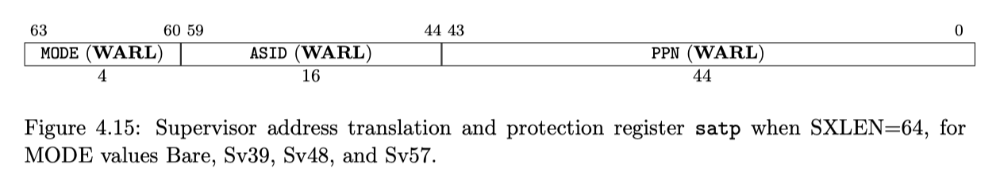

# CPU Cache 和 Virtual Memory 介绍

## 1 CPU Cache

当前的计算系系统包含了CPU和Memory两个组件，CPU在执行程序的时候需要读写Memory。受到成本制约，CPU读写Memory的速度比读写Register慢至少100倍以上。为了减少读写Memory的耗时，可以在CPU和Memory之间引入多层Cache组件，一般会有3层。因此存储数据的组件包括了这几种（到Memory为止，后面其实还有Flash/Disk等不在本文的讨论范围）：Register -> L1 Cache -> L2 Cache -> L3 Cache -> Memory。它们的速度和单位成本递减，而容量递增。一般来说L1 Cache会进一步分成L1i Cache和L1d Cache，分别用于缓存指令内容和数据内容。


把Cache作为一个模块来看，对上它给CPU提供了读和写某个地址的接口。读的时候CPU向Cache提供数据所在地址，Cache返回该地址对应的数据给CPU。写的时候CPU向Cache提供写入的数据和所要写入的地址，Cache负责将数据写入到对应的位置。对下层存储模块来说，它类似CPU会发起读写请求。如果当前Cache中不存在所读取的数据（未命中缓存，cache miss），则需要向下层Cache读取，有的话直接返回给请求者（命中缓存，cache hit）。Cache命中率是衡量Cache性能的核心指标（此外根据使用场景，像面积和功耗也要重点考虑，本文不会涉及到这部分内容）。

Cache能够起作用是因为程序执行过程中存在时间局部性（Temporal Locality）和空间局部性（Spatial Locality）：

- 时间局部性：指某个数据现在被访问，之后这个数据很有可能还会被访问到。
- 空间局部性：指某个数据现在被访问，之后前后位置的数据很可能也会被访问。

比如代码中的Loop Body部分，因为会执行很多次，Loop Body的代码一段时间内会被重复读取执行，具有时间局部性。另外代码中一般都只有少量的分支跳转指令，这也就意味着大部分的代码执行是顺序的，因此相邻位置的代码很快就会被访问到，具有空间局部性。同时代码在执行过程中的数据读写也具有类似的特征，比如对数组进行遍历然后做各种运算。

指令内容的读取和程序中数据的读写都具有上述规律，其中指令内容的读取具有很明显的局部性。这也是L1 Cache分成了指令和数据Cache的原因。

### 1.1 Cache的常见结构

因为Cache的容量比Memory小很多，在实现其缓存效果的过程中需要考虑如何在Cache中存放缓存数据，以便后续判断缓存是否命中。另外还要考虑当Cache没有空闲位置的时候如何淘汰已缓存的数据，以便腾出来用于缓存新数据。最简单的存放方式就是固定将数据存放在Cache的一个位置，这个存放的位置也叫Cache Line，使用数据地址的某一部分来索引。比如如下面所示将数据地址分成了三部分，然后使用Index部分来索引存放的Cache Line。Offset部分表示数据在一个Cache Line内的偏移。然后用Tag部分进一步判断该Cache Line缓存的数据是否是地址所指向的数据，因为有可能该位置缓存的数据是另外一个Index部分一样但Tag部分不一样的数据，或者还没有缓存有效的数据。这种存放方式叫做直接映射（direct-mapped）。

</img>

直接映射很容易使用硬件实现，不过这种方式会导致Index部分相同的地址挤占同一个Cache Line，使得之前缓存的数据被迫清除，降低了Cache的命中率。这时可以通过增加Index部分能够映射到的Cache Line的数量来降低互相挤占的情况。比如增加到2个Cache Line，那么当其中一个Cache Line被占用的时候，可以将数据缓存到另外一个Cache Line。我们将Index部分所能映射到的所有Cache Line的集合叫Cache Set。取数据的时候需要判断所有可以被映射的Cache Line中的数据是否有效（valid/invalid）且Cache Line记录的Tag跟地址的Tag部分一致。这种存放方式叫做组相连（set-associative），可以存放到2个Cache Line的叫做2路组相连。进一步如果数据可以存放到所有的Cache Line中，则称之为全相连（fully-associative），这时地址只需分成Tag部分和Offset部分，然后用Tag部分和所有Cache Line中记录的Tag进行比较确认是否命中。直接映射和全相连可以看作是组相连的两个极端。

举个例子说明。假设CPU使用的地址宽度用1 byte表示，一个Cache Line为8 bytes大小，则Offset部分占用3 bits（这样能访问到Cache Line中的每一个byte）。然后假设Index部分占用3 bits，Tag部分则占用剩余的2 bits。Index部分可以映射到2个Cache Line。因此该Cache是一个2路组相连的结构。假如CPU发起了一个load请求，请求地址为10101011处单字节内容，Cache命中情况下的访问过程如下图所示，最终得到数据0x29。


选择实现多少路组相连会影响命中率。比如上图中Index相同的地址有4个（即Tag部分可以表示的数值），但是只有2个Cache Line用于存储Index相同的数据。因此如果程序轮流读取三个Index部分一样的地址的数据时，总是会有一个地址的数据无法命中缓存。

### 1.2 Cache淘汰策略

因为Cache Set的数量往往比Tag部分可以表示的数量少，当Cache Set存储满了时就需要有一个淘汰策略。常见的策略包括最近最少使用（LRU，Least Recently Used）和随机替换（Random Replacement），这里重点介绍LRU淘汰策略。

要实现精确的LRU算法就至少额外给每一个Cache Line分配N bits，用于存储Cache Line的年龄（比如8路组相连的话，Cache Set为8，至少需要3 bits表示年龄）。当某个Cache Line访问到时，如果此时它的年龄为0，则将其年龄设置为1，同时将其他年龄大于0的Cache Line的年龄加1；如果此时它的年龄为1，则不做任何处理；如果此时它的年龄大于1，则将其年龄设置为1，然后将年龄小于该Cache Line但是大于零的Cache Line的年龄加1。在选择淘汰Cache Line时，只需要找到年龄为0的那个Cache Line淘汰即可。年龄值为0的Cache Line要么是最近还没有使用过的，要么是最早使用的（年龄最大然后加1溢出归零）。因为需要给每个Cache Line额外增加属性，这种算法必然会增加较多的硬件面积。

在实际设计中，折衷地选择Pseudo-LRU（PLRU）算法，该算法只是粗略的记录各个Cache Line的年龄值。其中常见的包括Tree-PLRU和Bit-PLRU两种PLRU算法。下面简要介绍下Tree-PLRU算法。

#### 1.2.1 Tree-PLRU

Tree-PLRU算法创建一颗完美二叉树，且完美二叉树的叶子节点一一对应Cache Set中的Cache Line。非叶子结点则使用一个bit表示年龄位，为0表示低路数Cache Lines最近有没被访问的Cache Line，为1表示指向高路数Cache Lines最近有没被访问的Cache Line。也就是说指向哪路说明哪路可以被替换。如下图所示是一个8-way组相连的Cache的完美二叉树结构，需要三级年龄位。需要注意的是，下图给每个年龄位可以为0或者1，并且画了两个指向下一级的箭头，实际上只会有一个箭头，当年龄位为0时表示指向右上的箭头，为1时表示指向右下的箭头。

</img>

假设第一级年龄位为0，表示方向指向way 0～3 Cache Lines，说明这些Cache Lines可以被替换，至于具体哪个Cache Line可以被替换，需要进一步查看第二级年龄位和第三级年龄位。每级年龄位的更新过程如下：

1. 假设Cache Set已经没有空闲（invlaid）的Cache Line了，同时假设所有的年龄位都为0，也就是说way 0 Cache Line是最近最少使用的Cache Line。初始化的Tree如下图所示，这时从第一级年龄位开始跟着箭头能走到way 0 Cache Line，我们称这些箭头组成了当前的Tree Path。这个Tree Path指向的是最近最少使用的Cache Line

   </img>

2. 来了一个未缓存过的load请求，Cache根据每一级年龄位的值，选择淘汰way 0处的Cache Line。同时将访问到的第一级、第二级、第三级年龄位的值都改为1。修改后的Tree如下图所示，这时的Tree Path指向way 4。

   </img>

3. 又有一个未缓存过的load请求，Cache根据每一级年龄位的值，选择way 4 Cache Line缓存该地址的值。同时将第一级年龄位的值改为0，对应第二级和第三级年龄位的值改为1。修改后的Tree如下图所示，这时的Tree Path指向way 2。

   </img>

4. 之后所有的未缓存过的load请求，都是替换根据从第一级年龄位开始箭头最终指向的Cache Line。比如后面依次淘汰way 2、way 6、way 1、way 5、way 3、way 7。可以看到基本上是淘汰最近最少使用的Cache Line了。

5. 假如来的是缓存过的load请求，则只需要修改对应的年龄位的值以便体现了其刚被使用了。比如接着第3步来了一个请求way 6的load请求，则需要将路径上对应的第一级年龄位改为0（本来就是0），第二级年龄位改为0，第三级年龄位改为1。如下图所示。

   </img>

总的来说，如果是请求已经缓存过的地址，则只更新到达该Cache Line的Tree Path中的年龄位。如果请求的未缓存过的地址且没有invalid的Cache Line，则选择当前年龄位组成的Tree Path所指向的Cache Line来替换。因为是近似模拟LRU算法，在某些情况下会出现不够准确的情况。比如假设Cache的状态为第1步所处状态，然后依次访问已经缓存过的way 4、way 0、way 1、way 2、way 3、way 6，此时的Tree如下图所示。

   </img>

假如这时又来了一个未缓存的请求，则根据年龄位所形成的Tree Path，会选择way 0处的Cache Line给替换掉。但实际上，way 0并不是最近最少使用的，它比way 4、way 5、way 7都要新，这种情况下就没有选择最近最少使用的来替换。

再来计算下需要新增的存储空间。假设Cache有N个way，n = log<sub>2</sub>N，则需要 2<sup>0</sup> + 2<sup>1</sup> + ... + 2<sup>(n-1)</sup> = 2<sup>n</sup> - 1 = N - 1 bits 存储年龄位。

#### 1.2.2 Victim Cache

因为Cache Set的数量往往比可以映射到其中的地址数量少，会出现刚被淘汰的数据马上又要被使用的情况。提高Cache Set的数量可以解决这个问题，但是会增加大量的面积，而且出现这种情况的次数通常不会太多。因此实际中会引入一个Victim Cache，这个Cache专门保存最近被替换掉的Cache Line。Victim Cache的容量很小，通常采用fully-associative方式。Victim Cache和主Cache之间的数据是互斥的（exclusive）

读取的时候，会同时读取主Cache和Victim Cache，如果发现数据存放在Victim Cache中，则直接使用其中的数据，同时将其写回到主Cache，主Cache中淘汰的数据保存到Victim Cache中。

### 1.3 Cache的写入

Cache写入的时候，需要考虑如何更新下一级存储器（可能是下一级Cache或者Memory），常见的有两个方式。一种是在更新当前Cache时同时更新下一级存储器，这种方式叫做Write Through。因为要写入更慢速的存储器，Write Through方式写入的效率不高。另外一种是更新当前Cache时只是将对应Cache Line标记为dirty状态，只有当它被淘汰的时候才更新到下一级存储器中，这种方式叫做Write Back。因为大部分时候不需要同时写入下一级存储器，Write Back方式的效率比写通方式高很多。Write Back方式问题是会出现上下层存储器数据不一致（non-consistent）的情况，给存储器的一致性管理带来了一定的负担。

上述提到的写入操作是假设在Cache中命中了缓存时的方式。对于没有命中缓存的情况，也有两种方式，一种是直接写到下一级存储器，称之为Non-Write Allocate。另外一种是先将缺失的数据加载到Cache Line中，然后再进行写入操作，这时可以选择Write Through或者Write Back方式，这种方式称之为Write Allocate。一般Write Through搭配Non-Write Allocate，Write Back搭配Write Allocate。

为了减少对下级存储器的写入压力，Cache可以引入一个write buffer，将写入操作暂存到write buffer中，得到下级存储器空闲的时候再真正写到下级存储器中。

### 1.4 提高Cache的bandwith

为了提高load/store指令的并行数量，需要让Cache支持多端口。目前最常用的是多bank组织方式（Multi-banking），将Cache分成了很多个bank，每个bank只有一个端口。如果一个周期内，多条内存访问指令访问的地址在不同的bank，则这些指令可以同时处理。因为内存访问存在空间局部性，为了减少某段时间内的请求落到同一个bank，需要将一个Cache Line分到每个bank中去。比如Cache Line为64 bytes，分成了两个bank，则可以依次将8 bytes分到不同的bank。比如0～7、16～23、32～39、48～55 bytes分到第一个bank，8～15、24～31、40～47、56～63 bytes分到第二个bank。减少bank冲突（bank conflict）才能提高bank利用率，如何划分bank是重要因素。

## 2 Virtual Memory

虚拟内存是指在物理内存之上引入一层新的内存地址，这套内存地址对所有的进程/线程都是统一的。虚拟内存到物理内存的映射关系一般由操作系统负责管理，用户程序本身并不在乎所用的地址是虚拟的还是物理的。虚拟内存的支持，需要硬件和操作系统合作，操作系统使用硬件提供的虚拟内存的软硬件接口。

### 2.1 为什么要引入 Virtual Memory

假如没有虚拟内存，用户程序直接使用物理地址来访问内存模块，同时在操作系统上运行的用户程序又有很多个。这时有几个问题需要解决：1. 各个用户程序之间使用的内存如何划分，以便他们之间不会互相影响到？2. 用户程序使用的总地址空间超过物理内存大小时怎么办？如果让用户程序直接使用物理地址，这两个问题都难以解决。当前主流的解决方法是引入虚拟内存抽象层。就像一句名言说的，“通过引入新的抽象层，我们可以解决任何问题。”，该名言通常还需要补充一段，“除了抽象层太多的问题”。😂

> We can solve any problem by introducing an extra level of indirection.
> 
> from: https://en.wikipedia.org/wiki/Fundamental_theorem_of_software_engineering

通过引入虚拟内存抽象层，用户程序中使用的地址为虚拟地址。操作系统需要将用户程序用到的虚拟地址转换成物理地址以便读写物理内存中的数据来完成程序的功能。整个转换过程对用户程序完全不可见，脏活累活都由编译器、操作系统和硬件协同完成。

### 2.2 Virtual Memory 结构

下面以RISC-V 64位系统为例介绍Virtual Memory的内容。RISC-V 64位CPU架构提供了Sv39、Sv48、Sv57三种虚拟内存规范，名字中的数值部分表示虚拟内存地址用的bits数。这些规范主要规定了虚拟内存的大小，Page Table级数等信息，虚拟地址范围越大，硬件开销越大。这些信息可以指导操作系统如何支持虚拟内存。以Sv39虚拟内存规范为例，它使用39 bits表示虚拟内存地址，因此整个虚拟内存的范围为512GiB。根据RISC-V规范要求超过39 bits的高位（63～39 bits）必须要和第38位保持一致，因此512 GiB对应到64 bits地址上分成两部分，分别是0x0～0x3FFFFFFFFF和0xFFFFFFC000000000～0xFFFFFFFFFFFFFFFF。Linux操作系统将512 GiB划分成了下面几个不同用途的空间。

```
===========================================================================================================
    Start addr    |     End addr     |  Size   | VM area description
===========================================================================================================
                  |                  |         |
 0000000000000000 | 0000003fffffffff |  256 GB | user-space virtual memory, different per mm
__________________|__________________|_________|___________________________________________________________
                                               |
                                               | Kernel-space virtual memory, shared between all processes:
_______________________________________________|___________________________________________________________
                  |                  |         |
 ffffffc000000000 | ffffffc6fe9fffff |         | unused
 ffffffc6fea00000 | ffffffc6feffffff |    6 MB | fixmap
 ffffffc6ff000000 | ffffffc6ffffffff |   16 MB | PCI io
 ffffffc700000000 | ffffffc7ffffffff |    4 GB | vmemmap
 ffffffc800000000 | ffffffd7ffffffff |   64 GB | vmalloc/ioremap space
 ffffffd800000000 | fffffff6ffffffff |  124 GB | direct mapping of all physical memory
 fffffff700000000 | fffffffeffffffff |   32 GB | kasan
__________________|__________________|_________|____________________________________________________________
                                               |
                                               | Identical layout on Sv39, Sv48, Sv57:
_______________________________________________|____________________________________________________________
                  |                  |         |
 ffffffff00000000 | ffffffff7fffffff |    2 GB | modules, BPF
 ffffffff80000000 | ffffffffffffffff |    2 GB | kernel
__________________|__________________|_________|____________________________________________________________
```

虚拟内存到物理内存的映射是以Page为单位，一Page可以配置成4 KiB、2 MiB、1 GiB三种大小。以4 KiB为例，Sv39规范中涉及到以下内容。

- satp寄存器，其中的MODE部分设置所使用的虚拟内存规范，ASID部分表示地址空间，一般用于区分多进程之间相同的虚拟地址。PPN部分指根页表的基地址（root page table）的PPN（physical page number）部分。Sv39中PPN为44位

  
- page table entry，表示页表项。在做Page Table Walker的时候需要根据其中的flags确定page table存在还是不存在，不存在则会触发一个Page Fault异常。 交由操作系统Page Fault处理程序分配物理内存给这个虚拟地址，更新每一级的page table enry。RISC-V中的Page Table Walker要求物理实现。

  

> 上图来源于 *The RISC-V Instruction Set Manual, Volume II: RISC-V Privileged Architectures V20211203*

- Spec中描述了虚拟内存转换成物理内存的过程（Page Table Walker），参见RISC-V Privileged Architectures V20211203中的4.3.2 小节。对于Sv39来说，步骤如下：

  1. 总共有3级页表（0、1、2），页大小为4KiB，页表项大小为8字节。satp.ppn存放的是第2级页表的物理基地址PPN(物理地址等于PPN << 12)。
  2. 第i级页表的物理基地址+va.vpn\[i\]可以找到对应的页表项，里面的PPN为下一级页表的物理基地址。
  3. 直到找到了第0级页表中的页表项为止，其中的PPN+Page Offset就是虚拟内存对应的真正物理地址。

### 2.3 TLB 加速

从上述的描述可以看到，虚拟到物理地址的转换需要经过3次内存读取。也就是说除了内存访问本身，还要访问三次内存，这显然及其影响内存访问的性能。页内的多次访问是一个时间局部性非常高的过程，因此通过将转换结果缓存起来，可以减少大部分的虚拟内存转换。这个缓存虚拟地址对应的物理地址的Cache叫做TLB（Translation Lookaside Buffer），一般TLB会分成两层，第一层指令和数据分开，使用全相连方式（I-TLB、D-TLB），第二层指令和数据共用，采用组相连的方式。

TLB的引入会导致一个问题，就是在进程销毁或者进程切换时，需要将对应的TLB缓存项优先淘汰（置为无效）。因此，TLB缓存的内容除了必要的，还需要记录虚拟地址本身，以及虚拟地址所属的地址空间编号（ASID）。RISC-V中提供了指令`fence.vma asid, vaddr`用主动设置TLB中哪些缓存无效。其中asid为虚拟内存空间编号（可以认为是进程编号），vaddr是虚拟地址。通过这条指令，可以将某个进程的所有TLB缓存置为无效或者删除具体的某个虚拟内存地址等。

### 2.3.1 Cache改造

因为虚拟地址的引入，Cache缓存所有的地址可以选择物理地址，也可以选择虚拟地址。目前用的最多的是Virtually-Indexed，Physically-Tagged（VIPT）方式，即虚拟地址作为Cache Index，物理地址作为Cache Tag。这种方式会有synonym（同义）问题，解决这个问题的方法一般是通过限制单个way的大小为4KiB（即页的大小），然后通过增加way数来达到增加Cache总容量的效果。

## 参考

- 《超标量处理器设计》，姚永斌
- [Pseudo-LRU](https://en.wikipedia.org/wiki/Pseudo-LRU)
- [*Operating Systems: Three Easy Pieces*](http://www.ostep.org)
- Linux内存管理博客
  1. [一步一图带你深入理解 Linux 虚拟内存管理](https://zhuanlan.zhihu.com/p/577035415)
  2. [一步一图带你深入理解 Linux 物理内存管理](https://zhuanlan.zhihu.com/p/585395024)
  3. [深入理解 Linux 物理内存分配全链路实现](https://zhuanlan.zhihu.com/p/595356681)
- The RISC-V Instruction Set Manual
  - [Volume II: RISC-V Privileged Architectures V20211203](https://github.com/riscv/riscv-isa-manual/releases/download/Priv-v1.12/riscv-privileged-20211203.pdf)
    - 4.3 Sv32: Page-Based 32-bit Virtual-Memory Systems
      - 4.3.2 Virtual Address Translation Process
    - 4.4 Sv39: Page-Based 39-bit Virtual-Memory System
    - 4.5 Sv48: Page-Based 48-bit Virtual-Memory System
    - 4.6 Sv57: Page-Based 57-bit Virtual-Memory System
- [Virtual Memory Layout on RISC-V Linux](https://www.kernel.org/doc/html/latest/riscv/vm-layout.html)
- [浙江大学22年秋操作系统实验-Lab 4: RV64 虚拟内存管理](https://zju-sec.github.io/os22fall-stu/lab4)
  - 3.2.4 RISC-V Address Translation
- [聊聊cache第一弹， VIVT，PIPT， VIPT和PIVT](https://zhuanlan.zhihu.com/p/434289177)
