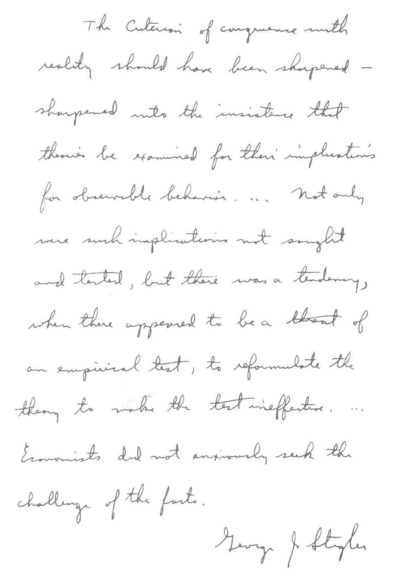
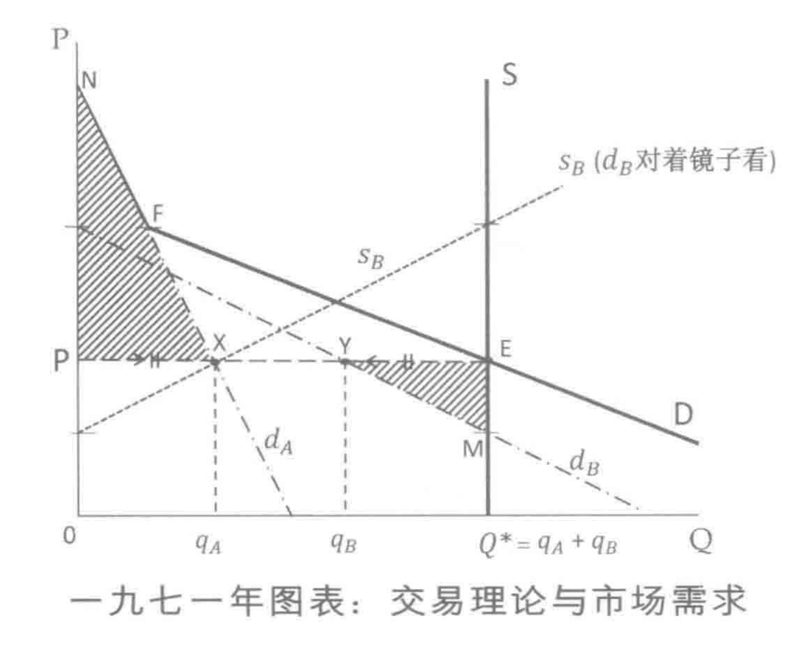

# 卷一：科学说需求

> 《经济解释五卷本：二O一九增订版》 张五常 著

* TOC
{:toc}

## 第一章：科学的方法

> 科学不是求对，也不是求错；科学求的是“可能被事实推翻”。可能被事实推翻而没有被推翻，就算是被证实了。

我坐在书桌前，拿起笔，想着人类在科学上的成就。科学是有系统地解释现象的学问，很有意思。人为万物之灵，一点不错：我们脑子的发达，与其他生物相比，距离不可以道里计。感情的表达是艺术，理智的分析却是科学的需要。人的感情往往与理智混淆。这样，科学的推断可能被感情左右，弄得拖泥带水。另一方面，理智的分析可以点缀着一些情感，不混淆。是的，科学可以有艺术的美。

向美追寻是人之常情，所以科学也可以有艺术性，有艺术的美。但科学的本质可不是艺术，前者是以阐释现象为主旨。另一方面，人到底是人，不能冷若冰霜，半点感情也没有。因此，说某篇科学文章是一件艺术作品，是恭维的话了。问题是，仅仅是美而不能解释现象，是美中的不足，失却了科学的功能。科学家既然是人，我们不能期望他们是人类的例外，毫无感情，但感情是不可以在科学上滥用的。原则简单：科学著作可以将客观分析与主观感情结合、并用，但二者要分清楚。只要能这样做，科学文字倒可加上感情之词，点缀一下，减少枯燥，增加其可读性。

以经济学来说，主观感情与客观分析的清楚划分是比较困难的。不是不能做到，而是比自然科学——如物理、化学等——困难。经济学是解释人类行为的科学。困难是，经济学者也是人，难免将自己的价值观混在一起，甚至以主观的喜恶作为科学上的结论。优秀的经济学者在分析时有忘我之能；这是一心二用的本领了。天生有所不逮者，是要多加锻炼的。

### 第一节：现象必有规律

我的书桌在窗旁。是深秋了。纱窗外，风摇翠竹。在人烟稠密的香港，窗外可以见到茂林修竹的环境不容易。杜甫写的“无边落木萧萧下”，香港的人见不到这景象也相信，那是为什么？是深秋，这里的竹还绿得可爱，那又是为什么？今年的气温下降得较早，只不过十一月初，已寒气逼人。两个月前我在窗外还见到的蝴蝶，现在不知所终。但我知道，明年六月蝴蝶还会再来。我怎能这样肯定呢？

窗是向东的。我每天在晚间写作，没有在书桌旁见到太阳的上升，有好几年了。但我不用看见，也敢跟任何人打赌，早上我可以在书桌旁的窗外见到太阳。我见到海，知道海水是咸的，也知道潮水的高低与“月有阴晴圆缺”有一定的关系。少年时，我是钓鱼能手。见到海，我就想起钓鱼乐事。钓者负鱼，但却知道鱼的品性。月圆之夜，乌云盖天，是钓黄脚魶的大好时机。这是规律。

#### 人的行为也有规律

大自然的规律是任何识者都会同意的。人的行为又何尝不是如此呢？向窗外远眺，香港置地公司所建的置富花园的房屋，与政府所建的廉租的华富村，一左一右。后者比前者人烟稠密，任何人都会同意，不用调查了。在这些住宅区中较近我家的碧瑶湾，人口的密度比置富的还小一点。较高级的住宅，人口密度较低。这是规律。在更近的山坡上，木屋三三两两。这些木屋很简陋，是僭建的。僭建的房子没有地权，比有地权的房子简陋得多了。这也是规律。

是的，不管是大自然或是人为的现象，都有规律可循。事实上，我们不可能找到任何现象是完全没有规律的——虽然有些现象，其规律要深入研究才能发现。现象有规律，自古皆然。我们知其然，但不一定知其所以然。既知其然，就很想知其所以然，这是人的好奇心。我们要作解释，科学也就由此而起。

#### 主观判断要客观认同

科学的形成是基于三个重要的信念，任何对科学有兴趣的人都要遵守。第一，凡是现象或行为，其存在是靠主观的判断，而大家不能在这主观上有分歧。我说太阳正在上升，是我个人的主观判断，要是你不同意，认为太阳正在下降，那么我和你就不可能一起科学地解释太阳的现象了。我看见的是花，你看见的也是花；我说下雨，你也同意雨在下着，是科学一般化的第一个条件。当然，世界上有一些人，什么也不同意。这些人非与科学绝缘不可。

奇怪的是，大家对主观现象的认同，是莫名其妙地容易达到一致的。一个现象，就算主观不同，同意这现象的存在也不困难。例如，有色盲的人，会同意某一种自己看不到的颜色的存在；失聪的人，听而不闻，不会否认有声音这回事。

主观的现象受到客观的认同、共信，是科学的一个基础。然而，有些主观的事不能为大众所认同，难以共信，所以这些事是科学以外的了。例如，中国昔日常提及的特异功能，信者言之凿凿，但不相信的更多。我在北京曾看过最有名的特异功能的表演，认为假得离谱，就不相信了。特异功能是科学以外的事，不仅因为我不相信，也不仅因为很多人不相信，而是因为没有人曾经严格地以考证的方法，使不信者信服。好比一些人相信上帝，另一些人不相信，而从来没有人成功地证实上帝的存在。这不是说基督教或其他宗教没有意义，而是说宗教非科学。

#### 现象规律必有原因

科学的第二个信念，是前文提过的：所有被众所认同的现象，都是有迹可寻，有规律的。某些现象的规律，要经过很大的努力才能发现或证实。经验告诉我们，现象的规律一向都是那样恒常不变，所以一个新现象的发现，虽然其规律不易找到，但从事科学研究的人，会坚信这规律的存在，百折不挠地寻求。

为什么现象的规律是这样重要呢？答案是：假若现象的发生毫无规律，完全是随便或偶然（random）的，不可能知道与任何其他现象有联系，那么这现象就不可能被有系统地解释了。无迹可寻的现象，事前既无迹象，事后也没有根据，好像是耶稣升天似的，不能以逻辑推断。科学之所以成为科学，是因为世界上没有毫无规律的现象。

这就带来第三个必需的信念了。从事科学研究的人，一定要坚信任何事情的发生不会是无缘无故的。推测（不是预测）与解释是同一回事。假若我们推测在某些情况下，由于某种缘故，某现象会产生，那么这现象的产生就算是被解释了。例如，苍蝇的飞行速度及不上飞机，但因为牛顿的万有引力，在机舱内苍蝇可以向前飞。解释苍蝇在机舱内可以向前飞，与推断苍蝇在机舱外飞时不及飞机快，是用同一理论。假若苍蝇与飞机的速度毫无规律，又或是这二者的速度在不同情况下无法比较，那么我们就无从解释机内或机外的飞行现象，科学又从何说起呢？

主观的现象要被众所认同，须有固定的规律，而其发生或出现，是必有原因的。这些是科学的必需条件。

### 第二节：事实不能解释事实

在科学上，现象（phenomenon）、事实（fact）、行为（behavior）或观察所得（observation）是同一回事——虽然有些现象是不能用肉眼观察到的。

解释现象往往需要非事实的抽象理论。为什么事实的解释要牵涉到抽象的思想那方面去呢？答案是：事实的规律不能不言自明，自我解释。天下雨，天上一定有云——这是现象的规律——但雨的出现不能解释云的存在。小麦在泥土中生长——这是规律——但泥土不能解释小麦。权利界定带来经济繁荣——这也是规律——但繁荣不能解释为什么有资产的权利界定；二者倒过来说，也没有解释力。事实的规律只可以使我们知其然，不能使我们知其所以然。

假若甲现象的发生会连带着乙现象的发生，而我们跟着说甲解释了乙，或乙解释了甲，我们会有两个困难。第一，世界上的现象规律何其多也。数之不尽的现象规律，如果真的能自我解释，那么在任何一门科学之内，理论汗牛充栋，各各不同，没有一般性的解释力。如果一个现象能解释另一个现象，那么只要现象的规律发现了，我们以为这规律有了自我解释，那么人的推理思想又有什么用场呢？第二，有规律的现象，在不同的情况下，其规律的表现可能会改变。例如，羽毛应该下降，但在风中可能上升。如果以风解释羽毛的上升，那么有风而石头不上升又怎样了？我们应该以什么原则来分门别类呢？我们要找的原则，是一个科学的原理或理论。我们可以说，科学的一个用途，是将现象分门别类，作有系统的安排。

布鲁纳（K. Brunner）说：事实不能以事实解释。弗里德曼（M. Friedman）说：事实的规律是要被解释的。在经济学界内，说得最好的还是马歇尔（A. Marshall）：“这些争议的经验告诉我们，除非经过理智的考究与阐释，我们不可能从事实中学得些什么。这也教训了我们，使我们知道最鲁莽而又虚伪的，是那些公开声言让事实自作解释的理论家；或者无意识地，自己在幕后操纵事实的选择与组合，然后提出如下的推论：在这之后，所以这就是原因。”

### 第三节：特殊理论与套套逻辑

我们知道，同一件物品，在很高的山上其重量是会减少的。地心吸力的理论解释了这个现象。但在牛顿之前，人们会怎样想呢？我们知道在很高的山上，气温会下降，于是我们说，寒冷的温度，由于某些缘故，会使物体的重量减少。这是理论。要证明这理论是对的，我们把同样的物品拿到平地，把它放在冰冻的房内，衡量其重量，发觉重量没有减少，那么温度与重量之说就被推翻了。

下文将会解释，凡是有解释能力的理论，一定要有被事实推翻的可能（refutable by facts），但却没有被事实推翻。以温度下降来解释物体重量减少这个理论被事实推翻了，我们应不应该视之为错呢？这是一个重要的哲学问题。

假若我们不管其他情况，任何被事实推翻的理论看为是错，那么所有理论都是错了的。那不成。被事实推翻了的理论可以挽救。以物体在高山的重量来说，温度下降之说被推翻了，但我们可以说，在高山上，不仅气温较低，风也较大。于是，我们再作实验，将同样的物品放在冰寒之室后，加上风扇，再衡量其重量。这一衡量，又发现那温度之说是被推翻了。

我们再接再厉，指出高山上的山坡是倾斜的。于是在有风扇的冰室内加上斜板，将物品安置在斜板上衡其重量，又发觉温度之说不可信。绝不气馁，我们继续指出高山的位置海拔上升。于是，我们耗巨资，将冰室高筑至云霄。终于，我们重复了高山上的情况，有冰寒，有风扇，有斜板，有高度，物体的重量果真少了，所以温度的理论是被证实了的。这个理论没有错，但却是一个特殊理论（ad hoc theory）。特殊理论也是理论，不过因为过于特殊，一般性的解释能力就谈不上。不是因为理论的内容不足，而是内容太多，以致内容稍为一改，理论就被推翻了。

#### 过于特殊代价太大

任何科学理论，即使被事实推翻，我们总可多加条件来挽救的。但挽救理论是须付代价的。过大的代价不应该付。一个特殊得只能解释一个现象而完全不能伸展到其他现象去的理论，毫无一般性的功能，解释力小之又小，其代价是太大了。被事实推翻了的理论可以挽救，也往往应该挽救，但不应该付出过大的代价。代价是否过大的衡量准则，是要基于一般解释力的大小。大小有程度之分。我们不应该见一个理论的解释力不够广泛就放弃它——今天不够广泛的理论，明天可能有较广泛解释力的取而代之，但在此之前，不够广泛的理论可能是最有用途的了。

世界上有真理，但没有不可以被更佳理论替代的理论。科学的进步，不是因为对的理论替代了错的，而是有较广泛解释力的，替代了较狭窄的。人的思想可以进步，今天认为是绝佳的，明天可能被更有用场的替代了。今天，我们还未能为人类的思想能力画上句号。二战以来的科学突飞猛进，使我们有理由相信，人的思想所及可能永无止境。

一个特殊理论，若是特殊到只能解释一个现象——如上文所述的例子，只能解释某物体在高山上的重量——是站在科学理论的一个极端，完全不能一般化，用场极少。站在另一端，却是一般化得离谱，在任何情况下也不可能是错的“理论”。不可能错，因为没有内容。这就是哲学上所说的套套逻辑（tautology）了。特殊理论内容太多了，而套套逻辑则没有内容。可取的理论，一定是在特殊理论与套套逻辑之间。

#### 套套逻辑可以空洞无物

所谓套套逻辑，是指一些言论，在任何情况下都不可能错。说得更严谨一点，套套逻辑不可能被想象为错！举一个例，假若我说：“四足动物有四只脚。”这怎可能错呢？句子内的后半部重述了前半部的意思，即使我们花很大功夫也不可能想象到在怎样的情况下会是错的。在地球上、火星上它不会错，在宇宙任何地方它也不会错。这句话的一般性厉害，但内容究竟说了些什么？其实什么也没有说！我们想破脑袋也知道是对的，但不知其内容。那是说，套套逻辑的内容是空洞的，半点解释能力也没有。

一般而言，套套逻辑不是“四足动物有四只脚”那么简单，那么一目了然。空泛而没有内容的，而又不可能错的“理论”多的是，很多时大学博士也不易察觉。且让我举些例子吧。

在经济学上，一个不可或缺的基本假设是：每个人的任何行为都是为自己争取最大利益。然而，一个人抽烟或跳楼，却对自己有害。假若我们说抽烟或跳楼的行为，是因为“争取个人最大利益”，那就是套套逻辑了。在这假设下，任何行为都算在其内，以“争取个人最大利益”来“解释”抽烟或跳楼，不可能错，因为假设的本身是一般地包括了人的所有行为。如果所有人的行为都是定义地、空泛地被解释了，整个经济学就没有什么内容。

举另一个例子。有一位经济学者，试图以事实考证私营企业的生产成本是否为该企业所能做到的最低成本。根据经济学的定义，所有私营企业，为了要图私利，必定会尽可能减低生产成本。于是，这位学者所试图考证的是套套逻辑，不可能错，但没有内容，因为定义本身不容许有可以减低生产成本而又故意不减低的行为。弗里德曼（Friedman）对这位学者的考证工作，可圈可点地下评语：“愚蠢的问题，当然会得到愚蠢的答案！”什么是愚蠢的问题呢？不可能有第二个答案的问题——或答案不可能是错的问题——就是愚蠢了。

是的，套套逻辑不一定肤浅，往往不是一目了然，有时饱学之士也看不出来。四十多年前，一位哈佛大学的研究生拿到经济学博士衔，其论文获该校选为最杰出并颁以奖状。后来该论文出版成书，大事宣扬。阿尔钦（A. A. Alchian）读后写的书评更有名。阿氏精辟地指出，获奖的整篇论文都是套套逻辑，不可能错，没有内容。这书评使哈佛尴尬之极。试想，一个博士生的套套逻辑，可以使大名鼎鼎的哈佛经济学系的高手教授也看不出来，我们又怎可以低估这种逻辑的“高深”呢？

#### 套套逻辑可以是重要概念

我说套套逻辑不可能错，没有内容，但并没有说这种言论不可能是重要的概念。事实上，很多重要的科学理论，是来自不可能错的套套逻辑提供的观点或概念的。套套逻辑有一点可取特色：它有极大的一般性。假若我们能把范围加以约束、收窄，有时可以促成一个有内容的——可能错的——理论，其解释能力之强，令人拍案。

在经济学内我们可以举出一些例子。例如上文所提及的“争取个人最大利益”与抽烟，把这二者天经地义地——好像下定义似的——混为一谈，是套套逻辑，没有内容；但如果我们能加进一些约束条件（即局限条件），使我们能推断在什么情况下一个人会多抽烟、少抽烟，或戒烟，那么理论就有内容，可以验证。

另一个更为明显的、从套套逻辑变为大有用场的理论的例子，是货币学说中的币量理论。这理论的起点分明是套套逻辑：货币量（M）乘货币的流通速度（V），等于物品的价格（P）乘物品的成交量（Q）。这个 MV = PQ 的方程式不可能错，是因为前者（MV）与后者（PQ）只不过是从不同角度看同一数量。既然不可能错，这方程式就成为一个定义，可以写为 MV ≡ PQ 了。很显然，这定义没有解释什么。然而，因为提供了一个看世界的角度，有启发力，如果能适当地加以约束，就变为重要的币量理论，大有解释力了。费雪（I. Fisher）、弗里德曼等学究天人，成功地指出在什么情况下货币的流通速度（V）大致上是固定的，继而指出货币量（M）与价格（P）的连带关系。币量理论搞出千变万化，异彩纷呈，归根究底，还是源于一个套套逻辑的概念。

有人说，四十多年来在经济学大行其道的科斯定律（Coase Theorem）是套套逻辑。我认为科斯定律大有用场，是因为识者可以技巧地加上约束，千变万化，推出不少具有解释现象能力的假说。同是套套逻辑，到了本领不同的人手上，会有截然不同的威力。那些批评科斯定律是套套逻辑而置诸度外的人，不知天高地厚。至于科斯定律是什么，我们要到本书的卷四才详尽地分析。

我们可在特殊理论及套套逻辑这两个极端之间下些结论。特殊理论内容过多，只能特殊地解释一个现象，没有一般性的解释力。但特殊理论总要比完全没有理论好。凯塞尔（R. Kessel）说得好：“没有任何理论在手，什么辩论也胜不了。”只能解释一个现象，是比一个现象也解释不了优胜的，虽然可取的科学理论，必定有一般性；不然的话，理论多如现象，岂不是乱七八糟了？

另一个极端是：套套逻辑广泛之极，不可能错，但如此一来，其内容就变得空洞，不着边际。套套逻辑的解释能力，比特殊理论还有所不如。但套套逻辑可以是重要的概念，可以有启发性，可能给我们提供一个新的角度看世界。认为套套逻辑内容空洞而置之不理，可能走了宝。我们不要放弃一个新的角度看世界，要尝试加上约束或局限条件，为套套逻辑增加内容，希望能把“定义”变为可以解释现象的理论。

大有可取的、足以解释世事的理论，永远是在特殊理论与套套逻辑这两个极端之间。科学的进步，往往是从一个极端或另一个极端开始，逐步地向中间发展的。

### 第四节：可能被事实推翻的重要性

假若同学问：在整个科学方法的结构中，哪一点最重要？我会毫不犹豫地回答：理论的推测一定要可能被事实推翻。不可能被事实推翻的理论，是没有解释能力的。可以说，所有实证科学（empirical science）的主旨，是要创立一些可能被事实推翻的句子或言论来作推测的。换言之，科学不是求对，也不是求错；科学求的是可能被事实推翻。可能被事实推翻而没有被推翻，就算是被证实（confirmed）了。前文说过，推测现象的发生与解释现象是同一回事。推测可能被现象推翻，但却没有被推翻，现象的发生证实了推测，那么这现象就算是被解释了。当然，一个现象可以有多个理论解释。我将会在下文谈及不同理论的取舍问题。

这里我要说的重点是：不可能被事实推翻的理论之所以没有解释能力，是因为这样的理论不可以被事实验证。套套逻辑不可能错。既然不可能错，您可以被事实推翻呢？一个可能被事实推翻的理论，一定要可以在想象中是错的。套套逻辑不可能错，连在想象中是错也不可能，所以没有解释力。除套套逻辑外，我们还可以指出其他四种情况，可使理论不能被事实推翻，因而废了理论的解释力。这些是本章第五节及第六节的内容。

可能被事实推翻是重要的。如果一个理论的推测被事实推翻了，我们只有两个选择。其一是放弃理论，找其他的；其二是附加条件以便挽救，但正如前文谈特殊理论时谈及，这挽救要付代价，而代价是不应过大的。今天可能被事实推翻而没有被推翻的理论，明天可能晚节不保——这是科学进步的过程。但今天还没有被推翻，今天有其用场。解释现象的用场是衡量理论的最重要准则。理论不应该以对或错来衡量。

#### 验证含意的基础原则

以句子或言论作推测，是用可以被验证的含意（testable or refutable implication）为主。这些含意是由理论推出来的。逻辑上，含意的规则简单：假若A的发生含意着B的发生（A→B），那么B的不发生就含意着A的不发生（Not B→Not A）。这是最基本的验证方法。举个例：下雨（A），天上必有云（B），其含意是：没有云（Not B），必定没有雨（Not A）。如果没有云却有雨，那么下雨（A）必有云（B）的假说就被事实推翻了。

验证一个理论含意的方法，是以事实反证。这点重要。要验证下雨必定有云这个含意（验证A→B），是要以没有云就没有雨（Not B→Not A）的事实作反证。以没有雨就没有云（Not A→Not B）来验证，是一个常见的谬误，逻辑学称“否决前事的谬误”（fallacy of denying the antecedent）。A的发生含意着B的发生，A的不发生完全不含意着B会怎样。说没有A就没有B，是谬论，中此计的学者不少。例如，经济学假设每个人都会为自己争取最大利益（A），所以在某些局限条件下，每个人都会努力工作（B）。有些学者认为人不一定争取最大利益（Not A），所以在同样条件下每个人不一定努力工作（Not B）。这是谬论。

一九四六年，一个名为莱斯特（R. A. Lester）的经济学者，发表了一篇举世瞩目的文章。他调查波士顿的私营运输公司雇用司机（驾驶员）的政策后，直指经济学大有名堂的“边际生产理论”是错了的（“边际”一词，过些时才阐释，这词于此不重要）。根据经济学的假设，每家私营企业会设法争取最高的利润，所以在雇用货车的驾驶员时，在边际上一个驾驶员的生产贡献所值会等于他的工资（这是“边际生产理论”的一个含意）。莱斯特遍问波士顿的运输公司的主事人，发觉他们不知也不管“边际产量”何物，所以这定律是错了：驾驶员的工资，不会等于他们在边际上的生产价值的。这是上文所说的没有雨就没有云的谬误。莱斯特这篇文章触发了经济学的科学方法大辩论，历时约二十年。

#### 错的假设可以推出真理

我可以举一个有趣（但非事实）的例子，来说明“A→B，所以 Not A→Not B”这个谬误。话说有一群人，每个都是白痴，对世事茫然不解。经济学者却假设他们每个人明智地争取最大的利益。事实上，这些人都是白痴，所以这个经济假设显然是错了。这些白痴听说汽油站很好玩，于是每个人都开办油站了。因为是白痴，他们之中有些把油站建在荒山之上，有些建在密林之中，也有些建在海上的。没有公路汽车经过，油站怎可以生存呢？但他们当中有几个同样的白痴，却糊里糊涂地把汽油站建在公路旁。过不了多久，适者生存，不适者淘汰，只有在公路旁建油站的白痴能生存。事实上，他们是不知自己所为的。经济学者假设他们懂得怎样争取最大利益，显然是错了，但适者生存的油站，却刚刚与争取最大利益的假设不谋而合。假设白痴懂得怎样争取利益虽然错，却准确地推测了油站建在公路旁，行为于是被解释了。说他们不知所为，所以油站不会建在最有利可图的地方，是谬论。

中国古代的天象学了不起，推测日蚀、月蚀的时刻很准确。这学问究竟为何我没有考究，但中国的孩子听过“天狗吃太阳”这个传说。以“天狗”这个假设来解释日蚀或月蚀当然是无稽之谈，但如果推测得准，没有被事实推翻，就不妨接受了。我们今天的日蚀、月蚀理论替代了中国古时的，不是因为今天的对而昨天的错，而是今天的有较大的一般性，可以多解释天体中的其他现象。说不定到了明天，今天的理论可能被证实是错了。套套逻辑是绝对的，但没有解释力。有解释力的理论可能错，更重要是可能被事实推翻。不管是对还是错，有解释力的理论就是有用的理论。说没有天狗吃太阳，所以不能以此推测日蚀的发生，是谬论。我们要将问题分得一清二楚。

### 第五节：模糊不清与互相矛盾

可以解释现象的理论，必然有被现象（事实）推翻的可能。这是实证科学的座右铭。我在前文不厌其详地提及，像套套逻辑那样的、不可能错的“理论”，因为不可能被事实推翻，没有解释力。然而，除了套套逻辑，还有四种情况会使一个理论免于被事实推翻的可能。这里先谈两种；下节谈余下两种。

首先要谈的，是我曾打趣地称之为“科斯第二定律”。在他那篇发表于一九六〇年的石破天惊的鸿文（世称“科斯定律”即源于此）中，科斯提出了一个人所共知，但在此以前没有人明显地提出来的哲理。在千方百计地试行理解庇古（A. C. Pigou）的经济分析但总是不明所指之后，科斯写道：“模糊不清的思想，是永远不能清楚证明是错的。”

#### 清楚地可能错才能验证

是的，概念或分析模糊不清，不可能清楚地错，所以不可能清楚地被事实推翻。要有被事实推翻的可能，一个先决条件是：理论的本身要清楚地显示有错的可能。“下雨有云”可能错（但从来没有错）；“春天开花”可能错（也从来未曾错过）。但假若我们不清楚什么是云，怎样才算是春天，对或错又从何说起呢？

在经济学上，模糊不清的概念多的是，无法以事实验证的理论——不可能清楚地被事实推翻的——层出不穷。马克思的《资本论》是例子。剩余价值究竟是什么？一些学者说是租值，一些说是利息，一些说是利润，另有一些说是完全没有这样的一回事。说来说去都不清楚。马克思说“剩余价值”是资本家付工资后所余下来的，但其他生产成本还没有被全部减除，又怎可以说是剥削工人之所得呢？《资本论》中的“资本”概念也模糊。后者要到上世纪三十年代才由费雪解释得清楚（见卷二《收入与成本》）。

马克思的理论从来没有人试将事实加以验证。中国当年不验证不奇怪，但为什么西方的学者也没有将马氏的理论付诸验证呢？答案是：模糊不清的理论，是不能被验证的。很不幸，不可能错的理论，往往被一些盲目附从的人认为“不错就是绝对”。

模糊不清的概念或理论，当然不是马克思独有。马氏之前的天才李嘉图（D. Ricardo）——此公对马氏影响甚大——就搞不清楚资本及成本的概念，以致他的工资与租值分析使后人看得不明不白。近代大师如奈特（F. H. Knight）——他有五个学生获得经济学的诺贝尔奖——也中了模糊不清之计。奈特把风险（risk）与不确定性（uncertainty）——分为二，但我们想来想去也不知有什么分别。

凯恩斯的《通论》也是模糊不清，所以该理论的某些重要部分，没有人敢夸言曾作验证。功用（utility）理论的鼻祖边沁（J. Bentham），主观地以功用为快乐，后人不知所指。近人阿尔钦问：“什么是功用？”也就成了名。边沁的功用理论模糊不清，不能被事实验证；但到了阿尔钦之后，验证功用理论的研究屡见不鲜。（作为阿师的入室弟子，我不用这概念作解释。是后话。）

#### 互相矛盾没有意义

模糊不清的概念或分析，不可能被清楚地证明是错，因而没有解释力。另一种不能被推翻的理论，是没有意义（meaningless）的那一种。没有意义并非空洞（不像套套逻辑），并非模糊不清，而是因为言论互相矛盾，在逻辑上前言不对后语（inconsistent），使人不知所指，无法知道所说的是什么，因而变得没有意义了。

举一些例子吧。假若我说：“一幅全白的墙壁有黑点。”这句话不空洞，也清楚之极。但“全白”与“黑点”互相矛盾，不能共存，这句话就没有任何意义了。逻辑学可以证明，全白而又有黑点的墙壁，可以使人指鹿为马，说墙壁是上帝！（这逻辑推理不浅，因为是经济学之外的学问，这里不多花笔墨。）矛盾的言论可以有内容，可以很清楚，但不可能有意义。

在经济学上，矛盾百出的理论多的是。像套套逻辑那样，矛盾不一定轻易发觉。我的论文《佃农理论》，推翻了前人的观点，指出前人之见屡有矛盾。例如：艾沙域（C. Issawi）的理论是基于每个人都要争取利益的，但他却写道：“在这文内我并不明显地假设：地主们不会对经济收益作出迅速的反应，不会意图用增加投资的办法来增加他们的收入。”这不是矛盾是什么？又例如，大师马歇尔分析佃农制度时，明知固定租金比佃农分成租金的收益大，却没有容许地主选取固定租金的制度——虽然马氏知道这两个制度是并存的。

诸如此类的矛盾分析，在经济学名家的著作中往往见之。包莫尔（W. Baumol）说一个垄断企业并非争取最大利润，而是争取最高销售，但他的理论不容许企业放弃少许销售量来换取很大的利润。希克斯（J. Hicks）指出，当一个人的收入增加，这个人对某些产品的需求可能下降。这没有错。但希氏在分析这问题时，所用的模式是一个只有两种产品的世界，而在这世界中，收入的增加是不会导致两种产品之一的需求量下降的。任何科学皆屡有矛盾的困难；经济学不例外。直接的矛盾不难发现，但间接的——那些经过一重或多重推断的——即使高人也往往避不了。

### 第六节：非事实与无限制

我重复地申述了“理论要有被事实推翻的可能性”的重要。我也指出套套逻辑，或模糊不清，或互相矛盾的理论，是不可能被事实推翻的。最后还有两种没有解释力的“理论”，不可能被事实推翻的。其一是用以验证的现象，并非事实；其二是被推断会发生的现象没有限制。

#### 不能观察无从验证

假若我说：“天下雨，天上必有云。”在这句话之内，“雨”和“云”是事实，是可以观察到的。但假若“雨”或“云”只不过是空中楼阁，并非事实，那么雨云之说就无从验证了。这其中包含着实证科学的一个不浅的哲理。凡是有解释力的推断，其考证方法必须有如下一类的含义：假若甲发生，乙就会跟着发生——而甲与乙皆是可以观察到的事实。起码在原则上，不管考察费用多大，时日多久，甲与乙的存在是要可以被证实的。爱因斯坦的相对论及遗传学里的基因理论，其含意起初难以事实验证，但后来还是证实了的。

问题是，正如前文所述，事实不能解释事实。甲的发生不能解释乙的发生。甲与乙的规律只可以用作证实某一个理论的含意。就算事实的种类再多，可以予取予携，而规律明显之极，它们也不能自作解释。所以，在另一方面，有解释力的理论往往起于抽象的思想，以某些非事实的假设入手，然后经过逻辑的推理，引申出可以被验证的含意——后者就是云雨之说了。

工程不容易。一个可以被验证的含意，要有被事实推翻的可能；但事实不能自作解释，而抽象理论的本身是不能被验证的。可以说，从抽象推理到事实验证的微妙转折中，高手与庸材的本领会分得很清楚。

#### 要附加条件挽救非事实的需求量

让我举个基本例子吧。在经济学上，那不可或缺的需求定律说：假若一种物品的价格下降，消费者对那物品的需求量会增加。价格及其变动是可以观察到的，但需求量却非事实！需求量是指消费者的欲望或意图的需求，是抽象之物，在真实世界不存在。所以，需求定律本身不可能用事实验证。然而，这定律在经济学上是重要而不可或缺的。低能之辈，往往以市场的成交量做需求量。这是指鹿为马，当然错。正确的处理方法大为不同。我们要说：假若需求定律是对的话，那么依照逻辑推理，在某一种可以观察到的情况下，甲的发生会导致乙的发生，而甲与乙都是可以被观察到的事实（这就是本身不可以被验证的需求定律所推出来的可以被验证的含意）。假若乙的不发生却有甲的发生，那么需求定律就大有问题——或需要附加其他情况，或算是被事实推翻了。假若“非乙”就一定“非甲”，需求定律没有被推翻，可以看为解释了甲与乙的规律。

是的，这样的推论及验证可以搞得高明、巧妙，令人叹为观止。这是科学上的美。需求定律的惊人解释力，在本书内我会不厌其详地示范。这里要申述的，是上述的附加的情况可多可少，千变万化。在科学方法上，附加的情况叫作验证条件（test conditions），经济学称局限条件（constraints）。有时我们可以说，假若甲与乙的出现，或甲或乙的出现，会导致丙的出现。我们又或可以说，甲的出现，会导致乙与丙的出现，或乙或丙的出现。这些可变的观察（variables）可多可少，可以同时出现，或在几个或多个可能的观察上，其中之一或二或三会出现。这些都符合有解释能力的理论的规格。不论验证时所牵涉的现象多或少，一个限制是必需的。

#### 无限制的例子

李俊慧同学要求澄清“无限制”的意思，那就让我举价格管制的例子吧。如果一种物品之价被政府管制在市价之下，传统的分析说排队轮购会出现，或搞人事关系会出现，或以武力决定胜负会出现……。这些可能替代市价的竞争准则如果没有限制，我们不可能解释或推断价格管制会带来什么现象，即是我们无从解释价管带来的现象。我在一九七四年发表的《价格管制理论》，就是用以推断在价管下我们要怎样处理才能把竞争准则从“无限制”约束为“有限制”——见卷四第四章第三节。

#### 均衡的阐释与物理学不同

假若我们说，甲的出现会导致乙，或丙或丁或戊等等的出现，好像永无止境似的，那么这个含意就不能被否定或推翻了。严谨地说，这是经济学理论中的所谓不均衡（disequilibrium）的情况。有现象限制因而肯定，从而获得可能被否定的含意，叫作均衡（equilibrium）。

上述的均衡与不均衡的理念，与传统上大谈均衡理论的经济学者所用的不同。我认为在基础上他们错了。经济学传统说的均衡，是从物理学搬过来。物理学的均衡，是指一个钟摆在止动时会停在中间，或一只鸡蛋在地上滚动后达到了一个不动的静止点，又或是一件不停的物体进入了一条轨道，有了规律。这种均衡是一些现象，是可以观察到的事实。

经济学的均衡是另一回事。例如，经济学者说需求曲线与供应曲线的相交点是均衡点。但世上没有需求曲线或供应曲线——这些只不过是经济学者想出来的概念工具。那是说，没有经济学者，这些概念工具不会存在。同样，经济学上所说的均衡或不均衡也只是概念，在真实世界不存在，不是现象或事实，是不可以观察到的。经济学者把物理学的均衡搬过来，但物理学的均衡是可以观察到的事实，经济学者的误解往往把他们的分析弄得一团糟。

#### 科斯当年同意我的均衡阐释

一九六九年的春天，科斯和我从温哥华驾车到西雅图，在两个多小时的旅程中他和我辩论关于经济学的均衡概念。他认为均衡与不均衡皆空中楼阁，是废物，应该取缔。我同意空中楼阁这个观点，但认为均衡与不均衡在经济学上既然那样流行，作为概念我倒可以挽救一下。

我向科斯指出不均衡可以解作因为被推断的现象没有限制，理论因而缺少了可能被事实推翻的含意，而均衡则是指因为有限制而达到可以验证的理论。这就是上文所说的“无限制”与“有限制”的区别了。科斯当时同意这阐释可以挽救在经济学上应该是废物的均衡与不均衡。那是四十多年前的事了。今天，明白而又同意这理念的经济学者，不及两掌之数。

抽象的理论，本身不能被事实验证。抽象的理论要有解释力，必须有可以被事实验证的一个或多个含意。可验证的含意，要有被事实推翻的可能，而含意中的附加条件及现象的推断，可以很多，而又可以用肯定的“与”字或不肯定的“or”字来联系，但不可以是无限的。当然，肯定的“与”比不肯定的“或”强，有较大的解释力，而抽象的推理及验证的含意愈简单，就愈有说服力。天才的科学家可以把很复杂的事情简化得令人折服。

### 第七节：理论的真实性

因为事实不能以事实解释，以理论解释现象，在某程度上一定是抽象的。抽象的概念非事实。这引起不少人认为理论与真实（reality）脱了节，只是夸夸其谈，空泛之极，是没有用途的。“真实主义”（realism）就成了一个很大的争论。今天，这争论已平静下来，但我们还是应该澄清的。

“真实”有多种意义；若不搞清楚是哪方面的，争论就永无止境了。抽象的概念当然不是事实，要说“理论”并非真实是可以的。但有解释力的理论，其最终目的，是要牵涉到事实的验证或推测那方面去。所以我们也可以说，有实用性的理论是有其真实性的。有好些理论，我们无从推出可以验证的含意（例如五六十年代经济发展学中的多种理论），所以怎样说也不过是一些游戏，与真实世界无关。

#### 三种非真实我们接受

然而，有解释力的理论的非真实性，起码有四种意义，其中三种很肤浅。第一，理论本身必定有抽象的成分。说它非真实，当然是对的。但说它非真实所以没有解释力，却是错了。因为事实不能解释事实，没有抽象的起点，世事一般解释不了。第二，所有事实或观察的描述，一定要简化——这简化使事实变得非“真实”了。这是平平无奇的吹毛求疵的观点。以一个苹果为例吧。假若我们真的要详尽而全面地描述一个苹果是怎样的物品，我们穷举世的纸张也不可能办到。单是描述苹果的色素及形状——姑勿论其味道或所含的维生素——就难以丝毫不差！在吹毛求疵的要求下，天下间没有一个现象或事实的描述是真实的。然而，以这种办法来批评科学的考证——这种人有的是——不是科学的态度。

第三种非真实，也是由简化而起。世界很复杂；简化的假设（与思想上的抽象假设不同）是必需的。但这简化的目的，只是为了便于处理；取消这简化不会影响效果，无关宏旨，所以是容许的。例如，我们说假若世界上有两个国家（其实不止此数，所以非真实），它们互相贸易会带来什么效果，等等。将两个国家改为三个或四个，其效果大致上没有什么不同。当然，在某些特别的问题上，将二改为三会有不同的效果。这样，要研究这些特别的问题，二与三之别就不能置之不理，但另一些简化也是需要的。

#### 验证或局限条件要有其真实性

最后一种“非真实”就不肤浅了。前文提及过的附加的验证条件（test conditions），很多人把它作为一种假设。这种假设当然会因简化而变为不真实，但我们决不能视之为空中楼阁，当作是思想上的抽象而与真实的世界脱离了的。验证条件的假设一定要有迹可寻，无论怎样简化，也一定要与世界的真实情况大致吻合。例如，作化学实验时需用一支清洁的试管（清洁是一个验证条件），我们不能用一支肮脏的试管而假设它是清洁的。

在经济学上，验证条件通常称为局限条件（constraints）。经济学并无“没有局限条件”的理论，正如其他科学理论，一定有验证条件的，否则就没有解释力了。假若我们说，在交易费用不存在的情况下（一个局限条件，可勉强称为一个假设），甲的发生会导致乙的发生。要替这个含意作验证，我们一定要在交易费用微不足道的真实情况下入手。换言之，局限条件的假设不能与真实世界脱离。这也是说，除了无可避免的简化，验证条件一定要有其真实性。

我们于是可以作出如下的结论。以抽象思想或概念为起点的科学理论，“非真实”是需要的，因为事实不能自作解释。“不可能太详尽”与“简化”——这些是容许的。但验证条件与真实世界脱了节却犯了大忌。在经济学上，局限条件（验证条件）的真实调查与简化，是忠于经济解释的最艰难的过程。世事如棋局局新，要花上三几年才能在一些局限条件上得到一点基本的认识，是很普通的事。时光只解催人老，所以从事实证研究的经济学者，往往要肯定问题的重要性，才敢将精力孤注一掷。

理论真实性的问题，经济学于上世纪五六十年代的方法大辩论中，有一个令人尴尬的谬误。那就是，假若我们说，甲的发生会导致乙的发生，那么我们跟着可以说“没有乙就没有甲”，但却不可以说“没有甲就没有乙”。这后者的谬误，我们在前文谈过了。在那次大辩论中，不少经济学家忽略了这个逻辑学上的第一课，忘记了没有甲并没有说乙会怎样。那位调查波士顿运输公司的仁兄，认为甲这个假设非真实，就大做文章说乙会怎样。这种低能分析本来是不值得回应的，但科学的进步有点莫名其妙，众多学者的回应引起了大有裨益的辩论。

### 第八节：经济科学的方法

如果同学认为这一章有些地方不容易明白，不要耿耿于怀。科学方法论（methodology of science）牵涉到哲学上的逻辑学与知识理论（theory of knowledge）。这些是近于人类文化历史上最湛深的学问了。虽然我曾拜于高人门下，所知却不多，而要深入浅出地写，词不一定达意。科学方法论本来精辟之极，但逻辑学的高人之间不一定互相同意，而科学的成就往往与此学问无关。不懂科学方法论的科学高人屈指难算；另一方面，科学方法论的专家很少是有成就的科学家。逻辑学往往走向象牙塔的极端，其高妙处令人拜服，但要达到精辟之境，总要付出很大的代价。

#### 中国的文化传统是障碍

从严谨哲学逻辑的角度看，我知的是粗枝大叶——我钻研这学问是五十年多前的事了。但科学的方法还可从另一个角度看，那就是抽象理论与真实世界的转接中的实证方法。这方面我知得比较多。本章的内容，是合并了哲学逻辑与实证转接，所以与一般书本上所谈的方法论是不同的。说到底，有实用性的科学，还是要走出象牙塔之外。

我以“科学的方法”置于本书之首，长章而大论，倒不是因为这学问对本书有什么不可或缺的重要性。重要的是中国的文化传统，往往大谈仁义道德，缺乏验证的精神，对科学的本质有根深蒂固的误解。而二十世纪对中国人有影响的“三民主义”与“马克思主义”——或其他主义——使同学们对科学的认识加上一层不透明的胶膜。前文说过，本书是中国同学写的。我认为，科学方法论对中国人比对西方好些民族更为重要。不要走进方法逻辑的牛角尖去，但大略的掌握是需要的。

#### 经济与自然科学的同与不同处

经济解释是一门验证或实证科学，empirical science是也。性质上与自然科学相同，所用的科学方法一样。然而，内容的本质经济学与自然科学有颇大的差别，科学方法的重点处理因而有不同之处。起于两方面。一方面，经济学的实验室是真实的世界，不是由经济学者建造的，不能由研究的人操控，观察上的困难自成一家。另一方面，经济学是解释人类的行为，但经济学者也是人，于是无可避免地，某程度是解释自己。客观的判断是比自然科学困难了。

论方法，经济与自然科学的重点不同，主要在如下几方面。首先，我认为经济学不应该受到那么大的物理学的影响。前文提及，那所谓均衡与非均衡，在物理学是一个现象，是真实的，但经济学的均衡与非均衡只是概念，我解释过了。当然，不少经济学者认为均衡与非均衡是指可以观察到的市场现象。这是大错，很尴尬的。同学要注意，当我在《经济解释》中提到均衡，我的意思是有足够的约束，找到了可以被推翻的假说，不是说一些可以观察到的均衡点。

我认为数学用于经济解释不重要，虽然今天的经济专业文章，用上的数学比物理还要多。除了物理，其他自然科学少用数。我不是说数学于经济没有用处，但数学可不是经济学。数学是一种神奇的语言：凡是方程式拆得通的，逻辑一定对。然而，对的逻辑不一定有对的内容。有些人善于用方程式去想，我则认为是多了一个框框，左右着我善用的天马行空的思考方法。不用数，我的推理逻辑很少错。我认为同学们要多学数，但思想时要考虑自己的脑子在哪方面比较优胜。多加操练，不用数的思考比较容易来去纵横，想象力是胜了一筹的。

有一个常见的谬误。好些人认为用上数学或统计的方程式，推理或验证来得比较精确。这是不对的。量度是数字排列，而精确性的衡量是这排列的众所周知性。这是哲学的另一个话题，到分析交易费用时我会示范怎样处理。

其次，我没有从事过自然科学的假说验证，但经济解释的假说及验证，永远是从局限条件的变动入手，也即是从验证条件的变动入手了。说甲的出现含意着乙的出现，其实是说甲的变动会导致乙的变动。

#### 推测与解释之别

说过了，推测与解释是同一回事，但有事前与事后之分。推测是先见到局限的变动而推断什么现象会跟着出现；解释是见到现象的出现，而追溯是什么局限变动促成的。逻辑的结构一样，所以推测与解释相同。调查的处理程序不一样，哪一方比较困难不容易说。想想吧。见到一个现象，要解释，我们要追溯促成这现象的局限变动，但天下的局限变动无数，我们要选哪一项或哪几项的合并呢？追溯事前的局限变动需要有理论的指引，不容易。推测呢？我们见到局限变动了，于是用理论推断什么现象会跟着发生。问题是，见到事前的局限变动不一定是稳定的，可以变后再变，推翻了本来是万无一失的推测。一九八一年我推断中国会走市场经济的路时，是基于一些观察到而又认为是相当稳定的局限变动，但推中了还是要靠上苍保佑，这变动的稳定终于持续。

#### 经济学者不够客观

这就带来另一个有关的重要话题。上述的事前推断或事后解释，协助的理论与概念的应用，要有足够的掌握。然而，我们见到的说是应用经济学的书，处理的方法是先提出一个理论，然后找真实世界的例子塞进去。基本上这是求对，违反了科学验证的主旨：求错但希望没有被事实推翻。说得再严谨一点，科学验证求的是refutability，即是理论或假说（hypothesis）要有被事实推翻的可能，内地称“可证伪”是不大正确的。Refutable（可推翻）与testable（可验证）是同一回事。出发点不同，意向不同，我们不容易在这些“应用”书本中学得很多的。

最后要说的，是看不到则验不着。是简单哲理，今天的经济学频频违反，导致灾难性的发展。说甲的发生会引致乙的发生，要验证，甲与乙一定是要真有其事，起码在原则上可以看得到或摸得着。我们说过，理论的起点往往抽象，就是原则上也无从观察的变量存在。多个香炉多只鬼，无从观察或不是真有其物的变量我们要尽量避免。经过多年的探讨，因为无可避免我不能不接受的非真实的变量只一个：需求量（quantity demanded）。只这一个，我的处理历尽千山万水。

纵观今天经济学的发展，无从观察的变量或行为数之不尽：博弈、动机、卸责、勒索、恐吓、隐瞒、偷懒、机会主义等。不是说没有这些事，但只有天晓得，实际上无从观察，无从量度，无从验证。看不到则验不着，但可以说故事，故事可以说得逻辑井然，听来可信。然而，无从验证的科学，是不能在事前作推断的。

#### 结语：公理性科学的奇妙功能

“解释”一词有好几种意思。一个孩子逃学，可以作出一些故事来解释一番。远为严谨是历史学者解释史实，其佳者教我很多，但这些事后的解释通常无从验证。用验证或试行证“伪”的方法作解释，事前的推断与事后的解释，在性质上是同一回事。这种需要用事实验证的实证科学一般属公理性（axiomatic）或用武断的假设（postulate）。这方面与数学相同。跟数学截然不同的，是验证的本身一定是要基于可以观察到的事实或现象的转变。看不到则验不着——这是实证科学的座右铭，可惜今天的经济学者是频频忘记了。

自然科学——如物理、化学、生物学——皆属公理性，操作的人不仅可以对现象或行为的发生作事后解释，也可以在事前作推断。这功能是源于事实或现象的发生必有规律，而这些规律容许从事者掌握着一些有惯性的要点，把这些惯性要点一般化，成为公理，引申到无数的行为或现象去。经济学的困难，是从事的人不相信这门学问可以解释自己的行为，更勿论社会整体的复杂现象了。他们于是把公理分为多项，理论无数，术语繁多，复杂离奇。

我坚信解释复杂的世事要用简单的理论处理。数十年来，我不断地作琐碎的世事观察，印证于理论，逐步把理论简化，到今天余下来的理论——不可或缺的——基本上只有需求定律。这定律可以作为公理看。把这公理深入一点看，成本的概念不可缺。引进社会，复杂的竞争含意不能避免。这些组合起来，经济学的整体，不可或缺的公理或理论只有三项：需求定律、成本概念、竞争含意。这三项，在全五卷的《经济解释》中我会反复地申述。

### 参考文献

A. A. Alchian, "Uncertainty, Evolution, and Economic Theory," Journal of Political Economy, 1950.

D. F. Gordon, "Operational Propositions in Economic Theory," Journal of Political Economy, 1955.

R. Carnap, Logical Foundations of Probability. University of Chicago Press, 1962.

E. Nagel, "Assumptions in Economic Theory," American Economic Review, 1963.

C. G. Hempel, Philosophy of Natural Science. Prentice-Hall, 1966.

## 第二章：自私的武断假设

> 我们知道自私可以给社会带来利益这个观点中国的老子先于斯密，而资源稀缺需要有制度的约束可见于韩非子的言论。另一方面，分工合作可以增加产量中国的古人早就知道。然而，通过市场来体现分工合作带来的巨利却是斯密首先以巨著来大论的。这促成西方的经济学的发展。

经济学鼻祖亚当・斯密（Adam Smith）发表过两本重要的书：其一是一七五九年出版的《道德情操论》（The Theory of Moral Sentiments）；其二是一七七六年出版的《国富论》（The Wealth of Nations）。前者论博爱，后者说自私。骤眼看二者有点互相矛盾。其实没有，而弄清楚前、后二者的来龙去脉不仅让我们能较为深入地理解为什么近四十年来经济学出现了悲剧性的发展，也让我们意识到西方的科学发展是有着令人拜服的层面。

### 第一节：从斯密到达尔文到道金斯

《道德》一书论博爱，主要是分析人与人之间的同情心。这是关于哲学上的伦理问题。整本书，斯前辈是凭个人的细致观察，衡量人与人之间的同情心在怎么样的情况下会增加，怎么样的情况下会减少。大致上，斯前辈是说每个人都有善良的一面，在某些情况下人类可以靠道德上的博爱或同情心而生存，但在另一些情况下这博爱会下降，要生存就不能不自私了。

当年读《道德》，我想到二千多年前孔夫子的后人写下的《大同与小康》。“小康”是说人类“各亲其亲，各子其子”。大致上，斯密的《道德》一书说是可以的。然而，转到孔夫子高举的“大同”，“不独亲其亲，不独子其子”，斯密的观点是人多不成。后者是《国富论》的观点，而斯前辈的伟大贡献，是“各亲其亲，各子其子”可以带来国富。从我们孔夫子的角度看，斯前辈是说天下为家可以，天下为公不成。

#### 从自私到看不见的手

在十七年后的《国富论》中，博爱与同情心斯密再不讨论，而是转到自私可以给社会带来利益。他写下这样的名言：

> 很多时候，一个人需要兄弟朋友的帮助，但假如他真的要依靠他们的仁慈之心，将会失望。倘若在需求中他能引起对方的利己之心，使对方知道帮助他人是对自己有益的事，那么这个人的成功机会较大。任何人向他人提出任何形式的交易建议，都是这样想：给我所需要的，我就会给你所需要的——这是每一个交易的含义；而我们从这种互利的办法中，获得的会比我们所需的更多。我们的晚餐可不是来自屠夫、酿酒商人，或面包师傅的仁慈之心，而是因为他们对自己的利益特别关注。我们认为他们给我们供应，并非行善，而是为了他们的自利。

这无疑是至理名言。可惜很少人注意到，更重要是这些话之前斯密说的另一句话：“在文明的社会中，一个人永远需要跟很多人一起合作，但在整个生命中他能得到的友情却寥寥无几。”是的，斯氏认为在社会中，一个人不能依靠他人的仁慈之心来生存，可幸每个人以自利为出发点却会给大

这无疑是至理名言。可惜很少人注意到，更重要是这些话之前斯密说的另一句话：“在文明的社会中，一个人永远需要跟很多人一起合作，但在整个生命中他能得到的友情却寥寥无几。”是的，斯氏认为在社会中，一个人不能依靠他人的仁慈之心来生存，可幸每个人以自利为出发点却会给大家带来利益。那有名的“看不见的手”于是存在：

> 每个人都会尽其所能，运用自己的资本来争取最大的利益。一般而言，他不会意图为公众服务，也不自知对社会有什么贡献。他关心的只是自己的安全、自己的利益。但如此一来，他就好像被一只看不见的手引领，在不自觉中对社会的改进尽力而为。在一般的情况下，一个人为求私利而无心对社会作出贡献，其对社会的贡献远比有意图作出的大。

#### 斯密为何那样看

这就带到本节要说的最重要一点。斯密说的人类自私可不是说天生自私，而是为了生存不能不自私。关键之处是在社会中每个人得到的友情寥寥无几，但为了生存却需要多人一起合作。正如我们在市场购买任何物品，一律是多人分工合作的结果。斯密非常重视分工合作这个现象，认为是国富的主要原因。这可见在《国富论》中，他一起笔就以一间制针工厂为例，指出在针厂内分工合作的产量会比每个人独自制针的产量高出几百倍！工人之间可以互不相识，没有友情，但各为私利而从事，大家皆可获巨利。事实上，不仅是那家工厂，整个市场斯密皆如是看。他有一句名言：“分工产出的程度是被市场的广阔度决定的。”换言之，斯密说的自私是适者生存的结果。那是源于分工合作的需要，而一个人不可能跟那么多的人结交为可以互爱互助的朋友。

这就带到本节要说的最重要一点。斯密说的人类自私可不是说天生自私，而是为了生存不能不自私。关键之处是在社会中每个人得到的友情寥寥无几，但为了生存却需要多人一起合作。正如我们在市场购买任何物品，一律是多人分工合作的结果。斯密非常重视分工合作这个现象，认为是国富的主要原因。这可见在《国富论》中，他一起笔就以一间制针工厂为例，指出在针厂内分工合作的产量会比每个人独自制针的产量高出几百倍！工人之间可以互不相识，没有友情，但各为私利而从事，大家皆可获巨利。事实上，不仅是那家工厂，整个市场斯密皆如是看。他有一句名言：“分工产出的程度是被市场的广阔度决定的。”换言之，斯密说的自私是适者生存的结果。那是源于分工合作的需要，而一个人不可能跟那么多的人结交为可以互爱互助的朋友。

我们知道自私可以给社会带来利益这个观点中国的老子先于斯密，而资源稀缺需要有制度的约束可见于韩非子的言论。另一方面，分工合作可以增加产量，中国的古人早就知道。然而，通过市场来体现分工合作带来的巨利却是斯密首

先以巨著来大论的。这促成西方的经济学的发展。我们要知道斯密生长在欧洲工业革命发展得如火如荼的十八世纪，而中国当时还是以家庭为主要的生产单位，论孝道，讲服从。不是说昔日中国的家庭经济没有分工合作，而是这合作远没有工厂那么夸张。英国昔日的工业革命是指从家庭产出搬到工厂那边去，主要是源于两项重要的纺织机的发明，使该机变为庞大，家庭放不下。工厂跟着出现，而其他产品也跟着工厂化。

斯密当年是凭观察世事而推出他的《国富论》。工厂有那么多的人一起操作，往往互不相识，靠博爱或同情心而生存显然不管用。各自为战而又互相合作不能不基于自私自利，但那是为了生存，不适者淘汰，于是使自私的人成为适者。事实上，整本《国富论》都含蓄地引用着适者生存的思维。尤其是斯前辈在讨论农地的使用制度的演变中，他明确地推测有经济效率的制度会逐步替代效率欠佳的制度。虽然在史实上，他的推断因为观察出错而错了，但在逻辑上适者生存的论调是可取的。斯密伟大，因为他的思想是源于世界的观察。

今天回顾人类的经济思想史，我认为经济学没有在中国有系统地发展起来，主要是因为炎黄子孙忽略了分工合作产出然后通过市场交易会带来巨利。中国的古人虽然知道分工合作可以增产，知道市场运作的功能，可惜在家庭产出下这些不够夸张，发展不出一个经济学的范畴。拿开斯密，二千五百年前中国的经济学水平是明显地高于与斯密同期的在欧洲的重农派与重商派。这可见一个重要思想范畴的发展，可能只源于一些简单的观察。作为炎黄子孙研究经济学

逾半个世纪，我走斯前辈的路，从细心观察世事入手，重视夸张的现象，说不定可以挽回败局！

#### 达尔文的天才与失误

斯密的适者生存的思维明显地影响了后来的伟大生物学家达尔文。后者在他的多本论著中常常用上“生命的经济”（economy of life）这一词。然而，一九六一年做本科生我选修一科《生命的起源》时，教授说达尔文的适者生存之见被认为是错，除非适者的定义是从某些基因的顽固存在看。达氏当年不知道有基因这回事。

另一个今天看是相当严重的失误，是达尔文当年没有机会考察过很多的生物遭淘汰的证据，以为遭淘汰的一律是不适者。这也是源于斯密的思维。在斯前辈的《国富论》中，我们见不到制度的安排会转向劣质或无效率那方向走。适者生存不容许人类毁灭自己。然而，单是在我们见到的二十世纪，人类有两次互相残杀的世界大战，有多种祸害民生的宗教与主义，有足以毁灭人类的核武的发明，而在中国有死人数以千万计的人民公社与“文化大革命”。适者生存怎可以出现这些悲剧呢？

如果我们把自私看为适者生存的后果——斯密是这样看——人类不会毁灭自己。但如果自私是天生使然，那么人类毁灭自己的可能性存在。《国富论》发表刚好二百年后的一九七六，道金斯（Richard Dawkins）出版了一本题为《自私的基因》（The Selfish Gene）的书。这本书博大湛深，非常重要。该书说所有动物都天生有自私的基因，从各种动物的行为引用的实例不仅多，而且很有说服力。

我的老师赫舒拉发（J. Hirshleifer）在上世纪六十年代教我时就对人类的灾难经济（the economics of disasters）有兴趣，读了道金斯的《自私的基因》就转向“生物经济学”（bioeconomics）那方面去，悲观地看世界。后来在二〇〇一年赫师出版《力量的暗面》（The Dark Side of the Force），那是博弈理论了。

### 第二节：经济解释的选择

让我们简单地回顾一下从斯密到今天经济学者对自私的看法，以及我这本《经济解释》选用的自私概念。斯前辈看到的自私是自然淘汰的结果，可惜这观点不能推出人类会互相残杀或毁灭自己的行为。然而，阿尔钦一九五〇年发表的《自然淘汰与经济理论》是重要文章，解释市场现象有重要贡献，我不仅常用，而且在卷四把这自然淘汰带到“适者均衡”这个重要概念去。换言之，斯密的自然淘汰不能解释人类互相残杀，但解释市场现象却有其可取处。

道金斯提出的自私基因与新古典经济学今天采用的自私的武断假设，皆容许人类互相残杀，自我毁灭。我选用后者这个武断假设，因为逻辑上后者较为容易地让我们把局限引进分析中。这样处理，我们不需要采用无从验证的博弈理论，但需要在整个经济理论的架构中让出很多空位，好叫我们能把交易或制度费用放进去。为此，我花了数十年时间把经济理论的整体简化为需求定律、成本概念与竞争含意这三个基础。成功的，也很好用，虽然这里那里我还会略说一下经济理论的其他细节。换言之，引进交易或制度费用来解释人类互相残杀的悲剧，可以验证，用不着推到无从验证的博弈理论那边去。

#### 以武断的方法处理自私

经济学有多种。我在《经济解释》处理的是从自然科学引用过来的以事实验证为准则的那一种。这是以一些武断的假设来推出一些可以被事实推翻的假说或理论。看不到则验不着，无从观察的术语或变量当然是愈少愈好。过后可见，我不能不接受的无从观察的变量只有“需求量”。

“自私”要怎样处理呢？不可或缺，但我不要从斯密的适者生存看，也不要从道金斯的自私基因看。我只是接受李嘉图（D. Ricardo）、密尔（J. S. Mill）等前辈的古典传统，以及马歇尔（A. Marshall）等前辈的新古典传统，把自私作为一个武断的假设（postulate）处理。所谓“武断”，是说在起步的基础上大家不要争论。这是走上自然科学的路。基于这假设，人类的互相残杀或自我毁灭或悲剧性的行为要怎样处理呢？我的处理是引进交易或制度费用。不容易，但可以解释人类的不幸。道理其实简单：如果我们能以交易费用（包括讯息或制度费用）这项局限的转变来解释人类为什么会欺骗，我们也可以通过同样的途径来解释人类的自私可以带来的其他的不幸。

要解释人类为什么会互相残杀或毁灭自己当然不容易，而我不敢说这本书会提供完整的答案。但从我知道的经济学看，除了引进交易或制度费用，这门学问没有其他方法可以解释人类自己弄出来的不幸。再者，巨大的灾难显然不能以我们日常见到的交易费用作解释。我们要引进“租值消散”（dissipation of rent）。我会把租值消散归纳在广义的交易费用之内。

在我之前，经济学的一个大难题是我们不容易把交易或制度费用放进传统的经济理论中。经济学的传统历来漠视交易费用。我们怎样才能把交易费用这项局限放进去呢？经过了半个世纪的思考，我采用的方法是把传统的理论大手简化，余下来不可不用的只有需求定律、成本概念与竞争含义这三个基础。因为理论简单，空出来的位置多，交易费用这项复杂的局限可以较为容易地放进去。

从解释行为或现象那方面看，武断的自私与基因的自私相同。另一方面，自然淘汰这个理念依然重要，因为可以看出在社会中人与人之间的竞争带来的结果。在这本书我会频频用上自然淘汰这个理念。以自私——个人在局限下争取利益极大化——作为一个武断的假设，重点是要加上其他原则来推出可以被事实验证的假说，然后看看能否通过验证那一关。验证能过关当然重要，而同样重要是这假设要一般性地遵守。我们不能说人有时自私有时不自私。换言之，捐钱、博爱、同情心，以至互相残杀，都是以这个武断的自私假设为出发点。关键是我们要怎样放进局限的转变。是的，我们可以从局限的转变中推断一个自私的人会变得博爱起来。

### 第三节：经济学的起点

让我们慢下来，从头说经济学理论的大概结构。

任何辩论必然有一个起点，科学不例外。假若我们在起点上有争议，科学就难以成事了。所以在科学发展中，参与的人要遵守一个大家不言自明的规则：凡指明是基础或是武

断性的假设（postulate），或是公理（axiom），大家都不在这基础上争论。不是说每个人要衷心同意这些假设或公理。是否认同不重要，重要的是同意不在起点上有争议。科学辩证的规则是：“且不要反对我在理论上必须有的起点，让我从这起点以逻辑推出一套理论，有了可以用事实验证的含意（testable or refutable implications），有了内容，到那时，你要反对才有所依凭。如果可以验证的含意被事实无情地推翻了，那我就不能不考虑我的基础假设是错了。”

说起来，那些不容许有争议的基础假设或公理，可能近于无稽，令人难以置信。例如，在数学上一个重要假设是这样说的：“假若一加一等于一个数字，这数字叫作二；又假若二加一等于另一个数字，这数字叫作三……”听起来有点傻气。但没有这个基础的假设，我们无从知道一至二之间不可能有另一个数字。要是我们在这基础上有争议，互不让步，那么数学的理论就不能发展起来了。

举另一个例子。在几何学上，一条直线的定义是两点之间的最近距离。有点难以接受，但远不及“一点”的基础假设来得抽象，仿佛是说笑似的。几何学指明：“一点是不可以量度的！”一点既不能量度，怎会有可以量度的直线呢？但基于这些似是而非、似非而是的起点，几何学使人类在古代建造了金字塔（虽然这些基础假设当时还没有搞清楚）。我们可以这样看：近于无稽的基础假设，可以导致令人叹为观止的学问。

过后我会把经济学的几个不可或缺的公理或基础假设，综合为一条向右下倾斜的需求曲线，即是需求定律，拆开来细看这些基础假设会帮助同学们得到较为正确的理解。

经济学上的第一个基础假设是：“个人”（individual）是所有经济分析的基本单位。这是说，任何经济问题不可以从一群人、一个团体、一个社会或一个国家作为起点来分析。说什么宏观经济、社会福利，或什么政府策划，都一定要以个体或个人为分析单位。

经济学没有以集体为起点的理论。无论观点是怎样的“宏”，不管分析的起点有没有提及，不基于个人为起点的，都不是可取的经济理论。这是说，分析宏观经济必然以个人为起点——我这本《经济解释》将会说没有宏观经济学这回事！当然，以集体或整个社会为起点的经济理论是有的，但这些脱离了基础。我们久不久听到什么宏观比微观重要等言论，是一些在经济学上没有基础的人才会说。宏观只不过是以个人为单位加起来的，其组合有或大或小之分。在现代的经济学中，宏观与微观之别，有些学者不按组合的程度，而是以重视货币与否为依归。好些经济现象需要宏观，但不需要有特别处理的宏观经济学。

以“个人”为分析单位，是不论男女，无分长幼，也不管某些人的神经是否有毛病。不管某甲是天才，某乙是蠢材，我们一视同仁地把个人作为分析单位，而“个人”者，是任何有观察力的人都可以鉴辨的。同样重要的是，凡是基础上的假设，是不能朝令夕改的。“个人”的假设不例外。我们不可以将一些问题以个人为起点，而另一些问题却以集体为起点。当然，好些问题是关乎集体而非个人的，但分析那集体问题时，还是要由个人为起点。

#### 个人作选择是武断基础

为什么“个人”是如此重要呢？答案是，所有取舍或选择都是由个人做主的。集体的取舍，是由个人的取舍集合而成。那是说，即使一个人在极权的政制下失却了自由——被形势所迫而没有自由——这个人还是作了不自由的选择。换句话说，天下间没有绝对的不自由，也没有绝对的自由；选择一定有局限的约束，而这选择是由个人做主的。

经济学的第一个基础假设，是个人作决定，作取舍。决定就是选择。这其中有一个不浅的哲理。经济学是以推断人的行为来解释现象的科学。我们说人的任何行为都是经过选择的。究竟是否明智、是否有理性不重要，重要的是我们假设人会作选择。究竟在事实上人的任何行为是否因选择而起，抑或是漫无目的、盲目而为，都不重要；重要的是我们一贯地遵守这个假设或公理。

“人会作选择”是经济学上的“惯例”（convention）。这惯例与其他自然科学的不同。解释物体的现象时，物理学家不会说物体的行为是物体自己选择的结果。原则上，如果物理学要说物体自作选择，也无不可，但物理学家没有这样做。任何科学都有其固定不变的起点，而这起点是不容争议的。经济学的“个人作选择”的假设，接受的人多了，所有的经济问题就成为选择的问题。经济学最重要的价格理论（price theory）被称为选择理论（choice theory），是有其因。

“人会作选择”是经济学上的“惯例”（convention）。这惯例与其他自然科学的不同。解释物体的现象时，物理学家不会说物体的行为是物体自己选择的结果。原则上，如果物理学要说物体自作选择，也无不可，但物理学家没有这样做。任何科学都有其固定不变的起点，而这起点是不容争议的。经济学的“个人作选择”的假设，接受的人多了，所有的经济问题就成为选择的问题。经济学最重要的价格理论（price theory）被称为选择理论（choice theory），是有其因。

以选择理论来解释人的行为，当然要假设人的行为是可以被推测的。严格一点说，经济学的第一个公理是任何人的

行为，都是基于个人作出可以被推测的选择（predictable choice）。这是公理，是经济学的一个基础假设，不管是对还是错，是不能有所争议的。

### 第四节：理论要约束行为

不要忘记，有解释力的理论，必然有被事实推翻的可能。不可能被推翻的理论，半点用途也没有。同样重要的是，要推测行为，科学的理论一定要对行为加上约束。假若行为完全没有约束，忽左忽右，像无定向的风那样，任何推测都不会错，那么理论就不可能被事实推翻了。

行为一定要有约束，比如指明在怎样的情况下会向左而不会向右。这样，行为才可以被推断、被解释。当然，指明是向右的，但也可能会向左。有解释力的理论，是可能会被事实推翻，但没有被推翻。这一点，我在第一章解释过了。约束行为会增加理论被推翻的可能。约束愈多，行为的推断就愈精确，但如此一来，被推翻的可能性就愈大。所以科学是冒险游戏。对行为的约束力愈大愈妙，但绝不可伸展到被推翻的领域中。科学高手会胆大心细，作大胆的假设，细心的体会，把约束行为的武断推到仅仅不被推翻的边沿去。

行为一定要有约束，比如指明在怎样的情况下会向左而不会向右。这样，行为才可以被推断、被解释。当然，指明是向右的，但也可能会向左。有解释力的理论，是可能会被事实推翻，但没有被推翻。这一点，我在第一章解释过了。约束行为会增加理论被推翻的可能。约束愈多，行为的推断就愈精确，但如此一来，被推翻的可能性就愈大。所以科学是冒险游戏。对行为的约束力愈大愈妙，但绝不可伸展到被推翻的领域中。科学高手会胆大心细，作大胆的假设，细心的体会，把约束行为的武断推到仅仅不被推翻的边沿去。

说人会一贯地作可以被推测的选择（predictable choice）——经济学的第一个假设——已是一个约束。这样说还须补充：由于约束力尚嫌不足，我们要加上其他重要的约束。这就带到本章开头两节提到的自私的假设：每个人的任何行为，都是自私自利的！那是说，每个人在有局限的情况下会为自己争取最大的利益。无论是勤奋、休息、欺骗、捐钱……都是以自私为出发点。这就是前文提出的每个人会

一贯地在局限下争取利益极大化。过后可见，局限的基本概念就是成本。不肤浅，我们要到卷二才深入地分析。而局限转变人的行为会怎样变，其主要的规律约束是需求定律，也不容易，我们会在本卷第五章分析。

#### 局限转变为何重要

基础假设不容许有异议，而人的本质究竟是否自私却无关宏旨：重要的不是人究竟是怎样（那是心理学、生理学，或哲学上的事），而是我们要假设人是怎样。问题来了，假若我们说欺骗、捐钱等等都是自私的行为，岂不是任何行为都可被“自私”解释了，以致不能被事实或任何行为推翻？说是约束行为，但到头来却毫无约束，那又怎可以自圆其说呢？这问题问得好。答案是：假若我们随意说任何行为都是自私，像套套逻辑那样不可能错，那么这自私的假设就会变得没有内容，空空如也，没有用场。但假若我能指明一些局限条件，用以指定在怎样的情况下人会因自私而作某种选择，而这局限条件的转变会导致某一种行为的必然转变，那又另作别论了。

例如，无缘无故的捐钱，帮助朋友，与自私扯不上关系，是解释不了的。但假若我们说，在某些局限条件下，捐钱的成本比较低，或利益比较高，那么捐钱的行为会增加。这样，自私这个假设就变得大有用场。我可以举出一些例子。三十多年前，邓朴方到香港募捐，一举而得捐款港币五千万元。但我的儿子却没有这样的本领。要是捐钱的人纯是为捐钱而捐钱，那么姑且不论我的儿子的不济，他们又何必隆重其事，何不在人们不知不觉中悄悄地将支票寄到慈善机构去？或者说，“无名氏”的捐者有的是。但在捐款可免税的情形下，为什么会增加捐钱的行为呢？“恻隐之心”这一词是怎样来的？相信好有好报的“因果”之说从何而起？

#### 不容许例外行为

在什么局限条件下人会相信因果报应，会谈仁义道德？在怎样的局限条件下人会有较大的恻隐之心？在怎样的情况下人会为名而乐善好施呢？我很欣赏像邵逸夫那样的人，对教育的捐助不遗余力——将一所大学的建筑物命名为“邵逸夫堂”是应该而适合的。说邵氏的捐钱是以争取自己的利益为出发点，是毫无贬低之意；要是我有他的财富，我不会像他那样慷慨。但假若我们放弃了自私的假设，经济学没有其他途径可以解释邵逸夫捐钱给大学，不是随便而是有选择性的。行为不是漫无目的，捐钱的行为不例外。

假若我们容许例外的存在，那么任何难以解释的现象都可作例外来处理，经济理论就不可能被事实或行为推翻了。这样一来，整个经济学的架构就会倒下来，溃不成军，什么解释力也没有。

困难的所在，不是自私这个假设是对还是错，而是要指出在不同的局限条件下，图私利会引致欺骗与捐钱这两种不同行为的并存。我在第一章内说过，局限条件的审核与界定，是经济学上最费心思的事。很多关于人的行为，我们在今天还没有满意的解释（这是经济学的趣味所在；什么都有好答案的科学是会寿终正寝的），主要原因是我们对局限条件的认识不足。

### 第五节：结论

虽然我们有理由相信自私是人的本质，是真理，是不可更改的，但从经济科学的角度看，这真理不重要。重要的是把自私作为一个辩证的基础假设，在这个起点上不容有争议。而以这假设来解释人的行为是否可取，要看这个及其他附带的假设能否推出一些可能被事实推翻的含意，再客观地以事实验证。在这个科学辩证的游戏中，因为逻辑的规限，我们不能说人有时自私，有时不自私，以致在逻辑上我们无法推出任何可能被事实推翻的含意。

这样处理，自私的假设确是有惊人的解释力。将来某些天才可能创出另一个假设来代替自私，而又比自私这个假设更有用场。今天，我们未有较好的选择，所以不能不墨守这个自私的假设而成规了。这不是顽固，而是科学方法划定下来的规则。

假若人的本质是自私的，不能更改，那么一个基于人的自私可以被更改的“主义”，其制度政策会失败。这是昔日中国的经验。今天的世界，相信“无私主义”的人愈来愈少，但还是被一些自私自利的人利用来增加自己的权力，以逐私利。

还有一个有趣的问题。那就是：假若人的自私本质真的可以被更改，而改造者又有上帝之能，会将人改造成怎样的呢？说人可以被改为不自私并没有说人应该是怎样的。如瓜似菜？如电脑？如科学怪人？我不知道读者有什么高见。我自己的直觉是，即使一个人毫无自私之心而像天使那样，这个人会比自私的人恐怖。

“私”字当头，在中国的文化传统没有一丝可取的含意：挟带私逃、私相授受、自私自利，等等，皆有贬义，而大公无私则是正面的。改革开放三十多年，神州大地有了长进，“私”营企业称作“民”营，但“私”字还是不便用。西方呢？“Private”一词受到尊重。为什么跟中国的文化有那么大的分别我没有考究。我想破了脑袋，也想不到除了译作“私”，“private”还有其他译法。说过了，这里说的“自私”是“局限于争取个人利益极大化”的简称，是个假设，毫无价值观，是好是坏无关宏旨也。

### 参考文献

A. Smith, The Theory of Moral Sentiments. Edinburgh, 1759.

A. Smith, An Inquiry into the Nature and Causes of the Wealth of Nations. W. Strahan and T. Cadell, 1776.

C. R. Darwin, The Origin of Species. John Murray, 1859.

A. A. Alchian, "Uncertainty, Evolution, and Economic Theory," Journal of Political Economy, 1950.

R. Dawkins, The Selfish Gene. Oxford University Press, 1976.


## 第三章：缺乏与竞争

> 在一个没有市场的社会中，竞争也是层出不穷的，只不过竞争的形式有所不同罢了。弱肉强食是竞争，权力斗争是竞争，走后门、论资排辈、等级特权等等，都是竞争形式。道理明确：凡是多过一个人需求同一经济物品，竞争必定存在。

以理论解释行为，行为一定要受理论的约束——这是基本道理。经济解释的法门，与任何其他的实证科学一样：一方面我们以一些有一般性的行为假设、公理或定律，来约束行为；另一方面，我们指出一些约束行为的局限条件或情况。这两方面的“双管齐下”，使我们能推断在怎样的情况下，人的行为必然会怎样；而情况有变，行为也就随之而变。为了要有被事实推翻的可能，这推断要说得肯定——若不肯定，怎会是“错”或被推翻呢？对这些约束理论融会贯通的人，运用之妙，存乎一心，对行为的推断的精确令人叹服。

第二章我们谈及两个基础假设：（一）每个人的任何行为，是个人的选择，而这选择是可以被推测的；（二）在局限约束下，每个人都会一贯地争取最大的私利。除此之外，我们还有其他的约束行为的基础假设。这些我们将于第四及第五章分析。这里我们打断话题，先解释缺乏（scarcity）与竞争（competition）这两个在经济学上不可或缺的概念。

### 第一节：物品的定义

“物品”一词是从英语“goods”这个词翻过来的。这词有广泛的含义。它不仅可释义为产品（product）或商品（commodity），也包括服务（service）、友情、声望、空气、清洁、幽静、爱人、爱，等等。凡是有胜于无的东西，不管有形或无形，都是物品——“有胜于无”是经济学上的“物品”定义。从个人的角度看，可爱的孩子、江上的清风、山间的明月，皆有胜于无;美丽的相貌、可信的声誉、动听的声音、温馨的回忆、思考的能力，等等，都是物品。

#### 有胜于无与多胜于少

物品可以分为两大类：其一是经济物品（economic goods）；其二是免费物品（free goods）。物品的定义是有胜于无，而在有胜于无之中，有一大部分是多胜于少的。多胜于少是经济物品的定义。这定义中的“胜”，是客观的。假若我们将五两黄金分为两份，一份三两，一份二两，由人随意选择，被选的那份是三两，黄金就是经济物品了。两相比较，被选取的那一份就算是较为优胜了，究竟是好还是坏，是否有益身心，却无关宏旨。因此，“胜”在这里没有主观或价值观的内容。

多胜于少是经济物品，在现实的世界中数之不尽。黄金白银、葡萄美酒、鲍参翅肚、水果蔬菜、衣食住行、旅游憩息、天伦之乐，等等，都是经济物品，因为这些都是多一点比少一点优胜的。

在所有物品中，有一小部分是有胜于无，但却不是多胜于少。原因是这种物品供过于求，即使再多一点也没有用，所以多胜于少就说不上了。这样的物品不多，而最常被引用的例子是空气。在空气清新的地区，空气用之不竭，没有人会争取多一点空气。空气虽然重要，但也只能说是有胜于无，不是多胜于少。空气于是成为一种免费物品而非经济物品。话得说回来，在人烟稠密之区，空气污浊，要多一点新鲜空气就变得很现实了。在这样的情况下，新鲜空气再也不是一种免费物品，而是一种经济物品。

### 第二节：什么是缺乏

“多胜于少”是经济物品的定义，也是“缺乏”（scarcity）的定义。那是说，凡是经济物品，都是缺乏的、不足够的。“不足够”从何而定？假若江上的清风与山间的明月，真的是像苏东坡所说的“取之无禁，用之不竭”，那当然是足够了。这样，清风与明月只能是免费物品——虽然在我们的真实世界中，清风难得，明月可贵，这些早已成为经济物品了。说得严格一点，所谓不足够，其供应量的多少不一定有关系。例如，好的鸡蛋比坏的多，但好的不足而坏的却有余。好的鸡蛋人们需求甚殷，故此不足；坏的呢，我们避之唯恐不及，没有需求，所以有余。

物品没有需求，天下不会有“有胜于无”这回事；而若非供应有限，多胜于少就谈不上。缺乏是因为在需求下，供应有限而引起的。人的需求量增加，再多（但仍有限）的供应也会愈形缺乏；人的需求量减少，有限的供应可能被认为是不缺乏的。那是说，缺乏的程度，是以相对的需求来决定的。

#### 经济物品必有代价

一种缺乏物品——一种经济物品——其供应不能完全满足人的需求。于是，这物品就变为多胜于少了。既然多胜于少，人们要争取多一点，那么他们一定愿意付出一点代价。不愿意付出任何代价来争取多一点的，不能算是多胜于少——逻辑不容许我们反对这观点。因此，凡是有人愿意付出代价来争取多一点的物品，都是缺乏的、不足够的，那就是经济物品了。在市场上，我们要付的代价是价格（price）。所以我们可以说，凡有价格的物品都是缺乏的，不足够的。一些社会——比如极端的共产社会——市场不存在，没有价格，但代价（sacrifice或cost）还是要付出的。所以我们又可以说：没有价格的物品也可能是经济物品，它们是缺乏的——既然缺乏（人们需要多一点），代价也就无可避免。

### 第三节：竞争的本质

在鲁滨逊的荒岛上，在那一人世界中，竞争是不存在的。当然，那荒岛上可能有其他野兽跟鲁滨逊竞争、抢食，但那里不会有人与人之间的竞争。经济学上的竞争（competition）是指人与人之间的竞争——所有经济学的基础假设都是为人而设，要解释的行为大都是人与人之间的竞争行为。

在鲁滨逊的一人世界中，有免费物品，也有经济物品。在争取较多的某种经济物品时，鲁滨逊是要付出代价的。想多吃一尾鱼，他要减少休息；为了多伐一些木材取暖，减少苹果的种植是代价；今年要多吃一点麦，明年得少吃一点。是的，在荒岛上，鲁滨逊也要面对供不应求的现实，有经济物品的存在，要付代价，所以像我们那样，也要在选择中作取舍。不同的是：鲁滨逊的世界没有人与人之间的竞争。

#### 经济学难于社会有竞争

在那没有竞争的一人世界中，经济学着实肤浅。我们可以用经济理论来解释鲁滨逊的行为，而全套有关的解释，若简化地申述，两三小时足够——深入的分析最多也不过两三天的时间。试想，在鲁滨逊的一人世界中没有市场，没有价格，没有货币、通胀、失业，也没有法律、警察、政治，更谈不上军备、中间人、合约、制度等等问题了。没有这一切，经济学再深也不会深到哪里去。

是的，经济学的复杂、湛深，完全是因为在鲁滨逊的世界中增加了一个人。有两个或更多人的世界，变成社会——这是“社会”最明确的定义。经济学的趣味因为有社会的存在。我们也可以这样看：经济学的复杂，百分之九十九以上是因为我们不是生存在一个鲁滨逊的一人世界，而是生存在一个多人的社会。

随着这推理的演进看吧。一种经济物品是多胜于少。在社会中，一个人对某种物品多要一点，其他的人也同样对这物品多要一点。僧多粥少，竞争于是无可避免。竞争的定义，是指对一种经济物品有多于一人的需求。在我们生存的社会中，这样的物品所在皆是。是的，在现实世界中，免费物品——如新鲜空气——还是存在的，虽然愈来愈少了。

#### 没有竞争的经济物品社会罕有

在社会中，没有竞争性的经济物品不容易找到，几乎要想破脑袋才可想而知一二。记得六十多年前我在香港的湾仔书院念书，同学们看电影进场时，喜欢取得电影院派出的、有关上映中的电影故事的一张说明书——俗称“戏桥”。众多同学争着占为己有，旧的（过时的）“戏桥”就变得缺乏，有价格，而比较难求的，小同学们以港币数元成交。那时，这数元是我一个星期的零用钱。旧“戏桥”变成经济物品，有竞争。过了几年，收藏“戏桥”的嗜好顿失影踪，同学们由厌而至弃之。但有一位姓李的同学，爱“戏桥”成癖，继续珍藏。于是，对这位有怪癖的同学来说，旧“戏桥”是一种经济物品（多胜于少），但却没有竞争。这是我知道的在社会中没有竞争的经济物品的罕有的实例。时移势易，香港的电影院再不印发“戏桥”了。我与那位姓李的同学有五十年没有见面，不知他堆积如山的“戏桥”怎样处置了。

在社会中，差不多每一种经济物品都是有竞争的。竞争于是无日无之。我们每个人从早到晚都在竞争，从小到大竞争惯了，可能意识不到竞争的无所不在。我们吃早餐，是从竞争中赢得的。一个人多吃一点，另一个人必定要少吃一点。在竞争中此得彼失。早餐如是，午餐如是，睡觉的床如是，坐公共汽车、进学校、到沙滩上晒太阳、在家里看电视等等，也如是。

可以说，在社会中，我们不容易找到没有竞争的人与人之间的行为。“没有竞争”这句话，从比较严格的经济学看，是难以成立的。一些不知所谓的经济学课本，论及垄断及专利权时，说没有竞争。然而，垄断及专利只不过是压制了某一种竞争，但增加了另一种竞争。例如，人们会在竞争中夺取垄断或专利权，也会在被垄断了（或有了专利权）的市场内，以相近或可替代的产品竞争图利。

在一个没有市场的社会中，竞争也是层出不穷的，只不过竞争的形式有所不同罢了。弱肉强食是竞争，权力斗争是竞争，走后门、论资排辈、等级特权等等，都是竞争形式。道理明确：凡是多过一个人需求同一经济物品，竞争必定存在。

### 第四节：游戏规则与产权制度

因为缺乏而引起的竞争，跟任何运动一样，是要有游戏规则的。没有规则就不能决定谁胜谁负。没有优胜者，竞争就没有目的了。田径赛有规则，网球赛有规则。即使在弱肉强食的竞争中，胜者生，负者死，也是规则。

从经济学的角度看人与人之间日常生活中的竞争，有关的游戏规则就是法律、纪律、风俗等，不一而足。正如体育游戏的规则一样，这些规则有约束性，指定竞争者在某种情形下不能有某种行为。这也是说，在社会的经济竞争中，无论是法律、纪律或风俗，都是以有约束性的办法来界定人与人之间的权利。这种权利界定就是产权制度了。在卷四我会申述，约束竞争的安排是合约安排，是从另一个角度看产权制度。这是后话。

#### 产权与竞争意义相同

产权制度（system of property rights）是竞争的游戏规则，也就是约束竞争行为的一种局限条件。假若我们吹毛求疵地分辨，这些规则千变万化。私有产权（private property rights）只不过是其中一种。要一般性地将产权制度分为几大类，而又有系统地分析每一类的转变对人类行为的影响，可以做到。这是制度经济学的问题，我会过后才细说。

“产”这个字的英语是property。这个字不简单。从经济学的角度解释，property是有竞争性的经济物品。这与法律上的定义稍为有别。法律上，property一般是指资产（尤其是地产或房产）；但在经济学上，其义不仅包括资产，消费物品也算在其内。消费品与房地产的共同处，是二者都缺乏，在社会中都有竞争性，都是经济物品。

阿尔钦说得好，“产”（property）、竞争（competition）、缺乏（sarcity）这三个词是同义的。读者们要在这同义的观点上多花一点时间，设法深入地想，直至理解到在社会中，竞争是一个无所不在的概念。不明白这个一般性的竞争概念，学经济不能有大成。

### 第五节：竞争准则的含意

在田径赛中，速度的快慢决定谁胜谁负。速度是田径赛决定谁是优胜者的准则。假若这赛事没有游戏规则，指明什么行为是犯了规例，那么速度这个准则就不容易成立了。同样，没有游戏规则，举重比赛的力度准则不容易成立。象棋赛以智力高者胜；桌球赛以眼力精、技术高、手力控制自如者胜——这些准则，都是由有关的游戏规则促成的。

经济上的竞赛（竞争）也是如此。自由市场价高者得，市价于是成为决定胜负的准则。促成这市价的游戏规则，是私有产权的制度。这是科斯与阿尔钦的思想重点了。

#### 规则是为准则而设

历久以来，经济学对市价的分析，都着重于价格是怎样决定的。但价格（price）这个概念到了阿尔钦手上，顿放异彩。他说：“价格决定什么，远比价格是怎样决定的重要！”单这一句话，我们对世界的认识有了长进。价格是一个决定胜负的准则，而私有产权是决定这准则的游戏规则。科斯与阿尔钦被誉为产权经济学的开山鼻祖，究其因，是他们每人都说过几句有启发性的话。

游戏规则与决定胜负的准则有直接的连带关系：前者决定后者，而后者决定社会的经济运作。有趣的问题是，究竟是因为人们需要有某一个准则才促成这准则的游戏规则出现，还是人们需要有某些游戏规则，才使确定胜负的准则无可避免地产生呢？骤眼看来，这是一个难分先后的问题。

我认为是准则在先而游戏规则在后。为什么呢？因为定胜负的准则所决定的，是人类以竞争来解决的问题，而游戏规则只不过是协助准则的成立而已。速度的快慢是田径赛的重心所在，这项赛事的规则仅是协助判断“快者胜、慢者败”。学校的考试成绩准则，目的是要鉴定学生们有没有在知识或学业上下功夫，而考试的规则只不过是公平地让知识较高者胜（当然，这不一定能达到意图的效果）。市价不仅决定谁胜谁负，也决定生产力高者胜，而私产制度是协助市价的采用。同学们要等到我分析租值消散时才体会到更深入的理解。

#### 本领有别选择不同

我在上文说，决定胜负的准则会决定社会的经济运作。一方面，社会成员的财富或收入的分配，是以竞争的准则来决定的。准则有多种，而在不同的准则下，每个人的优胜机会不同。一些人善于经营生意，或善于生产，私有产权的竞争准则对他们有助。一些人有高明的政治手腕，在非私产的制度下，他们可大展所长。也有一些人不懂得怎样应付千变万化的市场运作，但善于墨守成规地工作，以年资作准则，对他们就大有好处了。

另一方面，因为竞争准则对人的收入、享受有决定性的作用，所以在不同的准则下，人的行为会跟着不同。以价高者得为例吧。一个人要在市场中得益，要努力生产，或发明新的产品，或创造有效率的经营方法，或找寻可以节省费用的讯息，等等。但若物品没有市价，以配给的方法分配，那么竞争者就会选择“走后门”之路，或运用政治手法，争取一官半职，等等。

#### 竞争准则决定行为的实例

我可以用两个在香港分配居住房子的实例，来说明“准则决定社会经济行为”这条格言。我们知道，香港的房产自由市场是以价高者得的办法来决定胜负的。付得起而又出价够高的人，可将自己喜爱的房子买下或租下来，作为已用。不管这个人的年纪多大，相貌多好，政治手腕怎样了得，学问如何高深，付不出须付之价就没有什么优惠可言。

但在香港大学内，教师的房子是以计分的办法来分配的。作为系主任的有六分，结了婚的六分，一个孩子六分，两个是十二分，工作了一年两分，工作了八年就有十六分了。这些加起来的总分数，是决定争取房子分配先后及面积大小的准则。不管一位教师的学问怎样卓越，研究成绩如何出众，若分数不够高，在房子竞争上就非败不可。

说起来，香港大学分配房子的计分准则，与中国内地改革初期给干部分配房子的办法极为相似，差不多是如出一辙的。究其因，港大的局限条件与国营制度大有相同之处。港大的资产并非私产，而是公家或政府的。从产权那方面看，港大的制度是一种“共产”制度，其房子的分配准则与房子的市价无关。港大与昔日内地的主要区别，是港大的“共产”制只限于有关大学的事项，而中国内地昔日的“共产”，是一般性地扩展到整个国家去。

从以上的市场分配房子与港大分配房子的两个例子中，我们明显地看到，因为决定胜负的准则不同，胜者与负者会是不同类的人。一个有独特生意眼光的人，在港大没有特别的好处；而一个有较多孩子的，在市场上就没有什么优先权利了。想深一层，我们知道，在不同的准则下，人的行为跟着不同，所以生产的效率也就不同了。港大分配房子的准则会鼓励教师多生孩子，鼓励早婚，也鼓励较长久地服务于港大的意向。以价高者得的准则来分配，则会鼓励人们生产赚钱、节省费用及储蓄等等的行为。

在经济学上，“浪费”这个概念不简单。我们要到本卷之后才深入地探讨这个概念。这里，我只介绍一般书本说的、比较容易明白但不大正确的浪费概念。一般而言，浪费是指有其他办法，或用其他资源使用的分配，可使社会的财富或收入增加，但这些“其他”办法却莫名其妙地不予采用。

从以上的浪费定义衡量，在数之不尽的各种竞争准则中，只有一种没有浪费。这种唯一没有浪费的竞争准则，是市价。几个例子可以解释这一点。排队轮购，以先到先得为准则，是要付出时间代价的。但时间用在不事生产的呆立等候中，对社会任何人都没有好处，所以这时间的价值是浪费了的。

另一例子，让我们回到先前谈及的香港大学分配房子的计分准则去：一个港大的教师多生孩子，或较长久地留任，可多获分数。那么，在踌躇而难以取舍（那所谓“边际”）的情况下，要选择应否多生孩子或另谋高就，争取较佳的“房子”分数会有决定性的作用。本来不打算多要孩子的将孩子生下来，是“浪费”，因为分数的本身不代表产品的价值，而多生孩子的选择是为了争取分数而“逼”出来的。

以年纪大小做分配的准则，会鼓励人们不惜花费金钱、心力虚报年龄，或增加他们宁愿虚度时光而急待老来的意向。弱肉强食的社会，以武力定胜负，会促使人民在武器上投资。多年前，冰天雪地的阿拉斯加发现了金矿，出现寻金热潮，当地的竞争者于是定下规例，每天以速度竞赛的方式，较先抵达某个矿地的，就有权在那一天那一处采掘。这样一来，大家就抢着把拖雪车的狗养得又强又壮。这些行为都是有浪费的。

#### 市价的独到之处

唯一没有浪费的竞争准则，是市价。价高者得是唯一促使人们增加生产来换取所需的准则。多尽一分力以生产赚钱，取胜的机会较大，而这生产对社会是有贡献的。因此，市价这一准则不会引起浪费。

上面说的“浪费”观点，上世纪七十年代初期起我称为租值消散，因为性质与公海捕鱼的租值消散类同。事实上，一九六七写《佃农理论》时，第六章的第四节我就那样看，只是角度略有不同。是复杂、重要而又有趣的分析，前前后后我思考了四十多年，卷四会详尽地说。是的，在无数的经济竞争准则中，只有市价不会导致租值消散。这解释了为什么在人类数千年的历史中，虽然市场被贬过无数次，但总是顽固地再出现。在历史有载的无数制度中，只有市场有这样的能耐。

### 第六节：经济分析与价值观

前文说过：竞争的准则决定社会的经济运作。在有关“准则”这话题上，一些是属经济学的分析，另一些则属主观、伦理的问题，与客观的理论分析扯不上关系。这二者要清楚地分开。

我们知道，在不同的准则下，胜或负的人各各不同。因此，一些人喜欢选取某一种准则，另一些会选取另一种。这些行为是属于经济学的范畴了。例如学生考试，一些学生希望老师出文字题，让他们大做文章，另一些则要求选择题（multiple choice），认为这样他们的取胜机会较高。凡是选择的行为，都在经济学分析之内。

我们知道，在不同的准则下，胜或负的人各各不同。因此，一些人喜欢选取某一种准则，另一些会选取另一种。这些行为是属于经济学的范畴了。例如学生考试，一些学生希望老师出文字题，让他们大做文章，另一些则要求选择题（multiple choice），认为这样他们的取胜机会较高。凡是选择的行为，都在经济学分析之内。

究竟准则是好是坏，或对社会福利有何好处，则是伦理或价值观的事了，与客观的分析无关。例如，我在前文提及，以市价为竞争的准则没有浪费，因为它导致增加生产，而其他的各种准则在某程度上必会出现浪费。然而，我可没有说增加生产是好的，浪费是坏的。什么是好是坏，只有个人的价值观（value judgement）才能判断。

中国昔日的人民公社导致民不聊生，为什么会这样，是经济学分析的问题，但民不聊生究竟是好还是坏，则是主观的判断了。经济学可以解释人类的行为，可以解释在怎样的局限条件下民众会变得饥寒交迫，但不能说是好事或坏事。我说“不能说”，是指经济学不能说，并非指经济学家不能说。不要忘记，经济学者也是人，有着他自己的价值观。假若我说饥寒交迫是坏事，是不好的，我是站在人的立场，主观地说话，不是基于客观的经济分析。当然，我有权利作这样的主观判断，因为我有人的权利，但这权利是不须有经济学的训练才能得到的。

中国昔日的人民公社导致民不聊生，为什么会这样，是经济学分析的问题，但民不聊生究竟是好还是坏，则是主观的判断了。经济学可以解释人类的行为，可以解释在怎样的局限条件下民众会变得饥寒交迫，但不能说是好事或坏事。我说“不能说”，是指经济学不能说，并非指经济学家不能说。不要忘记，经济学者也是人，有着他自己的价值观。假若我说饥寒交迫是坏事，是不好的，我是站在人的立场，主观地说话，不是基于客观的经济分析。当然，我有权利作这样的主观判断，因为我有人的权利，但这权利是不须有经济学的训练才能得到的。

#### 价值观是人之常情，不是科学

我可以表达我的价值观，其他的人同样可以表达，但谁的价值观比较正确、比较可取，只有天晓得。价值观的表达是不须有分析的训练的。你说蓝色好看，我却喜欢红色，谁可以作出判断而使大家心悦诚服呢？你说政府支援教育是好事，我说是坏事，你和我辩论一百年也不会得到好与坏的结论。这是因为好与坏，喜爱或厌恶，不能以科学分析来达到客观的同意。

假若我说，饥寒交迫是不好的，是坏事，很多人会同意。这只不过是因为大多数（甚至所有）的人都不喜欢自己饥寒交迫。大家是因为价值观相同而同意，不是因为客观的分析而同意。经济学可以解释为什么民众会饥寒交迫，可以解释为什么政府支援的教育会产生些什么效果，但不能在好坏的问题上下判断。

上文提及，经济学者也是人，有他们自己的价值观。可是，在分析问题之际，他们也可能有意或无意地表达着某些效果是好或是坏的。客观的分析与主观的喜恶可能连带在一起。这没有什么不妥，虽然有时可能使读者或听者有了混淆。重要的是，从事经济分析的人要将主观与客观分辨清楚，不可以让主观的判断影响客观的分析。这是说，假若一个经济学者认为政府支援教育是好事（主观的判断），他于是有意或无意地把分析扭曲了，以致分析脱离了逻辑的规格，这就犯了科学的大忌。

#### 以考试分配我可多得美人

有时，一些经济学者没有说什么是好是坏，却使外人认为他是作了这种判断。例如，我说以市价为准则可以增加生产，不少读者会认为我说以市价为准则是好的。但我可没有这样说。读者以为我是说过了，因为他们认为增加生产是好事。在报章上写其他文章，为了要避免枯燥，有时我作好坏的判断，会表达自己的价值观。然而，本书以《经济解释》为名，跟价值观无干。

很多读者认为我信奉市场，对市场有特别的喜爱。相信市场之能是对的，而我也深知市场有所不能。但我个人的价值观是反对市场，也反对共产制度，因为在竞争下，这二者我都难以出人头地。我个人喜欢的，是以读书考试的方法来决定社会财富的分配，因为我对一般考试的任何准则都有过人之处。很可惜，今天世界上没有什么地区是以考试来分配财富或美女的。（天晓得，旧中国考状元，确有分配美女之效，但应该轮不到我！）

### 第七节：经济学的范畴

经济学既然不能判断好坏，那么其范畴包括些什么呢？答案是，经济学的范畴包括三部分。

第一，在知道有关的局限条件（constraints）或游戏规则（即产权制度或人与人之间的权利划分）的情况下，我们可以推断所用的竞争准则是什么。这是复杂问题，处理往往不容易，但学者愿意付出代价，总有办法做到。说起来，这是实证经济学上最容易分辨高人与低手的地方。

世事如棋，局限条件千变万化，任何分析不可能包罗万有。有关的重要局限条件要抽选出来简化。但什么算是“有关”，什么算是“重要”，分析者不能妄作判断，或随意取舍，因为这样做，分析者可以随意得到他希望得到的结论了。换言之，局限条件的取舍要有约束，而这约束需要理论。这是比较深入的有关方法论的问题，我会在卷四分析价格管制时讨论。

第二——这是经济学最容易的一部分了——是为了竞争的准则，经济学可以推断人的行为会怎样，资源的使用会怎样，财富或收入的分配会怎样。上文说过，准则的不同会导致行为的不同，而胜负的人（收入的分配）也会跟着不同。房屋分配及排队购物等例子属于这一部分。

事实上，撇开五十多年来的发展不谈，有二百多年历史的西方经济学，可取的（非价值观而又有解释能力的）都是这一部分。那所谓收入分配（income distribution）与资源使用（resource allocation 或 resource use）这两大项目的划分，是经济学的传统。今天经济学的教科书还是这样处理。

传统的经济学，关于收入分配与资源使用的分析，大都是基于以市价定胜负的准则。这准则只能在私有产权的制度下出现。换言之，传统的经济分析，虽然其上品可解释收入的分配与人类的行为，但范围狭窄。私有产权约束着的游戏规则，只不过是千变万化的规则中的一部分。假若我们熟读一般经济学教科书，不管是怎样高程度的，我们能以之解释的世事，范围很小。墨守成规地学经济，将课本念得滚瓜烂熟，不一定稍知门径，登堂入室更谈不上。科学要活学活用，经济学更是如此。

#### 新制度经济学令人失望

传统的经济学分析大都是以市价为准则，很狭窄，但这不是说不同的竞争准则经济分析无能为力。五十多年来，那所谓新制度经济学（new institutional economics）是试图以基本的经济学原理，扩展到五花八门的准则上去。可惜弄得一团糟，因为从事的众君子用上太多空中楼阁的概念，犯了“看不到则验不着”这个原则。不同的竞争准则当然会有不同的效果，但应该用同样的理论基础处理。只要我们能肯定地指出竞争的准则是什么，推断收入分配与资源使用的行为不困难。那是说，一旦弄清楚有关的游戏规则（局限条件），断定了竞争的准则是什么，一个能手花不上几天工夫就可以将竞争的行为推断出来，其准确度跟自然科学相同。

传统的经济学分析大都是以市价为准则，很狭窄，但这不是说不同的竞争准则经济分析无能为力。五十多年来，那所谓新制度经济学（new institutional economics）是试图以基本的经济学原理，扩展到五花八门的准则上去。可惜弄得一团糟，因为从事的众君子用上太多空中楼阁的概念，犯了“看不到则验不着”这个原则。不同的竞争准则当然会有不同的效果，但应该用同样的理论基础处理。只要我们能肯定地指出竞争的准则是什么，推断收入分配与资源使用的行为不困难。那是说，一旦弄清楚有关的游戏规则（局限条件），断定了竞争的准则是什么，一个能手花不上几天工夫就可以将竞争的行为推断出来，其准确度跟自然科学相同。

经济学范畴的第三部分，是最困难的了。那是要解释游戏规则是怎样形成的。为什么世界上有共产制度？为什么香港当年有租金管制？又因为游戏规则与竞争准则有直接的关系，所以这部分也是要解释竞争准则是怎样决定的。为什么香港大学教师的居住单位要以分数配给？为什么昔日的中国要论资排辈？

不同的产权制度是怎样形成的？法律为什么因时因地而变？香港的立法程序为什么与台湾的不同？什么是国家？为什么要有国家？为什么有些国家有宪法，另一些没有？为什么中国曾经出现人民公社？这些都是深奥的问题。

不同的产权制度是怎样形成的？法律为什么因时因地而变？香港的立法程序为什么与台湾的不同？什么是国家？为什么要有国家？为什么有些国家有宪法，另一些没有？为什么中国曾经出现人民公社？这些都是深奥的问题。

奇怪，有时经济学者认为是高深莫测的经济问题，不懂经济学的却认为是浅显之极。后者喜欢在这些问题上滔滔不绝地大发议论，但他们的“解释”与科学无关。若问香港的立法会议员：为什么某法例通过了？他们总不免雄辩滔滔地议论一番。但假若我们细心地分析一下他们的“理论”，我们通常只得出四个结果：（一）他们所说的是特殊理论（ad hoc theory），毫无一般性的解释力；（二）他们说的是套套逻辑（tautology），完全没有内容；（三）他们说的是他们自己的价值观（value judgement），与科学无关；（四）他们说的是谬论（nonsense）。

哈耶克（F. Hayek）曾经花了不少时间解释这经济学范畴内的第三部分的问题，没有什么大收获。五十多年来，政制或国家理论（theory of the state）成为经济的一项热门话题，参与的人不少，包括布坎南（J. Buchanan）、施蒂格勒（G. Stigler）、贝克尔（G. Becker）、诺斯（D. North）、德姆塞茨（H. Demsetz）、巴泽尔（Y. Barzel）等人，皆没有重大收获。当然，他们其他的研究是有收获的。我自己曾在《中国会走向资本主义的道路吗？》那小书内创立了一个政制理论，自觉满意，但重视这理论的只有科斯和巴泽尔。

一九八二年发表，这理论准确地推断了中国的体制转变。自己更为满意的是二〇〇八发表的《中国的经济制度》。

《经济解释》综合作者在一门学问的一条路上走了五十多年的所得，而这里说的经济学最困难的第三部分，是作者四十五岁后的集中力所在，迄今三十多年了。二〇〇二年写《制度的选择》是为这部分下笔，二〇一四年再写，有改进。二〇一六年又再写，决定把《制度的选择》分为《合约的一般理论》与《国家理论与经济解释的理论结构》。这样，《经济解释》从二〇〇二年的三卷改为二〇一四年的四卷再改为二〇一七年的五卷了。二〇一八年再修订时，卷四改名为《制度的选择》，卷五简称为《国家的经济理论》。

### 参考文献

A. Marshall, Principles of Economics. Macmillan, 1890.

R. H. Coase, "The Problem of Social Cost," Journal of Law & Economics, 1960.

A. A. Alchian and W. R. Allen, University Economics. Wadsworth Publishing Company, 1964.

A. A. Alchian, "Some Economics of Property Rights," Il Politico, 1965.

韩非子，“事因于世而备适于事”，《五蠹》。

张五常，《千规律，万规律，经济规律仅一条》，《信报财经月刊》，1979。


## 第四章：功用的理念

> 我要以数字来排列你的选择，但数字本身没有内容，怎么办？我可以说你选的数字是磅数，但“磅”是指重量，有所混淆。但我怎样也要给这选择排列的数字起一个名字，怎么办？我于是闭着眼睛，胡乱地打开英语字典，手指下按，开眼一读，那个词是 utility 功用。

西方经济学常用的utility一词，神州译为“效用”，但我认为“功用”比较恰当。关于译词，好些时我迁就内地的译法，但这次不让。“效用”过于真实，仿佛真有其事——例如我们说电力在什么用途上会有什么效能，通常是真有其物，可以观察和量度的。中国的文化传统从来没有 utility 这个概念。文化不同，你有我没有，翻译就只能如瞎子过河，胡乱地摸索。真实世界没有经济学说的 utility 这种东西！在西方，utility 通常是指水、电、煤气之类的供应，皆真有其物。但在经济学上，西方用的 utility 一词是空中楼阁，纯是经济学者的想象，不是真有其事也不是真有其物。

Utility 译得不好不重要，因为曾经有百多年时间，西方的经济学者也不清楚 utility 是什么。故老相传，他们以为自己知道，自己明白，但其实大家都不清楚。西方经济学要到二十世纪中叶才能给 utility 一个明确的定义。话虽如此，到今天，好些经济学者还是不懂 utility（功用）的正确定义。这些学者中不乏聪明才智之士，所以不可能是因为生得蠢而不懂。他们是不愿意懂：要是他们明白而又同意本章说的“功用”理念，他们会失却了改进社会之能，变得像我这样，成为小人物了。

### 第一节：悲哀的发展

一七八九与一八〇二年，英国经济哲学大师边沁（J. Bentham, 1748-1832）提出了功用（utility）这个概念。他知道对后人会有深远的影响。当年他写道：“我种下了功用的树。我把该树种得深，散得广。”

边沁的原意有三方面。其一是功用代表快乐或享受的指数。其二是每个人都争取这指数愈高愈好。后者给自私的假设数学化，后来微积分被引用到经济学时，功用函数就大行其道了。今天，功用函数在经济学上还是极为普及。这可不是因为功用的理念有不可或缺的解释用途，而是适用于数学。善于数学的可以容易地大做文章。

边沁的第三个原意，是一个人的收入增加，其收入在边际上的功用会减少。他跟着假设每个人对收入的多少有相同的享受，那么富人的边际收入功用低，穷人的边际收入功用高，社会整体最高的福利，是人与人之间的收入相等。这是平均主义的理论基础，也是今天还存在的福利经济学的前身。

#### 两位大师否决边沁

一个人的收入增加会否导致收入在边际上的功用下降，大有疑问，而今天经济学者一致同意的，是人与人之间的功用指数不能相比。一个富有的人对一元的看法，可能比一个街头乞丐重要得多。单是这一点，福利经济（welfare economics）就大有问题。一九五〇年，萨缪尔森（P.Samuelson, 1915-2009）在一篇湛深的文章内指出，一个社会的总国民收入增加，不管增加多少，只要有一些人（甚至一个人）的收入减少了，经济学就不能证实社会福利有所长进。

萨氏是福利经济学的一个首要人物，连他自己也那样说，为什么福利经济在今天还有那么多的从事者呢？我认为有两个原因。其一是上文提到的经济学者认为自己有改进社会之能。其二是经济学者要改进他们自己的福利：可以改进社会，做个政府经济顾问是会增加收入的。事实上，政府也乐于慷他人之慨，送纳税人的钱给经济学者：政府官员为自己的利益要推行某项政策，总要找些经济学者附和才来得顺理成章。

最严重的功用问题是边沁的第一点：功用是快乐指数。子非鱼，焉知鱼之乐？你怎可以知道我是快乐还是不快乐，又或是我今天比昨天快乐一点？江山易改，本性难移，好些经济学者老是认为自己有超凡的本领，有上帝之能。功用被认为是一个快乐指数，今天某程度上还是存在的。

一九一五年，一个无师自通的俄国经济学者——斯勒茨基（E. E. Slutsky, 1880-1948）——用意大利文发表一篇举足轻重的文章。他谢世后，一九五二年该文被译成英语。这篇伟大作品的一个要点，是指出如果我们要用功用的理论去解释人的行为，那么功用的理念要与主观的快乐或享受脱离关系。可不是吗？要解释行为，我们需要的是推断人的选择，或在什么情况下人的选择会怎样改变。至于人的选择是否以增加快乐为依归，是无关宏旨，完全不重要的。

#### 施蒂格勒大发牢骚

边沁之后，参与功用理论研究的，差不多包括所有重要的经济学者，天才辈出，好不热闹。很不幸，这些理论天才的工作，赢得的是一篇血泪史。一九五〇年，施蒂格勒（G. J. Stigler, 1911-1991）发表了题为《功用理论的发展》（The Development of Utility Theory）的长文，追溯百多年来功用理论的思想史，学究天人，文采斐然。在结论中施氏忍不住破口大骂：他认为经济学者不热衷于理论的验证，以致众多高手在功用理论上的刻苦耕耘，获得的对人类行为解释的贡献，微不足道！

我很喜爱施氏在该文结论中的一段文字，一九六八年请他用墨水笔写在白纸上，让我放在书桌旁作为自己研究时的警句。墨色淡化了，但该手稿今天还在。我把它刊登在这里，好让读者能欣赏一下这位二十世纪天才的笔迹与风采。其文如下：

> "The criterion of congruence with reality should have been sharpened— sharpened into the insistence that theories be examined for their implications for observable behavior. Not only were such implications not sought and tested, but there was a tendency, when there appeared to be a threat of an empirical test, to reformulate the theory to make the test ineffective. Economists did not anxiously seek the challenge of the facts."
>
> George J. Stigler



翻过来是：

> 与事实相符的准则是应该尖锐化的——尖锐地坚持理论的含意要受可以观察到的行为的审查。然而，不仅这些含意没有被找寻及验证，还有的倾向是，当一个含意受到事实验证的威胁时，理论就被修改，使验证无效。经济学者不渴望事实的挑战。

无论怎样说，功用理论今天还是大行其道，所以我不能不花些篇幅细说其重点。

#### 科斯和我反对功用分析

一九七二年我发表了一篇关于中国传统婚姻的文章，是关于盲婚及童养媳等现象的。在最后一节中我大肆抨击功用理论，认为其用途不大，可以取缔。英国的《经济学报》要发表该文，但要求减少五页，我就简单地把这最后一节取消。文章发表后，两位行内名家来信抱怨，说我不应该取消他们认为是最重要的一节。这节的文稿后来遍寻不获。

我反对功用理论的主要原因，是功用只不过是经济学者想象出来的概念，是空中楼阁，不是事实，看不到，摸不着，在真实世界不存在，所以要推出可以被事实验证的含意不仅困难，而且陷阱太多，以致推出来的很容易是套套逻辑，自欺欺人。

当时站在我那边的是科斯（R. H. Coase），站在另一边的有三个我欣赏的人：弗里德曼（M. Friedman）、贝克尔（G. Becker），与老师阿尔钦（A. A. Alchian）。他们要保留功用理论，因为好些经济物品——如友情、声望、天伦之乐等——不可以用金钱量度。他们认为不能用金钱量度，就要用功用数字来量度了。这三位师友的观点我不苟同，但先让我解释大家同意的功用理念是什么。

### 第二节：功用是数字的定名

一般而言，推断或解释行为或现象是需要量度的。要推断你在某十字街头会向右行而不会向左，是因为向右会较快、较安全，或较舒适，等等，这些都是量度。量度不需要有很多个选择（options），但起码要有两个。说甲比乙大就是量度，而假若我说在某情况下你会取大不取小，就是推断。

量度是排列：大小的排列、多少的排列、重轻的排列，等等。假若排列的选择太多，甲、乙、丙、丁……用尽还不够，我们就要用数字。数字是无限的。量度的定义，是武断地以数字排列。但数字本身是没有内容的。我说十七、二十九，是在说什么你不知道。但若我说二十九磅你就知我是说某物体的重量，也知道二十九磅比十七磅重。

#### 武断地以数字排列选择

说一个自私的人要争取自己利益的极大化，我们也可用数字来排列这个人的选择。假如我说在某情况下，这个人会选二十九而不选十七，那你会问，二十九或十七是什么？

问题就在这里。我要以数字来排列你的选择，但数字本身没有内容，怎么办？我可以说你选的数字是磅数，但“磅”是指重量，有所混淆。但我怎样也要给这选择排列的数字起一个名字，怎么办？我于是闭着眼睛，胡乱地打开英语字典，手指下按，开眼一读，那个词是 utility——功用。

二十世纪中叶，经过百多年众多学者的耕耘，可取的功用定义就是那样简单：不代表快乐，不代表享受，也不代表福利，功用代表的是选择的排列（options ranking）。因为选择数之不尽，我们就武断地用数字，说数字较大的比较小的可取，或较小的比较大的可取，但不可以说大的小的同样可取。

“功用”是武断地以数字排列选择的定名。数字是大是小不重要，重要的是次序：我们若说数字大的功用比数字小的可取，不能在中途反转过来，说小的比大的可取。这是逻辑上的需要了。

#### 基数与序数的分别

大致上，数字有三种用场，而其中两种是量度的。第一种非量度的，是数字可用作鉴辨。例如你到马场赌马，每匹马的身上都有一个数字，如七号、三号等。这些数字不论大小、快慢，而是作为鉴辨之用。买七号马，跑赢了你就去收钱。

数字的其他两个用场，是关于量度的。数字量度可以有两种排列。一种排列的数字是可以加起来的，叫作基数量度（cardinal measure）；另一种数字只可以排列，但不可以加起来，叫作序数量度（ordinal measure）。

一尾鱼是两磅，一只鸡是三磅，二者加起来是五磅。磅是基数。你要找一条八尺长的绳子，找不到八尺的，把三尺的与五尺的加起来，就是八尺。尺也是基数。凡是基数量度，都可以作线性变换（linear transformation）。举个例：温度的华氏是基数量度，摄氏也是基数量度，知道华氏的度数，我们可用方程式求得摄氏的度数，万无一失。磅与公斤，码与公尺，皆可以作线性变换的。

量度功用的一个困难，是功用不一定可以加起来。一磅面包的功用数字是四，一盎司牛油的功用数字也是四，二者同吃，其功用数字会大于八。一杯咖啡的功用数字是四，一杯茶的功用数字也是四，二者同喝，每杯的功用数字会小于四。那所谓可以相加的功用（additive utility），遇到互补物品（complements，如面包与牛油）或替代物品（substitutes，如咖啡与茶）的情况，就有不容易解决的困难。

话虽如此，经济学者曾经下过不少功夫，意图以某种办法来使功用可以用基数量度，其中最精彩的，是二十世纪的数学大师诺依曼（J. von Neumann, 1903-1957）与经济学者摩根斯坦（O. Morgenstern, 1902-1977）合作写的《博弈理论与经济行为》一书，洛阳纸贵，在第二版（1946）中作者指出，在有风险的情况下，功用可以用基数量度。但这量度需要四个假设，其中两个有问题。

### 第三节：费雪的贡献

今天，经济学者用的功用数字，一般是序数量度。序数量度的数字不可以加起来，但可以排列次序。不能加起来的排列，数字与数字之间的差距不能相比。一〇一比九十九大，九十九比八十九大。前者的差数是二，后者的差数是十，但因为不是基数量度，我们不能说后差数是前差数的五倍。

举些例子吧。香港小姐选美，冠军八十八分，亚军八十二，季军七十九，名次是排列了。但我们不可以说，冠亚之别，比亚季之别大一倍。举另一个例，学生考试，老师武断地以分数排列。在加大做学生时，一位同学问老师，考试的积分是怎样算出来的。老师回应道：“考试的积分只是武断排列，不这样做的老师会因为太蠢而不能在加大任教职。”文字题的考试积分是序数量度。

以序数排列功用，逻辑上没有问题。说某人取甲而舍乙，是因为甲的功用数字大于乙，而若附带的局限条件处理得恰当，某人的行为就被解释了。但以序数量度功用，我们无从知道甲与乙的数字差别代表着什么，也不知道这个人的总功用数字有什么用途。二十多年前一位香港中学生的父亲给我电话。他说儿子考试，老师问及总功用（total utility）的用途，儿子答不出来，因而不及格。这位父亲问答案，我反问：“你的儿子真的不知吗？”“不知。”“那你的儿子比老师知得多了！”

#### 解释行为只需从边际看

二十世纪最伟大经济学者费雪（I. Fisher, 1867-1947）在一八九二年发表了他的博士论文，部分是关于功用理论的。那是一本天才横溢的书，其中一个重点，是从解释行为那方面看，基数排列功用是不需要的。这是因为在边际上，基数排列与序数排列没有什么不同，而解释行为单看边际就足够了。边际功用是指物品多一点或少一点所带来的功用数字转变。从边际上看，没有什么需要加起来，也无须比较功用数字的差距。

解释行为只需从边际的变动入手的论点，始于杰文斯（W. S. Jevons, 1835-1882），费雪重视，而后继有人。一九四六年施蒂格勒指出，要是一个生产过程同时造出两种产品，每种产品的平均成本我们无法知道，但边际成本的变动我们是知道的。以解释生产的行为来说，我们不需要知道平均成本。

后来我作交易费用的研究，单从边际的变动入手。在真实世界中，交易费用不容易量度。可取的解释行为的办法，是判断在不同的情况下交易费用会变高还是变低。变动是“边际”，而假若没有变动，行为是不能被解释的。以边际变动的方法来处理交易费用，其量度是基数还是序数没有分别，而我们不要说基数量度比较精确，因为量度的精确性是基于观察者的认同，而不是数字的详尽。

#### 英雄所见略同

让我再说一次吧。功用只不过是武断地以数字排列选择的随意定名，用以解释人的选择行为。这是我的老师阿尔钦说的。施蒂格勒说：“无论我们假设一个人争取最大的是财富，是宗教虔诚，是消灭唱情歌的人，或是自己的腰围，对严谨的需求理论来说，是毫无分别的。”史托斯（R. H. Strotz）说：“很明显，我们无须判断功用的量度是以金钱，或以散漫的时日，或以八度和音，或以英寸来支持，而我们更无须认为功用的量度是一个心理上的单位。”这些是二十世纪五十年代的智慧了。

### 第四节：替换定理与等优曲线

本卷首两章我们谈及，以理论解释行为，行为一定要受到理论的约束。在局限下争取个人的最大利益是一个约束，而有了功用的理念，就变为争取最高的功用数字了。这约束是一个定理或公理（postulate），但解释不了多少人的行为。说一个人做什么都是争取较高的功用数字，是套套逻辑，加以局限条件的变化，我们能推断的只是一种经济物品增加而其他物品没有减少这一类的选择。

#### 愿意替换不可能错

替换定理（postulate of substitution）补加了约束，因而增加了解释行为的范畴。这定理是这样说的：每一个人都愿意牺牲任何物品来换取任何其他物品。你同意不同意？你愿意不愿意以自己的生命来换取一碗鱼蛋粉？这定理说你是愿意的。只要你牺牲的够少，而换得的够多，你就愿意。

你走过马路去吃鱼蛋粉，是冒一点点生命之险而去的——车祸的风险不是零。像其他父亲一样，我愿为自己的儿女付出很大的代价——这是爱。但为了工作，我与儿女相聚的时间不多——这是爱与生计的替换。

不要说因为你是个有原则的人，有些原则上的事你半步也不退让。人各有价，我自己的灵魂是可以出售的。叫价颇高，但假若你给我的好处很大，而我须放弃的原则微不足道，那我就跟你成交了。这是替换。

#### “等优”是正确译名

因为每个人都愿意替换，功用分析就创造了那有名的“等优曲线”（indifference curve历来译作“无差异曲线”，既乏文采，也不正确；“等优”是我译的，此译名将会传世）。因为愿意舍甲而取乙，我们在甲乙两种经济物品之间很容易找到一条曲线，在这线上的每一点功用数字相同。“等优”是指功用数字相同，每一点不分彼此地同样可取。以甲为纵轴乙为横轴，这曲线一定是向右下倾斜的，代表着一个选择者的等优替换。此线于是成为一条分水岭，凡是线之右上的每一点，皆比线上的每一点有较高的功用数字，较为可取，而线之左下每一点却相反。

在约束行为上等优曲线增加了用场。两种经济物品，人的选择不需要甲、乙皆增，或甲增而乙不减，才算是优胜可取：一增一减可能是优胜的。等优曲线有无限多条，每两条线永不相交，而右上的每一线的功用数字必定比左下的每一线为高。在局限约束下，一个人会选择可以达到的功用数字最高的等优曲线。

### 第五节：内凸定理

我们可以安全地再增加行为的约束。这就是等优曲线一定是内凸（向左下弯曲）的，像《水浒传》中的小李广花荣的“弯弓如满月”地向左下角弯之。（是打趣，不一定很弯，微弯也及格了。）这个约束（等优曲线不是直线也不向外凸）叫作“内凸定理”（convexity postulate）或“边际替换意图下降定理”（postulate of diminishing marginal rate of substitution）。

含意明显不过。假若功用数字不变（在同一等优曲线上），一个人拥有甲物品愈多，其愿意以乙物品替换甲物品的意图必定下降。这定理安全可靠，但替换要在同一的等优曲线上。要是这个人的财富或收入增加，跳到功用数字较高的等优曲线，边际替换的意图就可能改变了。这是功用分析对行为推断的一个大难题，使理论结构失却了对行为的一个最重要的约束。这是后话。

#### 空中楼阁用场不大

回头说以同一等优曲线来推断行为，内凸定理有一个结论，可惜用场不大。这结论是，如果某物品的价格下降，在同一等优曲线上这物品的需求量必定增加。这是因为价格永远是相对的，说某物品的价格下降是指需要付出的其他物品的代价下降了。这样，边际上的替换意图下降会促使价格下降了的物品的需求量增加。

困难是等优曲线与其功用数字是空中楼阁，是经济学者想象之物，真实世界没有这曲线，所以我们无从知道一种物品的价格下降，人的选择是否还在同一曲线上。逻辑的推论是：价格下降，对一个消费的人来说，实质的收入会增加，所以这个消费者会跳到较高的等优曲线上去。更上一层楼，替换的边际意图可能改变了，那怎么办？

### 第六节：贫穷物品与吉芬反论

经济学上 inferior goods 一词，香港的教育权威译作“次选货品”，错！内地译作“低档物品”或“劣质品”，也错。我译之为“贫穷物品”，虽然不雅，却是对的。

什么是贫穷物品呢？我的收入不高，喝啤酒，但昨天赌马赢了十万元，收入增加，转喝葡萄酒，不喝或少喝啤酒了。穷时喝啤酒，收入增加转喝葡萄酒，是某些人之常情。因为收入增加而需求量减少了的，称为inferior goods（贫穷物品）。但上述的啤酒可不是次货，或是次选，也不是低档。啤酒可能精美绝伦，但我就是赌马输了，或穷时才多喝一点。

这是说，啤酒与葡萄酒的相对价格不变，但我的收入增加或减少时，边际上的替换意图改变了，可能变到因为收入上升而少喝了啤酒。逻辑上，任何物品都可以是贫穷物品，而是或不是，每个人的选择不同。

#### 三管齐下没有结论

上述的平凡现象及其正确逻辑带来了一个严重问题。在整个功用分析中我们只有三个安全可靠的定理假设：其一是每个人争取局限下最高的功用数字；其二是替换定理；其三是内凸定理。这三个定理都约束行为，但因为功用或等优曲线是抽象之物，无从观察，可以推出来的验证含意不多，所以解释行为的用途也不大。

我们需要的是一个约束行为更强的定理，足以解决“功用”不是真有其物所引起的困难。我们问：假若要获取某经济物品的代价减少了，一个人对该物品的需求量是否必定增加呢？这是经济学的重心所在，而直觉的答案似乎是：当然啦！然而，用以上的三个定理，这个代价转变与需求量转变的必然规律我们怎样也得不到。

以价格作为代价吧。某经济物品的价格下降，依照内凸定理，其需求量必定增加，但那是假设停留在同一的等优曲线上，功用数字是不变的。某物品的价格下降，消费的人无形中增加了实质收入，其功用数字是会增加的。价格下降的本身会导致该物品的需求量上升，但收入或功用数字的增加可能导致该物品的需求量上升或减少——这后者是“贫穷物品”的作用了。

#### 吉芬反论是大麻烦

一种贫穷物品的价格下降，这下降的本身会使该物品的需求量增加，但价格下降引起的实质收入增加，会使贫穷物品的需求量下降。二者相加，一正一负，需求量可能还会上升。然而，在逻辑上这一正一负也可能有需求量下降的效果。后者是有名的吉芬反论（Giffen Paradox）。

是马歇尔（A. Marshall）在他的名著的第三版（1895）写出来的。一位名叫吉芬的爵士（Sir Robert Giffen, 1827-1910）向马歇尔提出如下的一个反论例子。面包是一种主要的粮食，如果面包的价格大幅下降，消费者的购买力上升，多吃了肉类，因而少吃了面包。面包之价下降，但需求量却减少了。这反论使例子中的面包被称为吉芬物品（Giffen goods）。逻辑上，吉芬物品不限于面包——任何物品都可能是吉芬物品。换言之，吉芬物品是贫穷物品推到极端：某物品的价格下降带来的实质收入增加，导致该物品的需求量下降。这样简单地看，逻辑上是对的。

#### 逻辑容许吉芬物品存在吗？

吉芬物品这回事，任何念经济大学一年级的学生都耳熟能详。然而，经济学最重要的需求定律是说，任何物品的价格或代价下降，其需求量必然增加。吉芬物品的存在否决了这条不可或缺的定律。要怎样处理呢？我们可以在逻辑上否决吉芬物品的存在。有两点。

其一是所有经济学者也奇怪地忽略了的：吉芬物品能在逻辑上存在，是因为我们单从个人需求那方面看，忽略了人与人之间的竞争。逻辑上，吉芬物品不可能在市场成交，而在没有市场的制度下，这种物品也不会用作走后门，或私相授受，或用作政治交易，或以论资排辈来分配。这是因为吉芬物品不会有一个成交价（见第九章第一节）。换言之，吉芬物品如果在真实世界中存在，逻辑上它只能存在于鲁滨逊的一人世界中。鲁滨逊的世界不可能有市场或任何社会制度的分配问题，但鲁滨逊有需求，也要付代价。因为没有人与人之间的竞争分配，逻辑上，在一人世界中吉芬物品可能存在。但吉芬物品不可能在社会竞争中存在。换言之，人与人的竞争淘汰了吉芬物品。

其二，马歇尔在提出吉芬物品时，举面包为例。但面包显然是生产要素——所有消费品都是生产要素——因而会受到边际产量下降定律的约束。因此，吉芬物品的存在是被这定律否决了。

二十世纪的价格理论大师如阿尔钦、施蒂格勒、科斯等人，用武断的方法来否决吉芬物品的存在。问题是他们不能否决贫穷物品（inferior goods）的存在。否决其一而不否决其二，逻辑是说不过去的。所以我还是喜欢自己的让市场竞争或边际产量下降定律来淘汰吉芬物品。本卷第七章与第九章会再解释清楚。

### 第七节：功用理念不用为上

回头说“功用”这个理念，虽然在经济学行内大行其道二百年，我自己经过慎重考虑之后决定不用。这是因为“功用”本身是空中楼阁，在真实世界不存在，是经济学者想象出来的抽象之物，看不到则验不着，我们无从以之作为假说验证的根据。从经济解释的角度衡量，我的立场是多个香炉多只鬼，无从观察的变量可以不用不要用。“功用”是可以不用的。

当年老师阿尔钦站在贝克尔和弗里德曼那边，认为“功用”要保留，要用。他的理由是好些经济物品不能在市场成交，或无从以金钱量度，例如友情、声誉等。阿师认为这些被称为非金钱物品（non-pecuniary goods）的，只能以功用作量度。为这问题我想了好些日子，得到的结论是：没有错，好些物品不能在市场成交，所以其价值不能以市价量度，但经济学有替换定理，那所谓非金钱物品可与金钱物品（pecuniary goods）替换，我们因而可以用金钱物品的价格变动来推断或解释非金钱物品的选择行为。这是说，没有市价，我们可用代价来处理非金钱物品。例如我正在大兴土木修改《经济解释》，可用金钱量度的时间代价是增加了。为此，我跟子女们问长问短的时间减少了，可以看为我对他们的关怀（非金钱物品）是下降了的，割爱是也。前文提到的我一九七二发表的关于旧中国的子女产权及盲婚、童养媳等现象的文章，全部避开了功用这个理念。

#### 不要中自欺欺人之计

我认为功用理论在行内盛行，主要因为这理论极宜用数学方程式处理，文章写得有专业面目，比较容易发表。贝克尔（Gary Becker）是当代最善用功用函数（utility function）的人，而他的分析力是我见过最好的。但我不认为他的解释力怎么样：他对世事的推断频频出错。是的，功用因为不是真有其物，其理论要多加手续才能验证，在推理时容易中套套逻辑之计。说一个人跳楼、离婚、杀子等行为，都是为了争取个人功用数字极大化，当然对，因为不可能错。这是套套逻辑。贝克尔当然不是那么低能，但同学们应该体会到功用分析是容易中这种计，而事实上频频中此计的行内君子无数。

阿尔钦当年说，以功用分析来解释或推断人的行为，有两个条件。一、我们要知道怎样以功用数字排列见到的不同选择；二、我们要知道获取这些选择需要付出的代价。我同意，但我的回应是：如果知道这些，我们不需要功用这个理念。

可以验证的假说，其中的变数一定是要真有其物，可以在真实世界观察到。这种验证，如果被事实推翻了，跟着的步骤是要再考察可能有关的局限条件，试行挽救。挽救不了我们就要放弃，另寻假说再作解释。从善用功用函数的高人的作品中我领会到，不管他们的分析如何高明，因为“功用”不是真有其物，功用理论的最大弱点不是以之推出的假说难于挽救，而是过于容易挽救，以致假说其实是废物作者也不知道。说这样功用高那样功用低不困难，但往往是中了自欺欺人之计。说过了，科学不是求对，而是求错但希望没有错。

在我认识的经济学朋友中，分析能力最强的是贝克尔。然而，在贝兄的多篇采用功用函数的文章中，我不认为他对行为或现象的推断或解释能令人信服。我认为他的作品不少近于套套逻辑，而他后期写的专栏文字，尤其是关于中国的，显示着他对世事知得不多。另一方面，贝兄论事客观，分析力强，是值得我们仰慕的。

### 参考文献

J. Bentham, The Principles of Morals and Legislation. Oxford University Press, 1789.

A. Marshall, Principles of Economics. Macmillan, 1890.

I. Fisher, Mathematical Investigations in the Theory of Value and Prices. Cosimo, 1892.

E. E. Slutsky, "On the Theory of the Budget of the Consumer," (1915), Readings in Price Theory, Richard D. Irwin, 1952.

J. R. Hicks, Value and Capital: An Inquiry into Some Fundamental Principles of Economic Theory. Clarendon Press, 1939.

M. Friedman and L. J. Savage, "The Utility Analysis of Choices Involving Risk," Journal of Political Economy, 1948.

G. J. Stigler, "The Development of Utility Theory. I," Journal of Political Economy, 1950.

G. J. Stigler, "The Development of Utility Theory. II," Journal of Political Economy, 1950.

R. H. Strotz, "Cardinal Utility," American Economic Review, 1953.

A. A. Alchian, "The Meaning of Utility Measurement," American Economic Review, 1953.

S. N. S. Cheung, "The Enforcement of Property Rights in Children, and the Marriage Contract," Economic Journal, 1972.


## 第五章：需求定律

> 需求定律的价与量可以精细如钻石的瑕疵，可以粗略如西瓜以只计，也可以庞大如整个经济的所有农产品，或工业产品，甚或举世对地产的需求。然而，无论是精细，或粗略，或庞大，其处理手法都是一样。何谓价？何谓量？需求曲线是指哪价？哪量？量是有质的还是委托的？这些问题不能避免。

在经济解释的范畴内，需求定律是我知道唯一不可或缺的理论。此前提及的所有假设及定理，全部或明或暗地包括在这定律的一条曲线之内。经济学的其他理论要不是可有可无，就是可用其他的理论替代。好比产出理论中最重要的边际产出定律，初出道时我用出了名堂，老来却懒得用，因为可以需求定律替代。可不是吗？我们吃的饭是消费物品，也是生产要素。

只有需求定律没有其他可靠可用的理论替代，起码到目前还没有。一条曲线包含着那么多的内容，变化说之不尽，牵涉到的概念博大湛深。因此，需求定律不容易学得到家。我是集中在经济解释的范畴说，而在这章之前及之后的分析，要不是示范着这定律的内容，就是示范着这定律要怎样用才对。

需求定律（the law of demand）是说任何物品的价格下降，其需求量必定上升。古往今来，何时何地，不能有例外。这是说，以纵轴为价及横轴为量，其中的需求曲线一定是向右下倾斜的。好些书本说有例外。这些作者不是把经济学作为一门实证科学看。理由简单，以理论解释现象或行为，理论必定要有可以被现象或行为推翻的可能。这一点，我在第一章说清楚了。如果有例外的话，任何被推翻了的理论含意，我们就说是例外，那么验证从何说起呢？

需求定律是经济学的灵魂。任何经济学论著，我可以单看作者对这定律的操控就知道他的斤两如何。这定律不需要在文字上提到，但内容上这定律要墨守成规——我在自己的博士论文《佃农理论》上就刻意地完全不提需求，向老师表演一下。

### 第一节：观察与验证

上一章谈及，在功用分析的三个定理下，因为有吉芬反论，我们无从肯定价格下降与需求量上升的必然规律。这是说，功用分析附带着的等优曲线分析可以推出一条需求曲线，但不一定是向右下倾斜的。这也是说，功用分析推不出需求定律。另一方面，需求定律不限于价格或市价的变动与需求量的关系。好些物品没有市价，或者在某些制度中市场不存在，但需求定律依然适用。不用市价，我们可用代价或牺牲替代。换言之，任何局限的转变都可以阐释为代价的转变，在没有市场或性质上不能交易的经济物品，需求定律依然可用。处理略为复杂，是后话。

如果功用分析的三个定理可以推出需求定律，则逻辑井然，极为美观。然而，从解释行为那方面看，只要我们能接受需求定律的本身是一个定理或公理（postulate），或接受我提出的在有竞争的社会中，逻辑不容许吉芬物品存在，或接受消费物品也是生产要素，要受到边际产量下降定律的约束，那么功用分析的三个定理是多余的，没有特别用途。这是因为需求定律的本身包括了这些定理的所有行为约束：价格或代价变动引起需求量变动，包括了功用分析中的替换定理，其对行为的约束高于内凸定理，还否决了吉芬物品的存在。再者，我们在第二章提到的自私的假设——个人在局限于争取利益极大化——也是包括在需求定律之内，因为只要选择是沿着需求曲线走，一定是遵守着个人利益极大化的假设。换言之，只要接受需求定律，等优曲线的分析是多余的。还有，过后我会解释，需求曲线对着镜子看就是供应曲线，而沿着需求曲线的边际用值反过来看就是边际成本。这些变化在本书中我会不厌其烦地解释，同学们在这里不懂过后会懂的。这里我只是要同学们有一个心理准备：需求定律是我知道的经济学的灵魂，是经济学唯一不可或缺的理论或工具。

#### 无从观察的需求量不能不接受和处理

需求定律的价格或代价是事实，原则上可以观察到。但需求量是指需求者的意图之量，在真实世界不存在。这样，需求定律的本身是不能被验证的。我们必须加上其他的验证条件，即是加上可以观察到的局限条件的转变，才可以用需求定律推出可以被事实验证的假说。下一章我会用好些实例作示范。我知道好些经济学者以为需求量是真有其物，但正如其他科学那样，经济学也有大人与小孩之分。

这里要说的，是假若需求定律的价格或代价是像需求量那样无从观察，非事实，那么需求定律就不可能推出任何可以被验证的含意，失却了解释行为的功能。只“需求量”这项我们无从观察的变量就够头痛，不易处理，但可以处理。没有选择，我们要接受不是真有其物的需求量的挑战。

抽象的空中楼阁，通常是理论的出发点，但为了验证，我们的假说要推到可以观察到的现象或行为那方面去。换言之，抽象往往是必需的，但一般来说愈少愈好。关于观察，我们可分三类。第一类是无从观察的，实际上不存在，说观察得到是发神经。需求量是这一类，功用也是这一类。为了验证，这一类当然愈少愈好。经过数十年的验证操作，我不能不接受的无从观察但要处理之物只有需求量。第二类是可以观察到的真有其物。价格是这一类，虽然有时遇上要从代价的角度处理比较困难。第三类是原则上可以观察到，但实际上观察很困难，我们要想办法找寻间接的替代来作验证。经济学上常说的边际产量是这一类，真有其物，但不在人造的实验室操控近于无从观察。如果边际产量只是想象，绝非事实，那么经济学上的边际生产理论就会变得一败涂地了。要记着，需求量属第一类，是经济学者的凭空想象，不是真有其物，但我们不能不接受，不能不面对。

#### 求验证不要门面装修

“功用”（utility）也不是真有其物。功用分析只能推出需求曲线，但因为逻辑上有吉芬物品，推不出需求定律，是很可惜的事。另一方面，本章第五节可见，需求定律是不需要有“功用”这个理念的。需求定律对行为的约束比等优曲线的分析强，但牵涉到的概念与变化多，需要巧妙处理，不容易学得好。

今天的经济发展确是用上了太多的无从观察的“意图”或“动机”，说出好听而又可信的故事，但无从验证，违反了实证科学的本质。解释行为需要以事实验证假说，真实世界不存在的变量或术语愈少愈好。说故事与科学解释是两回事。

世界复杂。解释世事理论以简单为上。功用分析可用，但增加了理论的复杂性。数之不尽的以功用理论“解释”行为的文章，揭开了数学方程式的面具空空如也。功用分析的好处是在高手处理下来得美观、工整、层次井然，其坏处是容易中套套逻辑之计。需求定律可以完全没有“功用”的内容，中计的机会较少。少了“功用”是少了一重门面装修，迫使我们的注意力集中在解释行为那方面去。较为简单，可以较为容易地推出变化，而变化层出不穷的简单理论是另一种艺术的美。话得说回来，严谨的功用分析可以解释行为。不能说没有用，但可以不用。需求定律是另一回事。

### 第二节：弗里德曼的分析

价格是一个变量（variable），需求量也是一个变量。需求定律是说这两个变量的联系是负值或负相关的（需求曲线一定向右下倾斜）。然而，以一种物品来说，除了这物品的价格与需求量这两种变量之外，可以影响该物品的需求量的其他变量或因素数之不尽。其他可变但假设不变的量（other things unchanged 或 ceteris paribus）称为参数（parameters）。虽然我们否决吉芬物品能在社会竞争中存在，但不要那么快就离开吉芬反论这个话题，因为我们可从挽救这反论中学得很多关于变量与不变量的处理学问，对理解需求定律重要。

要维护需求定律的解释力，哪些量可变哪些量不可变是大话题。两个原因。其一是经济学者希望以处理其他变量的变或不变，来挽救因为有吉芬反论而推不出需求定律的困境。这点于我倒不重要，因为我已经用其他途径否决了吉芬物品，但看看弗里德曼怎样处理同学们可以学得一些可取的经济学。其二是需求定律不可以假设上述的其他变量全部固定不变或全部皆变。那是说，需求定律的成立，除了该物品的价格及需求量之外，我们要放开某些变量可变，约束某些变量不可变。这样，选择什么可变什么不变就成为一门学问了。

先谈第一点：以选择不变量的办法来否决吉芬反论。我要谈的主要是弗里德曼一九四九年发表的文章：《马歇尔的需求曲线》（The Marshallian Demand Curve）。我认为弗老说的马歇尔需求曲线不是马歇尔的，而是弗老自己的。我也认为弗老文内的重点虽然精彩，却有问题。此公天才横溢，该文功力非凡，做学生时我读之再三，改变了我对经济学的看法。不相信弗里德曼是二十世纪其中一个经济学泰斗的人，要拜读该文。我对弗老衷心佩服，也衷心感激他给我的教诲，但有时不同意他。这是西方学术与东方学术的一个截然不同的传统了。

弗老的《马歇尔的需求曲线》博大湛深，说来话长。这里只评述他文内的一个重点。

#### 从局部均衡看一般均衡

弗老关心的，是功用分析推不出需求定律——即是推不出需求曲线一定向右下倾斜。这定律不可或缺，而若功用数字不变（或实质收入——real income——不变），内凸定理就与需求定律相等。问题是如果假设金钱收入（money income）不变（一般的假设），价格下降会导致实质收入上升，那么需求定律会有吉芬反论的困扰。弗老问：需求曲线是应该假设金钱收入不变还是实质收入（功用数字）不变呢？他的答案是二者大致相同！这样，需求曲线只可以向右下倾斜，成为定律。

弗老的推论是，在一个没有失业的社会中，某物品的价格下降不会导致人民的实质收入上升。这是因为价格的转变只会导致资源使用的转移，不会导致社会的收入增加。那是说，功用分析中的吉芬反论，只不过是局部均衡（partial equilibrium）的结果。要是我们以社会整体的一般均衡（general equilibrium）来看世界，吉芬反论不能成立。这样，需求就有了定律。

一般而言，弗老这分析是对的。困难是还可以有例外。例如，一个农业经济大丰收，农产品价格大幅下降，人民的实质收入是增长了的。又例如，政府大事资助教育，学生的学费下降至近于零，虽然社会的整体收入不会增加，但学生的实质收入有增长，因而逻辑上吉芬反论可能在学生阶层中出现。

没有任何有斤两的经济学者不同意，如果需求定律不成立，整个经济学的架构会塌下来，溃不成军。严格来说，上述的弗老大文解决不了吉芬反论，但该文重要，因为他的局部均衡分析有一般均衡的内容。更重要的是在需求分析的变量与不变量的选择这学问上，该文及弗老一九六二年出版的《价格理论》（Price Theory）教我们很多。

### 第三节：不变量的选择

需求定律约束着价格或代价（一个变量）与需求量（另一个变量）之间的关系。然而，可以影响需求量的因素多如天上星，价格只是其中之一罢了。大雨连天，雨伞的价格上升，但其需求量是增加了。这现象没有推翻需求定律：雨伞的需求上升，不是因为其价格上升，而是因为连天大雨。

“需求量”与“需求”不同。前者因为价格变动而变动。后者的变动，是因为价格之外的其他因素（变量）变动而变。连天大雨（是个变量），影响了雨伞需求，使整条需求曲线向右移动。因为这移动，需求量也就增加了，但这增加可不是由价格变动引起的。很明显，要以需求定律来约束雨伞之价与量的关系，我们必须假设天气不变。

正如上文所说，可以影响需求量的因素（变量）多如天上星，而价格只是其中一种。例如你跟老婆吵架，食量下降；风水先生说凡是纯蓝天就是你的不吉日子，你深信不疑，一见蓝天就足不出户，减少了你对计程车的需求。诸如此类的例子，我可以写之不尽。

#### 不变因素以少为上

以需求定律而言，你要哪类其他因素不变呢？这是不简单的学问。如果你说，除了价格外，所有其他可以影响需求量的因素都不变，就会有这样的问题：所有其他因素不变，价格又怎会变动？但如果你说所有其他因素皆可变，那么雨伞的例子就推翻了需求定律。很明显，需求定律是要有准则地选择变与不变的因素的。

做学生时我为“其他不变量”的选择问题花了很长时间。因为问题重要，而书本或文章说得不够清楚，或过于复杂，又或可从不同的角度看，我逼着要想出自己的。我定下来的选择准则是：只要需求定律的验证含意不被事实推翻，其他的不变因素愈少愈好，可变量愈多愈好，因为这会增加需求定律的解释现象的广泛性。

在这个准则下，我认为如下的三项“不变”与“变”的界定是安全的——安全者，不被事实推翻也。

（一）凡是直接影响供应的其他因素皆可变。这包括所有供应变动会引起价格变动的因素。农业丰收（供应增加，价格下降）；政府减少土地供应（楼宇价格上升）。这些因素都是可变的。

（二）凡是直接影响需求的其他因素皆不可变。这包括金钱收入（money income）及所有价格不变或供应不变而需求量也会变的因素。上文提到的连天大雨与雨伞需求量就是例子。飞机失事天天有，机票销量下降；某文学家获诺贝尔文学奖，他的作品销量上升等等。这类因素（变量）不可变。

（三）价格转变会导致需求量的转变，这价格转变也可能导致其他因素的转变，而这些其他因素可能再影响需求量。这些在中间的、间接地影响需求量的因素（变量）皆可变。举一个例，咖啡的价格下降会导致咖啡本身的需求量增加，但同时也会引起糖的需求增加，这后者的增加会导致糖的价格上升，糖的价格上升会导致咖啡的需求减少，而这减少会导致咖啡的需求量减少。在这里，糖的需求与价格是中间因素，可变。那是说，咖啡的价格下降导致其需求量增加，是需求定律，而在二者之间的所有可能影响咖啡需求量的其他因素（变量）皆可变。

这第三项重要。我们要让这些中间或间接因素变动，因为我们要尽可能不考虑这些变量对需求定律的影响。如果我们要作这些考察，就变得夜长梦多，而假若需求定律被事实验证推翻了，我们总可以这些中间因素为借口，挽救该定律，也因而使该定律失却了大部分的解释力。

这第三项可以倒转过来，从需求量的变动导致价格变动看，这二者之间的其他变量（因素）皆可变。这是重复了第三项。第三项开头以价格为独立变量（或自变量，independent variable），需求量为依变量（或因变量，dependent variable）。这里倒转过来，以需求量为自变量，价格为因变量。不倒转或倒转的分析效果相同。二者选其一，今天我们选前者：价格为自变量。昔日马歇尔是选后者的。

我认为最精彩的关于需求定律的其他不变量（ceteris paribus）的分析，是弗里德曼的《价格理论》（Price Theory）一书内关于需求理论那一章。但弗老的分析过于复杂，不用方程式不容易说清楚。上文说的得到弗老的启发，虽然角度不同，表面看不一样，但大家的理论含意大致相同，可谓英雄所见略同矣。

### 第四节：品味不变的假设

在需求的分析中，品味或口味（taste）的转变会影响需求，老生常谈。品味的转变，会使整条需求曲线向右移（需求增加）或向左移（需求减少）。我可能是唯一持不同观点的人。我认为如果要以需求定律解释行为，我们应该假设每个人的品味不变。

在哲理或信念上，我同意有品味这回事，也不能肯定品味不变。困难是我们不是上帝，不能判断一个人的品味是怎样的，也不能判断这个人的品味是否改变了。经济学所说的品味之变是一种游戏：一个人的行为改变了，就说因为这个人的品味有所转变。这是什么科学呢？所有行为都可以用品味的转变来解释，我们还有什么可以被事实验证的假说含意呢？可以这样说吧：凡是以品味的转变来解释行为的，皆低能也。

每个人天生下来，其品味是不同的。这点容易同意，所以我不能否认有品味这回事。但从科学验证的角度看，以品味的转变来解释行为是空空如也。

举些例子吧。前文提及如果飞机频频失事，这讯息会使机票的需求下降。但这是否因为需求者的品味变了，还是不利讯息对坐飞机的需求有负面作用？说讯息变会引起品味变可能是对的，但我们看不到品味之变，只看到讯息之变。单举看不到的品味之变，我们无从推出可以被事实验证的含意。但讯息之变是事实，可以推出机票需求下降的含意。这样，我们是不需要知道品味是否改变了的。

举另一个例。不喜欢听古典音乐的人，若花点时间去试行欣赏，过了些时日，这些人会对古典音乐有好感，甚至着了迷。你说这些人对古典音乐的品味变了，我不会反对，但我们无须指出品味之变来解释这些人对古典音乐的需求有所增加。我们只要指出这些人多听了古典音乐，或文化的环境转变了，或新交的朋友都是古典音乐迷，等等，就可推断这些人对古典音乐的需求有所增加。

#### 品味转变是低能借口

我不是说品味真的不会变，而是说以品味的转变来解释行为，不可能推出可以被事实验证的含意。我们需要知道的，是品味转变的成因。但如果知道成因，我们无须提及品味的转变。

问题是这样的。从来没有人可以单以品味的转变来解释行为。这样做是套套逻辑。要解释需求的转变，我们必须以可以观察到的因素或局限的转变为依归。能做到这一点，品味就不需要提及了。

我不是说没有品味这回事，也不是说品味不会变。一个人可能天生下来品味就固定不变，只是不同的讯息或经验或学问影响了他的需求；一个人也可能因为讯息之变而变了品味。这些是经济学之外的问题了。我坚持的，是经济学不能以品味转变为借口，来解释我们不能解释的行为，或挽救被推翻了的理论含意。要废除这些借口，最简单的办法是假设每个人的品味不变。

### 第五节：用值与换值的理念

既然功用的理念可以用也可以不用，而理论又以简单为上，我们不用算了。前文提及，需求定律不容许吉芬反论的存在，这定律对行为的约束比内凸定理来得强，所以，只一条向右下倾斜曲线，其解释力就比整个功用分析来得广泛。

说过了，需求定律是可以完全没有功用（utility）的内容的。我们只要假设边沁（J. Bentham）这个人从来没有存在过。没有边沁，我们不妨再复古，对价值的看法回到经济学鼻祖斯密（A. Smith）的巨著（1776）那里去。斯前辈在他的《国富论》中提出两个关于价值的理念，简单而正确，可惜落笔打三更，对这些理念的分析他一开头就想错了，使后之来者漠视这些重要理念。

#### 不要让斯密不小心的错埋没他重要的对

对的理念，可以有错的分析，而假若我们以为分析错了所以理念也错，是错上错。这是整个维也纳逻辑学派的第一课。

斯密指出价值有两种。其一是用值（use value），其二是换值（exchange value）。顾名思义，用值是某物品给予拥有者或享用者的最高所值，或这个人愿意付出的最高代价。换值是获取该物品时所需要付出的代价，而在市场上，换值就是该物品的市价了。

斯密落笔打三更。一开头他谈到钻石与水的反论（paradox），说一件用值很高之物，其换值可能很低，而换值很高的，其用值可能很低。他举例：水的用值很高，但换值（市价）很低；钻石的换值很高，但用值很低。这个有名的“水与钻石反论”，错了三点。

其一，我们不能以钻石与水相比，因为一克拉钻石与一克拉水是完全两回事。其二是斯前辈没有结过婚（是否谈过恋爱有几个版本），似乎不懂女人的品味。钻石对他这个以心不在焉而知名天下的教授来说，可能没有什么用值，但对女人，钻石的用值何其高也。从选择的角度看，一个女人自愿地出十万元（换值）买一粒钻石，对她来说其用值必定不低于十万元。除非一个人作了错误的选择，用值是不会低于换值的。

其三——最主要的一——是斯前辈当年还没有边际分析的理念。水的用值的确很高；水的换值的确很低。但在边际上，水的用值是很低的。我们今天在家里多喝一杯水（边际之量），其水费（换值）不到一分钱，而这杯水的用值也不到一分钱。这与在沙漠的情况不同。我们在家里喝水是喝到不想再多喝一口的。钻石呢？女人所好，风光所在，且物以稀为贵，其边际用值是很高的。

错归错，对归对。撇开上述的几点谬误，我十分喜欢斯前辈提出的用值与换值的理念。这些理念简而明，不抽象，对我这个要以理论解释行为的人来说，可谓正中下怀矣！这里要指出一个重点。斯前辈提出的用值与换值并非空中楼阁，不是没有其事，而是在原则上可以从代价或市价的变动来衡量它们的变动，可以观察到，不是“功用”那种凭空想象。我认为以斯前辈的用值理念取代了功用的内容，是需求分析的一项很大的改进。

### 第六节：何谓价？

何谓价？价是一个消费者对某物品在边际上所愿意付出的最高代价。在边际上，他愿意付出的最高代价为何？答曰：是该物品在边际上的最高用值。以市场来说，换值是市价。某物品的边际用值（marginal use value）比市价（换值，exchange value）高，消费者会多购一点；若比市价低，这消费者当然不会购买。这是个人争取最大利益的假设使然。如此一来，在均衡上，市价会与边际用值相等。这样，市价就是边际用值。（在本章第八节我们谈到消费者的盈余时，市价可能是平均用值。这是后话。）

#### 掌握变化重要

有了上述关于“价”的理念，我们还有几个重点要澄清。

（一）我们谈及，好些物品没有市场，或属前文提到的非金钱物品，或在某些制度下市场不存在，所以没有市价。没有市价我们就要谈代价了。市价是代价，但代价不一定是市价。以代价（以其他物品替换）来说，人的选择均衡点是代价等于边际用值。没有市价用代价，我们要靠可以观察到的局限转变作判断，也要靠替代定理来谱入需求定律中。这些我们谈过了。

有一个重要问题。代价是成本，是一个湛深的理念，我们要到卷三才作深入的解释。这里分析需求定律，遇到没有市场或要处理非金钱物品（如友情）的情况时，需求定律的运作就要从边际代价或边际成本这些方面看。这样，需求的均衡点是边际成本或代价等于边际用值。科斯和阿尔钦喜欢说，价值与成本是一枚钱币的两面。这里需要补充的是要从边际均衡的那一点看。

（二）价格永远是相对价格（relative price）。因为没有不相对的价格，“相对”一词可以省去。代价也如是。所谓相对价格，是指甲物品之价，永远是乙物品或其他物品要付出来替换的“量”。我们若以金钱作甲物品之价，这金钱是代表着要付出的乙物品或其他物品之量。金钱只是一个替代数字，替代要付出或要放弃的物品的边际用值。

（三）价格通常用现值（present value）量度——将来才付之价要用利率折现（discounted）。这是因为选择的决定通常是现在的：今天决定明天才决定，是今天的决定。在没有市场的情况下，市场利率不存在，分析就比较困难了。一方面，我们要用上文提到的最高边际代价；另一方面，我们要以其他的现象来把时间所值作客观的判断。关于时间与利息，本书卷二会作阐释。

（四）价格或代价有动态，有流动（flow）与静止（stock）之分。按期付款（如租金）是流动；一次付款买房子是静止。有时我们不谈流动或静止，而是谈一刹那（one instant of time）。后者很常用，是指不考虑时间问题的。重要的有两点：其一是价的动态必定要与量的动态相同才没有分析的矛盾；其二是只要价与量的动态相同，需求定律没有例外。换言之，从时间与动态这两方面看，同一分析这二者要相同。

### 第七节：何谓量？

价归价，量归量。二〇一〇年的一个晚上，午夜思回，我无端端地想到在价与量的转接中，存在着一个有趣的“隔离理论”，跟着用不上两个小时，就解通了困扰经济学者百多年的共用品这个难题。我要到本卷第八章才分析这个隔离理论。这里简要说一句，任何物品在市场成交，出售者选用的量是隔离其他不付费而又希望享用该物品的人。隔离不了就成为共用品，难以收费。

这里谈“量”，我要首先指出，成交量与需求量是两回事。成交量是事实，是可以观察到的。一种物品的购买量与出售量永远相同：二者是同一回事，是成交量的不同角度罢了。需求量却不是事实，无从观察，是个概念，没有经济学者“需求量”是不存在的。

需求量是指在某价格下一个消费者意图换取的量，而供应量则是出售者的意图，二者皆非事实。因为只是意图，需求量与供应量不一定相等。经济学者提出均衡这个理念，说在均衡上需求量与供应量相等。均衡也非事实，是靠经济学者的思维而存在的。不要把购买量与需求量混而为一，也不要把出售量与供应量画上等号。

概念上，需求量是指在不同的价格（换值）下，消费者意图换取的最高的量。需求曲线于是成为在不同价格下最高的不同需求量的界线。要注意，价是局限，需求曲线是边际用值曲线，沿着该线选择是在局限下争取利益极大化。这就是我们在第二章说的自私的武断假设了。

量——无论需求量或成交量——颇为复杂，但有趣味。我认为“量”可分“有质”的与“委托”的两大类，也有二者的合并。且先谈有质的量吧。

#### 钻石的例子

你到市场购买黄金，说明是九九金，量以克计。金就是金，一克金就是一克金，比半克多一倍，比两克少一半。此乃有质之量也。

你给女朋友买钻石，买一克拉（carat），此钻石之大小也，量也。然而，除克拉量外，钻石还有其他的“量”被量度了而又算了价的。色泽（九七色、九六色等），瑕疵（VVS1、VVS2等），切工（cutting）都是被量度了的质量，各有各之价。这样，你花十万元买一克拉钻石不是只买一克拉那样简单，而是买四种质量的合并：克拉量、色泽、瑕疵、切工。要是你跑到一间钻石批发商那里购买，他可能把数以百计的钻石放在你的面前，四种质量的组合有多个选择，你选了一粒一克拉的，价十万，但其实四种质量都被量度了，都有价，你付的是四个价的组合。

钻石的需求曲线，所指的量是什么呢？答案是其实有四条曲线，四价与四量。因为克拉量的数字排列可以无数，以克拉为量最普遍，但若单以克拉为量，其他三种质量是要假设不变的。凡是质量被直接量度而算价的，是有质的量。重要的是，如果其他三种质量自由变动，那么单以克拉为量的钻石需求曲线就不一定向右下倾斜了。

我可以举另一个类同的例子。在美国，你到市场买鸡蛋，以“只”为量。农林处定下来的准则，鸡蛋有特大、大、中、小之分，也有AAA、AA、A等级别。这后者是按蛋黄的坚实度而定的，蛋黄愈坚实愈值钱。鸡蛋的例子，“只”是有质的，因为大小与蛋黄的坚实度是质，都被量度了，各自算了价，虽然比不上钻石算得那样吹毛求疵。

#### 委托量是重要思维

转谈“委托”量这个理念吧。委托，英语称 proxy，我以之作为量的一个观点是一九六九年在香港跑工厂调查件工合约时想到的。一九八三年发表的《公司的合约本质》以之作为重点处理，科斯读后认为重要。其后二〇〇二年写本书卷三的初版时，分析合约的履行定律与合约的一般理论，我再用“委托”这个理念。

举个例，工厂以件工算工资，以每件产品或产品的局部算，属“有质”的，因为是直接地以产品作价。如果工资以时间算，时间只是个委托之量，本身不代表工人操作的贡献，不一定有所值。工作时间只是代表着一个工人在一段时间内可以产出的大约估计。为什么有时采用件工，有时采用时工，在监管与运作上的差别广泛地牵涉到交易费用这个话题，要到卷四才讨论。我在那里提出一个“履行定律”，其大意是说指定了作价的量，出售者会倾向于履行合约的指定，瞒骗的行为主要源于没有被量度而作价的质或量。关于这点我会提到讯息或交易费用。

这里要指出的，是在大家熟知的产品市场上，委托量的采用也常见。需求定律永远用于价格及其直接联系着的量之间的关系。可以很复杂：某产品以一个委托量算价，也同时以几个有质的量算价，处理就成为上文提到的钻石例子加委托的量与价。同一物品有关的需求曲线可以有好几条，但要记着，需求定律的约束，永远用于价与该价直接联系着的量之间的关系。

在产品市场找委托量的例子，我喜欢举维生素丸的销售。你去买多种维生素合并的丸子，表面算价之量是以“瓶”计的。但瓶子本身与维生素没有关系，是“无质”的。瓶子只是维生素丸的委托（proxy）算价单位。但这里的委托是很清楚的。瓶外说明内里有丸一百粒，而每粒容纳多种维生素的不同分量说得清楚。这些不同分量是量度了的，也算了成本，但我们买的是一瓶瓶的委托瓶子。究竟说明的多种维生素是真是假，又是增加交易费用的问题了。

以无质的委托瓶量而言，维生素丸的例子是我们在市场上最常见的质量被说得最详尽、最明确的例子了。然而，因为价是每瓶计，一个消费者只能追寻边际上一瓶的最高用值与瓶价相等。除非是万中无一的机缘巧合，丸子的边际用值，尤其是每种维生素的边际用值，就不能与它们之价相等了。这与选购钻石的例子是不同的。

在上述的维生素丸的例子中，需求定律只宜用于瓶价及委托的瓶量。虽然丸量与各种维生素的分量都说是量度过，都算进了价中，但这些质量的需求曲线不一定向右下倾斜。某些维生素的某些分量可能被消费者认为太多，少一点他可能愿意付较高之价。但这并没有推翻需求定律，因为这定律的需求曲线只是约束瓶价及瓶量的关系。换言之，多种维生素的量没有直接地以价联系，需求定律用不着。

#### 西瓜与香柏圆件的例子

再让我转到西瓜的例子。西瓜通常是以磅或公斤出售的。这是以重量算价。西瓜的重量与上文的瓶子不同；重量的本身代表着西瓜的某些质量。问题是，购买西瓜，消费者重视的是糖的成分，水的多少，维生素C的分量，与西瓜纤维的可口度。这些质量是完全没有量度过的。购买西瓜的人只能自作估计，试行选择。如此一来，这些重要的质量只能委托于重量那里去。

西瓜在美国加州丰收时，农村路旁的西瓜档往往不算重量，而是以“只”数算价。西瓜的大小不同，但却是同价。以“只”为量，其委托之质又多了一点。

这使我想起美国的cedar round 市场。Cedar 是香柏树，其木质不容易被虫蛀食，市场喜欢把树干横切成大约六英寸厚、十多英寸直径的圆件，作为花园所用的步行垫子。这些香柏圆件大小不一，但往往同价。出售的人喜欢让顾客自行选购可取的，剩下来的减价销售。减价后顾客再选一段日子，剩下来的又再减价。这种做法显然是因为出售的人要避去亲自挑选、分等级来定不同级价的费用。出售者要让顾客自己分等级。这样一来，在一层一层的减价时，价的下降不一定导致需求量上升。这可没有推翻需求定律，而是因为减价时，香柏圆件的等级质量下降了。

#### 需求定律用于价与量的直接联系

我希望上述的几个例子，能使读者知道，同样的一条需求曲线，在不同的人的手上可以有截然不同的威力。一方面理论要简化，另一方面其重心要拿得准，而真实世界的现象要观察入微。一般来说，解释行为绝不是一些政府的统计数字加上几条方程式就可以办到的。

需求定律约束着价与有关的量的规律，其量可能是有质的或委托的，或是二者的合并。重要的是价与量必定要有直接的联系：有关的量是价直接地表达着的量。然而，从钻石的例子可见，买一粒钻石的需求曲线有好几条。维生素丸的例子，一条曲线，多种维生素的组合，量是委托于无质的瓶子。这里，需求曲线只限于瓶价与瓶量，各种维生素的分量是预定的组合，算了的不同分量没有被不同的价表达出来，不能局部成交，所以个别的需求曲线就谈不上。当然，在市场上，我们可以找到单一维生素的独立瓶子，但那是另一条需求曲线的范围了。

西瓜的例子，需求曲线是指价与重量，或价与只数，但糖、水、纤维等质量没有量度出来，只是消费者相信有个大概的组合。香柏圆件的例子，需求曲线是指价与件，虽然件件不同。顾客选购了一遍，次级的减价后再选，是另一条需求曲线的范围了。

需求定律的价与量可以精细如钻石的瑕疵，可以粗略如西瓜以只计，也可以庞大如整个经济的所有农产品，或工业产品，甚或举世对地产的需求。然而，无论是精细，或粗略，或庞大，其处理手法都是一样。何谓价？何谓量？需求曲线是指哪价？哪量？量是有质的还是委托的？这些问题不能避免。

#### 选量作价与履行定律

上文可见，虽然我们日常在市场购买物品，见一价一量，考虑买或不买，我们不会想到该量必定是一个合乎经济原则的选择。是出售者的选择，但也是经过市场竞争而淘汰下来的结果。量的量度有费用，是交易费用其中一种，出售者要争取的是量与价带来的利益与量度费用之间能带来最大的差距。在市场竞争下，这些是经过淘汰的选择，是适者生存的结果。

量度费用是交易费用的一部分。有趣的是，出售者选择了以某量作价，购买的人不需要担心出售者会欺骗这个量的多少。购买者要担心的是没有被量度而作价的其他质或量。好比在市场购买维生素丸，以瓶算量，顾客一般不用担心出售者会骗瓶数，但瓶内究竟是些什么，则往往需要商标的保障或第三者的监管了。

履行定律是说被选择量度了而作价的量，其监管出售者履行的费用会下降。这个定律重要，尤其是用于雇用员工那方面。后者，我会在卷四《制度的选择》的第六章作详尽的分析。

### 第八节：消费者的盈余

消费者的盈余叫作 consumer's surplus，是需求理论中的一个重要话题，对解释行为大有用场的。一八四四年，法国经济学者度比（J. Dupuit）首先提出这个概念，十九世纪末期马歇尔定其名而加以发扬。马老的学生庇古（A. C. Pigou, 1877-1959）大手地带进他极力倡导的福利经济学那方面去。不幸的是，庇古认为消费者盈余对解释行为没有用场（这个福利大师对解释行为的贡献是零）。从马歇尔到今天，这盈余大都用于与解释行为无关的福利量度上，浪费了一个重要的解释行为的工具。

以消费者盈余作为解释行为的工具，昙花一现，限于五六十年代的芝加哥经济学派。该学派当时对价格安排的现象有兴趣，而与连销或捆绑销售现象合并起来的学问，是该学派独有的了。虽然这里的学问十分精彩，有关的文章或论著却甚少。这是因为该学问主要是芝加哥元老戴维德（A. Director, 1901-2004）的口述传统。戴老平生喜欢读，喜欢想，喜欢谈，却不喜欢写。我应该是承受了戴老传统的最后一个人。

#### 盈余是用值与换值的差额

要细说消费者盈余，最好是从斯密的价值理念说起。前文提及，斯前辈认为水的用值甚高，而其换值甚低。简单地说，用值与换值的差额就是消费者的盈余了。

以水为例吧。你在家中很口渴，但没有水或其他饮品、生果之类，又因某些缘故不能出外找水喝，你愿意出多少钱买一杯清洁的水呢？说一千元可能是低估的了。家中有水了，一杯之价只一分钱。你第一杯的最高的用值是一千元，你愿意出这个价，但你只须付一分，其差额就是你的盈余。当然，家中有了水，你喝呀喝的，喝到你不要再多喝时，最后一杯的最高用值只是一分钱。在边际上，水的最高用值与价（换值）相等，消费者的盈余是零。但边际之前的每一杯水，其用值是高于换值的，每杯皆有盈余，这些盈余加起来，就是消费者的总盈余了。

假若一个苹果的市价（换值）是二元，你买五个。第五个（边际）的最高用值当然也是二元，否则你会多买一点或少买一点。这第五个的消费者盈余是零。然而，第一个苹果你愿意出十元之价（你的最高用值），第二个是八元，第三个是六元，第四个是四元，第五个才是二元。你每个须付之价只是二元。这样，你的消费者盈余是八元、六元、四元、二元、零，加起来是二十元。

对你来说，五个苹果的最高总用值是三十元（十加八加六加四加二），总换值是十元（二乘五），消费者盈余是二十元（三十减十）。五个苹果，你最高的平均用值是六元（三十除以五），每个苹果的平均盈余是四元（六减二），总盈余（四乘五）也是二十。

#### 出售者榨取盈余的方法

我是卖苹果的人。在有竞争的情况下，同行的每个卖二元，我只能跟大市要价。但如果我是唯一的出售者，而我又知道五个苹果你最高愿意付三十元，其中二十元的盈余我当然希望可以兼得。那怎么办？我有三种办法。

第一种办法是最困难的。你买第一个苹果我收你十元之价，第二个收八元，第三个六元……这样，你买五个的总付价是三十元而不是十元了。你的消费者盈余（二十元）是给我榨取了。困难是你会骗我，说一个小时前跟我买了四个苹果，现在买的是第五个。

你骗我？我还有两个办法可以榨取你的盈余。其一大方得很。每个苹果收价二元，买多买少随君便（我知道二元一个你会买五个），但你要先给我二十元入场费。这入场费就是你的消费者盈余了。

#### 全部或零是重要思维

最后一个办法是不收入场费的。我说每个苹果收价六元（你五个苹果的最高平均用值），但你一定要一起买五个，不然一个我也不卖。你一起买五个，付我三十元，其中二十元的盈余就给我榨取了。（不要与六瓶啤酒一盒的现象混淆，因为啤酒有竞争，也同时同地有散卖。六瓶一盒是量多节省交易费用，打个折头。）

“全部或零”有个名堂，叫作 all-or-nothing。全部或零之价（上述苹果每个六元）是最高用值的平均价，消费者盈余包括在其中。一般常用的需求曲线，是每价任君买多少。但若每价都规定要买全部，要不然一个也不能买，这条需求曲线就变作全部或零的需求曲线（all-or-nothing demand curve）。在这曲线上，消费者的盈余是零。在《何谓价？》那节中我说价是边际用值，但以全部或零的需求曲线来说，价是平均用值。（用值，不管边际或平均，永远是指最高的。）这也是说，常见的任君买多少的需求曲线是边际用值的曲线，而全部或零的需求曲线则是平均用值的曲线。（前者，是否贫穷物品会有少许的差异，不重要。）

以上的榨取消费者盈余的分析，有一点小枝节。消费者的盈余被榨取了，他的收入或财富下降了一点，因而可能少购一点。另一方面，如果该物品是“贫穷物品”（inferior goods），消费者会因为穷了一点而多购一点。这里我们假设这些小枝节不存在。

上文可见，一个有专利，或垄断，或所谓寡头的销售者，有意图去榨取消费者的盈余。好些困难可能使他不这样做，这是后话。这里我要指出的，是一般书本分析的专利或垄断或寡头的定价行为，往往胡说八道。

#### 三个定义其实一样

再回头看苹果的例子，如果每个只卖二元，消费者盈余没有被榨取，那么指定了需求量（例子中说是五个），消费者盈余可以有三个定义，是从不同角度看同样的盈余：

（甲）消费者盈余是一个消费者愿意付出的最高换值（三十元）与实际换值（十元）的差额。

（乙）消费者盈余是一个消费者的总用值（三十元）与总换值（十元）的差额。

（丙）消费者盈余是一个消费者在全部或零的选择下愿意多付的最高差额（二十元）。

苹果的例子可不是没有真实世界例子对照的空中楼阁。让我先谈一个假设的例子，然后转到真实世界那里去。

#### 会所的解释

假设这样。某地方政府租一个大水塘给我，让我在那里殖鱼供顾客用小艇垂钓。如果每次供应一个钓客的成本是二十元，而我收二十元，该钓客每年会光顾八次。我知道他八次的平均用值是五十元。问题是，如果我每次收他五十元，他每年只光顾三次。我希望他每年光顾八次，又要每次平均收他五十元。怎么办？一个办法是每次收二十元，但每年他要给我二百四十元（三十乘八）的会员费，不是会员不能光顾。这二百四十元是光顾八次的消费者盈余，而每次收费二十元，只要二百四十元的会员费不会影响他的需求下降，他是会每年光顾八次的。这是说，每次收费五十元会大幅地影响这顾客的边际需求量，但每次二十元就没有什么边际影响了。二百四十元的会员费是全来八次或全不来的选择，与全部或零的安排是一样的。

当然，读者会问：每个顾客的需求曲线不同，我们怎可以单为一个顾客定会员费呢？这是个好问题，我要到卷三才作答。

转到真实世界吧。今天的香港及内地有很多会所，什么美国会、马会、高尔夫球会、乡村俱乐部之类，他们都收入会费，另加年费或月费，而内里供应的食品或服务是比外间市场便宜的。这些会费或年费或月费皆从消费者盈余中抽取，不一定抽得很尽，而会场内较为廉价的供应是鼓励多光顾，有多一点消费者盈余可抽。三十年前香港某高尔夫球会的会员资格值六百万港元以上。老会员的消费者盈余何其高也！

#### 美国迪士尼乐园的实例

我认为最有趣的榨取消费者盈余的实例，是美国的迪士尼乐园昔日的收费安排（不知今天有没有变）。该乐园给予未入园的顾客两种选择。其一是顾客先付一个可观的入场费，进场后顾客要选享哪些项目绝对自由，但每项要另收费。其二是顾客可购买一本有多个项目的册子，有了册子就可免费入场。显而易见，这两种安排都是“全部或零”的化身。

显而易见，因为顾客的需求曲线各各不同，多些不同的收费安排，榨取消费者盈余可以榨得尽一点。难怪迪士尼乐园还对学生呀，老人呀，富有的、不富有的游客呀有种种的不同收费安排了。这些不同的安排牵涉到另一个重要话题，也要到本书卷三我才作分析。那是价格分歧（price discrimination）。

### 第九节：需求的价格弹性

价格下降，需求量上升——这是需求定律。但价格下降，购买者对该物品的消费总额可能下降也可能上升。从出售者那边看，减价后的收入可能下降也可能上升。其决定关键是需求的价格弹性（price elasticity of demand）。

价格弹性是一个系数（coefficient），由一条很简单的方程式算出来。十九世纪后期，好些经济学者要找这简单的方程式，但莫名其妙地找不到。一八八一年底，马歇尔和太太在西西里岛度假时，他喜欢在一间小宾馆的天台上工作。一天下午他从天台下来，对太太说：“我刚刚发现了需求弹性系数！”

今天，除价格弹性外，还有数之不尽的其他弹性系数的方程式，可以搞得非常复杂。不幸的是，对解释行为来说，弹性系数的用场不大，所以不重要。（估计社会福利的转变——如果你相信有这回事的话——弹性系数是重要的。）

只谈需求的价格弹性算了。价格下降，本身导致消费减少；需求量上升，本身导致消费增加。结果的消费总额的增或减就要看这二者的分量哪方面比较重了。马歇尔当年“破案”的关键，是二者的分量比对要以百分比处理。价格弹性系数的方程式是把量的百分比转变放在上头，价的百分比转变放在下面。价格下降，上头的量的上升百分比若比下面的价的下降百分比大，那么弹性系数就大于一，说是有弹性（elastic）。这样，价格下降会导致消费增加（出售者的收入增加）。弹性系数若小于一，是无弹性（inelastic），消费会减少。

价格有弹性（系数大于一），价格与总消费背道而驰。价格无弹性（系数小于一），价格与总消费并驾齐驱。要记着，价格弹性系数是从一个价位来算的。一条需求曲线有数之不尽的价位，价格弹性系数可以价价不同：曲线上某部分的弹性系数大于一，某部分小于一。

#### 不能预知用途不大

需求的价格弹性对解释行为帮不到多少忙，是因为我们不容易（其实不能）预知这系数的大约数字。虽然需求量我们看不到，但因为有需求定律，我们知道若价格下降，需求量是会上升的。用价格的弹性系数，我们就没有这种方便了。

举一个例。一九九七年香港新建的西区海底隧道，是私营的，经营者当然要增加收入。该隧道开始收费三十元，生意不好，用几种方法打个折头。后来生意好一点，收费提升到四十元。这提升使收入下降（弹性系数大于一），收费减至三十五元。多一辆车过隧道的服务、维修费用等近于零，所以该隧道主要是争取最高的总收入。说不定收费二十元的总收入会比收三十五元或三十元高得多。

举另一个例。多年以来，香港政府每次加烟、酒税，都先行预测库房的收入会增加多少。但经验是政府这种预测从来不准确，与街上担瓜卖菜的差不多水平。要是香港政府求教于我，要我替他们预测加烟、酒税后的库房收入增加多少，我的本领也只能如担瓜卖菜之辈矣！困难所在，是大家都不知道烟、酒需求的价格弹性。

#### 一错一对的实例

不能预知价格弹性系数，但可以试行自作聪明地猜一下。不久前我为某出版商的刊物作了两次猜测，一错一对，打个平手。

第一次是我替周慧珺老师出版的影碟，是教书法的。我想，周老师的示范神乎其技，市场上没有相近之物可代替，而学书法的人找教师上一课，要百多二百元，周老师的影碟是可以看完再看的，看之不尽，售价若是五十元，其弹性系数应该小于一，售价一百元应该没有问题吧。殊不知大有问题，价是开得过高了，猜错了价格弹性系数。

第二次是几年前自己以旧文重组的关于教育及学术的两本书。这两本书编得很用心，自觉满意的。出版商问我定何价？我细想之后，说一百港元，比通常的高一倍。何也？我认为这两本书在市场上没有相近的替代读物，价格弹性系数应该小于一。这次是猜对了：售价提升一倍，书的销量仍然很不错。

一错一对，但我用的推断方法完全一样。价格弹性系数主要是由替代物品的多或少及其价格决定的。有趣的是，无论怎样看，我认为周老师的书法影碟的替代物品，比我那两本书还要少。但我是猜错了的。

这里的含意是明显的。任何人如果可以在事前准确地猜中市场的需求弹性系数，凡猜必中，必富可敌国。就是猜得大略地对也可赚很多的钱。地球没有出现过这样的人，可见弹性系数是不能未卜先知的。

### 第十节：需求第二定律不能成立

因为有价格弹性这回事，而我们不能预先知道这弹性系数的大略，阿尔钦（Alchian）与施蒂格勒（Stigler）分别发明了需求第二定律（the second law of demand），其目的是要让我们有一个关于价格弹性的规律，可以增加一点解释行为的功能。

这第二定律说：弹性系数的大小与时间是正相关的。那是说，若某物品减了价或加了价，价变之后时间愈长，弹性系数愈高。其逻辑是这样的。一种物品的价格弹性，除了该物品本身的性质外，主要是由其他替代物品的多或少及它们的价格决定的。替代物品愈多，愈相近，价愈低，该物品的价格弹性系数会愈高。阿尔钦与施蒂格勒认为，找寻替代物品来替换是需要时间的。时间愈长，替换的机会愈大，所以该物品的价格弹性系数是与时间正相关的。

先考虑某物品的价格上升吧。价格上升，需求量会立刻减少，但过了一些时日，找到了一些替代物品替换，需求量会再多减一点。这样，需求曲线有关的部分是会向左下移动的。

再考虑某物品的价格下降。价格下降，需求量会立刻增加，但过了一些时日，消费者会再减少其他替代物品的需求，或从整个市场的需求看，其他消费者会逐渐多购买这减了价的物品，局部或全部替代他们此前所购买的。这样，需求曲线有关的部分是会向右上移动的。

#### 逻辑不俗世事无情

上述的逻辑本来不俗，但无情的世界使需求第二定律不能成立，因为被事实推翻了。我细心观察两个在香港发生的现象，使我不能接受这第二定律。

其一是香港的计程车加价，加了不少次了。每次加价，顾客量初时明显大幅下降，但过了几个月就差不多回复到未加前的水平。其二是香港的海底隧道加价，之后的顾客量变动与计程车一样，先减后回升。

得到我的提点，一位港大同事找到了香港好些年前隧道加价的用客数字，明确地显示着用客量是先大跌然后慢慢回升。可惜这位同事捉到鹿不懂得脱角，处理失当，用大量的统计方程式，由电脑搞得一团糟，以致五六十页的长文（起码过长五倍）没有学报愿意刊登。

为什么需求第二定律会被事实推翻呢？我的解释是，阿尔钦与施蒂格勒想对了一半，忘记了一半。他们对的一半是，找寻替代物品需要时间。他们忘记了的是，替代物品有时众所周知，不需要找寻。这样，价格上升，消费者立刻转用已知的替代物品，但用了一段时期，认为不称意，就转回旧物那方面去。

计程车加价，香港有谁不立刻知道哪几种交通工具可以替代？这些替代交通工具是不需要找寻的。隧道加价，就算是只有一条隧道的当年，香港有谁不知道汽车渡海可以用渡轮的？先试用渡轮，不称意，就回头用隧道。这样，需求第二定律就被推翻了。

科学就是这样奇妙。约束行为的定律不需要多，很简单可能威力无穷。需求定律的本身威不可挡，我们不需要第二定律。

### 参考文献

A. Marshall, Principles of Economics. Macmillan, 1890.

P. Wicksteed, The Common Sense of Political Economy. Macmillan, 1910.

J. Robinson, The Economics of Imperfect Competition. Macmillan, 1933.

M. Friedman, "The Marshallian Demand Curve," Journal of Political Economy, 1949.

G. J. Stigler, The Theory of Price. Macmillan, 1952.

A. A. Alchian and W. R. Allen, University Economics. Wadsworth Publishing Company, 1964.


## 第六章：小试牛刀

> 我于是对学生说，在我指定的情况下，钞票会在街上失了影踪。物理学、化学不能解释，生物学、心理学、社会牛也不能解释，但经济学是可以解释的。事实上，经济学解释钞票失踪与物理学解释硬币下坠的准确性完全一样。物理学用万有引力解释硬币下坠，经济学以常求定律解释钞票失踪。

好些人认为经济学不是一门精确的科学（not an exact science）。他们认为经济学与物理学或化学等自然科学不同，对解释现象往往模棱两可，十发起码三不中，与自然科学是不可以相提并论的。在课堂上面对学生这样的质疑你会怎样回应呢？

当年我在美国教本科生一年级时所举的钞票例子，据说今天美国的大学常采用。我把一枚硬币紧握在手，把手放开，硬币向下坠，然后对学生说：“上面没有强力的磁石，有谁敢跟我打赌，我把手放开硬币会向下坠。”没有学生回应。“十赌一有谁敢下注？”没有回应。“一千赌一怎样？”没有回应。“一万赌一呢？”也没有回应。

我收回硬币，从钱包里拿出一张百元钞票，对学生说：“如果我把这钞票放在有行人的街上的当眼之处，没有风，也没有警察，这钞票会不翼而飞。要不要跟我赌一手？”没有回应。“一万赌一怎样？”没有回应。

我于是对学生说，在我指定的情况下，钞票会在街上失了影踪。物理学、化学不能解释，生物学、心理学、社会学也不能解释，但经济学是可以解释的。事实上，经济学解释钞票失踪与物理学解释硬币下坠的准确性完全一样。物理学用万有引力解释硬币下坠，经济学以需求定律解释钞票失踪。是的，没有警察，行人不太多，拾取钞票为已有的代价下降，这与指定在什么情况下硬币会下坠是一样的。

如果不能指出有关的局限条件，我们对人的行为的解释往往出现问题，但自然科学何尝不是如此呢？科学的精确性从来不是指有多少个数字，而是观察者的认同。你不敢跟我打赌就是认同了。在《功用的理念》那章内，我指出量度只不过是数字的排列与定名，而又谈及不同的量度数字。

要在这里以真实世界的例子示范一下需求定律的用场，我要先指出我们还没有谈到生产，没有谈到市场的不同结构，没有谈到公司的组织，产权的划分，等等，所以需求定律的示范，在这里只能小试牛刀，选一些比较简单的实例。但先让我否决一些书本上认为是推翻了需求定律的例子。

### 第一节：无知的含意

你在街上遇到一个不相识的人。他对你说：“老友，我这里有一粒两克拉的钻石，是真的，有证书，质量甚高，市价起码三十万元，现在我急于要钱，五千元卖给你如何？”他跟着把钻石给你看，闪烁夺目。你当然不会买，因为你不相信这个街上的陌生人。就算那钻石的确是真的，你也不会相信，因为你不懂得怎样鉴辨。如果你是专家，看得出是真品，你可能因为该钻石来历不明而不买。你也可能像好些人一样，看也懒得看，因为你认为市值三十万元之物不会卖五千元。你是受到讯息费用的约束了。

同样的钻石，在一间装饰华丽、大名鼎鼎的商店中，你可能乐意付价三十万元。你的行为可没有推翻了需求定律，只是讯息不同，你信商店而不信街上的陌生人。

差不多任何物品，要准确地判断其质量不容易。我们往往要花很大的功夫才能成为一样物品的鉴别专家。要成为多样物品的专家你要付上整生的时间，而样样皆懂是不可能的事。年轻时我对照相机很有研究，对不同镜头的分色处理下过功夫。但今天买相机，因为科技变了，我要左问右问，请教朋友。

差不多任何物品，要准确地判断其质量不容易。我们往往要花很大的功夫才能成为一样物品的鉴别专家。要成为多样物品的专家你要付上整生的时间，而样样皆懂是不可能的事。年轻时我对照相机很有研究，对不同镜头的分色处理下过功夫。但今天买相机，因为科技变了，我要左问右问，请教朋友。

#### 讯息费用影响需求

一般来说，无知，加上自己以往的经验，同类之物，我们往往见到价格较高就会认为质量较好。这样的判断不一定对，但对的机会通常是高过错的。你会像我一样，认为市价较高质量应该较好，因为市场已作了鉴别。

在上述的情况下，我们有时见价高而买，见价低反而不买。尤其是那些价格低廉、无足轻重的物品，不值得我们花时间去作什么研究的。举个例，我很少用圆珠笔，但用时我选价格最低的、以透明塑胶造的那一种，因为喜欢见到内里油墨的存量。一天我叫女秘书替我买一支最廉价的圆珠笔。她买回来了，说是港币三元的。我说：“不是这种呀，我要透明的那种。”她说：“透明的只是一元多一支呀！”她显然是认为价高一点质量较高，而我这个大教授靠笔为生，不会用最廉价的笔吧。

因为讯息不足而以价的高低来作质量的判断，当然不违反需求定律。这个以价判质的行为不仅真实，而且重要。经济学者很多时漠视这现象，是说不过去的。我自己对市场上讨价还价的行为想了很多年，最后的解释是从以价判质及资源空置入手。这现象在古董市场来得最明显：价低就往往被认为是假的。本书卷三我会分析讨价还价的行为，但这是牵涉到交易费用的局限了。在卷三第八章分析讯息费用奇高的收藏品时，我会指出花时间研究真假，是有回报的投资，虽然其回报率不一定高过利息率。

#### 难解现象与局限处理

六七十年代时，美国的石油进口有配额（quota）管制。不知是否与此有关，汽车所用的汽油价格有一个怪现象，到今天我还找不到解释。那就是汽油的零售价有周期性的升降，像锯齿那样整齐的。价升是一次过地升，大约升三分之一；价降是逐步下降，大约为时两个星期。在这样的情况下，不少顾客知道汽油价格变动的规律，见价一开始下降就尽可能不买，等其价多跌一点。

价的变动，可以引起这变动的方向会继续的预期（expectation），因而影响了需求（整条需求曲线移动）。这也是没有推翻需求定律的。

回头说关于六七十年代美国汽油价格升降的锯齿图案现象，以天才知名的凯塞尔（R. Kessel, 七五年谢世）曾经与我辩论了很久。他只同意我提出的一部分解释，那就是如果政府容许汽车用户以大容器在价低时储存汽油（那是犯法的），锯齿图案不会存在。但这解释不了为什么这图案会出现。（据说这锯齿图案在八十年代消失了。）

从上述的几个例子可见，处理那所谓“其他因素不变”（ceteris paribus）可不是简单的事。正相反，从处理“其他因素”的手法，我们往往可以看出一个经济学者的斤两。困难的所在，是我们不能随意地以其他因素为借口，来挽救一个被事实推翻了的理论含意。

在计量（统计）经济学大行其道的今天，回归分析（regression analysis）对其他因素的处理可以帮一点忙。问题是这种分析陷阱太多，不可靠！好些时用这种分析的人中了计也不知道。

最可靠的处理办法，是想、想、想。我们要想出一些可以被事实验证的含意，安全地避去“其他因素”的困扰。要做到这一点，我们想时要集中在验证条件（test conditions）或局限条件（constraints）那方面去：这个条件应该放进去，那个条件应该抽出来，调来调去，务求得到一些验证含意，被推翻了就是推翻了的。这些验证条件或局限条件不能是空中楼阁，可以简化，但必须与真实世界的情况大致吻合。

### 第二节：验证的条件

其他因素（other things）、验证条件（test conditions）与局限条件（constraints）这三者有相同之处，但在角度上有重要的差别。我们不妨以需求定律来解释清楚。

一条向右下倾斜的需求曲线（向右下倾斜是定律）约束某物品的价与量的关系，二者皆是变量。其他因素是指这两个变量之外的所有其他变量，有些我们让其变，有些不让其变。变与不变的选择，我们在上一章分析过了。这里要补充的，是好些其他变量与我们要分析的需求物品扯不上关系，这些无关的我们不要管。

“验证条件”这一词，在经济学上很少用，是我从逻辑学中的科学方法论那里借过来的。以需求定律而言，验证条件是其他因素中的一小部分，是那些为了要创造一个可以被事实验证的含意而指定的条件。我在第一章谈及，一个验证含意（implication），或一个假说（hypothesis），若不被事实推翻，就算是解释了事实，也算是推测了事实的发生。但这推测是要有条件的：依照需求定律，以逻辑推出来的假说，在某种情况下，甲的出现会导致乙的出现。这里所说的情况，就是验证条件了。

#### 从验证角度看局限是上佳法门

虽然“验证条件”这一词在经济学上很少用——经济学者喜欢说“其他因素”或“局限条件”——但我是喜欢的。衡量理论的含意，三者的角度不同，而我认为验证条件的角度看得最清楚。

在科学验证中有一种叫作关键验证（critical test）。要解释事实或行为，我们可以有多个不同的假说。如果在你面前有两个不同的假说，你可以先验证一个，然后再验证另一个。但你也可以想呀想，想出一个或几个验证条件，指定了之后，在逻辑上，事实或现象只可以支持两个假说的其中一个。这是说，指定的验证条件如果选得高明，验证可以有如下的结果：一个假说是对另一个假说必定是错。这就是关键验证，是科学验证上最精彩、最令人折服的。调查局限条件来解释人的行为，若从验证条件的角度看，推出关键验证可事半功倍。在第四节我会以例子作示范。

“局限条件”是指约束行为的所有条件，是经济学最常用的了。以需求定律而言，局限条件不仅包括其他的有关因素，包括验证条件，也包括价格。从验证一个假说或含意那方面看，局限条件的角度不及验证条件的角度来得尖锐，但若要把问题放大一点看，局限条件的角度就比较优胜了。阿尔钦（Alchian）喜欢从产权的局限入手，深深地影响了我；他认为产权的局限与竞争的局限是同一回事，使我茅塞顿开。科斯（Coase）的本领，是把所有局限条件归纳在成本之内。

#### 困难可分类处理

整个经济学的原理或定理其实不多，不可或缺的只是需求定律。如果你有明师指导，你会知道这些原理简单，可以把重点拿得准。问题是运用起来，以这些原理解释世事，其困难程度会大幅上升。大致上，困难是有三方面的。此前我说过了，这里要有系统地再说一次。

（一）世界的局限条件——约束每个人争取最大利益的局限——非常复杂。局限是真实世界的事，不可以随意假设。我们需要简化，但简化后的局限条件必须与真实世界的大致吻合。另一方面，局限条件数之不尽，与一个现象有关或无关的要分清楚——此分也，不可以乱来，而是要受到理论的约束。

一个例子可以说明审查有关局限的困难。在经济学推理上，政府要资助教育，学券制是可取的办法。不少人认为香港要推行学券制。然而，大家认为，推行学券制的机会甚微。那是为什么？说是压力团体反对当然是对的，但在什么局限条件下他们的反对会有这样的力量呢？可以肯定的，是如果要解释为什么学券制在香港不被采用，一条需求曲线，加上局限条件，就足够了。需求曲线浅，局限条件深，是以为难。

（二）验证含意——甲的发生会导致乙的发生——这里的甲与乙，又或加上丙、丁等的有关变量，必须可以在真实世界中观察到。需求定律中的需求量是一个意图的变量，并非事实。那是说，需求定律的本身是不可以验证的。我们要以需求定律，加上局限条件的变化，从逻辑推出可以被事实验证的含意。那是说，我们必须推出一些含意，在逻辑上避去了抽象的需求量的困扰。要做到这一点，验证条件的指定就要讲功夫了。

（三）其他因素（变量）的变或不变的选择我们谈过了。如果你假设某些其他变量不变，你怎可以知道它们在实际上真的不变？你可以作大量的调查，然后用统计学控制变与不变。但你也可以想呀想，想出一些验证条件，证实这些条件的存在后，其他因素或变量我们不需要知道。这样做，也要讲一点功夫。

### 第三节：不管成交量的含意

真实世界没有需求量，只有生产量或成交量。因为需求量看不到，以需求定律来解释世事就多了一重困难。数之不尽的经济学研究，其作者根本不知道需求量只是一个概念，洋洋大观的方程式令人尴尬。专家如是，准专家更加是。

以亚洲人熟知的股票市场为例吧。图表派（我称之为风水派）常用股市成交量的升降来推测股市的走势，其准确性与风水先生的水晶球差不多。然而，此派盛行了那么多年，像风水那样，信者大不乏人。原则上，股市完全没有成交股价也可以大升或大跌。

#### 随意观察定律灵光

无论怎样说，需求定律是经济学的灵魂，而这灵魂的重点是要懂得怎样处理需求量这个抽象概念。抽象或非事实的概念其他科学也常见。以需求定律解释行为，我们要不是能以逻辑把需求量与成交量挂钩，就是不管成交量，单以需求量转变的含意来阐释现象。先从这后者举几个例子示范，因为比较浅。

上一章分析消费者的盈余时，我们提到榨取这盈余的一种办法，是收会员费。会所收此费后，里面供应的食品价格比外间低廉。这是需求曲线向右下倾斜的含意。若收了可观的会员费，所内的食品价格反而提升，需求定律就被推翻了。

又例如，本章开始时提出的百元钞票在街上不翼而飞，我指出警察或公安人员愈少，钞票失踪的机会愈大。要是有两位警察站在钞票之旁，行人反而蜂拥地去抢拾钞票，需求定律就被否决了。

我们从来没有见过街上的商店用大红纸写着：“加价大倾销！”没有见过讨价还价时大打出手，因为顾客坚持多付钱而卖家挥拳相向。没有见过排队轮购是因为价格太高。没有见过手表的保证书上写明：“三个月之内必定不灵！”没有见过女人求偶时把自己的脸涂上黑色……这些都是需求定律的含意。

可以这样说吧：所有人类的行为，都是受到需求定律的约束的。且让我们转到深入一点的现象去：以指定验证条件的办法来使需求量与成交量挂钩。

### 第四节：单质的需求验证

“单质”是指一种物品只有一种质量。金是金，银是银；一两金是一两金，一两银是一两银（当然，我们是以纯金或纯银算）。这与第五章所说的钻石例子是不同的。钻石多质，但因为几种质都被量度了，各有各的价，就变为多量。一粒钻石的成交价，是几种量与价的组合。我们若说多质而不说多量，是因为好些物品的多质没有被量度，没有每质分别定价。那所谓质（或称质量——quality），只不过是没有直接定价的其他量罢了。

我要先以一个单质的物品为例，来示范需求定律比较深入的用途：怎样指定验证条件而使需求量与成交量挂钩。我选的例子是影印纸张，一张一张地算价。当然，影印也可以有好些不同的“质”，但我们假设这些其他质不存在，或不重要。

#### 影印行为的示范

我举的例子，是世界上好些大学的教授可以申请而获得一些研究金。这研究金不是交给教授，让他为所欲为，而是由大学掌管。指明是某教授才可以用，但也指明是只能用于研究的——教授不能用研究金请情妇花天酒地一番。什么是研究用途说得分明，而影印是其中容许的一项。

现在假设一位教授在大学里影印，每张二毫，自己出钱是二毫一张，用由大学替他掌管的研究金也是二毫一张，后者由校方从研究金中扣取。再假设这教授有两个不同的选择，二者只能得其一。其一是校方一次过地给他加薪十万元，可用作影印，也可以花天酒地。其二是给他研究金十万，由校方掌管作研究用途，可以影印，但不可以花天酒地。在如上的两个指定的不同局限下，你说哪项际遇这教授的影印数量比较多呢？同样是二毫影印一张，加薪十万或研究金十万，哪方面的影印数量提升比较多？答案当然是研究金那项影印比较多。这答案的肯定性是与硬币会下坠一样的。

要解释为什么一个教授获得研究金的影印量增加，肯定会比同样数目的加薪为甚，我们可以有数之不尽的假说。我以需求定律推出来的假说是：可以花天酒地的加薪，一毫值一毫，但只限于某些研究项目的研究金，一毫之所值肯定低于加薪的一毫。如果这后者一毫只值前者的六仙，那么同样是二毫影印一张，加薪之价是二毫，研究金之价是十二仙。价格下降，需求量就增加了。

#### 局限（验证）条件的指定重要

在这例子中我们可以看到四个重点。一、从加薪转到研究金是局限转变，而这也是验证条件的转变了。只要我们能适当地选用验证条件，解释世事就如有神助。二、验证条件用得好，需求量与成交量在逻辑上的动向相同，所以这二者算是挂了钩。上述的例子，意图的需求量与事实的成交量的增减动向是相同的。这解决了需求量不是真有其物的困难。三、我不管你发明任何其他假说，但在我指定的验证条件下，我的假说会被验证为对而你的可能错。如果你的被推翻了，那么同一验证一对一错，就成为关键验证（critical test）。这显然是要靠验证条件选择得好才可以达到的。四、那所谓其他因素的变或不变，在上述的假说中可以置之不理。只要验证条件选得好，能使这条件之变成为重要的边际转变，其他因素就变得无关宏旨了。

### 第五节：多质的需求验证

不是所有好的需求假说都是我发明的（一笑）。老师阿尔钦发明了一个，精彩而重要，但可惜棋差一着，错了半步，使某些人认为阿师全盘错了。我在这里把阿师的假说略加修改，作点补充，然后一般化地表演一下。

四十多年前，阿师见出产于美国加州的橙（又称金山橙）中，质量最高的牌子是新奇士（Sunkist），而新奇士的橙大都运到外地去，在加州本土反而少见。为什么优质的产品运到外地，而留在产地的反而较差呢？阿师的假说发表后，两个芝加哥大学的教授不同意，为文反对。我的一个学生（J. Umbeck）加入笔战，橙就变作苹果。今天行内的老生常谈，是苹果而不是橙了。

#### 阿尔钦的妙着被证为错

美国华盛顿州是盛产苹果之地，品种数以十计，其中红苹果（Red Delicious）的品质最受欢迎，市价也最高。然而，明显的观察所得，上佳的红苹果大都出口，远渡重洋，华盛顿州的本地人多吃较差的或其他品种。是的，今天在香港及内地，市场所见的美国苹果，差不多全部是红苹果，华盛顿州出产的其他品种在亚洲见不到。

阿尔钦的解释，是假设在美国顶级的苹果每个卖二毫，次级每个卖一毫，其相对价格是二比一。如果把苹果运到香港来，每个加运费一毫，到了香港顶级的是三毫，次级的是二毫，其相对价格是三比二。在美国本土，二除以一是二；到了香港，三除以二是一点五。一点五低于二。结论是，苹果运到香港后，虽然顶级与次级的市价都比美国为高，但以相对价格而言，顶级的在香港比较便宜（一点五低于二），所以是红苹果而不是其他的就运到香港来了。不要忘记，经济学说的价永远是相对的，相对价格（relative price）是也。

阿师这个假说解释本来十分精彩，但芝大的两位仁兄（J. Gould与J. Segall）一九六九年发表文章，以等优曲线的功用分析，证明阿师的分析错了。引起争议的原因，是加州的橙与华盛顿州的苹果，出口的都是上品，这观察不可能错；另一方面，芝大二兄的等优曲线的分析反证，白纸黑字，逻辑井然，也看不出错处。他们错了的是举出的反证实例：龙虾在波士顿原产地最可口，蔬菜在农村原产地比城市的好吃。这两个反证例子不能成立，因为龙虾与蔬菜都是以新鲜为上。波士顿的龙虾运到香港来，其肉会缩减三分之一。

#### 以质算量问题清楚

我今天认为阿师的分析没有错，只是看错了角度；我认为芝大二兄的分析是错了，因为他们的分析图表的纵轴与横轴用错了“量”。他们三个人都忽略了的，是顶级与次级的分析必定要从多质物品的角度入手。以苹果的只数为量入手，不言自明地假设其他重要的质量（如糖分）不同，分析很容易弄错。苹果的糖分本身虽然没有直接地定价，但糖分的高低对价有决定性。如果我们间接地把糖分的价算出来，问题就变得清楚了。

（我自己当年为这个问题想了很久，若干年后才想出“有质”量与“委托”量这个分别，才知道苹果的“只”量是“有质”与“委托”的合并。把糖分委托于“只”量，问题就清楚了。此前我没有发表过“委托”量这个概念，今可见于本卷第五章第七节。）

无论一个苹果的糖分是多是少，运费都是一样，因此运到香港来糖分的每个单位的间接之价，必定是糖分愈高愈相宜的。解释香港人要吃上佳的华盛顿州红苹果，阿尔钦加运费这个验证条件加得妙，但以美国的顶级与次级相对价格与香港的相对价格相比，是看错了角度。正确的角度，是因为有了固定的运费，糖分及其他质量上升时，这些质的间接之价在香港跌得很快。我们在香港选吃上佳的苹果或金山橙，是受到需求定律的约束了。

让我说清楚一点。假若苹果的糖分单位被量度定价了，而在华盛顿州这价是不变的话（例如一个单位是五仙，两个单位是十仙，三个是十五仙），加上一个固定的运费。（例如每个苹果运费十仙），那么糖分单位增加，每单位之价会下降，这导致糖分单位增加苹果的相对价格一定会下降。我们要从苹果中的糖分或其他质量看。换言之，芝大的两位仁兄的等优曲线分析，是用单质的物品从事，错了，要以多质处理才对。这是说，他们不应该看苹果优劣之价，而是要看糖分单位之价。阿师当年的看法其实没有错，但没有把糖分单位分开来看，看不清楚。

#### “爱”也遵守需求定律

一位母亲要给外地的儿子邮寄寒衣，如果运费是以每箱计，不计重量，箱子的大小有限定，那么母亲一定会尽量把箱子装得满满的。母亲的爱，也要遵守需求定律。

朋友，想想吧。要是你穿上西装，带着新相识的女朋友，隆重其事地到一家高级餐厅去吃晚餐，你不会选吃汉堡包。事实上，老板明知你不会选吃汉堡包，他的高级餐厅没有汉堡包供应。这是需求定律的含意了。

买了一幅高级的住宅用地，风景如画，你不会建一所简陋的房子在那里。要是你发了神经，以简陋为贵，建造了那样的房子，你的建造费用一定血本无归：建好后把房子卖出，你的所得充其量只是地价而已。上佳的住宅用地，建造的房子必定是较佳的。这也是需求定律的含意。

一个时间宝贵的人，千方百计地抽空去听音乐演奏，不会选购廉价座位。坐飞机去巴黎度假，到那里的餐厅吃晚餐，叫的红酒会比同一个人长居于巴黎的为贵。一个自己出钱请补习老师的学生，上补习课的出现机会，会比这学生进了免费大学，上免费课的出现机会为高。如此种种，都是需求定律约束着的行为，苹果与橙之类也。

### 第六节：成衣配额的分析示范

说过了，因为还没有谈到生产、市场结构等话题，需求定律的解释威力示范这里只能小试牛刀，不能大展拳脚。但二〇〇三年十一月二十六日我发表的题为《配额：前车可不鉴乎？》的文章，是很好的需求定律的威力示范，同学们不用读到卷二也可以读得懂，而在该文的后部我引进垄断租值是妙着，同学们也可以读得懂。兹将该文以楷体刊载如下，好叫同学们能体会到需求定律的解释威力：

> 中国两年前签订世贸协议后，纺织成衣产品进入美国的配额按步取缔，其中一些取消了配额。后者中有三种产品因为取消了配额而导致美国进口急升。美国决定把配额于明年初放回去。中国反对，说美国违反了世贸协议，美国则认为没有违反，吵了起来。公有公理，婆有婆理，我不懂，但谁对谁错不是这里要探讨的话题。
> 
> 经济学者是屡有分析配额的效果的。他们一般是按照课本的方法，把几条曲线移来移去，看着法例加上一点变化，然后以些什么回归分析计量一下。这种分析不是错，而是因为过于着重方程式与进出口数字，忽略了我认为是制造品配额最重要的含意，也即是说漠视了最重要的内容。让我说说吧。
> 
> #### 身在美国看得分明
> 
> 二十世纪七十年代，香港成为世界第一成衣（纺织品）出口“国”。你道为什么？是因为六十年代中期，美国及其他先进之邦，以配额约束香港纺织品的进口数量！
> 
> 那些年头我在美国，亲眼看得分明。六十年代，香港的纺织品只在低档的百货商场的地库（basement）出售，品质奇劣，价格相宜，见不得光，与数之不尽的落后国家的产品排排坐。配额约束实施后，香港成衣的质量急升，几年之间由地库升到最高档次的那一层，而价格也大幅提升了。不少美国的高档牌子惨遭淘汰，或节节败退。是的，七十年代后期，香港富有的太太小姐们，坐飞机到美国的高档商场购买衣服，买回来的都是香港货。
> 
> 那些年头我在美国，亲眼看得分明。六十年代，香港的纺织品只在低档的百货商场的地库（basement）出售，品质奇劣，价格相宜，见不得光，与数之不尽的落后国家的产品排排坐。配额约束实施后，香港成衣的质量急升，几年之间由地库升到最高档次的那一层，而价格也大幅提升了。不少美国的高档牌子惨遭淘汰，或节节败退。是的，七十年代后期，香港富有的太太小姐们，坐飞机到美国的高档商场购买衣服，买回来的都是香港货。
> 
> 有什么奇怪了？四十年前美国某些州份把香烟税改为以每包算，香烟立刻加长。若干年前西雅图某区政府委任的收垃圾公司发了神经，垃圾按每箱收费。该区的垃圾箱立刻加大，塞得满满的，父母叫孩子在箱中的垃圾上跳，结果是垃圾箱重得拿不起来！
> 
> #### 还是需求定律使然
> 
> 配额是值钱之物。一件成衣要一个配额才可出口，制造商怎会不增加其质量呢？这正如香港进口的美国苹果与金山橙，因为高档的与低档的要加上同样的运费，进口商当然选高档的了。如果我瞒着老婆，偷偷地带一个打扮得珠光宝气的美人到雅谷进晚膳，我不会那样傻，问侍应有没有汉堡包。
> 
> 经济理论的解释当然还是那条需求定律。香港中六学生懂得的答案，是虽然加上运费后，优质苹果与劣质苹果的价格一起提升了，但从相对价格那方面看，优质苹果的价格是下降了的。需求定律的价格，永远是相对价格。同样，提升成衣质量，其价格是上升了，但优质与劣质同样加上一个配额之所值，优质成衣的相对价格下降，所以出口的质量提升。
> 
> 这分析，中六学生说得出有一百分，但到了博士后只得六十，强可及格，因为只是大略地对。较为正确的分析比较深入，要把“量”来一个颇为复杂的阐释。拙作《科学说需求》的第六章第五节处理了这个问题。
> 
> 为什么被配额约束了数量，香港当年会成为天下第一纺织成衣出口“国”呢？答案是两个理由的合并。其一是优质使价格上升，而出口总值以价算。其二是优质的成衣远为耐用，减少了他国的出口量。
> 
> #### 配额自由转让占了先机
> 
> 另一个问题来了。当年亚洲的国家或地区都受到同样的配额管制，为什么主要是香港跑了出来呢？答案还是需求定律：整个亚洲只有香港容许配额在市场自由买卖。这自由转让不仅使配额落于善用或适用者的手上，也使配额的价值上升，而这使香港的优质成衣的相对价格下降得更多了。听说内地的纺织品配额也有在市场转让的，但因为法律不容许，市场就发明了一些偷龙转风的转让方法。这增加了交易费用，然而，一般的观察是内地的配额转让盛行，对产品质量的影响应该与香港昔日的相若。
> 
> 任何制造品都有多个层面的档次。在国际自由贸易的市场中，不同之区会按他们的比较优势成本来选择各适其适的品质档次产出，选错了的制造商会被市场淘汰。不是说在配额引进之前，香港的制造商没有能力产出质优、档次高的成衣，而是在国际自由竞争下，他们认为投资于高档次的产品的成本斗不过先进之邦。
> 
> #### 配额租值容许成本上升
> 
> 配额的引进，是把自由市场的质量档次排列更改了。怎么可能呢？配额之前香港的成衣制造商认为走高档的成本过高，走不过，难道配额之后走高档的成本下降了吗？不是的。答案是：配额引进之后，成衣制造商之间的竞争受到约束，使配额的每个受配者在某程度上拥有一点垄断权，配额之价代表着垄断租值，而这租值的存在容许持有配额的竞争者提升成本，因而容许成衣质量的大幅提升。在持有配额者的竞争下，均衡点是质量提升的成本增加在边际上与配额的租值相等。成衣质量的大幅提升于是可分两部分看：其一是需求定律强迫质量上升的选择；其二是配额租值给予成本上升的空间。这是经济学。
> 
> 配额的引进，是把自由市场的质量档次排列更改了。怎么可能呢？配额之前香港的成衣制造商认为走高档的成本过高，走不过，难道配额之后走高档的成本下降了吗？不是的。答案是：配额引进之后，成衣制造商之间的竞争受到约束，使配额的每个受配者在某程度上拥有一点垄断权，配额之价代表着垄断租值，而这租值的存在容许持有配额的竞争者提升成本，因而容许成衣质量的大幅提升。在持有配额者的竞争下，均衡点是质量提升的成本增加在边际上与配额的租值相等。成衣质量的大幅提升于是可分两部分看：其一是需求定律强迫质量上升的选择；其二是配额租值给予成本上升的空间。这是经济学。
> 
> 是愚蠢得不容易想象的保护主义。当年美国与其他先进之邦，为了保护自己的纺织成衣商，把落后而质劣的香港纺织品加上配额限制。然而，到头来，落后的香港成衣商，因为配额保护着他们，给他们有可观的配额租值，让他们有成本空间大展拳脚，提升产品质量，把先进的配额倡导者杀下马来。这叫做搬起石头砸自己的脚。
> 
> 这些年来中国内地的纺织成衣，有众多港商的参与，质量广及多个档次，其中不乏高档的。入世之后，面对配额的瓦解，制造成衣的竞争急升。在这样的情况下，配额的重临会使他们精益求精，可能把金缕衣造出来。城门失火，殃及池鱼，欧洲的什么名牌将会有难矣！

### 参考文献

A. A. Alchian and W. R. Allen, University Economics. Wadsworth Publishing Company, 1964.

J. P. Gould and J. Segall, "The Substitution Effects of Transportation Costs," Journal of Political Economy, 1969.

S. N. S. Cheung, "A Theory of Price Control," Journal of Law & Economics, 1974.

S. N. S. Cheung, "Why Are Better Seats 'Underpriced'?" Economic Inquiry, 1977.

T. E. Borcherding and E. Silberberg, "Shipping the Good Apples Out: The Alchian and Allen Theorem Reconsidered," Journal of Political Economy, 1978.

J. Umbeck, "Shipping the Good Apples Out: Some Ambiguities in the Interpretation of 'Fixed Charge'," Journal of Political Economy, 1980.


## 第七章：交易理论与市场需求

> 百多年来，经济学者往往误解了物品市价的厘定。市价的厘定，绝对不是因为市场需求曲线与市场供应曲线相交。正相反，这市场二线相交，是因为数之不尽的需求者与供应者各自为战，那一大群自私自利的人，不约而同地争取自己的边际用值与市价相等，从而促成市场需求曲线与市场供应曲线相交之价。

只因为世界多过一个人，经济解释的困难上升何止百倍！

要解决人与人之间的竞争，我们的社会发明了制度。制度有多种，市场是其中之一，是经济学最常谈及而篇幅又是最大的。从今天新制度经济学（new institutional economics）的角度看，传统是过于重视市场这个制度了。好些非市场的制度也普及，很有趣味，但在新制度经济学兴起之前不受重视。六十年代兴起的新制度经济学是我和几位师友搞起来的，可惜过了不久就误入歧途，跟着弄得一团糟。在本书的卷四与卷五我会大手清理门户。

### 第一节：交易是上下交征利

提起交易，我想到经济学鼻祖斯密一七七六年发表的《国富论》其中的两段至理名言。这两段话我在本书的第二章第一节翻译了出来，同学们要读后再读，细心揣摩和思考。

是的，以交易而交征利，与没有交易相比，前者的利益增加大得惊人。这庞大的利益增加，主要是由于每个人专业生产，然后交易。不谈生产而单论交易，利益还是有的，但比起有专业生产的存在，其交易的利益少很多，近于微不足道。我们还没有分析生产的问题，还没有介绍成本的概念，所以这里分析的交易，是没有生产的交易理论。我们要到本书卷二才把专业生产加入交易来分析。

#### 边际用值相同是均衡要点

没有生产的交易，大家有利可图，主要是因为大家对物品的边际用值（marginal use value）不同。举个例：一个苹果，甲的边际用值是八毫，乙的边际用值是一元三毫，如果苹果在甲的手上，在八毫以上他会卖出，而乙则在一元三毫之下愿意买入。假若双方以一元（换值，exchange value）成交，甲的盈利是二毫，乙的盈利是三毫——后者是乙的消费者盈余了。以一元成交，大家的边际用值都是一元。这是市场均衡的情况。如果边际用值不同他们会再议价。边际用值相同而又等于一元市价，就再没有议价的空间了。那是说，市价（换值）一元，甲乙双方的边际用值也是一元，就成为每个消费者的边际用值与市价相等。这就是大名鼎鼎的市场均衡（market equilibrium），也达到了那重要的帕累托条件（Pareto condition）。帕累托条件在本书内将会分几次逐步阐释。

上文以一个苹果为例，对“边际”的处理不够清楚。且让我把苹果的数量加大，重复以上的分析，好叫读者能看得明白，从而带到其他比较重要的小节上去。

假如整个市场只有甲、乙二人，苹果的总供应量只有六个。如下是甲与乙的需求曲线：

```
苹果数量　　：  1      2      3      4      5      6

甲的边际用值：$1.00  $0.90  $0.80  $0.70  $0.70  $0.60

乙的边际用值：$2.00  $1.60  $1.20  $0.80  $0.80  $0.40
```

因为每个需求者赚取最大私利要让自己的边际用值与价格看齐，需求定律可以看为边际用值与需求量的负相关——负者，一降一升也。上述的数字是我随意放进去的，除了量愈大边际用值愈低的规律，没有其他刻意的安排。

现在假设六个苹果皆为甲所有，他的边际（第六个）用值是$0.50；乙没有苹果，他第一个的边际用值是$2.00。这样，高于$0.50，甲愿意出售；低于$2.00，乙愿意购买。甲出售苹果，其边际用值上升；乙购入，其边际用值下降。大家边际用值相等之点，是$0.80。

这是甲出售四个——6，5，4，3；乙购买四个——1，2，3，4。在有竞争的情况下（为了简化，其他的买或卖的竞争者只是在旁观望，见有利可图才加入），成交价是$0.80，这等于甲与乙的边际用值了。

交征利的结果，甲所获的总利是$0.60：（$0.80 - $0.50）+（$0.80 - $0.60）+（$0.80 - $0.70）。乙所获的总利是$2.40，他的消费者盈余：（$2.00 - $0.80）+（$1.60 - $0.80）+（$1.20 - $0.80）。在成交价（市价，即换值）$0.80的均衡交易中，乙购买四个，甲留两个为己用，需求总量是六个。

（上述的分析，同学们可以在本卷第九章的几何图表中看得更清楚。）

#### 六个要点顺理成章

在以上的简单例子中，我们可以看到几个比较重要的含义。

（一）购买量永远等于出售量等于成交量。上述的例子，此三量都是四个。但$0.80之价，总需求量是甲二乙四，共六个。总供应量也是六个（原来的六个，成交前皆为甲所有）。在均衡的情况下，需求量（六个）与供应量（六个）相同，但成交量（四个）与需求量或供应量是不同的。完全没有成交，需求量或供应量都可以很大。

（二）不谈生产，市场的每一个人都是需求者与供应者兼于一身的。无论我拥有什么，价低我需求，价高我供应。例如，我收藏寿山石成癖。价够低，我买入;价够高，我可以全部卖给你。

（三）在均衡下，市价等于市场每个人的边际用值（上述的例子是$0.80）。若不等，在没有交易费用（包括讯息费用）的情况下，买卖双方有利可图，这含意着市场的参与者会再议价，交易增加。要是有利可图而不图，就违反了帕累托条件。

帕累托（V. Pareto, 1848-1923）是个顶级的意大利经济学者。他说：资源的使用及物品的交易可以达到一个情况或条件，满足了这条件，我们不可能改变资源的使用，使一个人得益而没有其他人受损。换言之，要是这条件不达到，我们总可以改变资源的使用或市场的交易，使起码有一个人得益而没有其他人受损——这也等于可使整个社会的人得益。这是最基本的帕累托条件的说法。自交易费用（transaction costs）的分析兴起后，这情况变得博大湛深。这是后话，按下不表。帕累托情况一般被称为帕累托至善点（或最优点）。我认为“至善点”（optimality）一词有主观的好不好成分，以“条件”（condition）代之才合乎科学态度。

（四）从以上的简单例子可见，甲与乙是竞争着多要苹果。市场是一个解决办法：价高者得。任何人对任何物品的边际用值高于市价，会多购买；低于市价，会出售。得者为胜，弃者为负，而胜负双方皆有利。价于是成为一个决定谁胜谁负的准则。阿尔钦说：价格决定什么比什么决定价格重要。此乃大师之见也。

（五）上述例子也可见，两个竞争者的需求曲线都是向右下倾斜的。若其中一人的需求曲线是向右上升，把苹果作为吉芬物品，违反了需求定律，那么交易就不可能成事。这是因为曲线向右上升的那位仁兄，老早就将所有苹果占为已有，不会出售。原则上，一个人的需求曲线可以某部分向右上升，另一部分向右下倾斜。然而，凡有交易，必定是在向右下倾斜的那部分发生。所以我在前文两次提及，凡有竞争，吉芬物品不存在。

（六）如果有交易费用的存在，上述的市价等于每个需求者的边际用值的均衡情况不一定可以达到。又如果交易的一方持有物品的专利权，或有垄断权，市价的厘定不会像上述例子那样简单。这些都是后话。

上述的分析牵涉到一个多年前我发明的几何图表。这图表简而明，非常重要，今天被西方好些大学作为教材。今天我是把这图表再改进了，加进了精彩的阐释，放进本卷第九章与卷五的第五章。事实上，整本《经济解释》有不少重复的地方，因为同学们老是要求我重复再说，但我在再说时是略转角度与内容的。

### 第二节：市场需求否决剪刀分析

市场需求（market demand）与个人需求（individual demand）不一样，前者是众多的后者加起来而成的。一种物品的市场可能由数之不尽的个别需求者组合而成，而市场的供应也往往是数之不尽的个别供应者的组合。

物品有私用品（private goods）与共用品（public goods）之分。前者的分析普及，后者的分析比较少见。我们这里先谈前者，后者要到第八章才讨论。

所谓私用品，是一个享用某量其他的人就不能享用该量了，所以是独用（exclusive use）性质的。苹果是例子：你吃苹果时，我不能吃同一个苹果的全部。私用品不一定是私有；共用品不一定是公有或共有。二者的分别只是享用的性质，与产权或制度扯不上关系。

私用品的市场需求曲线，是个别需求者的不同需求曲线向右横加而成的：每价加个别需求者的需求量。市场需求曲线于是代表着所有需求者的边际用值与总需求量的关系，这曲线当然也是向右下倾斜的。

#### 市场集中处理讯息不易被超越

让我们假设有庞大的不需要生产的某物品的供应，例如海滩上的贝壳卖得起钱，需求的人数之不尽。在市场上，每个需求者见贝壳之价低于自己的边际用值，就会多购入，见高于自己的边际用值，就会出售一些。每个需求者的买或卖，其量可能微不足道，不能明显地影响市价，但他的买卖行动会对市价有轻微的影响。

好些时，一个人会认为自己对某物品有独得之秘，可以静静地在市场图利。然而，无论这个人怎样守口如瓶，只要他在市场交易，他的意图讯息就传了出去，表达在市价上。市价于是成为讯息的接收中心，其升或降无可避免地反映着所有需求者的意图或喜恶讯息。

当然，有时市场的需求者被讯息误导，引起市价的大升大跌，使某些人发达，某些人破产。有时一些人认为自己的独得之秘万无一失，大购或大售，以为有巨利可图，但这些人的破产机会一般比发达的机会为高。这是因为市场的范围不容易估计得准确。上世纪七十年代，两个巨富的美国兄弟以为可以炒银而更上一层楼，殊不知银价暴升后，众多的家庭主妇把家中祖传的银器拿出来卖掉，使这两兄弟破产。

#### 小孩子的玩意是好示范

撇开自以为是的炒家，每个需求的人都以市价与自己的边际用值相比，然后购进或沽出。每个人这样做，其结果是每个人的边际用值皆与市价相等，而人与人之间对这物品的边际用值也因而相等。换言之，如果不同需求者对某物品的边际用值不相等，市场的均衡就达不到，而竞争购入或沽出的行为，会或大或小地影响市价，到后来每个需求者的边际用值相等。当然这是假设交易费用不足以左右这选择的情况。

记得童年时在香港的湾仔书院就读，同学们喜欢玩“公仔纸”。是成年人购买香烟时附送的。公仔纸上的公仔往往不同，有些需求比较大，有些比较小。同学们依照自己的需求，大家在课余时间交换公仔纸为乐。那是个完备的市场。有时两张换一张，有时三张换两张，有时同学拿出母亲给予的零用钱购买，也有时少许零用钱加公仔纸成交。这些现象是说，小同学们按照市场的规律，看着不同公仔纸的交换比率（换值），来衡量自己对某公仔纸的边际用值。交换的比率就是价。

我们若不管讯息或其他交易费用的存在，市场的均衡点是市价与每个需求者的边际用值看齐，达到了帕累托条件。如果市价与任何需求者的边际用值有差距，那么为了增加个人利益，市场的交易会增加或减少，市价也会变动，从而使市价与每个人的边际用值相等。数之不尽的需求者都因为争取个人利益而这样做，这些人的需求曲线加起来就成为一条市场对该物品的需求曲线了。

#### 马歇尔的剪刀失之千里

这市场需求曲线与该物品的市场供应曲线的相交点之价，是市价，又称均衡市价，而每个需求者的边际用值与之看齐。那是说，市场需求与市场供应相交之价，可不是受到马歇尔（Marshall）所说的剪刀决定的。市价的决定，是因为数之不尽的需求者与供应者，各自争取最高的交易利益，以自己的边际用值与面对的价格相比，或购入，或沽出，而这些行动或使价格上升，或使价格下降。达到每个需求者的边际用值与价格相等时，大家的边际用值相等，而含意着的大家相等的价格就是市价。达到了这一点，市场的需求曲线刚好与市场的供应曲线相交（不谈生产，市场的供应曲线是竖直的）。

百多年来，经济学者往往误解了物品市价的厘定。市价的厘定，绝对不是因为市场需求曲线与市场供应曲线相交。正相反，这市场二线相交，是因为数之不尽的需求者与供应者各自为战，那一大群自私自利的人，不约而同地争取自己的边际用值与市价相等，从而促成市场需求曲线与市场供应曲线相交之价。

这个相反的角度甚为正确，也使我们知道马歇尔提出来的，市场的需求与供应二线的剪刀，二刃相交而定价的说法出现了困难。这困难使我们无从处理边际用值与市价不等而引起的好些重要现象。比方说，一九七四年我发表《价格管制理论》之前，经济学从来没有理论可以解释因为价格管制而引起的多种行为。

#### 短缺与过剩皆空中楼阁

先不谈价格管制，假设价格莫名其妙地在市价之下，那么依照传统的剪刀观点，市场的需求量就会大于市场的供应量。这二者的差距叫作短缺（shortage）。短缺与缺乏（scarcity）不同，前者是指需求量大于供应量，后者是指某物品的需求使代价或价格高于零。从剪刀的观点看，市场需求量大于供应量，不均衡的情况出现，短缺的压力会使价格上升，达到市价的均衡点而止。然而，压力是些什么？说是需求量大于供应量是说了等于没说。

再者，需求量与供应量都是意图之量，看不到，摸不着，所以那所谓短缺（shortage）是空中楼阁，在真实世界是不存在的。抽象之物，往往是理论起点必需的。但抽象增加了假说验证的困难，可以不用当然不应该用。无端端地发明了抽象的“短缺”，充其量只可以增加经济学的“深奥”，可没有增加可以验证的内容，何利之有？

倒转过来，若价格莫名其妙地高于市价，传统说过剩（surplus，这里不能译作盈余）会出现。供应量大于需求量，也是不均衡，也是空中楼阁，但压力又来了，使价格下降至市价而止。

#### 泡沫理论溃不成军

传统上，经济学者为了故扮高深，发明了稳定的均衡与不稳定的均衡（stable and unstable equilibrium），而后者可带来爆炸（explosíve）情况，天快要塌下来，泡沫经济的理念不胫而走，甚至说若不用动态（dynamic）经济的观点，经济学没有用途。是象牙塔内的经济学者发明这些玩意的。很有趣，但与世事无关。象牙塔者，不知世事之谓也。

我还是喜欢以简单的分析来处理复杂的世事。价格若高于或低于市价，市场需求者的边际用值会低于或高于价格。这些自私自利的人，为了要增加私利，就会沽出而使价格下降，或会购入而使价格上升。市价于是因为人的自私而升降，也因为人的自私而安定下来。读到这里同学们应该明白，为什么我在前文提及，需求定律是包括着“个人争取利益极大化”这个假设或公理。有了需求定律，用得恰当，我们可以不顾局限下争取极大化的分析，省却不少麻烦。重点是我们不仅要掌握需求定律，更困难是懂得怎样把局限的转化为价格或代价的转变。这是经济解释的重心所在。

#### 短缺概念源于思想短缺

回头说价格管制，单论通常所见到价格被管制在市价之下，就足以示范传统的剪刀分析毫无理论可言。价格被管制在市价之下，莫名其妙的“短缺”出现，不均衡，世界大乱矣！问题是人与人之间对任何物品的竞争，必定要解决。说不均衡，是说没有解决的办法。不均衡的意思，是指没有可以被事实验证的假说。什么压力云云，不可以压出一些假说来。

正确的分析，是如果价格被管制在市价之下，需求的一群见到自己的边际用值高于价格，竞争抢购不获，逼着要付出金钱价格之外的其他代价来作补充而争取。这些其他的补充准则可能是排队轮购，可能是论资排辈、武力解决、政治手法、人际关系等等。只要知道哪一种补充金钱价格的准则会被采用，或哪几种准则的合并会被采用，我们就知道这些补充准则的代价，加上金钱之价，会等于边际用值。我们于是会有另一种均衡，不会有短缺，而竞争就会被解决了。“短缺”是因为经济学者的思想有所短缺而产生的。

价格管制的分析困难，不是因为不均衡，而是我们不知道哪一种金钱之外的准则会被采用。一旦知道，均衡分析易如反掌。我在一九七四年发表的《价格管制理论》，是让我们能有系统地推出哪一种其他准则会被采用。这是后话。

### 第三节：交易的局限条件

分析需求问题时，我们屡次谈及局限条件。但需求的局限条件与交易的局限条件是不同的。提到交易，我们不妨先向鲁滨逊的一人世界那方面想。鲁滨逊有需求，有局限，但不可能有交易。交易的局限条件只能在社会存在。

从权利界定的角度看，一人世界不会有产权（property rights），后者是为社会而设的一种局限。从费用或成本那方面看，一人世界不会有交易费用（transaction costs），所以这种费用也是因为有社会而存在的。社会的定义，是多过一个人。本卷过后我会给交易费用多加一个广泛的定义，称为社会费用（institution costs），是指凡有社会才会有的所有费用，而在社会中，没有市场交易也会有这种一人世界没有的费用。也是在本卷过后，我会解释社会费用（包括市场成交的费用），可以看为约束人与人之间的竞争的费用。这些理念，是源于我跟进中国的发展三十年才得到的。是后话。

#### 跟当年的师友分道扬镳

产权与交易费用之间的关系，及这些局限条件对体制的形成与人的行为的影响，是新制度经济学的范畴。时来风送滕王阁，我适逢其会，做研究生时就参与其事，屈指一算，在这方面我不停地想已有半个世纪了。不幸的是，三十多年来，我在这门学问选走的路，与当年的师友有了分歧。他们有些转向博弈理论发展，有些在近于博弈的卸责、恐吓、机会主义等无从观察验证的角度入手。其实“卸责”由我一九六九年首先提出，但我很快就意识到这些术语含意着的行为无从观察，于是无从推出可以验证的假说，放弃了。一些同事说是我提出的卸责触发了博弈理论的卷土重来。若如是，很抱歉，是不良影响。

产权与交易费用的重要性明显。试想，在一人世界中，我们不会有银行，不会有律师，也没有警察或公安、公务员、议员、文员、会计、经纪、商人……这些行业，都是因为社会有交易费用而产生的。我十分着重从这些费用或成本的局限转变来解释行为，不仅因为这些费用普及，也因为这些局限的转变在原则上可以观察到，是真实的。不容易量度，也不容易处理，但原则及实践上可以做到。

历久以来，经济分析集中在资源（生产要素）的使用（resource allocation）与收入的分配（income distribution）这两大话题上，更为精彩的现象却视若无睹。这后者包括制度的形成、结构的组织、合约的选择、价格的安排，等等。这些现象是由交易或社会费用的存在促成的。漠视了这些现象是一个重要的经济学缺环，经济学者因而对资源使用与收入分配只能有初步的解释。

回头续前文，每个需求者对一种物品的边际用值等于市价的均衡点，在有交易费用的情况下可以有很多变化。一个重要的困难，是我们不能假设这个天衣无缝的市场的交易费用是零——虽然差不多所有经济学者都是那样说。困难是这样的：市场的本身是一种制度，而制度是因为有交易费用的存在而产生的。假设交易费用是零，又怎会有市场呢？

我们可以肯定市场的存在是为了减少某些交易或社会费用，但这些减少了的费用是些什么，是一个大难题。我们要到卷三至卷五才大事问津了。

对我影响很大的科斯定律（Coase Theorem），也有同样的困难。简言之，这定律说没有私有产权就没有市场交易。私有产权于是成为交易的一个先决的局限条件。这观点是对的。但科斯在他的鸿文中加上另一个条件：交易费用是零。这就出现了困难。私有产权是一种制度，也是因为交易费用的存在而产生的。交易费用是零，怎还会有市场及产权制度呢？科斯定律在局限条件的假设上有了冲突，在逻辑上有了矛盾。这也是后话。

### 附录：自私三解与市场应对

（二〇一八年一月十一日，内地网上刊登了一篇文章，其中有一段批评我的话，因为被知名刊物转载，网上吵得热闹。一月二十二日我以此文回应，纯从学术的分析下笔，网上吵得更热闹了。这篇回应写得清楚简洁，总结了本卷的理念架构，转刊在这里，同学们会知道他们学得的真理其实是简单的学问。）

> 最近中国人民大学马克思主义学院教授、博士生导师周新城在内地一份刊物发表了一篇文章，题为《共产党人可以把自己的理论概括为一句话：消灭私有制》。该题在某网站出现时被改为《人大教授狼批张五常、吴敬琏等经济学家鼓吹私有制》。这篇文章在网上炒得热闹，不少朋友关心这件事，纷纷来邮慰问，以为我出了什么问题。我历来不管这类批评，但关注的朋友太多，而香港的《明报》一月十六日以大字标题《党刊转载轰张五常鼓吹私有制文章》作报道，我因而追查周新城教授的原文，其中提到我的那一段，有点莫名其妙，要回应一下。
> 
> 周教授提到我说的话有不少问号，而其中奇怪的是说在某干部会上，“在座的身为领导干部的共产党员不仅不予以反驳，相反，却把张五常的讲话结集公开出版”。我不记得曾经有这么一个干部会——历来凡会不参——也不知道有那样的一本“结集公开出版”的书。更奇怪的是在周教授引用的文献中，竟然找不到我的名字，没有一项是我的作品。难道有人在生安白造吗？希望周教授能多读我写的文章，不要凭道听途说而破口大骂。
> 
> 让我在这里以最简单的文字来澄清我对“私产”这一词的观点。
> 
> #### 自私三解
> 
> 英语 private 这个字译作“私”是没有其他选择的了。中国文化对“私”这个字有负面的含义是不幸的，但那是一个伟大文化的传统。作为一门实证科学，经济学所说的自私（selfish）则有三个不同的看法。
> 
> 第一个看法，是自私是天生的。这是源于一九七六年道金斯（Richard Dawkins）出版了一本名为《自私的基因》（The Selfish Gene）的书。这本书重要，博大湛深，也很有说服力。但在经济学上，我不采用这个自私的阐释。
> 
> 第二个看法，是自私是自然淘汰的结果。这是源于亚当・斯密一七七六年出版的《国富论》（The Wealth of Nations）。其意思是说在社会中人不自私不容易生存。一九五〇年，我的老师阿尔钦发表了一篇重要的文章，把斯密之见伸延，影响了一代经济学者在经济科学方法上的争议。阿尔钦说人类争取利益极大化是自然淘汰的结果。这观点对我影响很大，但我自己用上的自私概念可不是自然淘汰，也不是天生自私。
> 
> 第三个自私看法，我常用的，是自私源于经济学的一个武断假设。在这假设下，究竟人类是不是天生自私或是不自私不能生存，皆无关宏旨。深入一点地说，这个武断的自私假设是经济学说的在局限下个人争取利益极大化。你给一个小孩子两个选择，同样的糖果他可以选一颗也可以选两颗，如果他选二弃一，就是自私了。
> 
> #### 自私的一般化是需求定律
> 
> 需求定律是经济学的灵魂，没有这定律就没有我从事了几十年的经济学。这定律是说，任何物品的价格下降，一个人对这物品的需求量会增加。这里说的价格是局限，其转变导致需求量的转变，是个人争取利益极大化的结果。所以我们可以说，需求定律也是一个自私定律。经济学可以不谈自私，但不可以不用需求定律。那所谓在局限下争取利益极大化，可以简化为“自私”这两个字。你要我不说自私，就要让我多用几个字。你要我不说在局限下个人争取利益极大化，我就要用需求定律这个外人不知所指的术语了。需求定律的威力不仅替代了“自私”或“个人争取利益极大化”这些听来有点价值观味道的说法，更重要的是这定律有远为广泛的变化与用途。可惜的是，对没有学过经济学的人我应该怎样说呢？要解释需求定律不是那么容易的事。
> 
> 想当年，作研究生时，我为价格下降需求量增加这句话苦学苦思了三年才感到有舒适的掌握。来去纵横的掌握还要多观世事三十年。今天西方的经济学教授不仅不多管这定律，好些甚至不教了。这是经济学的悲哀。提出上面的三个自私观，因为我要澄清，当我说人是自私的，我只不过是说这个人是遵守着需求定律。
> 
> #### 市场是处理竞争的一种安排
> 
> 远为复杂的问题，是在资源稀缺、多过一个人的社会中，竞争一定会出现。跟任何竞争一样，决定谁胜谁负要有一个衡量胜负的准则。我们日常见到的市场，价高者得，决定胜负的准则是市价。我曾多次申述，可以决定竞争胜负的准则多如天上星，但唯一不会导致租值消散的就是市价。这是因为当你要购买我手上的东西时，你自己一定要有所产出，对社会作了贡献，才可以付出我要求的价。不用一个市价作为决定胜负的准则，采用其他任何准则，某程度一定会导致租值消散。这观点我在一九七九年的一篇文章内对北京的朋友解释得清楚。他们重视该文。
> 
> 这里的核心问题，是我的好友科斯一九六〇年提出的那个所谓科斯定律的观点。科斯说，没有清楚的权利界定，市场不会出现。如果没有市场出现，市价就不能用作决定竞争胜负的准则。用上任何其他的竞争准则，例如搞人事关系，或论资排辈，或动用武力，等等，必会导致某程度的租值消散。这里的不幸处，是清楚的权利界定也就是周新城教授反对的私有产权，英语俗称 private property，法律称 fee simple absolute。
> 
> 另一方面，界定权利的费用相当高，市场形成的费用也高。这些是生产成本之外的费用——统称交易费用——在一个工商业发达的国家，往往占国民收入百分之七十以上。我们今天有银行，有商业机构，有律师、公安、法庭等，费用甚巨，为的就是要争取以市价作为竞争的准则，从而减少没有市场但有竞争必然会出现的庞大的租值消散。庞大的租值消散是昔日中国改革开放前的经验。我们可以不谈私产，甚至不用“私”这个字，但我们要不要市场呢？市场对社会的主要贡献，是在竞争下，资源使用与收入分配必须决定，而采用市价是唯一不会导致租值消散的准则。然而，采用市价这个准则需要有清楚的权利界定！这是从另一个角度看科斯定律了。
> 
> #### 中国制度的重点是权利界定
> 
> 在二〇〇八年出版的一本题为《中国的经济制度》的小书中，我说得清楚：“我坚信私产与市场对社会的价值，不止四十年了。但我从来没有反对过中国共产党的存在。从第一天起我反对通过民主投票来改革。”
> 
> 我跟着说：“中国共产党做出来的成果令我拍案！政党历来有困难，困难多多。党员八千万，要怎样安排党的职责与执行党规才对呢？不可思议。”
> 
> 我跟着又说：“党领导与指挥了改革行动。然而，成功的主要原因还是中国的人民：刻苦，聪明，有耐力。只要能看到明天有希望，他们可以在今天忍受着巨大的艰辛。”
> 
> 《中国的经济制度》这本书其实是一篇长文。我是在考察了中国的经济发展三十年，其中苦思了三年才找到解释的。该文的重点，是通过地区层层承包这个制度，地区政府每层之间与市民之间的权利界定清楚。因为土地的使用权力落在县之手，激烈的县际竞争就出现了。我们可以不谈私产，但清楚的权利界定不可不谈。其实二者是同一回事。
> 
> #### 追讨版税可博一笑
> 
> 我不是一个改革者，只是想到二战期间在广西逃难时那么多的小朋友饿死了，对国家的关心我无从掩饰。一九七九年我到阔别了多年的广州一行，见到那里满目疮痍，忍不住把两个外甥女带到美国去读书。跟进中国的经济研究，一九八一年我写好《中国会走向资本主义的道路吗？》那本小书——其实是问会否走向市场经济——准确地推断中国会走的路。在科斯的催促下，一九八二年我放弃美国的职位，回港任教职。回港后新华社的朋友鼓励我写文章，北京与深圳皆提供助手，协助我找寻资料，分析中国的问题。我一口气地写下《卖桔者言》（一九八四）、《中国的前途》（一九八五）、《再论中国》（一九八七）这三本书。后面的两本北京各印了两千本，说明是内部阅读，使我高兴。如果周新城教授认为这两本书误导了北京的朋友，那我应该考虑追讨版税（一笑）。
> 
> 一九八一年我考虑回到香港任教职时，科斯和巴泽尔等同事认为我对经济制度运作的认识前无古人。今天八十二岁了，在内地跑了那么多年也实在累。日暮黄昏，我可以为国家作出的贡献，是差不多了吧。周新城教授要消灭私有制，但我不知道他说的私有制是什么，所以既不能赞成也不能反对。香港与中国内地的土地，今天皆非私有，但使用权与收入享受权是界定得清楚的。私字当头，中国的文化传统不容易接受。我希望周教授不是反对权利的清楚界定，也不是反对以市价作为决定竞争胜负的准则。只要能维护这两点，其他怎样说都不重要。

### 参考文献

A. Marshall, Principles of Economics. Macmillan, 1890.

J. Robinson, The Economics of Imperfect Competition. Macmillan, 1933.

M. Friedman, Price Theory. Aldine Pub. Co., 1962.

A. A. Alchian and W. R. Allen, University Economics. Wadsworth Publishing Company, 1964.

H. Demsetz, "The Exchange and Enforcement of Property Rights," Journal of Law & Economics, 1964.


## 第八章：共用品与隔离理论

> 因为同时享用共用品的人可以无数，像美人打扮或思想传世那类的收益往往存在，全部隔离不付费的人不会是最佳的选择。

共用品的分析，经济学者认为是大难题，有悠久的历史了。四十多年前，几位师友说我是打通这难题的最佳人选，但谈何容易？二〇一〇年四月十五日凌晨四时，某些事使我睡不着，走到书桌前坐下，把多年想到的关于共用品的要点写下来，随意补加一些，竟然发觉得到的是一个近于完整的分析。澄清传统分析之外，我加进了好些要点，而在二〇一六年五月我想到一个赏罚不对称的有趣问题，再作补充。这就变为完整了。

### 第一节：共用品的性质

我们在第七章第二节提及：物品可分两类，私用品（private goods）与共用品（public goods）。Public goods 一词是萨缪尔森发明的；他起错了名，误导了后人，使中译 成为“公共品”，大错特错。

先以苹果为例吧。苹果是私用品。如果苹果之价是每个一元，我的需求量是二，你的需求量是三，那么一元之价，你和我加起来的需求量是五。市场的需求曲线是每价加量，那是向右横加。这是私用品的市场需求。为什么呢？因为我吃一整个苹果你不能吃同一个。

#### 共用品的市场需求向上直加

如果物品是一个电视节目，你在家中看，我也在家中看同一节目，你看你的，我看我的，互不干扰，那么该电视节目就是共用品了。共用是指多人可以共享而不干扰他人的享用。私用品的性质是独用（exclusive use），共用品的性质是同用（concurrent use）。传统说共用品少有是不对的。除电视节目外，我们还可举一个思想、一项发明、莫扎特的音乐（不是指唱片，而是指音乐的本身）、我写《经济解释》的内容（不是指书，而是书中的内容），等等。过后可见，共用品其实到处皆是，极为普遍。

某经济学者二十多年前在香港报章上做文章，举公厕为 public goods 之例。错了。公厕是政府建造的，不收费，说是为公众所用没有错。但公厕不可以共用，所以是私用品。海滩可以公用，但不可以共用——我躺卧晒太阳，不会让你躺在我上面。私用品可以为公有，共用品可以为私有，不要搞错。

#### 市场需求与价格分歧

共用品的市场需求曲线，是以每个需求者的个人需求曲线向上直加起来的：每量加需求者的边际用值。这带来一个有趣的问题：一个电视节目我愿意出二元看，你愿意出三元看，是我们各自的边际用值，加起来是五元。若电视台（有线的电视）收费二元，总收费是四元；若收费三元，你看我不看，总收费只得三元。若要达到总边际用值收费来鼓励节目的产出，电视台要用价格分歧的办法：收我二元，收你三元。但价格分歧的费用奇高：电视台不容易知道你和我的边际用值。价格不分歧，电视节目的产出就要打个折扣。那是说，以共用品而言，除非每个需求者天生一样，否则同价不可以达到帕累托条件。这是旧一套的帕累托条件。新的加上交易费用，看法变了，这是后话。（无线的电视有间接收费：我们看电视广告的时间所值，是费用，价也。）

上述的分析有三个要点。一、因为我用时你也可以用，而收费要把不付费者隔离，共用品有收费的困难。吃苹果是我吃你不能吃，隔离不设而自存，收费当然较易。二、交易或收费的费用够低，共用品的产出及销售会出现价格分歧。三、同一共用品，享用者之间的边际用值不同。

### 第二节：大师之见有问号

共用品的争议，起于密尔（J. S. Mill）一八四八年提出的灯塔例子，其后参与的名家有西季维克（H. Sidgwick, 1883）、林达尔（E. R. Lindahl, 1919）、庇古（A. C. Pigou, 1938）、萨缪尔森（P. A. Samuelson, 1953）等人。密尔的例子，是对海上船只大有好处的灯塔有收费的困难，因为在黑夜中，船只以灯塔的指引而避开礁石之后，逃之夭夭。他于是认为私人建造灯塔无利可图，需要政府协助强行收费。跟着的西季维克与庇古之见，是灯塔应由政府建造，免费供船只使用。

林达尔没有分析灯塔，但他以公安服务的例子，首先提出共用品的概念，说市场需求是个人的需求曲线向上直加的。其实公安不是一个好例子，但向上直加提了出来就成了名。说公安服务不是共用品的好例子，可见于二战后不久的香港。当时治安不妥，政府提供的公安服务不足，我父亲的商店与邻近的好些其他商店合资聘请护卫服务，也是公安。然而，有些商店不付费，抢劫行为出现时护卫员对不付费的不护。同样，一九四七年的广州，富有人家一般补贴当时政府提供的保安人员，效果是穷人家没有保护。公安服务于是成为富人的私用品。

#### 萨缪尔森言不成理

共用品的争议的主要人物是萨缪尔森。这个二十世纪的理论天才同意密尔的观点，认为灯塔私营不容易收取费用。但他补加了一个重点：就算灯塔容易收费，也是不应该收费的。这一下奇兵突出，把经济学界搞得团团转。萨氏的论点，是灯塔建成之后，多服务一艘船的费用是零——边际费用是零。在这样的情况下，收费会妨碍一些船只选用灯塔，促使他们改道而行。既然边际费用是零，这改道对社会有害无益，不收费才是上策。萨氏后来拿得诺贝尔奖，这论点的文章被提及。

共用品是指多人可共享同一物品，无数的人可以互不干扰地共用，多供应一个人的边际费用或成本当然是零了。边际成本是零就不应该收费，近于零的也不应该收费吧。跟着的分析是，如果收费低于平均成本或费用，私营一定亏本（这是对的），而如果收费等于或高于平均成本，那么收费会在边际成本之上（平均成本因为产量增加而下降，这也是对的）。收费高于边际成本，对社会有害无益，不收费或由政府资助而又管制价格，才是上策。这是老生常谈了。

这里的要点是：牵涉到收费问题，共用品有互相矛盾的两种看法。其一是要采用价格分歧，收到尽，才可以达到帕累托条件。其二是多供应一个享用者的边际费用或成本是零，应该一律不收费。是有趣的价值观，不可以解释市场现象，但可以解释某些政客及经济学者的行为。

依照萨缪尔森的观点，香港的海底隧道，如果没有挤塞，是不应该收费的——多服务一辆车的边际费用近于零。但若不收费，谁来建造？答案当然是应该由政府建造了。你同意不同意？电灯、煤气、电话等，需求量增加平均成本下降的行业，都要由政府主理，或起码由政府管制收费。这些也是老生常谈。经济学者的胡说八道，遇上权力欲强的政府，如鱼得水，那所谓公共行业（public utilities）今天大都受到政府的管制。这里的要点是：产量上升而平均成本不断下降的行业，某方面往往有共用品的性质。这是因为从使用人数这方面看，人数增加，每个人的平均成本是下降了。

要澄清一个错得肤浅的关于共用品的论点：萨缪尔森说多服务一个顾客边际费用是零，不应该收费，应由政府提供服务。单举钢琴演奏家的例子就够了。

#### 隔离收费是关键所在

一个钢琴家在音乐厅演奏，是通过经理人收费的。这收费是演奏家的收入，是他天天勤修苦练的主要原因。他演奏的音乐是共用品。政府应否推出法例，钢琴家应该由政府出钱培养呢？

没有疑问，共用品可以私营产出。也没有疑问，凡有或部分有共用品性质的产品或服务，每个顾客的边际用值不一定相等。然而，人与人之间的边际用值不等可不是共用品独有。大家吃苹果，你喜欢吃到核心去，我只吃几口就抛掉——你和我之间对苹果的边际用值不同。政府应该加以干预吗？

回头说萨缪尔森，他大名鼎鼎的《经济学》课本当年畅销天下，让他发了达。一本一本的课本是私用品，在书中萨氏的思想却是共用的。他把自己产出的共用品思想与私用品的书本连销——是一种捆绑销售——而发了达，再以反对共用品由私人产出而拿得诺贝尔经济学奖。此诚天才也（一笑）。

这里的要点是：把共用品捆绑着私用品一起销售，是隔离不付费的人不能享用的一个好办法，可以减低交易费用。

### 第三节：横看成岭侧成峰

以共同享用、互不干扰这原则来界定共用品，市场的需求曲线是不同的个人需求曲线向上直加而成，即是每量加每个需求者的边际用值。然而，好些时，共用品是大家可以一起享用，但有挤迫情况，不是完全没有干扰。这里的要点是：无论怎样挤迫，只要共用品的量不变，不会因为挤迫而变为私用品。挤迫的变动会导致个别享用者的需求曲线上下移动，不会左右移动。这是说，有时因为挤迫而互相干扰，导致个人的边际用值下降；有时挤迫增加了可取的热闹，导致个人的边际用值上升。不管是哪一种，产出共用品的人要考虑的是市场的需求，不是个别人士的需求，而出售收钱一般比私用品困难，因为要把不付钱的隔离——例如要买门票才可进场看演奏。

#### 向上斜加是发神经

记着，不管怎样挤迫，凡是享用人数增加而物品的量不增加，属共用品，市场的需求曲线是个别享用者的需求边际用值向上直加而成。有些学者以为看到皇帝的新衣，把个别享用者的需求曲线向右方斜上而加，以之处理共用品的挤迫情况。这是笑话，因为量没有变，向右上斜加是发神经。凡是享用者增加导致量增加，属私用品，市场的需求曲线是以个别需求曲线向右横加，即每价加个别的需求量。共用品直加，私用品横加，是清楚的处理。有没有挤迫加法一样，只是挤迫增加个别的需求曲线会下降。

#### 边际用值不同与相同的情况

让我们回到钢琴演奏的例子去，说得复杂一点吧。钢琴演奏的本身可以看为一件物品，听众或多或少皆享用同一物品量，是共用品，而门票的安排是要隔离那些不付费的人。从出售这共用品看，市场（一个演奏厅）的需求曲线是个别曲线向上直加。票价的厘定，如果所有座位的质量相等，是售票老板认为该价可以获得最高的总收入。在这安排下，每个顾客付同价，他们的边际用值不一定相同，而演奏厅不一定坐满。如果交易费用够低，售票老板采用价格分歧，不同顾客付不同的票价，总收入会增加，而只要需求者够多，演奏厅一定坐满。不同顾客的边际用值不会相等。这是共用品与私用品的一处区别，帕累托条件要有不同的阐释——我说过了。要达到不同顾客的边际用值相等，质量相同的座位的票价要相同，而又要有多场同样的演奏，不同的顾客选择享用不同的场数。另一方面，如果座位的质量不同，售票老板的不同票价处理不算是价格分歧。

#### 演奏共用与座位私用要选择处理

再提升复杂层面。一场钢琴演奏的需求可以看为市场需求，但场内的座位可不是共用品：我坐着听，除非你是美女不能坐在我的膝上。从座位的角度看，只一场演奏，座位的需求也是市场的需求，但其需求曲线是个别需求向右横加的，即每价加座位量。质量相同的座位同价，要达到个别顾客的边际用值相等，除非个别碰巧相等，否则不同的顾客要选购数量不同的座位票：有些买三个座位一个人坐在中间。有点怪吗？那当然，但不同质量的座位票价不同，一人一票一座会拉近不同顾客的边际用值。

这里的要点是：享受钢琴演奏，从一个角度看是共用品，从另一角度看是私用品，市场的需求曲线前者是个别需求向上直加，后者是个别需求向右横加。解释行为选用哪种加法，要看是哪种行为或现象才决定。

#### 其他类同的例子

如下是一个有名的例子。一列火车近于满座，只有一个空位。多容纳一个乘客的边际成本近于零。车票要预售，难以价格分歧，近于零的票价火车要大亏蚀。不亏蚀的票价要远超近于零的边际成本，违反了传统的帕累托条件。好些大师于是认为：政府如果不管制火车票价，这行业要由政府经营。据说这是今天的所谓公共行业（水、电、煤气等）受到政府大事干预的原因。是原因吗？还是借口？

同学要注意，从一场演奏的需求转到演奏厅内个别座位的需求，或从一列火车的需求转到个别座位的需求，我们是从共用品转到私用品那边去，市场的需求曲线是从向上直加转到向右横加。有趣的是，从共用转到私用后，我们看到对个别需求者的边际供应成本下降得很快——火车的例子是边际成本近于零。边际成本不断下降是那自然垄断（natural monopoly）的热门话题，是后话，这里我只借着讨论共用品的概念，澄清一些骗人的玩意。

说到共用品，我要再一次提醒同学在本卷第五章写《需求定律》时说过的话：“何谓价？何谓量？需求曲线是指哪价？哪量？量是有质的还是委托的？这些问题不能避免。”从共用品与私用品的讨论中同学们知道，同一物品或服务的享用，这样看是共用品，那样看是私用品：二者量不同，价不同，处理的方法也不同。为什么市场会用那份、那量？需求定律应该是指哪价、哪量？弄清楚这些问题对解释行为重要。

#### 共用捆绑私用可隔离收费

让我再加一点变化吧。严格地说，差不多所有物品都具有共用品与私用品的性质。例如欣赏钻石是共用，戴钻石是私用。这样看，钻石的成交也是一种捆绑销售。市场一般偏于以私用特质的量度作价及量，因为比较容易隔离不付价的享用者，不像钢琴演奏那样，要用验票员守在门口。这是说，钻石以克拉量作价，欣赏的共用所值是算在该价之内。也有好些情况，因为共用品的性质存在，有价值的物品或服务难以量度，或无从隔离不付费的享用者，市场交易就谈不上。同样，一个苹果可以吃（私用），也可以看（共用）。这里的要点是：除了上文提到的隔离与捆绑这两个协助收费的法门，私用品的需求定律可以不言自明地包含着共用品的利或害，但这些共用的质与量要假设不变。

考考同学吧。一个貌美如花的女人在街上走，打扮得像仙女下凡，众人看着，开心过瘾，是共用品的享受了。为什么收不到钱这个美人还要花巨资及时间来打扮呢？这里的要点是：一个打扮得像鬼火似的女人，目的是把共用品捆绑着自己，从而提升身价，跟钻石因为光泽高而升值的道理是一样的。

再加一个要点吧：传统的市场需求曲线，一般是个别需求曲线向右横加。这是私用品的处理，可不是因为共用品的性质少有，而是因为有隔离费用，市场喜欢以私用品的量作价。换言之，经济学者做对了也不知何解也！

#### 美人懂得隔离收费

一个苹果可吃，是私用；一个苹果可看，是共用。市场选择可吃的作价是因为可以容易地隔离不付价的人，而苹果可看的那方面不值钱，经济学者历来不注意。其实共用品的性质在真实世界随处可见，只是市场一般选取有私用品的隔离功能的特征作价。这是为了节省交易费用了。

一个貌美如花的女人让我拉着她的手一起招摇过市，不让你拉，老人家当然开心过瘾。无奈她的美貌你也可以看，属共用，我和她皆难以把你隔离而收费。然而，她的美貌价值传到我拉着她的手，请她进膳不会是汉堡包。这是她把你隔离来收我的费。说不定明天该美人会拉着你的手，把我隔离来收你的费。这类现象在我们生活的社会无处无之，天天有。

### 第四节：赏罚不对称的隔离理论

我老是喜欢说美人。一个美人打扮得珠光宝气，街上的人看得开心，属共用，该美人可没有收取街上人的钱。但她的身价是提升了，共用品的价值，好一部分是算进了美人的身价那边去。这鼓励她花费打扮。反过来，一间工厂污染邻居，其影响属负值，也属共用，但工厂可没有补偿给邻居，吵起来要求政府干预。美人与工厂这二者衍生出来的共用品效应显然是不对称的：美人打扮有身价升值的补偿；工厂污染却不会自动贬值。这跟蜜蜂采蜜与传播花粉的算是私用品的对称效果有别：采蜜的蜂主不付钱，经济学者说政府要抽蜂主的税，补贴给果园的主人；蜜蜂传播花粉蜂主收不到钱，经济学者说要抽果园主人的税，补贴给蜂主。虽然我曾经证实了蜜蜂与果园的例子是神话，但经济逻辑没有错，一方要补贴另一方要抽税。这是对称的。为什么美人与工厂是不对称的呢？答案是美人的打扮提升了自己的身价，她的花费有了补偿，而蜜蜂传播花粉蜂主却没有收费（不是实例，而是在我之前经济学者以为如此）。美人的自愿不收费的供应，要求政府补贴是说笑了。

上述的美人例子与工厂污染的不对称重要，因为示范着共用品与私用品的一个大差别。共用品因为受到影响的人多，可以无数，产出这共用品的人不收费对自己往往有收益。私用品例如一个苹果，一个人独自吃了，没有其他收益，不像美人打扮，因为有外人欣赏而得到一点回报。

#### 思想传世的价值观

美人的例子不是美人独有，而是一般性的。好比我搞思想创作，思想当然也是共用品，欣赏或批评的人也多。我在一九六七年写好一九六九年在芝加哥大学出版的《佃农理论》，收到的版税总收入不足以请几位朋友吃一顿饭。然而，当年要价只几美元一本的书，今天网上的叫价愈千美元！这些钱当然不是由我收取，但见到这个价，该论著将会传世逾百年今天近于肯定。我老是幻想着自己有不少文章会传世很久，而对我来说自己的思想能够历久传世值很多钱。当然，我无从把自己的传世思想在市场出售而变为不是我的。上苍有知，如果可以出售，我要求的价格会高到天上去！今天我是个富有的人吗？当然不是，但比起一个大富的人，我选自己那一边。是一个无从比较的财富位置，但如果思想不是共用品，我不会选走思想创作的路。换言之，我没有伯牙那么伟大，高山流水只奏给子期一个人听。

是的，思想创作这回事，往往不能在市场成交，但作者可以自作选择。在社会中，个人的选择往往不能通过市场——就是交易费用是零也不能。说个人可作没有市场的选择是说选择可以替代。这类选择无数，经济学者是过于重视市场了。今天的中国不重视思想创作，从我的价值观看是悲剧！

九百多年前，苏东坡写好了他的《赤壁赋》，不敢以之示人，每天晚上在家中后园朗诵，害得邻居老妇背得出来。苏子当然知道该文将会历久传世，而如果上苍有能，我乐意把自己的《佃农》换取他的《赤壁》。这可见一件共用品给产出者的价值，可以高到天上去，虽然不一定可以换得一碗饭吃。对社会整体来说，卖不起钱的共用品可以是无价之宝了。

#### 收费与不收费的选择

回头说共用品的隔离理论，我们不妨先再看私用品的选量作价。私用品选用的量通常是天然地隔离不付价的人。量度有费用，履行的监管也有费用。从出售者的利益看，量的选择可能如珍贵的钻石以几个量加起来作价，或西瓜在丰收时不算重量，以每只为量算价。从购买者的利益看，被瞒骗的行为主要出现在没有被量度作价的其他质量。后者，一个出售者或商店的声誉就显得重要了。都是交易或讯息费用引起的现象，是后话。

转到共用品，不能隔离不付费的使用者，出售的人无从收费。我们初步的分析，是隔离带来的收入增加在边际上要足以填补隔离的费用（例如出售门票与顾客进场验票）。然而，想深一层，因为同时享用共用品的人可以无数，像美人打扮或思想传世那类的收益往往存在，全部隔离不付费的人不会是最佳的选择。出售共用品的人的选择是某程度隔离收费，某程度放开让不付费的享用。均衡点是在边际上，“量”的选择是隔离的直接收入，减去不隔离的间接收入，与执行的费用相等。

这是为什么某些球赛或歌唱演出，进场收费之外，在场外却有大银幕让不付费的人观看。有些演出选择性地赠送门票，因为是免费，获赠票者的意向事前难以估计，以至不少佳座在演出时空了出来。

二千多年来，中国人有句老话：“耳之于声也，有同听焉；目之于色也，有同美焉。”把“同”字改作“共”字，就是本章说的共用品。同不一定是共，但共却一定是同。我们日常见到的共用品大部分都是跟“声”与“色”有关。所以我们可以勉强地说，共用品这回事，炎黄子孙早就知道了。

像我这个老人家搞的思想创作那类共用品要怎样算呢？

我可以补加一句：脑之于思也，有同感焉！

### 参考文献

J. S. Mill, Principles of Political Economy. John W. Parker, 1848.

E. Lindahl, "Just Taxation-A Positive Solution," (1919), Classics in the Theory of Public Finance. Macmillan, 1958.

P. A. Samuelson, "The Pure Theory of Public Expenditure," Review of Economics and Statistics, 1954.

S. N. S. Cheung, "The Structure of a Contract and the Theory of a Non-exclusive Resource," Journal of Law and Economics, 1970.

S. N. S. Cheung, "The Fable of the Bees: An Economic Investigation," Journal of Law and Economics, 1973.


## 第九章：经济学的理论结构与哲学性质

> 我把经济学的理论结构的整体简化为三部分——需求定律、成本概念、竞争含意——为的是要让出很大的空间，让我们能比较容易地把交易费用放进去。漠视交易费用经济学的解释世事的用场不大，但复杂的理论是很难容纳交易费用的。作学生时我对复杂的理论与技术上的操控学得成绩好，但经过多年探讨认为不管用。世界复杂，我们要用简单的理论结构处理，但如此一来，简单理论的掌握要有很深入的层面。

二〇一四年《经济解释》共四卷的重写快完工时，太太无意间在英语网上看到 Steven Cheung's Demand Curve（史提芬・张的需求曲线）一词。需求曲线可不是我的发明，怎么会扯到我这边来呢？略查究竟，原来在《科学说需求》的《原序》起笔时提到一九七一年我写下的一篇题为《交易理论与市场需求》的文稿，用上一幅几何图表，自己从来没有发表过，但被美国朋友放进两本甚或更多的教科书内，把我的名字与该大名曲线挂了钩。当年我显然不认为该图表重要，因为自己没有保存该文稿。

该几何图表非常浅，容易记得，我在本卷的第七章大致上以文字申述了。这次见到有人把老人家的旧图重提，自己再画出来，再看再想一下。一九七一是四十三年前——稼轩写《永遇乐・京口北固亭怀古》有“四十三年，望中犹记，烽火扬州路”之句，怎会那么巧？我不由得细看该图表，想想自己四十多年来在经济理论的思想上有些什么变化，竟然发觉该简单不过的图表是包括着传统经济理论的所有内容！当年不这样看，今天这样看，是反映着自己在一门学问上有了长进。

本来说整套《经济解释》不会用一幅图表——斯密的《国富论》没有用——但补加这章我要自食其言了。两个原因。其一是最近几次给同学们讲话，用上该图表，他们不少要求我要把它放进《经济解释》中。其二是学经济的中国同学多，要是他们看得明白，该图表的传世机会不小：非常简单，但内容广泛，阐释起来变化多，是合乎传世的所有规格了。

### 第一节：经济学的理论结构

附图以纵轴为价（P），横轴为量（Q）。竖直的S线代表着某物品的供应总量（Q<sup>\*</sup>），假设固定不变。有A与B两个人，d<sub>A</sub>与d<sub>B</sub>分别是二者对该物品的需求曲线。先假设在交易之前该物品全部为B所有。这样，该物品给B的边际用值是M。A完全没有该物品，其边际用值是N。在这情况下，



如果交易之价高于M，B会出售给A。另一方面，如果购买之价低于N，A会购入。

每量B售出必与A的购入量相同，此乃成交量也。B售出，是沿着他的需求曲线d<sub>B</sub>向左上移动；A购入，是沿着他的需求曲线d<sub>A</sub>向右下移动。从横线看前后二者的移动量每步相同。只要B的边际用值低于A的边际用值，B会增加出售给A，因为有利可图；另一方面，只要A的边际用值高于B的，前者会增加从B购进，也因为有利可图。均衡点是B的边际用值与A的边际用值相等。从图表可见，B出售到Y点，他的边际用值会跟A购入到X点的边际用值相等，而B的售出量（EY）一定与A的购入量（PX）相等。P是他俩的成交价，也即是市价。

#### 交易互利与市场需求

交易是互相征利。A之利是他的消费者盈余（面积NXP）。他的总用值是面积0NXq<sub>A</sub>，但付出给B的总换值是面积0PXq<sub>A</sub>，所以面积NXP是A的交易总利。B的交易总利是面积YEM。这是因为他放弃了的总用值是面积YMQ<sup>\*</sup>q<sub>B</sub>，但获取的总换值是面积YEQ<sup>\*</sup>q<sub>B</sub>（即0PXq<sub>A</sub>），面积YEM于是成为B出售给A所获的总利。

我们把A的需求曲线d<sub>A</sub>与B的需求曲线d<sub>B</sub>每价向右横加而得A与B合共的需求曲线。这后者就是市场的需求曲线了。即是每价按着d<sub>A</sub>与d<sub>B</sub>向右横加，得到的NFED是市场的需求曲线。

不管A与B的个别需求曲线怎样画，只要二者有交易上述的均衡情况会出现。要注意的是在E那一点，市场需求曲线（NFED）与固定的供应总量曲线（竖直的SQ<sup>\*</sup>）相交。那是市场均衡，而P是交易的市价。重要是这个市场均衡点可不是因为马歇尔提出剪刀二刃相交，也不是因为过剩或短缺的压力，而是因为A与B两人各自为战，自私自利，见价低于自己的边际用值就购入，见价高于自己的边际用值就沽出，互不相让，既没有垄断，也没有串谋。在E这个市场均衡点于是出现如下情况：A的边际用值等于市价等于B的边际用值。

同一物品，扩展到有无数人的市场，分析依旧。无数的个别需求曲线向右横加，无数还没有交易的竖直供应曲线也向右横加，结果是市场的总需求曲线与总供应曲线相交之处（E）就是市场均衡，而无数的人一起交易之价（P）是在市场需求曲线与总供应曲线的相交点。市价一也，竞争使然，而无数的参与者的各自边际用值一律相等，也等于市价。

如果政府立例管制该物品的市价，当然要作别论，但说什么剩余或短缺会出现，不均衡，是低能之见。正确的处理，是市价作为竞争准则如果被禁止采用，其他竞争准则会出现，局部或全部替代市价。知道什么其他竞争准则会出现，均衡分析是研究生习作。非常困难的是要推断在价管下，哪一种或哪几种市价之外的其他准则会被采用。一九七四年我破此案时巴泽尔说是他平生读过的最重要的经济学文章，要到卷四才讨论了。

#### 边际用值与边际成本只是从不同的角度看

以上是老人家四十三年前提出的论点，跟着的发展有长进，陈述如下。

回头看图表，未有交易之前物品全部为B所有，以竖直的S线表达。若价高于M，B会沿着他的需求曲线（d<sub>B</sub>）卖给A。B的供应曲线于是成为d<sub>B</sub>对着镜子看，即s<sub>B</sub>。这B的有交易的供应曲线（s<sub>B</sub>）在X那点与A的需求曲线（d<sub>A</sub>）相交，代表着B的边际成本与A的边际用值相等，是从另一个重要角度看市场均衡。为什么s<sub>B</sub>是B供应给A的边际成本曲线呢？因为那是他的需求曲线（d<sub>B</sub>）对着镜子看！B的需求曲线代表着他的边际用值，是他愿意付出最高的边际价值，而成本的定义是最高的代价。B放弃或出售给A，该物品的最高代价，是B自己衡量该物品的边际用值。

从上述补充的角度看，市场均衡不仅是每个消费者的边际用值相等，再等于市价，更再要等于供应者的边际成本。如此类推，扩展到市场有无数的参与者，所有的人的边际用值等于所有的人的边际成本，再一律等于市场的成交价。

#### 引进生产活动分析大致不变

上述分析是假设市场上某物品有一个整体的存量，没有生产活动，也即是没有制造业。引进生产或制造，其分析基本上没有变。假设在街头有一个卖花生的人，投入自己的劳力种植花生与加工制成可口的食品，在街上应市。没有伙伴，这花生的产出者是个独行侠。这个人的生产要素当然也是经济物品。在竞争下，通过市场与市价这个人把自己的生产要素换取他人的物品。在均衡点上，这个人的边际生产成本会跟花生的消费者的边际用值相等。

这里跟没有生产或制造的情况只有一项重要的分别。那就是动用生产要素来制造可口的花生，我们要加进边际产量下降定律的约束。如此一来，制造花生出售的人的边际成本曲线不仅会受到他对自己的生产要素的需求曲线的约束，也要加进产出花生过程中的边际产量下降定律的左右。

我曾经提及，在市场上，需求曲线向右上升的吉芬物品不会在竞争中存在（同学们可从本节的几何图表的简单曲线证实这一点，容易的）。引进生产或制造，有了边际产量下降定律的约束，逻辑上吉芬物品更不可能存在了。提出吉芬物品的马歇尔，举面包为例。面包无疑是消费物品，但绝对也是生产要素，怎会不受到边际产量下降定律的约束呢？

我们可以严谨地大手简化。边际用值是消费者愿意出的最高价值，但从放弃的角度看就成为最高的边际代价，也即是边际成本，对着镜子看就成为s<sub>B</sub>那条供应曲线。另一方面，既然面包是消费物品，也是生产要素，受到边际产量下降定律的约束，d<sub>B</sub>对着镜子看的s<sub>B</sub>就是边际产量下降曲线与需求曲线的组合。我们会在本卷过后才给成本与边际产量远为详尽的解释。

#### 自甘为奴与市场分离

我们不妨再提升分析的复杂层面。假设制造花生食品的人，为了增加自己的收入，不在街头做小贩，而是参与一家工厂跟其他人一起分工合作，由经理人分派及指导工作。他是自甘为奴，提供自己的劳力跟其他员工合作，从而分享分工合作带来的巨利。他的贡献只是产品的一小部分。这里，分析的结果跟上文说的一样，但我们要从以件工算工资的角度看。从件工看，这个人的贡献就仿佛把自己产出的花生卖给经理人，然后让经理人把他的件工产出与其他员工的不同部分产出，合并而成另一种产品，然后应市。我不需要再说什么边际等于什么边际等于什么边际而又再加什么边际吧。

上述基本上还是产品市场，虽然产品是由一种变为多种了。严重问题的出现，是工厂员工合作产出时再不用件工，而是以时间算工资，即是以员工的时间作为他们产出贡献的一个委托量度。这是个湛深而又非常有趣的话题，我要到分析公司性质时才作深入讨论。这里只能说，引进时间工资，产品市场与生产要素市场会分离，变为两个不同类别的市场。然而，从经济大原则那方面衡量，市场均衡与竞争含意还是一样的。

#### 没有宏观经济学这回事！

上述的分析是说那大名的萨伊定律基本上没有错，虽然萨伊说供应创造需求应该看为供应是为了需求。过后我会解释，凯恩斯学派认为萨伊定律错是基于一个不深的谬误。

上述的图表有一处忽略：没有引进时间对价值的影响。这方面的补充我们要感谢源自奥国学派的美国耶鲁大学的天才费雪的贡献。他提出利息是时间之价，让我们对“现价”或现值有了深入的理解，是不可或缺的补充了。再者，费雪之见：投资与储蓄是同一回事，只是角度不同。这跟剑桥大师凯恩斯及他的追随者认为投资是“注入”、储蓄是“流失”的看法有着大差别。这方面，过后我会解释为什么费雪对，凯恩斯错。凯恩斯学派的宏观分析因而溃不成军。一九六四年，老师阿尔钦对我说过这样的一句话：“宏观经济学吗？没有这回事！”

上述无疑对经济学的整体架构简化得厉害，但我认为该整体既可以也应该如是看，然后让使用的人把复杂的变化自己加上去。不容易，变化是否加得到家，处理是否了当，有大人与小孩之别，但同学们可以按着老人家教的逐步尝试。

#### 理论结构只三部分

如上所述，经济学的理论结构有三部分——只有三部分——都重要。

其一是需求定律，是指那向右下倾斜的需求曲线，内容为何我以《科学说需求》整本处理过了。这定律包括在局限下争取利益极大化的所有含意，但其中有一个大麻烦：需求量（与供应量）不是真有其物，该定律的本身因而无从验证，要以逻辑推出真有其物的变数的验证含意才可以发挥该定律的解释威力。同样，那所谓“均衡”也非真有其物，不要跟物理学的均衡混为一谈。经济学的均衡是指什么我解释过了。

其二是成本的概念。这概念的定义本科生背得出来，但因为变化多学之者要观察、思考多年才可以有称意的掌握。尤其是也算是成本的租值，因为角度往往转来转去，不容易拿得准。好比我曾经写下“成本的转变决定行为；行为的转变决定租值”这句话，多番考虑之后我有时保留，有时放弃——因为要看选择的角度是什么。要注意，成本是代价，在好些情况下引进需求定律成本与价相同。成本的分析我会在卷二《收入与成本》处理。

其三是竞争的局限。源于有社会，竞争使产权等问题出现，经济分析变得复杂无数倍。全五卷《经济解释》皆涉及竞争这个重要话题，而主要的处理是在卷三至卷五。

以经济理论解释人类的行为，来来去去都是局限转变行为会跟着怎样变。事前推断是先看局限转变；事后解释是追溯局限转变。皆解释也。局限转变之外，解释或推断行为的理论约束，不可或缺的只有需求定律，但我们要把局限转变翻为价或代价的转变才能引用到需求定律那边去。

#### 交易费用最难处理

在整个考察局限转变的范畴中，困难程度最高是考察交易费用的转变。这是因为交易费用一律牵涉到成本的概念与竞争的约束这两方皆不浅的学问。再者，虽然原则上交易费用可以观察量度，但实践起来往往困难。经过多年的耕耘，到今天我还认为有一般性的关于交易费用的函数不存在；或者说，零散的函数关系太多。

我自己深信不疑的，是漠视交易费用这项局限转变，经济学的解释行为或现象的功能不是那么好，往往令从事者失望。我可能只是行内一小撮这样想的人的其中一个，但多年来我引进交易费用的转变而得到令自己满意、痛快的实例解释无数，认为是非常有趣的学问，心安理得，不管他人怎样想了。

我把交易费用、制度费用、合约费用、约束竞争费用、租值消散等，一起画上等号！这让我们能从不同的角度考察交易费用的转变，有时这样看，有时那样看，解释现象或行为可有奇效。在过后几卷我会在不同的层面申述。

这里同学们要注意，我把经济学的理论结构的整体简化为本节说的三部分——需求定律、成本概念、竞争含意——为的是要让出很大的空间，让我们能比较容易地把交易费用放进去。漠视交易费用经济学的解释世事的用场不大，但复杂的理论是很难容纳交易费用的。做学生时我对复杂的理论与技术上的操控学得成绩好，但经过多年的探讨认为不管用。世界复杂，我们要用简单的理论结构处理，但如此一来，简单理论的掌握要有很深入的层面。

### 第二节：经济学的哲学性质

哲学应该是人类在思想上最艰深的学问。上世纪六十年代初期在洛杉矶加大做研究生时，我认识几位读哲学的，知道当时的哲学系分伦理（ethics）与逻辑（logic）两部分。伦理牵涉到价值观，是深是浅很难说；逻辑学是无底深潭，可幸有简化的阐释。

逻辑哲学是科学方法（methodology of science）的重心，验证假说是实证科学的主旨，当年在洛杉矶加大的经济系研究院是个热门话题。正规的经济课程没有教，但哲学系那边有卡尔纳普（R. Carnap）教本科，同学们都嚷着去听，而经济系本身的布鲁纳（K. Brunner）是个动不动以逻辑为先的人。是的，当年在加大的经济研究院内，科学方法是我和几位同学经常讨论的话题，主要当然是研讨验证含意的规格。离开加大之后我自己的发展，是重视“看不到则验不着”这个原则，认为经济学用上的无数术语皆空中楼阁，没有什么实际用场。

从论文《佃农理论》开始，我的推理习惯是每走一步必以验证为大前提——那刚好是在科学方法上跟同学们吵了几年的时候。在该论文分析合约的选择时我提出“卸责”这个无从观察的理念，耿耿于怀久之，终于放弃。后来凡属变量我皆着重于观察，着重于真有其“量”。今天，在实证上，我对世事的看法跟当年的师友是有着颇大的分离了。在本卷的第一章《科学的方法》里我详尽地把自己的验证方法写了下来。

#### 经济学格外重视方法逻辑

经济学者着重于科学方法起自李嘉图，后来的马歇尔执着于验证。可惜这些大师们没有认真地执行过。近代经济学者的方法争议的导火线，源于老师阿尔钦一九五〇年发表的关于自然淘汰与经济理论的文章。那是阿师的旷世杰作，当年我读后有好几晚睡不着。行内的科学方法大辩论源自弗里德曼一九五三发表的《实证经济学的方法》。弗老在文中提到阿师给他的启发，写得不是那么好，可以商榷的地方多。一石激起千重浪，这大辩论持续了二十多年。七十年代后期开始平息，但没有大家同意的结论。是不幸的，因为博弈理论八十年代初期在经济学卷土重来。博弈理论违反了“看不到则验不着”这个实证科学的基础原则，也漠视了经济学的基础概念，从解释世事那方面看一律拿零分。

这就带到本节关注的一个问题：在所有验证科学中，只有经济学重视探讨科学的方法。那是为什么？虽然今天的经济学者对科学方法似乎失却了兴趣，但曾经有很长的时日他们对科学方法的讨论远超其他需要验证的科学。科学方法是哲学逻辑那方面的学问。专于此道的人一般对实证科学没有染指。他们的兴趣是解释为什么自然科学（natural 或 physical sciences）例如物理、化学、生物等能有那么强的解释或推断功能。尤其是经过维也纳学派的耕耘，可以被推翻的假说（falsifiable hypothesis）就成为实证科学（emirical science）的核心哲理。可以被推翻是指可以被事实推翻——假说不以事实为凭是无从验证的。

另一方面，物理、化学、生物等自然科学的从事者很少涉及科学方法这个哲学逻辑上的话题。我曾经拜读过爱因斯坦与哲学大师波普尔在科学方法上的辩论的来往信件，获益良多，但自然科学家中对方法逻辑有兴趣的，爱氏是个少见的例子。我认识不少在自然科学有点成就的朋友，皆对科学方法一无所知。他们天天在实验室操作，是成是败用不着问苍天。

#### 经济是社会科学中唯一走自然科学的路

经济属社会科学（social sciences）。社会科学中还有政治、历史、人类学、社会学等。除了经济，其他社会科学很少涉及科学方法的讨论或争议。这些社会科学当然着重事实的考察，也重视解释，但这些其他社会科学不是公理性质（axiomatic）的，即是不以一些公理或定律或武断的假设作为分析的出发点，绝少用上“可以被事实推翻的假说”从事，验证的科学方法因而少受注意。

萨缪尔森曾经说经济是社会科学中的皇后。这是言过其实了。我不懂政治与社会学，但从历史与人类学中学得不少，很佩服这些学问的好些论著。不是公理性，因而不搞假说验证，但往往有令人拜服的学问，其解释力可以自成一家。解释不一定要通过假说的验证。经济学呢？有令人尴尬的一面。就说萨缪尔森吧。他是经济大师，二\circ〇九年谢世时举世颂扬，但也有两位行内专家算出，萨氏生平对重要经济发展的推断没有中过一次！萨缪尔森无疑是个创造模型的天才，但他对需求定律、成本概念、竞争约束等的掌握一律不到家。

在所有社会科学中，只有经济学是公理性的。公理性是指有武断性的假设与有一般性的定义或定律，从而推出可以验证的假说。验证是求错或求证伪，要以可以观察到的事实或现象从事。没有被事实推翻就算是过了关，即是通过假说的验证而作了解释。社会科学中只有经济学以公理性的原则从事解释，但所有自然科学皆属公理性，解释的方法跟经济学用的相同。然而，前文指出，自然科学的从事者很少问津哲学逻辑的科学方法，但经济学却频频涉及。为什么会是这样呢？

#### 没有人造实验室却要解释自己

我认为有三个原因。首两个是浅的，只需略说。第三个原因不浅，但有意思，由我自己想出来，要多花一点笔墨了。

第一个原因，是经济学要解释的是人类的行为，也即是经济学者要解释自己。这使不少经济学者喜欢把自己的价值观带到自己认为是理想的世界，不容易置身事外地看问题。然而，置身事外地客观是科学的一个起码要求，经济学者不容易做到。为了约束自己的价值观左右着真理的追求，一些认为需要客观判断的就引进哲学逻辑的方法来约束自己。话虽如此，那毫无解释或推断功能的福利经济学到今天还是驱之不去，问津者大不乏人。当然，加进自己的切身利益，或为利益团体服务，经济学者往往把自己的灵魂贱价出售。

第二个经济学重视科学方法的原因，是作为一门实证科学，经济学的实验室是真实的世界，没有自然科学必有的人造的实验或化验室的支持、协助着假说或理论的验证。自然科学的从事者天天坐在实验室操作。原则上，经济学者应该天天到真实世界的街头巷尾跑。但他们没有：要不是坐在办公室推出一些不着边际的模型，就是拿着一些没有多少真实细节的数据搞回归统计。任何题材，实情究竟如何，经济学者一般没有足够的掌握。因为这项大不足，科学的方法逻辑就变得重要，好叫经济学者能约束一下胡乱推理的倾向。

#### 漠视变化细节带来失误

这些年有些经济学者尝试“建造”自己的实验室，称“实验经济学”（其中两位主要人物我认识）。他们炮制一些实际的情况，让不知情的外人进入这情况中，然后观察行为。这种“实验”显然是源于考察真实世界过于复杂，无法像自然科学那样在实验室内操控，所以要设计一些特殊或指定的情况来试验那些不知就里的被验者。原则上当然可以，但谈何容易？真实世界非常复杂，以人工调控的简化容易搞出笑话。更为头痛的问题是：经济学的公理或定律是从人类的行为反推过来而成立，有着多而复杂的变化。以炮制情况来作实验，充其量只能验证一些没有什么变化的行为。

不论炮制情况这项玩意，我可举一个所有经济学者相信、所有学生必读的理论，但因为不知世事而错得离谱。那是以需求弹性系数不同来解释价格分歧。这理论逻辑井然，但因为弹性系数近于无从观察，没有谁见过有说服力的验证。为此我观察了多年，发觉该传统的价格分歧理论推出来的间接含意一般与真实世界的现象有出入。最后我想出资源空置是价格分歧的原因，跟着的考察验证百发百中。其他例子如捆绑销售、全线逼销等，也因为在街头巷尾跑得多，我找到足以跟任何人打赌的解释，皆与书本或他家说的相去甚远。很明显，真实世界的现象细节非常重要，争取这些细节，经济学者别无选择，要到真实世界的街头巷尾跑。

#### 空中楼阁的处理需要另一种天赋

最后一个经济学重视科学方法的原因，比以上两个多了不少新意，说起来有点冒险，但重要，是本节要说的经济学的哲学性质的重心所在。上文提及，所有自然科学皆属公理性，但社会科学中只有经济学属公理性，而公理性的科学皆着重于假说验证。

这里我观察到的要点，是作为一门属公理性的科学，经济学的公理，除了边际产量下降定律，从局限下个人争取利益极大化的武断假设到需求定律到成本定义等，一律是空中楼阁，不加进些什么这些公理的本身难以触摸。自然科学的公理，虽然有时也属空中楼阁，但出发点近于一律是原则上真有其物，有可以观察到的物体的支持。例如物理学讲什么原子，化学有元素，生物学有DNA及基因等。对我这个门外汉来说，自然科学十分神奇。好比在发现DNA的双螺旋结构之前，生物学家已经肯定有DNA这东西。

让我说清楚一点吧。自然科学的公理的起点，一般是基于真有其物，或从事者相信真有其物。是神奇的学问，因为先前无从观察但认为是有之“物”，若干年后往往被证实为有。爱因斯坦几次推中，其天才近乎神话了。经济学呢？公理的起点一般不是基于真有其物——例如功用、需求量、均衡、极大化等不仅全属虚构，有道的经济学者知道是空中楼阁，不会愚蠢地试行证实其存在。我不怀疑经济学从来没有出现过像爱因斯坦、孟德尔、达尔文那个水平的天才；但我怀疑这些自然科学的天才可以把空中楼阁处理得像一小撮经济学者那么好。半个世纪前老师赫舒拉发对我说：弗里德曼攻物理不会是另一个爱因斯坦。我回应：爱因斯坦攻经济不会是另一个弗里德曼。

#### 回头再看自私的假设或公理

我在本卷第二章提到，经济学用上的自私假设或公理有三种阐释。其一是斯密提出的自然淘汰观，认为人类的自私是适者生存的行为。这个重要的观点影响了后来的生物学家达尔文。问题是，从解释行为那方面看，适者生存的自私难以解释人类的互相残杀。其二是道金斯一九七六年指出，自私是天生的基因使然。道氏之作很有说服力。其三是把自私处理为一个武断的假设。后二者皆容许人类互相残杀。我选武断的自私，从解释人类行为那方面看与自私基因没有什么不同。互爱互助与互相残杀皆可从局限的转变处理。

另一方面，自然淘汰可不是没有真理的。做本科生选修某科时，老师教：长颈鹿之所以有长颈，因为该鹿以吃树上的叶为生。该鹿原来也有短颈的，其基因分长颈与短颈两种。基因属短颈的吃不到树上的叶，死得早，一代一代地传下去，有短颈基因的遭淘汰，余下来的只有长颈鹿。这例子当年被引用来证明达尔文的自然淘汰观是错，因为他提出自然淘汰时不知道有基因这回事。但达尔文真的是错了吗？要看我们怎样算。只看短颈鹿吃不到树上的叶而遭淘汰他没有错，看长颈鹿的生存与吃叶的行为达氏不需要引进基因——只引进自然淘汰足够。由此引申，我认为自然淘汰这个理念用于经济解释依然重要，问题是用于哪方面的行为。我会频频用于解释竞争的行为与效果。

#### 从人类行为与自然淘汰反推过来的公理

这就带到本节要说的核心话题——即是问：经济学的哲学性质究竟是什么？我的答案是：作为一门以武断假设或公理为起点的科学，除了边际产量下降定律，这些公理不是基于一些可以观察到的或真有其物的生理细胞或基因的运作，而是从人类的行为引申回头而获得的定义或规律。不同的公理或武断假设之间没有矛盾，推得出可以用事实验证的假说，就成为一门实证科学了。因为经济学的公理的非真实性比自然科学的来得普及，科学的方法逻辑就比其他自然科学有较大的监管用场了。

这解释了为什么多年以来我坚持要多到真实世界观察，重视市场与非市场的现象细节，然后反推过来与经济学的公理、定律或定义印证，看看这些概念或理念在细节上的变化是否需要修改，或在阐释上是否需要补充。换言之，经济学的公理不是事实，而是从人类的行为，经过竞争与自然淘汰的左右，反推过来而求得。使用这些公理的人在细节上要作补充或修改，才可以发挥这些公理的解释功能。

#### 考察细节重要的两个实例

好比需求定律，真实世界没有那条需求曲线，需求量不是真有其物，课本上的解释拖泥带水，说不上有广泛的用场。是我之幸，当年在研究院三位老师教这曲线各各不同，都教得非常好。然而，当我拿着该定律的曲线在香港跑工厂跑市场时，竟然发觉该定律与观察到的现象或行为有点格格不入。我要经过好些时日，以观察到的细节对价与量的阐释作了大量的补充，保留着该定律的基本原则，才感到该定律的解释威力无穷。换言之，我是从适者生存的市场与非市场的竞争行为来给需求定律的阐释加上变化，对价与量作了多方面的补充，使用该定律时才感到得心应手。

好比成本的定义或概念，也属空中楼阁。一七七六年斯密在《国富论》中用得对，显然是源于他的自然淘汰的思维。一八四八年密尔出版他的巨著时也用得对，但一八九〇年马歇尔在他的《原理》中却弄得一团糟。说来尴尬，“成本是最高的代价”这个不可或缺的定义，要到我做研究生时才算是一般地被经济学者接受了。然而，只背得出这个定义，不懂得引进真实世界的细节与变化，这定义的用途不多。也难怪今天搞博弈理论的众君子对成本概念的掌握令人尴尬。

在成本的理念上我也在真实世界观察了多年，重视细节，提出了上头成本、挤迫效应、租值消散、合约结构、竞争约束等皆与成本有关的理念。这些变化让我们大幅地增加了对世事的理解，于今回顾，这些补充一律是经过自然淘汰的人类行为而获得的。另一方面，认为没有大用场的经济学公理或概念，我不管也不用，因为以自然淘汰作补充是很麻烦的工作。

#### 结语

人类的行为有规律。要不然，我们不会有社会科学这回事。在社会科学中只有经济学是公理性的，后者与自然科学相同。自然科学的公理一般是以真有其物为起点，然后推断行为或现象。经济学的公理一般是空中楼阁，本身无从观察。自然淘汰是伟大的思想，源自斯密，发扬于达尔文，以天才之笔引进现代经济学是阿尔钦。我是阿尔钦的入室弟子，寻寻觅觅五十年，终于明白：自然淘汰的思维，用于经济学，不仅是竞争下的适者生存可以挽救一些非真实的公理，远为重要是经济学的公理或定义的细节调校与补充，引进自然淘汰会有令人惊喜的好去处。然而，我用的自私假设却是一个武断的公理。

同样是公理性的科学，自然淘汰的思维，用于自然科学要从公理含意着的微小现象的变化入手，但用于经济学则要倒转过来，以人类行为的规律细节把公理或定义作修改或补充，是对还是错，最终的衡量是看这些公理约束着的人类的行为能否经得起自然淘汰的蹂躏。从哲学逻辑的角度看，二者的解释或推断能力一样。世界多么有趣！

### 参考文献

A. Smith, An Inquiry into the Nature and Causes of the Wealth of Nations, W. Strahan and T. Cadell, 1776.

A. Marshall, Principles of Economics. Macmillan, 1890.

R. Carnap, Logical Foundations of Probability. University of Chicago Press, 1962.

C. G. Hempel, Philosophy of Natural Science. Prentice-Hall, 1966.
