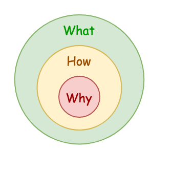
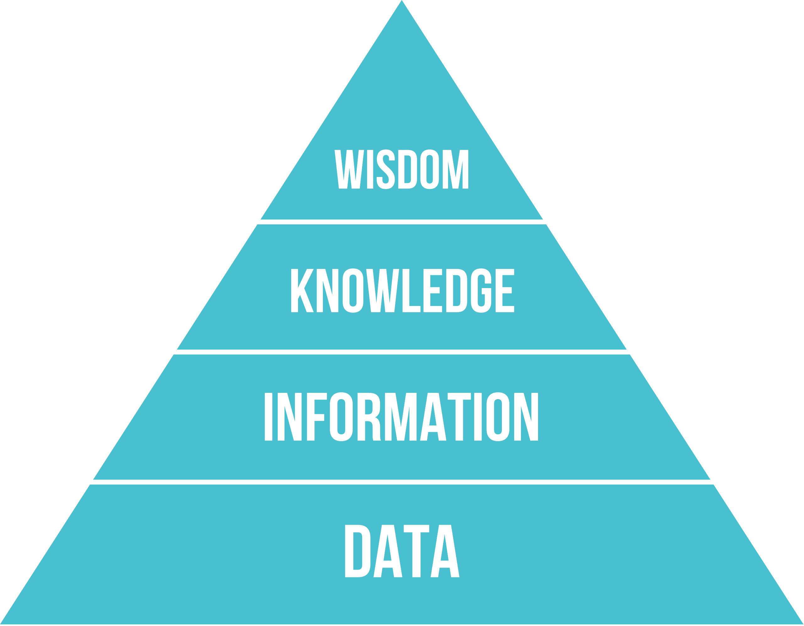

# 01World

> Tintin's Computer World

## 前言

欢迎来到**01World**，这里是我通过学习和思考所构建的有关计算机领域的知识体系。内容包括计算机体系结构、编程语言、操作系统、软件工程等。对于涉及到的任何技术，我都会尝试回答**What**（技术细节）、**How**（实现原理）、**Why**（为什么需要这个技术）以及它的优缺点和适用范围这四个问题。

### 学习方法

- 费曼学习法（learning by teaching）：将你想学的概念讲解给菜鸟听，重点是不断优化（查漏补缺）直到菜鸟能理解。
- 概念深入：What、How、Why
  
  
- 逐步过滤和抽象：Data（数据） --> Information（信息） --> Knowledge（知识） --> Wisdom（智慧）
  
  

## 知识树

> 注：随着新知识的加入，原有的知识树结构会更新需要进行迭代

- 计算机世界（01World）
  - 体系结构（arch）[链接](./arch/index.md)
    - 指令集架构
      - RISC-V
      - ARM
      - x86
    - 关键指标
      - 性能
      - 功耗
  - 编程语言（pl）
  - 操作系统（os）
  - 软件工程（se）

