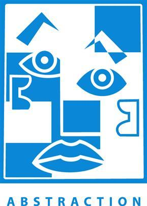
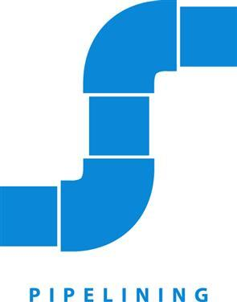
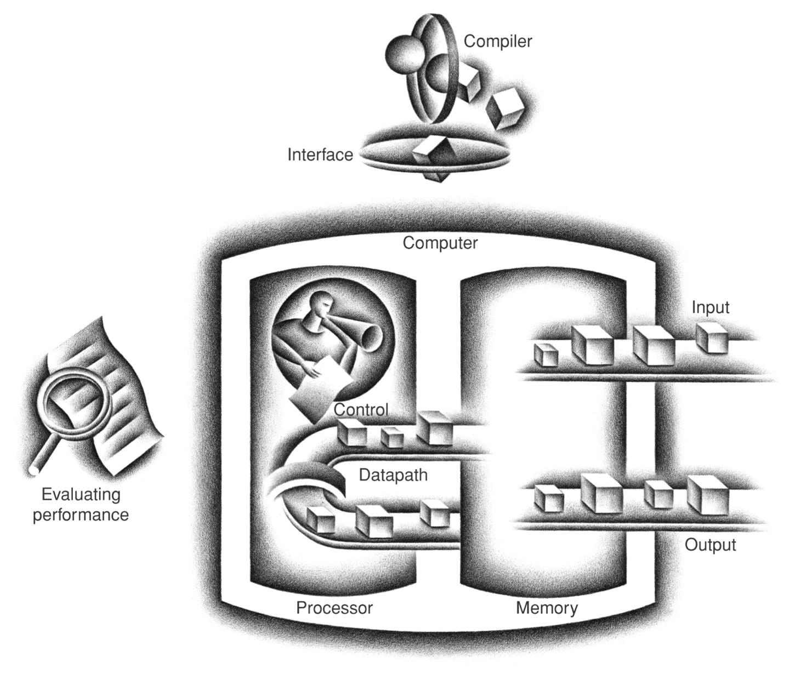

# Computer Organization and Design: the Hardware/Software Interface (6th Edition, RISC-V Edition)

> By David A. Patterson and John L. Hennessy
> 
> link: https://www.elsevier.com/books/computer-organization-and-design-risc-v-edition/patterson/978-0-12-820331-6

## What You Can Learn in This Book

By the time you complete this book, we believe you will be able to answer the following questions:

- How are programs written in a high-level language, such as C or Java, translated into the language of the hardware, and how does the hardware execute the resulting program? Comprehending these concepts forms the basis of understanding the aspects of both the hardware and software that affect program performance.
- What is the interface between the software and the hardware, and how does software instruct the hardware to perform needed functions? These concepts are vital to understanding how to write many kinds of software.
- What determines the performance of a program, and how can a programmer improve the performance? As we will see, this depends on the original program, the software translation of that program into the computer’s language, and the effectiveness of the hardware in executing the program.
- What techniques can be used by hardware designers to improve performance? This book will introduce the basic concepts of modern computer design. The interested reader will find much more material on this topic in our advanced book, *Computer Architecture: A Quantitative Approach*.
- What techniques can be used by hardware designers to improve energy efficiency? What can the programmer do to help or hinder energy efficiency?
- What are the reasons for and the consequences of the recent switch from sequential processing to parallel processing? This book gives the motivation, describes the current hardware mechanisms to support parallelism, and surveys the new generation of “multicore” microprocessors (see Chapter 6).
- Since the first commercial computer in 1951, what great ideas did computer architects come up with that lay the foundation of modern computing?

Without understanding the answers to these questions, improving the performance of your program on a modern computer or evaluating what features might make one computer better than another for a particular application will be __a complex process of trial and error__(不断试错的复杂过程), rather than __a scientific procedure__(科学的过程) driven by insight and analysis.

## Seven Great Ideas in Computer Architecture

- **Use Abstraction to Simplify Design**
  
  Both computer architects and programmers had to invent techniques to make themselves more productive, for otherwise design time would lengthen as dramatically as resources grew by Moore’s Law. A major productivity technique for hardware and software is to use **abstractions** to characterize the design at different levels of representation; lower-level details are hidden to offer a simpler model at higher levels. We’ll use the abstract painting icon to represent this great idea.

  

- **Make the Common Case Fast**

  Making the **common case fast** will tend to enhance performance better than optimizing the rare case. Ironically, the common case is often simpler than the rare case and hence is usually easier to enhance. This common sense advice implies that you know what the common case is, which is only possible with careful experimentation and measurement (see Section 1.6). We use a sports car as the icon for making the common case fast, as the most common trip has one or two passengers, and it’s surely easier to make a fast sports car than a fast minivan!

  

- **Performance via Parallelism**

  Since the dawn of computing, computer architects have offered designs that get more performance by computing operations in parallel. We’ll see many examples of parallelism in this book. We use multiple __jet engines__(喷气发动机) of a plane as our icon for **parallel performance**.

  

- **Performance via Pipelining**

  A particular pattern of parallelism is so prevalent in computer architecture that it merits its own name: **pipelining**. For example, before fire engines, a “bucket brigade” would respond to a fire, which many cowboy movies show in response to a dastardly act by the villain. The townsfolk form a human chain to carry a water source to fire, as they could much more quickly move buckets up the chain instead of individuals running back and forth. Our pipeline icon is a sequence of pipes, with each section representing one stage of the pipeline.

  

- **Performance via Prediction**

  Following the saying that it can be better to ask for forgiveness than to ask for permission, the next great idea is **prediction**. In some cases, it can be faster on average to guess and start working rather than wait until you know for sure, assuming that the mechanism to recover from a misprediction is not too expensive and your prediction is relatively accurate. We use __the fortune-teller’s crystal ball__(算命先生的水晶球) as our prediction icon.

  

- **Hierarchy of Memories**

  Programmers want the memory to be fast, large, and cheap, as memory speed often shapes performance, capacity limits the size of problems that can be solved, and the cost of memory today is often the majority of computer cost. Architects have found that they can address these conflicting demands with a **hierarchy of memories**, with the fastest, smallest, and the most expensive memory per bit at the top of the hierarchy and the slowest, largest, and cheapest per bit at the bottom. As we shall see in Chapter 5, caches give the programmer the illusion that main memory is almost as fast as the top of the hierarchy and nearly as big and cheap as the bottom of the hierarchy. We use a layered triangle icon to represent the memory hierarchy. The shape indicates speed, cost, and size: the closer to the top, the faster and more expensive per bit the memory; the wider the base of the layer, the bigger the memory.

  

- **Dependability via Redundancy**

  Computers not only need to be fast; they need to be dependable. Since any physical device can fail, we make systems **dependable** by including redundant components that can take over when a failure occurs and to help detect failures. We use the tractor-trailer as our icon, since the dual tires on each side of its rear axles allow the truck to continue driving even when one tire fails. (Presumably, the truck driver heads immediately to a repair facility so the flat tire can be fixed, thereby restoring redundancy!)

  

## The BIG Pictures

- The five classic components of a computer are input, output, memory, datapath, and control, with the last two sometimes combined and called the processor. Figure 1.5 shows the standard organization of a computer. This organization is independent of hardware technology: you can place every piece of every computer, past and present, into one of these five categories. To help you keep all this in perspective, the five components of a computer are shown on the front page of each of the following chapters, with the portion of interest to that chapter highlighted.
  
  

- Both hardware and software consist of hierarchical layers using abstraction, with each lower layer hiding details from the level above. One key interface between the levels of abstraction is the *instruction set architecture*—the interface between the hardware and low-level software. This abstract interface enables many *implementations* of varying cost and performance to run identical software.

## Performance

This table summarizes how the hardware and software affect performance:

| Hardware or software component | How this component affects performance | Where is this topic covered? |
| --- | --- | ---|
| Algorithm | Determines both the number of source-level statements and the number of I/O operations executed | Other books! |
| Programming language, compiler, and architecture | Determines the number of computer instructions for each source-level statement | Chapters 2 and 3 |
| Processor and memory system | Determines how fast instructions can be executed | Chapters 4, 5, and 6 |
| I/O system (hardware and operating system) | Determines how fast I/O operations may be executed | Chapters 4, 5, and 6 |

### Defining Performance

- **response time**: Also called **execution time**. The total time required for the computer to complete a task, including disk accesses, memory accesses, I/O activities, operating system overhead, CPU execution time, and so on.

$$
\frac{Seconds}{Program}=\frac{Instructions}{Program}\times \frac{Clock\ cycles}{Instruction}\times \frac{Seconds}{Clock\ cycle}
$$

$$
CPU\ time=Instruction\ count\times Clock\ cycles\ per\ instruction(CPI)\times Clock\ cycle\ time
$$

- **throughput**: Also called **bandwidth**. Another measure of performance, it is the number of tasks completed per unit time.

$$
Performance_X=\frac{1}{Execution \ time_X}
$$

### 术语

- register spilling：寄存器因为需要被重复使用，将old value保存到内存
- frame pointer and stack pointer: 过程栈帧，栈低位置为frame pointer，栈顶位置为stack pointer
- Executable and Linkable Format(ELF)

- Application binary interface(ABI)

### 读不懂的英文句子

- Sometimes a bit pattern with a 1 in the most significant bit represents a negative number and, of course, is less than any positive number, which must have a 0 in the most significant bit.

  两个并列谓语represents和is

- What we have presented so far suggests that a single change to one line of one procedure requires compiling and assembling the whole program.

  主语为What we have presented so far

### 读错的英文单词

queue，procedure，parameter，
